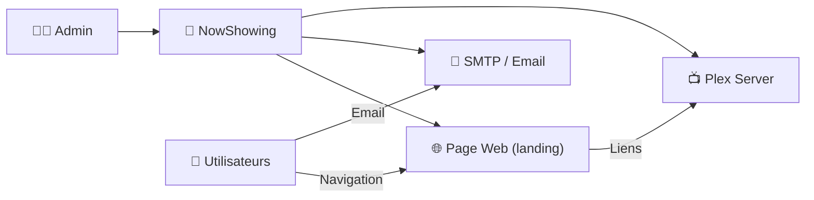
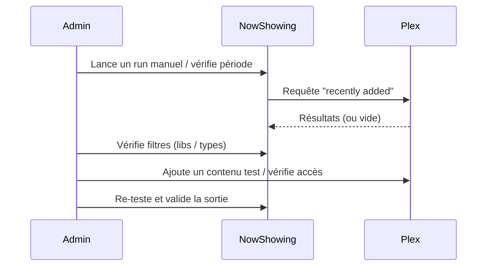

# 🍿 NowShowing — Présentation & Exploitation Premium (Plex “Recently Added”)

### Notifications & page web des nouveautés Plex (films/séries) pour tes utilisateurs
Optimisé pour reverse proxy existant • Emails ciblés • Web “landing” des ajouts récents • Exploitation durable

---

## TL;DR

- **NowShowing** génère un **résumé des contenus récemment ajoutés** sur un serveur **Plex**.
- Diffusion possible :
  - 📧 **Email** (à tous ou certains utilisateurs Plex)
  - 🌐 **Page web** consultable par les utilisateurs
- Version “premium ops” : **gouvernance des destinataires**, **qualité des templates**, **contrôle d’accès**, **tests**, **rollback**, **éviter les fuites d’info**.

---

## ✅ Checklists

### Pré-usage (avant d’annoncer aux utilisateurs)
- [ ] Définir la politique de notification (qui reçoit quoi, à quelle fréquence)
- [ ] Valider les catégories (films, séries, musique ?) et la fenêtre “recent”
- [ ] Valider le rendu (images, liens, titres, synopsis)
- [ ] Définir l’accès à la page web (auth via reverse proxy existant / VPN / LAN)
- [ ] Vérifier la conformité “privacy” (ne pas envoyer des contenus privés à tout le monde)

### Post-configuration (qualité opérationnelle)
- [ ] Un email test arrive bien (et n’est pas classé spam)
- [ ] Les liens mènent bien aux pages Plex attendues
- [ ] La page web ne fuit pas d’infos en accès non autorisé
- [ ] Les logs sont propres (pas de boucles, pas d’erreurs Plex)
- [ ] Une procédure de rollback est documentée

---

> [!TIP]
> NowShowing est idéal pour augmenter l’adoption Plex : “nouveautés de la semaine”, “arrivées récentes”, “ajouts pour enfants”, etc.

> [!WARNING]
> Les résumés peuvent révéler des goûts / contenus sensibles. Mets une **gouvernance stricte** sur les destinataires et l’accès web.

> [!DANGER]
> Ne publie pas la page web en public sans contrôle d’accès : c’est une vitrine de ta bibliothèque.

---

# 1) NowShowing — Vision moderne

NowShowing n’est pas “juste un mail”.

C’est :
- 🔎 Un **extracteur** “Recently Added” via Plex
- 🧩 Un **générateur** (email + page web)
- 🎯 Un **outil de diffusion** configurable (ciblage utilisateurs)
- 🧠 Un **levier d’engagement** (les utilisateurs reviennent quand ils voient les ajouts)

---

# 2) Architecture globale



---

# 3) “Premium config mindset” (5 piliers)

1. 👥 **Ciblage des destinataires** (groupes / sélection / exclusions)
2. 🪪 **Contrôle d’accès** à la page web (via reverse proxy existant)
3. ✉️ **Qualité délivrabilité email** (SPF/DKIM/DMARC, domaine, anti-spam)
4. 🧾 **Templates propres** (lisibilité, mobile, liens clairs)
5. 🧪 **Validation + rollback** (tests avant mise en prod, retour arrière simple)

---

# 4) Gouvernance des notifications (ce qui évite les drames)

## 4.1 Politique d’envoi recommandée
- **Hebdomadaire** (recommandé) : “Nouveautés de la semaine”
- **Quotidien** (si très actif) : “Ajouts des dernières 24h”
- **À la demande** (mode “release day”) : envoi manuel lors d’un gros ajout

## 4.2 Ciblage “smart”
- Groupe “Tout le monde” (risqué) → à éviter si bibliothèque hétérogène
- Préférer :
  - “Famille”
  - “Enfants”
  - “Amis”
  - “Beta testers”

> [!TIP]
> La meilleure approche : plusieurs “audiences” + messages plus courts, plutôt qu’un seul mail géant.

---

# 5) Page web (landing) — l’interface “discovery”

## Bonnes pratiques UX
- Mettre en avant :
  - “Ajoutés récemment”
  - “Top nouveautés”
  - séparation Films / Séries
- Liens directs vers Plex (web/app)
- Optimiser mobile (beaucoup consulteront depuis téléphone)

## Sécurité / contrôle d’accès
- Si exposé hors LAN :
  - Auth via reverse proxy existant (SSO / forward-auth / basic auth)
  - Ou accès VPN uniquement
- Sinon :
  - Restreindre IP (LAN)

> [!WARNING]
> Une page “Recently Added” non protégée = divulgation de la bibliothèque.

---

# 6) Email — délivrabilité & qualité

## Délivrabilité (si tu veux éviter le spam)
- Utiliser un SMTP fiable
- Aligner :
  - SPF (autoriser ton SMTP)
  - DKIM (signature)
  - DMARC (politique)
- Éviter :
  - sujets trop “marketing”
  - trop d’images sans texte
  - liens obscurs

## Template premium (principes)
- Sujet clair : “Nouveautés Plex — Semaine du YYYY-MM-DD”
- Sections :
  - Films
  - Séries
- Chaque item :
  - titre + année
  - petit visuel
  - lien “Voir dans Plex”
  - note (option) / durée (option)

---

# 7) Workflows premium (exploitation)

## 7.1 Triage “ça ne remonte rien”


## 7.2 “Les utilisateurs se plaignent du contenu”
- Vérifier l’audience utilisée
- Segmenter (famille / enfants / amis)
- Réduire la fenêtre (ex: 7 jours au lieu de 30)
- Retirer certaines bibliothèques du reporting

---

# 8) Validation / Tests / Rollback

## 8.1 Tests de validation (avant prod)
```bash
# 1) Vérifier que le service répond (si exposé en interne)
curl -I http://NOWSHOWING_HOST:PORT | head

# 2) Vérifier la page web rendue (si URL)
curl -s https://nowshowing.example.tld | head -n 20

# 3) Test email (manuel) : envoyer à une adresse de test
# - vérifier réception
# - vérifier liens Plex
# - vérifier rendu mobile
```

## 8.2 Tests de sécurité (essentiels)
- Depuis un navigateur non authentifié :
  - ❌ la page web ne doit pas afficher la bibliothèque
- Depuis un utilisateur “audience A” :
  - ✅ reçoit l’email attendu
  - ❌ ne reçoit pas les emails des autres audiences

## 8.3 Rollback (simple)
- Revenir à une config “safe” :
  - désactiver l’envoi email
  - restreindre la page web (LAN/VPN only)
  - revenir au template précédent
- Documenter le rollback en 5 étapes maximum

---

# 9) Erreurs fréquentes (et fixes)

## “Emails non reçus”
- Vérifier spam
- Vérifier SPF/DKIM/DMARC
- Tester avec une autre boîte (Gmail/Outlook)
- Simplifier le template (moins d’images, plus de texte)

## “Page web OK mais liens Plex cassés”
- Vérifier URL Plex (public vs local)
- Vérifier si l’utilisateur a accès au contenu
- Vérifier le format de lien (plex.tv vs local)

## “Contenu incorrect envoyé aux mauvaises personnes”
- Mauvaise audience / sélection
- Mauvais mapping utilisateurs Plex
- Corriger segmentation + re-tester avec groupe test

---

# 10) Sources — Images Docker (URLs brutes)

## 10.1 Image communautaire la plus citée
- `ninthwalker/nowshowing` (Docker Hub) : https://hub.docker.com/r/ninthwalker/nowshowing  
- Repo officiel NowShowing (référence) : https://github.com/ninthwalker/NowShowing  
- Profil Docker Hub de l’éditeur (références des images) : https://hub.docker.com/u/ninthwalker  

## 10.2 LinuxServer.io (si applicable)
- Catalogue LinuxServer.io (pour vérifier l’existence d’une image) : https://www.linuxserver.io/our-images  
- Statut : pas d’image LSIO “NowShowing” listée dans le catalogue LSIO (donc pas de source `lscr.io/linuxserver/nowshowing` à référencer)