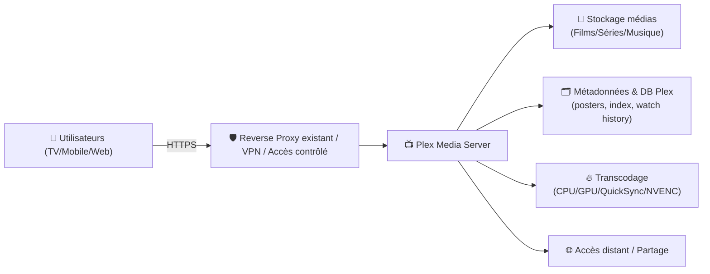
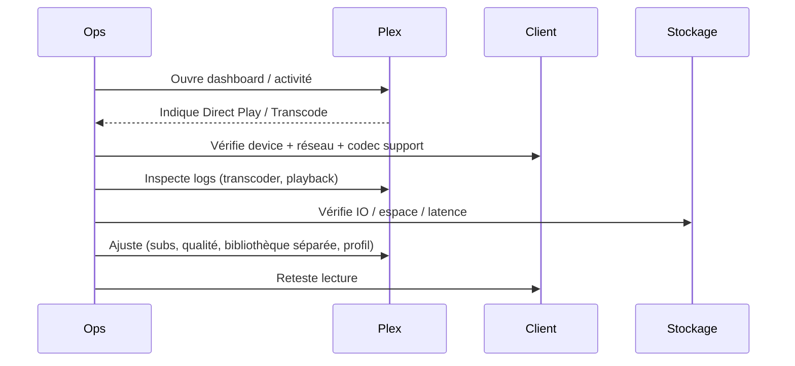

# 📺 Plex — Présentation & Exploitation Premium (sans install / sans Nginx / sans Docker / sans UFW)

### Serveur media “hub” : bibliothèques, transcodage, accès multi-device, partage & gouvernance
Optimisé pour reverse proxy existant • Qualité maîtrisée • Performance durable • Ops & dépannage

---

## TL;DR

- **Plex Media Server (PMS)** centralise tes médias (films/séries/musique/photos) et les **stream** vers clients (TV, mobile, web).
- La vraie réussite Plex, c’est : **bibliothèques propres**, **métadonnées fiables**, **stratégie de transcodage**, **accès sécurisé**, **monitoring**.
- Version “premium” = **gouvernance**, **qualité**, **exploitation**, **tests & rollback**, **politique de partage**.

---

## ✅ Checklists

### Pré-config (avant d’ajouter 10 To)
- [ ] Structure de stockage stable + nommage propre
- [ ] Stratégie bibliothèques (Films / Séries / Enfants / 4K séparée si besoin)
- [ ] Stratégie transcodage (Direct Play vs Transcode + hardware)
- [ ] Accès externe : reverse proxy existant / VPN / contrôle d’accès
- [ ] Comptes / partage : règles claires (home users, amis, enfants)
- [ ] Plan de sauvegarde (métadonnées + config) + test de restauration

### Post-config (qualité)
- [ ] Scan & matching cohérents (peu de “wrong match”)
- [ ] Clients principaux en **Direct Play** sur la majorité des contenus
- [ ] Sous-titres gérés sans casser le Direct Play
- [ ] Logs propres (pas de boucles transcode/IO)
- [ ] Partage et restrictions (enfants) validés

---

> [!TIP]
> Le “niveau pro” Plex se gagne sur 3 points : **bibliothèques propres**, **Direct Play maximisé**, **transcodage maîtrisé**.

> [!WARNING]
> Les sous-titres (surtout image-based PGS/ASS) peuvent forcer un transcodage.  
> C’est souvent la cause #1 des CPU à 100%.

> [!DANGER]
> Plex expose des surfaces sensibles (comptes, partages, médias). Garde une stratégie d’accès stricte et un plan de récupération.

---

# 1) Plex — Vision moderne

Plex n’est pas juste un lecteur.

C’est :
- 🧠 Un **catalogueur** (métadonnées, collections, playlists)
- 📦 Un **gestionnaire de bibliothèques** (scans, agents, posters, éditions)
- ⚙️ Un **moteur de streaming** (Direct Play / Direct Stream / Transcode)
- 👨‍👩‍👧‍👦 Un **système de partage** (home users, restrictions, profils)
- 🧰 Un **outil d’exploitation** (logs, dashboards, diagnostics)

---

# 2) Architecture globale



---

# 3) Concepts clés (indispensables pour ne pas “subir” Plex)

## 3.1 Modes de lecture
- **Direct Play** : le client lit tel quel → meilleur (qualité + CPU minimal)
- **Direct Stream** : remux conteneur (ex: MKV→MP4) sans ré-encoder → léger
- **Transcode** : ré-encode vidéo/audio (ou burn-in subs) → coûteux

> [!TIP]
> Objectif premium : **maximiser Direct Play**.  
> Une médiathèque “bien encodée” vaut mieux qu’un serveur surdimensionné.

## 3.2 Transcodage & sous-titres
- Sous-titres **SRT** = souvent OK (selon client)
- Sous-titres **PGS** (Blu-ray) = fréquemment “burn-in” → transcode
- Sous-titres stylés **ASS/SSA** = peuvent déclencher transcode selon client

---

# 4) Bibliothèques & Qualité de matching

## 4.1 Stratégie bibliothèques recommandée
- 🎬 Films
- 📺 Séries
- 👶 Enfants (restrictions)
- 🧨 4K séparée (si tu veux éviter transcode 4K vers devices faibles)

> [!WARNING]
> Mélanger 4K HDR lourds et clients faibles = transcodage permanent.  
> Séparer la bibliothèque 4K est une stratégie simple et très efficace.

## 4.2 Nommage (ce qui évite 90% des erreurs)
### Films
```
Movies/
  Dune (2021)/
    Dune (2021).mkv
```

### Séries
```
TV/
  The Expanse/
    Season 01/
      The Expanse - S01E01.mkv
```

> [!TIP]
> Le matching Plex devient quasi automatique si le nom + année + SxxExx sont propres.

---

# 5) Partage, comptes, gouvernance (premium)

## 5.1 Modèle simple et efficace
- **Admin** : toi (gestion serveur)
- **Home users** : famille (avec restrictions si besoin)
- **Friends** : partage limité (qualité/accès, pas d’admin)

## 5.2 Contrôles “enfants”
- Bibliothèques dédiées “Kids”
- Restrictions de classification
- Profils séparés (évite mélange historique)

> [!WARNING]
> Évite de partager “tout” par défaut : le partage doit être **intentionnel** et réversible.

---

# 6) Performance premium (sans recettes d’installation)

## 6.1 Réduire la charge serveur (les vrais leviers)
- Formats compatibles clients → **Direct Play**
- Audio : prévoir AAC (large compat) si tes clients sont variés
- Éviter burn-in subs (préférer SRT quand possible)
- Découper bibliothèques (4K à part si nécessaire)

## 6.2 Points de vigilance
- IO disque (scans massifs + thumbnails)
- Stockage métadonnées sur disque lent
- Transcode sur CPU sans hardware (si beaucoup d’utilisateurs)

---

# 7) Exploitation : incidents & dépannage

## 7.1 Workflow “ops”


## 7.2 Symptômes → causes probables
- **CPU 100%** : transcode vidéo / burn-in sous-titres
- **Buffering** : débit insuffisant, stockage lent, transcode saturé
- **Qualité qui baisse** : “Remote quality” client / bande passante / transcode
- **Mauvais posters** : nommage, agent/matching, conflits de versions

---

# 8) Validation / Tests / Rollback

## 8.1 Tests fonctionnels (smoke tests)
```bash
# 1) Vérifier que l'UI répond (si tu as une URL)
curl -I https://plex.example.tld | head

# 2) Tester un fichier "référence" (manuel côté client)
# - Film H.264 + AAC (compat)
# - Film H.265 + HDR (stress)
# - Série avec SRT vs PGS (comparatif)
```

## 8.2 Tests “qualité d’exploitation”
- Lecture depuis TV principale : doit être **Direct Play** sur 80%+ des contenus
- Lecture distante : vérifier qualité choisie sur client
- Sous-titres : confirmer qu’un SRT ne force pas transcode (selon client)

## 8.3 Rollback (principes)
- Sauvegarder métadonnées/config avant changement majeur (agents, libs, scan, etc.)
- Garder un “fichier test” (référence) pour comparer avant/après
- En cas de dérive : revenir à la config précédente + rescans contrôlés

---

# 9) Sources — Images Docker (urls brutes uniquement)

## 9.1 Image officielle Plex (la plus citée)
- `plexinc/pms-docker` (Docker Hub) : https://hub.docker.com/r/plexinc/pms-docker/  
- Tags (versions) : https://hub.docker.com/r/plexinc/pms-docker/tags  
- Repo officiel (référence) : https://github.com/plexinc/pms-docker  

## 9.2 Image LinuxServer.io (si tu préfères l’écosystème LSIO)
- `linuxserver/plex` (Docker Hub) : https://hub.docker.com/r/linuxserver/plex  
- Tags (versions) : https://hub.docker.com/r/linuxserver/plex/tags  
- Doc LSIO (Plex) : https://docs.linuxserver.io/images/docker-plex/  
- Repo LSIO (référence) : https://github.com/linuxserver/docker-plex  

---

# ✅ Conclusion

Plex “premium”, c’est :
- 📁 bibliothèques propres (matching fiable)
- 🎯 Direct Play maximisé
- 🔥 transcodage sous contrôle (subs compris)
- 👨‍👩‍👧‍👦 partage gouverné (rôles, enfants, accès distant)
- 🧪 validation + rollback (tu changes sans te casser)