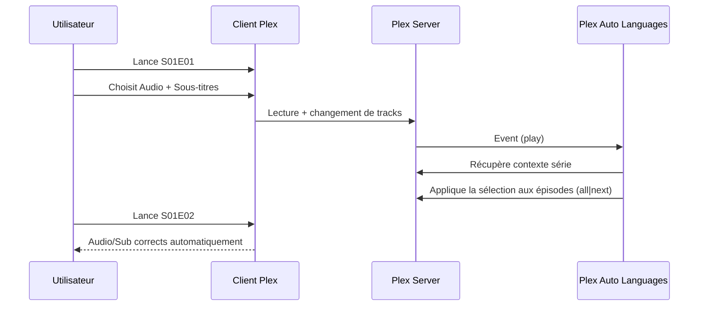

# 🎧 Plex Auto Languages — Présentation & Configuration Premium (Sans install)

### Expérience “Netflix-like” : audio + sous-titres qui s’adaptent automatiquement par série, par utilisateur
Optimisé pour Plex TV Shows • Multi-utilisateurs • Règles fines • Performance maîtrisée • Exploitation durable

---

## TL;DR

- **Plex Auto Languages (PAL)** met à jour automatiquement les **pistes audio** et **sous-titres** des épisodes d’une série selon ce que tu viens de choisir, **sans casser tes préférences globales**.
- La langue est gérée **par série** (et peut être **par saison**), et fonctionne aussi avec **plusieurs utilisateurs**.
- Une config premium = **stratégie de mise à jour claire**, **déclencheurs maîtrisés**, **labels d’exclusion**, **performance safe**, **validation + rollback**.

---

## ✅ Checklists

### Pré-configuration (préflight)
- [ ] Token Plex disponible (accès serveur OK)
- [ ] Définir la stratégie : `show` vs `season`, `all` vs `next`
- [ ] Choisir les déclencheurs : play/scan/activity (attention perf)
- [ ] Définir un label d’exclusion (ex: `PAL_IGNORE`)
- [ ] Convenir d’une règle “exceptions” (séries à ne jamais toucher)
- [ ] Écrire 1 runbook : “PAL ne change pas les tracks / change mal”

### Post-configuration (go-live)
- [ ] Test sur 1 série : épisode 1 → choix audio/sub → épisode 2 correct
- [ ] Test multi-user : User A ≠ User B (indépendant)
- [ ] Test scan : ajout nouvel épisode → PAL applique la règle attendue
- [ ] Vérification logs : pas de boucle, pas de spam d’événements
- [ ] Label `PAL_IGNORE` validé : aucune modification sur une série taggée

---

> [!TIP]
> Le “sweet spot” le plus stable : **update_level=show**, **update_strategy=all**, **trigger_on_play=true**, **trigger_on_scan=true**, **trigger_on_activity=false**.

> [!WARNING]
> `trigger_on_activity=true` peut augmenter l’utilisation des ressources (changements déclenchés sans lecture, selon clients supportés).

> [!DANGER]
> Si tu as une très grosse bibliothèque (10k+ épisodes), surveille `refresh_library_on_scan` : le laisser à `true` peut coûter cher. Ajuste selon ton contexte.

---

# 1) Plex Auto Languages — Vision moderne

PAL n’est pas un simple “sélecteur auto”.

C’est :
- 🧠 Un moteur de **mémoire contextuelle** (par série / saison)
- 👥 Un outil **multi-utilisateurs** (préférences indépendantes)
- 🎛️ Un orchestrateur de **déclencheurs** (play / scan / activity)
- 🧰 Un outil d’exploitation (logs, exclusions, stratégie)

Cas typiques :
- “Je veux *Squid Game* en coréen + sous-titres EN, sans y penser ensuite”
- “Je regarde une série en VO, mais une autre en FR”
- “Plusieurs profils à la maison, chacun ses préférences”

---

# 2) Architecture globale

```mermaid
flowchart LR
  User["👤 Client Plex (Web/TV/Mobile)"] --> Plex["📺 Plex Media Server"]
  Plex -->|Events (play/scan/activity)| PAL["🎧 Plex Auto Languages"]
  PAL -->|API calls| Plex
  PAL --> Rules["⚙️ Stratégie\n(show/season, all/next)"]
  PAL --> Exclusions["🏷️ Labels ignore\n(PAL_IGNORE)"]
  Plex --> Library["📁 Bibliothèque Séries"]
```

---

# 3) Comment PAL “décide” (modèle mental premium)

## 3.1 Unité de décision
- Par défaut : **par série** (`update_level: show`)
- Alternative : **par saison** (`update_level: season`)

## 3.2 Étendue de mise à jour
- Par défaut : **tous les épisodes** (`update_strategy: all`)
- Alternative : **seulement les prochains** (`update_strategy: next`)

## 3.3 Déclencheurs (quand PAL agit)
- `trigger_on_play` : quand tu lis un épisode (souvent indispensable)
- `trigger_on_scan` : quand Plex détecte de nouveaux fichiers (pratique)
- `trigger_on_activity` : quand tu navigues / quand la track par défaut bouge (plus “intrusif”, plus coûteux)

---

# 4) Philosophie de configuration (5 piliers)

1. 🎯 **Stratégie claire** (`show|season`, `all|next`)
2. 🔄 **Déclencheurs maîtrisés** (play/scan, activity avec prudence)
3. 🏷️ **Exclusions propres** (labels ignore)
4. ⚡ **Performance safe** (refresh library, gros catalogues)
5. 🧪 **Validation + rollback** (tests simples, retour arrière en 2 minutes)

---

# 5) Configuration Premium (YAML + principes)

> PAL peut être configuré via **fichier YAML** (monté en `/config/config.yaml`) et chaque paramètre peut être **surchargé par variables d’environnement**.

## 5.1 Template de config (base premium)
```yaml
plexautolanguages:
  update_level: "show"          # show | season
  update_strategy: "all"        # all | next

  trigger_on_play: true
  trigger_on_scan: true
  trigger_on_activity: false

  refresh_library_on_scan: true

  ignore_labels:
    - PAL_IGNORE

  plex:
    url: "http://PLEX:32400"
    token: "PLEX_TOKEN"
```

### Notes de design
- `show + all` = comportement “Netflix-like” le plus prévisible
- `season + next` = “je veux minimiser les changements et ne toucher que le futur”
- `ignore_labels` = ton bouton “no-touch” par série

---

## 5.2 Gestion des exceptions (pratique et maintenable)

### Règle simple
- Si une série doit rester manuelle : ajoute le label Plex `PAL_IGNORE`

### Pourquoi c’est premium
- Tu évites les cas “série multilingue spéciale”
- Tu conserves un contrôle fin sans complexifier la config globale

---

## 5.3 Performance (bibliothèques volumineuses)

### Paramètre clé
- `refresh_library_on_scan` :
  - `true` : PAL détecte mieux les fichiers mis à jour sur un épisode déjà existant
  - `false` : moins de charge (recommandé si très grosse bibliothèque), mais moins “réactif” aux remplacements/retags

### Paramètre à activer avec prudence
- `trigger_on_activity: true` :
  - peut générer plus d’événements et donc plus d’activité
  - dépend des clients Plex supportés (web + app Windows selon doc)

---

# 6) Workflow premium (ce que l’utilisateur vit)



---

# 7) Validation / Tests / Rollback

## 7.1 Smoke tests (fonctionnels)
```bash
# Test 1 : l'app répond (si endpoint/port exposé)
curl -I http://PAL_HOST:PAL_PORT | head

# Test 2 : vérifier qu'un changement sur S01E01 est répercuté
# (manuel) Lire S01E01 -> changer audio/sub -> lancer S01E02 -> doit être OK
```

## 7.2 Tests “premium” (anti-régression)
- Multi-user :
  - User A choisit VO+EN
  - User B choisit FR+FR
  - Vérifie que les épisodes suivants suivent chaque utilisateur
- Label ignore :
  - Ajouter `PAL_IGNORE` à une série
  - Vérifier qu’aucune piste n’est modifiée
- Scan :
  - Ajouter un nouvel épisode (SxxEyy)
  - Vérifier que PAL applique la règle attendue

## 7.3 Rollback (retour arrière propre)
- Désactiver les triggers (mettre `trigger_on_play=false`, `trigger_on_scan=false`, `trigger_on_activity=false`)
- Ou ajouter `PAL_IGNORE` aux séries sensibles
- Restaurer le fichier `config.yaml` précédent (garder une copie datée)

---

# 8) Dépannage premium (symptômes → causes → actions)

## “PAL ne change rien”
Causes fréquentes :
- token Plex invalide / pas les droits
- URL Plex incorrecte
- triggers désactivés
- série labelisée `PAL_IGNORE`

Actions :
- vérifier URL/token
- activer `trigger_on_play`
- tester sur une série non taggée

## “PAL change trop / comportement surprenant”
Causes :
- `trigger_on_activity=true`
- `update_strategy=all` sur une série où tu voulais “next”

Actions :
- désactiver `trigger_on_activity`
- passer `update_strategy=next`
- utiliser `PAL_IGNORE` sur les cas spéciaux

## “Charge CPU / trop d’activité”
Causes :
- très grosse bibliothèque + `refresh_library_on_scan=true`
- activity trigger

Actions :
- passer `refresh_library_on_scan=false` si très gros catalogue
- garder `trigger_on_activity=false`

---

# 9) Sources — Images Docker & Références (URLs brutes)

## 9.1 Image “upstream” la plus citée
- `remirigal/plex-auto-languages` (Docker Hub) : https://hub.docker.com/r/remirigal/plex-auto-languages  
- Repo principal (README + config) : https://github.com/RemiRigal/Plex-Auto-Languages  
- Guide Plex officiel pour trouver le token (mentionné dans le README) : https://support.plex.tv/articles/204059436-finding-an-authentication-token-x-plex-token/  

## 9.2 Images communautaires / forks (souvent utilisées)
- `journeyover/plex-auto-languages` (Docker Hub) : https://hub.docker.com/r/journeyover/plex-auto-languages  
- `ghcr.io/journeydocker/plex-auto-languages` (GitHub Container Registry) : https://github.com/orgs/JourneyDocker/packages/container/package/plex-auto-languages  
- `racle90/plex-auto-languages` (Docker Hub, fork fix Live TV selon description) : https://hub.docker.com/r/racle90/plex-auto-languages  

## 9.3 LinuxServer.io (LSIO)
- Liste des images officielles LSIO (référence) : https://www.linuxserver.io/our-images  
- À ce jour, aucune image “plex-auto-languages” n’apparaît comme image LSIO dédiée dans leur catalogue public : https://www.linuxserver.io/our-images  

---

# ✅ Conclusion

Plex Auto Languages apporte une vraie valeur quand tu veux :
- une expérience fluide “Netflix-like”
- des préférences par série (et potentiellement par saison)
- du multi-user propre
- sans bricoler manuellement audio/sous-titres à chaque épisode

La version “premium” tient sur 3 mots :
**stratégie, exclusions, validation**.