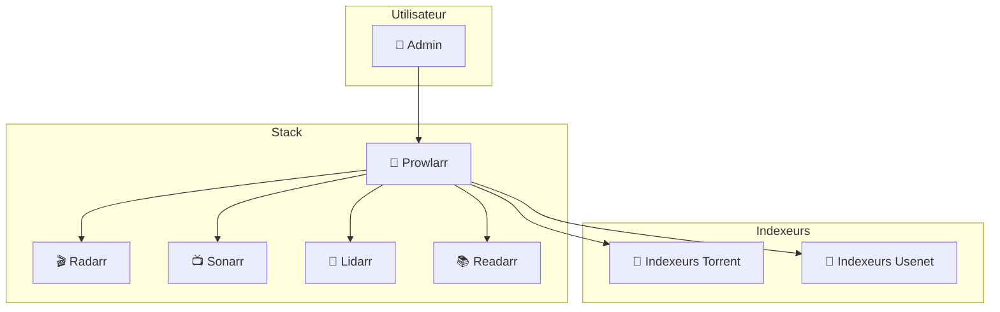
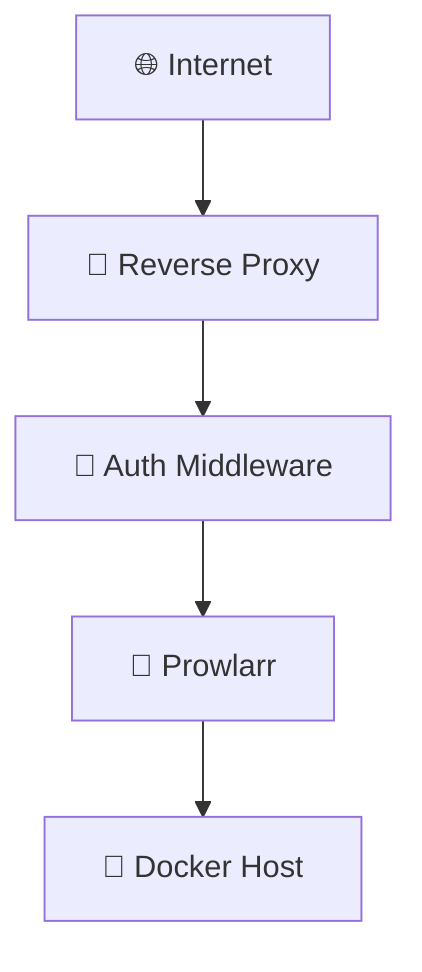
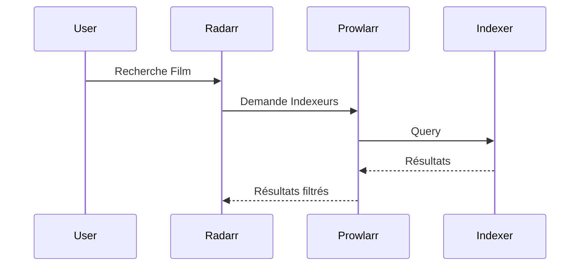
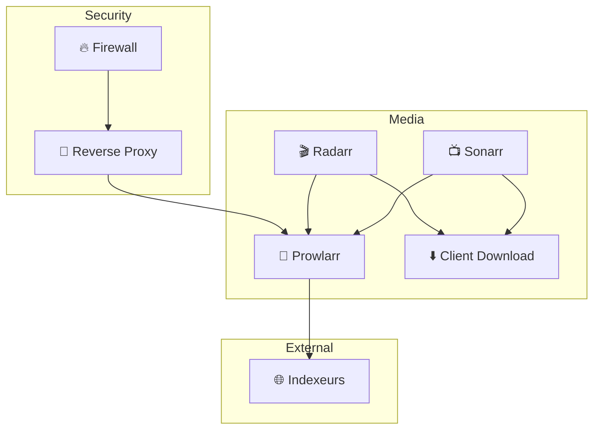

# 📡 Prowlarr — Orchestrateur d’Indexeurs

<div class="hero">

Centralisation • Automatisation • Sécurisation  
Un seul point de gestion pour tous les indexeurs Usenet & Torrent.

</div>

---

# 🎯 Vision Stratégique

Prowlarr devient :

- 🎛️ Le **contrôleur central des indexeurs**
- 🔄 Le **gestionnaire de synchronisation automatique**
- 🔐 Le **point de contrôle d’accès aux sources**
- 📡 Le **pont entre Radarr, Sonarr, Lidarr & Readarr**

Il réduit :

✔ La duplication de configuration  
✔ Les erreurs humaines  
✔ Les surfaces d’exposition API  
✔ La maintenance multi-applications  

---

# 🏗️ Vue d’Ensemble Globale



---

# 🧠 Rôle Clé de Prowlarr

Prowlarr :

- Centralise les indexeurs
- Synchronise automatiquement vers *arr apps
- Gère les catégories
- Maintient les clés API
- Supporte Torznab & Newznab
- Automatise la maintenance

🎯 Objectif : Une seule configuration → propagation automatique.

---

# 🏛️ Architecture Sécurisée avec Reverse Proxy



---

# 🔐 Sécurisation Recommandée

## 1️⃣ Isolation Réseau Docker

- Réseau bridge dédié
- Pas d’exposition directe de ports
- Communication interne uniquement

```yaml
networks:
  media_net:
    driver: bridge
```

---

## 2️⃣ Reverse Proxy (Traefik ou Nginx)

- HTTPS obligatoire
- Authentification Basic ou SSO
- Rate limiting
- Headers sécurisés

---

## 3️⃣ Protection API

- Rotation régulière des API keys
- Désactivation accès externe direct
- IP whitelist si possible

---

# 🐳 Configuration Docker Optimisée

```yaml
version: "3.9"

services:
  prowlarr:
    image: lscr.io/linuxserver/prowlarr:latest
    container_name: prowlarr
    environment:
      - PUID=1000
      - PGID=1000
      - TZ=Europe/Paris
    volumes:
      - ./config/prowlarr:/config
    networks:
      - media_net
    restart: unless-stopped
    security_opt:
      - no-new-privileges:true
    read_only: true
    tmpfs:
      - /tmp

networks:
  media_net:
    external: true
```

---

# ⚙️ Configuration Avancée

## 🔗 Synchronisation Automatique

Dans Prowlarr :

1. Settings → Apps
2. Ajouter Radarr / Sonarr
3. Activer Sync Level : Full Sync
4. Activer "Sync Categories"

🎯 Toute modification d’indexeur se réplique automatiquement.

---

# 🧭 Gestion Intelligente des Catégories

| Application | Catégorie |
|-------------|-----------|
| Radarr | Movies |
| Sonarr | TV |
| Lidarr | Music |
| Readarr | Books |

Permet un routage automatique des résultats.

---

# 📊 Flux Logique de Recherche



---

# 🚀 Optimisations Performance

✔ Désactiver indexeurs instables  
✔ Limiter timeout  
✔ Configurer retry intelligent  
✔ Surveillance des échecs  
✔ Activer nettoyage automatique  

---

# 🛡️ Hardening Avancé

## Sécurité Conteneur

- read_only: true
- no-new-privileges
- Pas de root user
- Volume minimaliste
- Logs centralisés

## Sécurité Réseau

- VLAN dédié
- Reverse proxy obligatoire
- Firewall bloquant accès externe direct
- Monitoring fail2ban/CrowdSec recommandé

---

# 🌍 Architecture Complète avec Stack Média



---

# 🏢 Vision Entreprise / Homelab Pro

Bénéfices :

✔ Centralisation  
✔ Scalabilité  
✔ Maintenance simplifiée  
✔ Réduction erreurs humaines  
✔ Sécurité renforcée  
✔ Monitoring simplifié  

---

# 📈 Comparatif Avant / Après

| Sans Prowlarr | Avec Prowlarr |
|---------------|---------------|
| Config répétée | Centralisation |
| Risque incohérence | Synchronisation auto |
| Maintenance lourde | Gestion unique |
| API multiples exposées | API centralisée |

---

# 🎯 Conclusion Stratégique

Prowlarr n’est pas juste un gestionnaire d’indexeurs.

C’est :

- 🎛️ Un contrôleur central
- 🔄 Un synchroniseur automatique
- 🔐 Un point stratégique de sécurité
- 📡 Un accélérateur d’automatisation

Dans une architecture moderne Docker + Reverse Proxy :

> Prowlarr devient le cerveau des sources.

---

# 🏁 Niveau Final Recommandé

Pour un déploiement “Top du Top” :

✔ Docker isolé  
✔ Reverse proxy HTTPS  
✔ Authentification forte  
✔ Firewall hôte  
✔ Monitoring actif  
✔ Sauvegarde config automatique  
✔ Logs centralisés  

---

**Stack recommandée :**

Prowlarr + Radarr + Sonarr + Client Download + Reverse Proxy + Firewall

Architecture propre, modulaire et évolutive.
