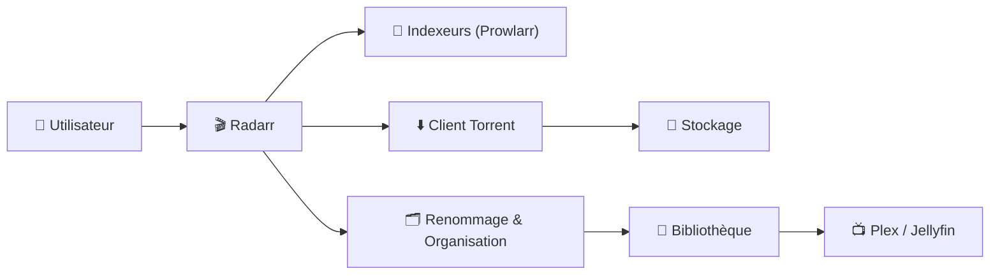
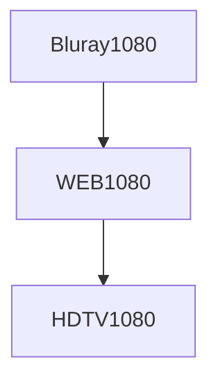
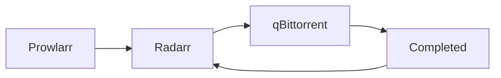
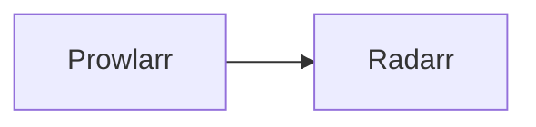
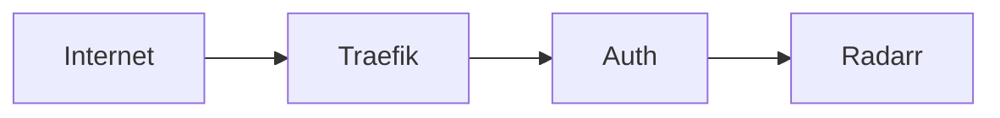
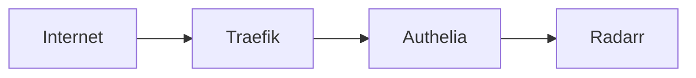
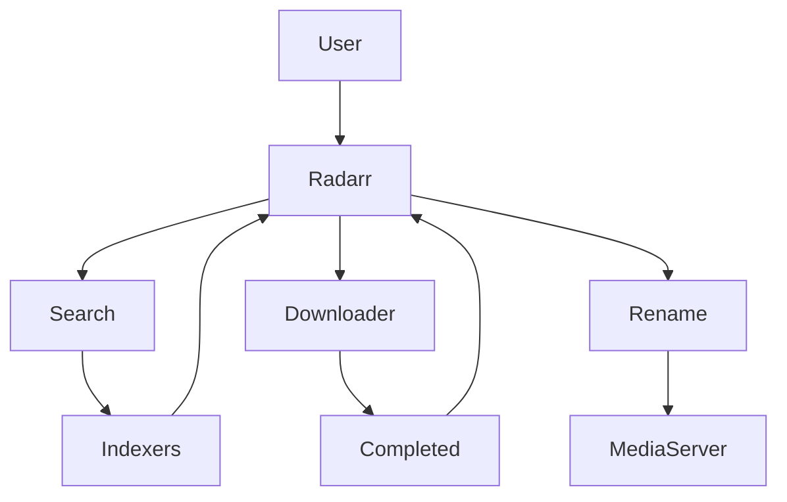

# 🎬 Radarr — Architecture & Configuration Premium

### Automatisation intelligente de votre bibliothèque cinéma

Optimisé pour Docker • Reverse Proxy • Qualité maîtrisée • Performance durable

---

# 🎯 Radarr (vision moderne)

Radarr n’est pas juste un téléchargeur automatique.

C’est :

- 🧠 Un moteur de décision qualité
- 🔎 Un orchestrateur d’indexeurs
- 📦 Un gestionnaire de bibliothèque
- 🔄 Un automatisateur intelligent

Il connecte :

- Indexeurs
- Client torrent / download
- Système de stockage
- Plex / Jellyfin

---

# 🏗️ Architecture globale



---

# 🧠 Philosophie de configuration

Une configuration premium repose sur 5 piliers :

1. 🎯 Profils qualité intelligents
2. 📦 Organisation stricte des fichiers
3. 🔎 Indexation propre via Prowlarr
4. 🔄 Monitoring efficace
5. 🛡️ Sécurité via reverse proxy

---

# 🎬 1️⃣ Profils Qualité — Le cœur stratégique

Les profils définissent :

- Résolution minimale acceptée
- Formats préférés
- Taille maximum
- Priorités d’upgrade

---

## 📊 Exemple logique d’un profil 1080p optimisé



Ordre recommandé :

1. Bluray 1080p
2. WEB-DL 1080p
3. HDTV 1080p

🎯 Objectif : upgrade automatique si meilleure qualité détectée.

---

## 🧠 Pourquoi c’est critique

Mauvais profil =

- Téléchargement de releases médiocres
- Mauvaise taille fichier
- Encodage douteux
- Pas d’upgrade automatique

---

# 🧩 2️⃣ Custom Formats (Configuration avancée)

Les Custom Formats permettent de :

- Prioriser x265
- Éviter les releases mal taggées
- Booster HDR / DV
- Bloquer releases “LQ”

---

## 🎯 Exemple stratégie moderne

| Format | Score |
|--------|-------|
| x265 | +100 |
| HDR | +150 |
| Proper | +50 |
| LQ | -10000 |

Cela transforme Radarr en moteur de scoring intelligent.

---

# 📁 3️⃣ Organisation des fichiers (critique)

Configuration recommandée :

```
/data/media/movies/
    Movie Title (Year)/
        Movie Title (Year) - 1080p Bluray x265.mkv
```

---

## 🎬 Renaming Premium Template

```
{Movie Title} ({Release Year}) - {Quality Full} - {MediaInfo VideoCodec}
```

Résultat :

```
Dune (2021) - 1080p Bluray - x265.mkv
```

---

# 🔎 4️⃣ Intégration avec Prowlarr

Architecture recommandée SSDv2 :



Avantages :

- Centralisation des indexeurs
- Pas de duplication de config
- API simplifiée

---

# ⚙️ 5️⃣ Client de téléchargement

Radarr doit :

- Utiliser catégories dédiées
- Séparer movies / series
- Activer Completed Download Handling

Paramètre clé :

✔ “Remove completed downloads”  
✔ “Use Hardlinks” si possible  

---

# 💾 6️⃣ Hardlinks (optimisation avancée)

Si ton système supporte les hardlinks :

✔ Pas de duplication des fichiers  
✔ Pas de double espace disque  
✔ Move instantané  

🎯 Recommandé pour SSDv2.

---

---

# ⚙️ Configuration Recommandée Radarr (SSDV2)

Cette configuration est optimisée pour :

- qBittorrent
- Prowlarr
- Hardlinks
- Reverse Proxy
- SSDv2 Docker

Objectif : stabilité + qualité + automatisation propre.

---

# 📁 1️⃣ Root Folder (CRUCIAL)

Dans **Settings > Media Management**

Root folder recommandé :

```
/data/media/movies
```

⚠️ Important :

- Ce dossier doit être sur le même filesystem que `/data/downloads`
- Sinon les hardlinks ne fonctionneront pas

---

# 🔄 2️⃣ Media Management

Activer :

- ✅ Rename Movies
- ✅ Replace Illegal Characters
- ✅ Use Hardlinks instead of Copy
- ✅ Delete Empty Folders

Désactiver :

- ❌ Import using Copy

---

## 🎬 Naming Template recommandé

Movie Folder :

```
{Movie Title} ({Release Year})
```

Movie File :

```
{Movie Title} ({Release Year}) - {Quality Full} - {MediaInfo VideoCodec}
```

Résultat :

```
Dune (2021) - 1080p Bluray - x265.mkv
```

---

# 🎯 3️⃣ Profils Qualité

Dans **Settings > Profiles**

Ordre recommandé 1080p :

1. Bluray-1080p
2. WEB-1080p
3. HDTV-1080p

Pourquoi ?

- Bluray = meilleure source
- WEB = fallback
- HDTV = dernier recours

---

## 📏 Size Limits recommandés

Exemple 1080p :

- Minimum : 3GB
- Preferred : 8–15GB
- Maximum : 25GB

Évite les releases trop compressées.

---

# 🧩 4️⃣ Custom Formats (Niveau Premium)

Dans **Settings > Custom Formats**

Exemple de scoring :

| Format | Score |
|--------|-------|
| x265 | +100 |
| HDR | +150 |
| Proper | +50 |
| LQ | -10000 |

Permet :

- Prioriser x265
- Favoriser HDR
- Bloquer releases douteuses

---

# 🔎 5️⃣ Indexers (via Prowlarr recommandé)

Architecture recommandée :



Ne pas configurer les indexers directement dans Radarr si Prowlarr est utilisé.

Avantages :

- Centralisation
- Maintenance simplifiée
- API unique

---

# ⬇️ 6️⃣ Download Client (qBittorrent)

Dans **Settings > Download Clients**

Ajouter :

- Host : qbittorrent
- Port : 8080 (ou interne Docker)
- Category : movies

Activer :

- ✅ Completed Download Handling
- ✅ Remove Completed Downloads (optionnel)

---

# 🔗 7️⃣ Hardlinks — Vérification

Pour que les hardlinks fonctionnent :

- `/data/downloads`
- `/data/media`

Doivent être montés correctement dans Docker.

Si mal configuré :

- Radarr copie au lieu de hardlink
- Double consommation disque

---

# 🔄 8️⃣ Monitoring

Dans chaque film :

- Activer Monitoring
- Utiliser “Minimum Availability” selon stratégie

Options :

- Announced
- In Cinemas
- Released

Recommandé :

👉 Released

---

# 🛡️ 9️⃣ Sécurisation Radarr

Ne jamais exposer Radarr directement.

Architecture recommandée :



Ajouter :

- HTTPS obligatoire
- Authentification externe
- CrowdSec en amont

---

# ⚡ 10️⃣ Performance VPS

Recommandations :

- Désactiver RSS si inutile
- Ajuster intervalle de scan (ex: 15 min)
- Surveiller logs régulièrement

---

# 🚨 Erreurs fréquentes

❌ Downloads et Media sur deux disques différents  
❌ Catégorie qBittorrent incorrecte  
❌ Hardlinks non activés  
❌ Profil qualité mal ordonné  
❌ Size limits trop permissives  
❌ Exposition directe sur Internet  

---

# 🧠 Résumé Configuration Premium

✔ Root folder propre  
✔ Hardlinks activés  
✔ Profil qualité intelligent  
✔ Custom formats configurés  
✔ Prowlarr centralisé  
✔ Reverse proxy sécurisé  

---

# 🎯 Conclusion Technique

Une configuration Radarr bien pensée :

- Évite les mauvaises releases
- Optimise l’espace disque
- Automatise les upgrades
- Simplifie la maintenance
- Sécurise l’accès

Dans SSDv2, Radarr devient :

🎬 Un moteur de qualité intelligent  
🔄 Un système d’upgrade automatique  
📦 Une brique centrale de l’écosystème media

---

# 🛡️ 7️⃣ Sécurisation via Traefik

Radarr ne doit jamais être exposé directement.

Architecture recommandée :



Ajouts recommandés :

- HTTPS obligatoire
- Authentification externe
- CrowdSec en amont

---

# 📊 Configuration optimale recommandée

| Élément | Recommandation |
|----------|----------------|
| Profil qualité | Bluray > WEB > HDTV |
| Custom formats | x265 + HDR boost |
| Taille max | Adaptée à résolution |
| Renaming | Activé |
| Hardlinks | Activés |
| Monitoring | Tous les films souhaités |

---

# 🚀 Workflow final optimisé



---

# 🧠 Ce que ça change réellement

Une configuration premium permet :

✔ Meilleure qualité automatiquement  
✔ Moins d’intervention manuelle  
✔ Moins d’espace disque perdu  
✔ Bibliothèque propre  
✔ Automatisation complète  

---

# 🏢 Vision architecture SSDv2

Radarr devient :

- 🎬 Un orchestrateur qualité
- 📦 Un gestionnaire intelligent
- 🔄 Un moteur d’upgrade automatique
- 🧠 Une brique clé de l’écosystème media

---

# 🎯 Conclusion

Une configuration Radarr premium ne se limite pas à :

“Ajouter un indexer et cliquer sur rechercher”.

Elle repose sur :

- Scoring intelligent
- Profils bien pensés
- Architecture cohérente
- Sécurité via reverse proxy
- Intégration avec Prowlarr
- Gestion disque optimisée

---

<div class="stat-grid">

<div class="stat-card">
<div class="stat-number">🎬</div>
<div class="stat-label">Qualité maîtrisée</div>
</div>

<div class="stat-card">
<div class="stat-number">⚡</div>
<div class="stat-label">Automatisation totale</div>
</div>

<div class="stat-card">
<div class="stat-number">💾</div>
<div class="stat-label">Espace optimisé</div>
</div>

<div class="stat-card">
<div class="stat-number">🛡️</div>
<div class="stat-label">Accès sécurisé</div>
</div>

</div>

---
