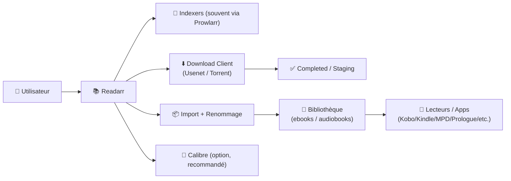
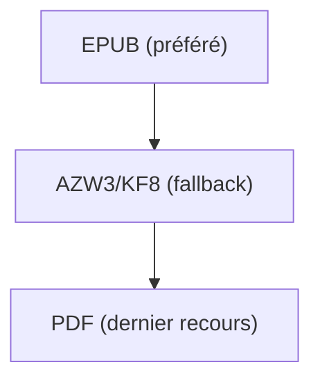
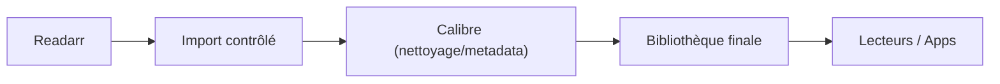

# 📚 Readarr — Présentation & Configuration Premium (Sans install / Sans Docker / Sans Nginx / Sans UFW)

### Gestion automatisée de bibliothèque **ebooks + audiobooks**
Qualité maîtrisée • Métadonnées propres • Intégration Calibre • Indexers + Download clients • Exploitation durable

---

## TL;DR

- **Readarr** gère une bibliothèque de **livres** comme Sonarr/Radarr le font pour séries/films : suivi, recherche, import, renommage, upgrades.
- Le “premium” = **métadonnées cohérentes**, **workflow Calibre**, **règles qualité**, **providers fiables**, **tests/rollback**.
- Point important : Readarr a connu des changements de maintenance (voir section *Statut & maintenance*).

---

## ✅ Checklists

### Pré-configuration (avant de remplir la bibliothèque)
- [ ] Décider : **ebooks**, **audiobooks**, ou **deux instances** (souvent plus propre)
- [ ] Définir **source de vérité** : Calibre (recommandé) ou dossier simple
- [ ] Fixer la **taxonomie** : auteurs, séries, langues, formats (EPUB/KF8/PDF, M4B/MP3)
- [ ] Définir les **règles qualité** (formats préférés, tailles, exclusions)
- [ ] Valider le **parcours fichier** : downloads → import → bibliothèque (chemins stables)

### Post-configuration (qualité opérationnelle)
- [ ] Import test : 1 livre + 1 audiobook → renommage OK
- [ ] Recherche test : 1 auteur surveillé → release trouvée → download → import OK
- [ ] Métadonnées : couverture, série, ISBN/ASIN (si dispo) cohérents
- [ ] Logs propres (pas de boucle d’indexer / pas d’erreurs de mapping)
- [ ] Procédure rollback documentée (métadonnées + renommage + import)

---

> [!TIP]
> Pour un résultat “bibliothèque premium”, l’intégration **Calibre** (et/ou Calibre-Web en lecture) apporte une gouvernance bien supérieure aux simples dossiers.

> [!WARNING]
> Le piège #1 = mélanger ebooks + audiobooks dans la même logique sans règles.  
> Souvent, **2 instances** (ou au minimum 2 “root folders”) évitent le chaos.

> [!DANGER]
> Un mauvais renommage / import mal mappé peut “réorganiser” ta bibliothèque de façon irréversible.  
> Toujours faire des tests sur un petit échantillon avant de scaler.

---

# 1) Readarr — Vision moderne

Readarr n’est pas juste un “grabber de livres”.

C’est :
- 🧠 Un **moteur de décision** (formats, langues, préférences)
- 🔎 Un **orchestrateur d’indexers** (Usenet / BitTorrent via Prowlarr)
- 📦 Un **gestionnaire de bibliothèque** (import, renommage, structure)
- 🔄 Un **automateur** (monitoring auteurs/séries, upgrades)

---

# 2) Architecture globale (référence)



---

# 3) Statut & maintenance (à connaître)

- Repo Readarr (code) : https://github.com/Readarr/Readarr  
- Organisation Readarr (repos) : https://github.com/Readarr  
- Site Readarr (docs + note sur images) : https://readarr.com/  

Notes utiles :
- Le site indique que **l’équipe Readarr ne fournit pas d’image Docker “officielle”** (tierces parties).  
- Le repo GitHub a été marqué “archive” (visible dans la liste des repos de l’org).

---

# 4) Philosophie de configuration premium (5 piliers)

1. 🎯 **Profils qualité** (formats préférés, exclusions)
2. 🧾 **Métadonnées propres** (auteurs/séries/éditions)
3. 📚 **Workflow Calibre** (source de vérité + exports propres)
4. 🔎 **Indexation saine** (Prowlarr + catégories + limites)
5. 🧪 **Validation / Tests / Rollback** (éviter les dégâts à grande échelle)

---

# 5) Modèle bibliothèque (ce qui évite le chaos)

## 5.1 Ebooks (recommandé)
Structure logique :
- par **Auteur**
- puis **Série** (si applicable)
- puis **Titre**

Exemple :
```
/books/
  Brandon Sanderson/
    Mistborn/
      Mistborn - 01 - The Final Empire (EPUB).epub
```

## 5.2 Audiobooks (recommandé)
Structure logique :
- par **Auteur**
- puis **Série**
- puis **Titre**
- fichiers audio + cover + metadata

Exemple :
```
/audiobooks/
  Andy Weir/
    Project Hail Mary/
      Project Hail Mary (2021).m4b
      cover.jpg
```

> [!TIP]
> Si tu veux ebooks + audiobooks, fais **2 root folders** minimum, et idéalement **2 instances** pour des règles qualité distinctes.

---

# 6) Profils Qualité — le cœur stratégique

Readarr “premium” = préférer ce qui est **lisible, léger, compatible**, et éviter les sources “bizarres”.

## 6.1 Ebooks : stratégie moderne
- ✅ Préférer : EPUB (compat), AZW3/KF8 (si Kindle), PDF seulement si nécessaire
- ❌ Éviter : formats exotiques mal supportés
- 📏 Tailles : filtre anti “scans moches” ou fichiers corrompus

Exemple logique :


## 6.2 Audiobooks : stratégie moderne
- ✅ Préférer : M4B (chapitres), sinon MP3 (large compat)
- 🎧 Options : “single file” vs “multi files” selon ton écosystème

---

# 7) Métadonnées & Matching (le “niveau pro”)

## 7.1 Pourquoi le matching est difficile
Un même livre peut exister en :
- éditions différentes
- langues différentes
- séries/volumes parfois incohérents selon les sources
- titres alternatifs

## 7.2 Règles premium
- Normaliser **langue** (FR/EN) et s’y tenir
- S’appuyer sur **ISBN/ASIN** quand disponible
- Forcer la cohérence “Série / Tome / Numéro”
- Éviter les doublons d’éditions non souhaitées

> [!WARNING]
> Si tu changes les règles de matching après avoir importé 5 000 livres, tu vas créer des “mouvements” massifs.  
> Toujours valider sur 20–50 éléments avant.

---

# 8) Intégration Calibre (recommandée)

## 8.1 Pourquoi Calibre est un game-changer
- Source de vérité des métadonnées
- Conversions (EPUB↔AZW3) + corrections
- Export propre vers appareils (Kindle/Kobo)
- Gestion fine des séries, tags, langues

## 8.2 Stratégie “premium” Calibre + Readarr
- Readarr : **automatisation** (trouver/télécharger/importer)
- Calibre : **gouvernance** (metadata final, conversion, qualité)

Workflow recommandé :


---

# 9) Indexers & Download Clients (logique premium)

## 9.1 Prowlarr (recommandé)
- centralise indexers
- évite duplication config
- catégories propres : `books`, `audiobooks`

## 9.2 Règles premium
- Limiter le nombre d’indexers “bruyants”
- Mettre des limites (retry, timeouts)
- Mettre des catégories dédiées côté downloader
- Activer un handling “completed” clair (Readarr récupère proprement)

> [!TIP]
> Le “premium” n’est pas d’avoir 40 indexers, mais 3–8 bons, stables, bien scorés.

---

# 10) Erreurs fréquentes (et fixes rapides)

## 10.1 “Readarr ne trouve pas les fichiers”
- Cause : chemins incohérents entre downloader et bibliothèque
- Fix : stabiliser les chemins + mappings + permissions

## 10.2 “Import en double / mauvais dossier”
- Cause : root folders mal séparés (ebooks vs audiobooks)
- Fix : séparer root + règles + catégories

## 10.3 “Mauvais match série/tome”
- Cause : sources metadata divergentes
- Fix : normaliser sur Calibre, corriger série/tome, relancer rescan contrôlé

---

# 11) Validation / Tests / Rollback (section opérationnelle)

## 11.1 Tests de validation (smoke)
```bash
# 1) Reachability (adapter host/port)
curl -I http://READARR_HOST:8787 | head

# 2) Santé “fonctionnelle” (manuel)
# - ajouter 1 auteur
# - rechercher 1 livre
# - déclencher download
# - vérifier import/renommage
```

## 11.2 Tests qualité (à faire sur 20 items)
- 10 ebooks : formats, nommage, séries, langues
- 10 audiobooks : structure, tags, cover, chapitres (si M4B)

## 11.3 Rollback (anti-catastrophe)
Plan minimal :
- Désactiver temporairement :
  - auto-renommage
  - auto-import massif
- Revenir à l’état précédent :
  - restaurer un snapshot/backup de la bibliothèque (fichiers)
  - restaurer la config Readarr (selon ton mode de déploiement)
- Rejouer un import **sur un échantillon** avant de relancer globalement

> [!DANGER]
> Avant toute grosse refonte (templates, root folders, matching), fais :
> - un export de liste
> - un backup de config
> - un test sur échantillon
> Sinon, tu “réorganises” des milliers de fichiers sans filet.

---

# 12) Sources — Images Docker (au format demandé)

## 12.1 Image LinuxServer.io (historique / tags)
- `linuxserver/readarr` (Docker Hub) : https://hub.docker.com/r/linuxserver/readarr  
- Tags (Docker Hub) : https://hub.docker.com/r/linuxserver/readarr/tags  
- Doc LinuxServer (page marquée “deprecated_images”) : https://docs.linuxserver.io/deprecated_images/docker-readarr/  
- Repo packaging LinuxServer : https://github.com/linuxserver/docker-readarr  

## 12.2 Note Readarr sur les images Docker “officielles”
- Site Readarr (mention “pas d’image Docker officielle”) : https://readarr.com/  

## 12.3 Alternatives communautaires (exemples)
- `ghudiczius/readarr` (Docker Hub) : https://hub.docker.com/r/ghudiczius/readarr  

---

# ✅ Conclusion

Readarr est puissant quand tu le traites comme un **gestionnaire de collection** :
- profils qualité clairs (formats/langues)
- métadonnées gouvernées (Calibre)
- indexers/downloader propres (catégories + limites)
- validation + rollback (éviter les dégâts)

Résultat : une bibliothèque **propre**, **cohérente**, et **automatisée** — au lieu d’un dossier “Books” ingérable.