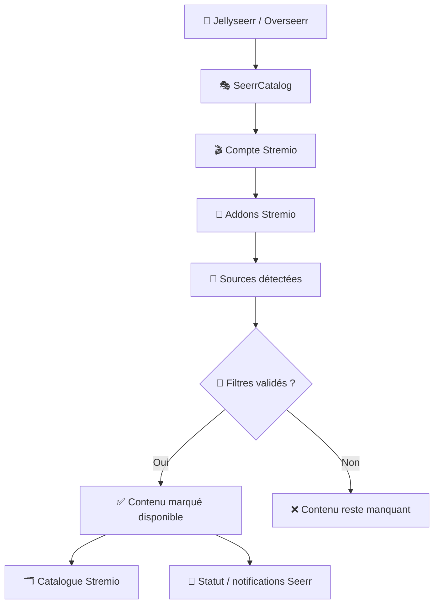
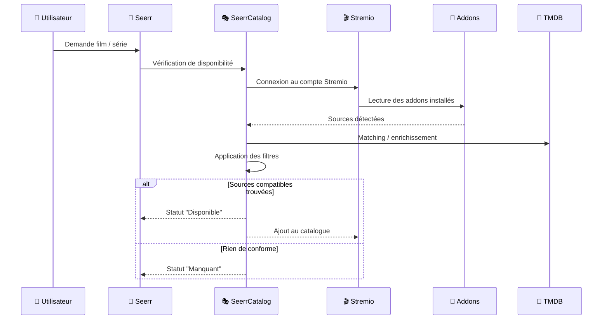

<!--
✨ SeerrCatalog — README premium edition
Basé sur le contenu fourni par l’utilisateur, en conservant l’essentiel du fond,
les visuels, les étapes, l’installation, les commandes utiles et les liens.
-->

<div align="center">


# SeerrCatalog

### 🧠 Demande dans Seerr → 🔎 vérification via tes addons Stremio → ✅ “Disponible” + 📺 catalogue dans Stremio


<br/>

> **Le pitch** : tu gardes le confort **Seerr** — demandes, statuts, notifications — et tu récupères un **catalogue Stremio** qui se remplit automatiquement, **sans pipeline *arrs* classique** et **sans téléchargement local piloté par SeerrCatalog**.

</div>

---

## 🚀 TL;DR

**SeerrCatalog** sert de **pont intelligent** entre **Jellyseerr / Overseerr** et **Stremio**.

Concrètement :
- il **reçoit une demande** depuis Seerr ;
- il **vérifie** si tes addons Stremio trouvent réellement des sources ;
- il applique tes **filtres** ;
- il remonte le contenu comme **Disponible** ;
- et il l’expose dans **un catalogue Stremio**.

> [!TIP]
> La valeur du projet ne vient pas d’un téléchargement automatique, mais d’une idée beaucoup plus élégante :
> **“si Stremio peut réellement le lire via tes addons, alors Seerr peut le considérer comme disponible.”**

---

## 🧠 Abstract

SeerrCatalog adopte une logique différente d’un stack média classique basé sur **Radarr / Sonarr / Jellyfin**.

Ici, il ne cherche pas à :
- télécharger ;
- indexer une bibliothèque locale ;
- déplacer des fichiers ;
- construire un pipeline *arrs* complet.

À la place, il :
- se présente à **Seerr** comme un backend compatible ;
- se connecte à **Stremio** ;
- lit les **addons installés** ;
- vérifie la **disponibilité réelle** des contenus demandés ;
- renvoie un **statut exploitable** dans Seerr ;
- et alimente un **catalogue Stremio dynamique**.

> [!WARNING]
> SeerrCatalog suit une logique de **disponibilité via Stremio**, pas une logique de **gestion de bibliothèque locale**.

---

## 🔎 Ce que fait SeerrCatalog

- 🔄 reçoit les demandes depuis **Jellyseerr / Overseerr**
- 🎭 émule un comportement compatible avec les attentes de Seerr
- 🎬 se connecte à un compte **Stremio**
- 🧩 détecte les **addons installés**
- 🎯 vérifie si des sources existent réellement
- 🏷️ applique des **filtres** de langue / qualité
- ✅ marque les contenus **disponibles**
- 🗂️ crée un **catalogue Stremio** associé

### Compatibilités mises en avant

- **Docker**
- **Stremio**
- **Jellyseerr**
- **Overseerr**
- **TMDB**

---

## 🧭 Positionnement

SeerrCatalog ne remplace ni **Seerr**, ni **Stremio**, ni les **addons**.  
Il joue le rôle d’une **couche de traduction** entre la demande utilisateur et la disponibilité réelle via Stremio.



---

## 🔄 Flux de traitement

Le fonctionnement global est très lisible : **demande**, **vérification**, **filtrage**, **statut**, **catalogue**.



---

## 🎬 “Ok mais ça ressemble à quoi ?”

<div align="center">
<table>
  <tr>
    <td></td>
    <td></td>
    <td></td>
  </tr>
  <tr>
    <td align="center"><sub>1) Premier utilisateur = admin</sub></td>
    <td align="center"><sub>2) Infos à recopier côté Seerr</sub></td>
    <td align="center"><sub>3) Stremio connecté + addons détectés</sub></td>
  </tr>
</table>

<br/>

<table>
  <tr>
    <td></td>
    <td></td>
    <td></td>
  </tr>
  <tr>
    <td align="center"><sub>4) Filtres : FRENCH / MULTI + 1080p+</sub></td>
    <td align="center"><sub>5) Installation dans Stremio</sub></td>
    <td align="center"><sub>6) Notifications “Available”</sub></td>
  </tr>
</table>
</div>

---

## 🛠️ Installation Docker

> [!TIP]
> Le point vraiment important ici : **le volume doit être persistant**, sinon tu perds les utilisateurs, la configuration et l’état de l’instance.

### `docker-compose.yml`

```yaml
services:
  seerr-catalog:
    image: ghcr.io/aerya/stremio-seerr-catalog:latest
    container_name: seerr-catalog
    ports:
      - "7000:7000"
    env_file:
      - .env
    environment:
      - BASE_URL=${BASE_URL}
      - API_KEY=${API_KEY}
      - PORT=${PORT}
      - HOST=${HOST}
      - TMDB_API_KEY=${TMDB_API_KEY}
    volumes:
      - /mnt/Docker/stremio/seerrcatalog:/app/data
    restart: always
```

### `.env`

```bash
# Clé API pour l’émulation Radarr / Sonarr
API_KEY=zblob1237

PORT=7000
HOST=0.0.0.0

# URL publique si reverse proxy
BASE_URL=https://stremio-seerrcatalog.domain.tld

# Pour TMDB (matching + posters)
TMDB_API_KEY=xxx
```

### Lancer

```bash
docker compose up -d
docker logs -f seerr-catalog
```

---

## ⚙️ Variables d’environnement utiles

SeerrCatalog peut être piloté via plusieurs variables d’environnement structurantes.

### 🌐 URL publique

```bash
BASE_URL=https://stremio-seerrcatalog.domain.tld
```

### 🔑 Clé API côté compatibilité Seerr

```bash
API_KEY=zblob1237
```

### 🚪 Port

```bash
PORT=7000
```

### 🖧 Host

```bash
HOST=0.0.0.0
```

### 🧠 Clé TMDB

```bash
TMDB_API_KEY=xxx
```

> [!TIP]
> Les variables les plus importantes sont généralement **BASE_URL**, **API_KEY** et **TMDB_API_KEY**.

---

## 🧙‍♂️ Setup — WebUI → Seerr → Stremio

### 🪪 Étape A — créer le premier compte admin


Le premier utilisateur créé devient l’**administrateur** de l’instance.

---

### 🔗 Étape B — récupérer les informations utilisateur à coller dans Seerr


Chaque utilisateur dispose d’informations / endpoints à renseigner côté **Seerr** pour relier correctement le service.

---

### 🎬 Étape C — connecter un compte Stremio


SeerrCatalog doit pouvoir accéder au compte **Stremio** pour lire les addons installés et vérifier les sources réellement visibles.

> [!WARNING]
> Si le compte Stremio n’est pas correctement relié, la logique de disponibilité ne peut pas fonctionner correctement.

---

### 🎯 Étape D — définir les filtres


Tu peux définir des critères comme :
- **FRENCH**
- **MULTI**
- **1080p+**
- autres préférences de qualité / langue

> [!TIP]
> L’intérêt de SeerrCatalog n’est pas juste de trouver “quelque chose”, mais de trouver **quelque chose qui correspond à tes critères réels**.

---

### 🧠 Étape E — renseigner TMDB et l’URL Seerr


TMDB aide pour :
- le **matching** ;
- les **métadonnées** ;
- les **posters** ;
- une présentation plus propre côté interface.

---

### 📺 Étape F — installer l’addon dans Stremio


L’addon doit évidemment être installé côté **Stremio** pour que le catalogue et la logique de disponibilité aient une traduction concrète dans l’interface finale.

---

## 🔌 Côté Seerr : ajout comme Radarr / Sonarr

<div align="center">
<table>
  <tr>
    <td></td>
    <td></td>
    <td></td>
  </tr>
  <tr>
    <td align="center"><sub>Radarr pour les films</sub></td>
    <td align="center"><sub>Sonarr pour les séries</sub></td>
    <td align="center"><sub>Le service apparaît comme connecté</sub></td>
  </tr>
</table>
</div>

SeerrCatalog est intégré côté Seerr comme s’il s’agissait d’un backend de type **Radarr / Sonarr**.

> [!NOTE]
> C’est précisément ce mécanisme qui permet à SeerrCatalog de s’insérer dans les workflows habituels de **Jellyseerr / Overseerr**.

---

## ✅ Le moment “whaou”

### 1) Tu demandes une série


### 2) Elle apparaît dans les demandes


### 3) SeerrCatalog trouve des sources via Stremio

<div align="center">
  
  <br/>
  
</div>

### 4) Et Stremio expose le catalogue prêt à consommer


> [!TIP]
> C’est là que le projet devient très fort visuellement : **la demande, la disponibilité et le catalogue final racontent la même histoire d’un bout à l’autre**.

---

## 🧠 Deux choses à savoir

> [!NOTE]
> **1) Séries** : si plusieurs saisons sont demandées, SeerrCatalog peut s’appuyer surtout sur **S01E01** comme point de contrôle. Si cet épisode est trouvable, la série peut être considérée comme exploitable.

> [!NOTE]
> **2) Pas de téléchargement** : c’est volontaire. Le projet suit une logique **“disponible via addons Stremio”**, pas une logique de pipeline *arrs* complet.

---

## 🔐 HTTPS et exposition distante

> [!DANGER]
> Dès que l’instance doit être exposée à distance, une **URL publique propre** est fortement recommandée, idéalement en **HTTPS**.

En pratique :
- en local, une URL interne peut suffire selon le scénario ;
- à distance, une URL publique stable améliore fortement l’intégration entre les services.

Cette couche publique compte particulièrement si SeerrCatalog doit dialoguer proprement avec **Seerr**, **Stremio** et un éventuel **reverse proxy**.

---

## 🧯 Si tout reste en “Manquant”

Les causes les plus fréquentes sont généralement :

- l’addon **SeerrCatalog** n’est pas correctement installé dans Stremio ;
- le compte **Stremio** n’est pas bien connecté ;
- les addons attendus ne sont pas visibles ;
- les filtres sont trop stricts ;
- la configuration **TMDB** est absente ou incomplète.

### Checklist express

- L’addon SeerrCatalog est bien **installé** dans Stremio
- Le compte Stremio est bien **connecté**
- SeerrCatalog **voit tes addons**
- Les filtres ne sont pas trop stricts
- TMDB est bien configuré

### Commandes utiles

```bash
docker ps --filter name=seerr-catalog
docker logs -n 200 seerr-catalog
docker exec -it seerr-catalog sh
```

> [!TIP]
> En cas de doute, commence toujours par vérifier ce trio :
> **compte Stremio connecté**, **addons bien détectés**, **filtres pas trop agressifs**.

---

## ✅ Forces

- 🧠 très belle intégration conceptuelle avec **Seerr**
- 🎬 s’appuie sur **Stremio** comme moteur réel de disponibilité
- 🔔 conserve statuts et notifications côté **Jellyseerr / Overseerr**
- 🗂️ produit un **catalogue Stremio** cohérent
- 📦 évite une stack média lourde
- ⚙️ se déploie simplement via **Docker**

---

## ⚠️ Limites

- dépend directement de la qualité et de la présence des **addons Stremio**
- ne télécharge pas et ne construit pas une bibliothèque locale classique
- peut sembler “ne rien trouver” si les **filtres** sont trop stricts
- suit une philosophie différente des usages *arrs* traditionnels

> [!WARNING]
> Plus l’attente utilisateur ressemble à un pipeline **Radarr / Sonarr** classique, plus il faut bien comprendre que SeerrCatalog suit une **autre approche**.

---

## 🏁 Conclusion

SeerrCatalog est surtout intéressant comme **pont premium entre Seerr et Stremio** :

- il **reçoit la demande** ;
- il **vérifie les sources** ;
- il **décide de la disponibilité** ;
- il **alimente un catalogue**.

Sa vraie force vient du fait qu’il combine dans un même flux :
- le confort de **Jellyseerr / Overseerr** ;
- la souplesse des **addons Stremio** ;
- la logique de **filtres** ;
- une restitution finale simple à consommer.

> [!TIP]
> En une phrase : **SeerrCatalog transforme une demande Seerr en disponibilité concrète et en catalogue dynamique dans Stremio.**

---

## 🔗 Liens

- Article + captures : https://upandclear.org/2026/01/03/seerrcatalog-laddon-over-jelly-seerr-pour-stremio/
- GitHub : https://github.com/Aerya/Stremio-Seerr-Catalog