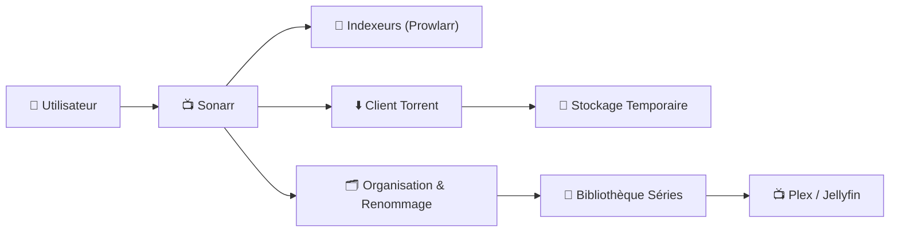
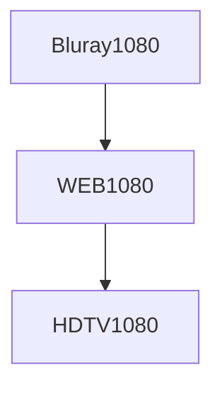
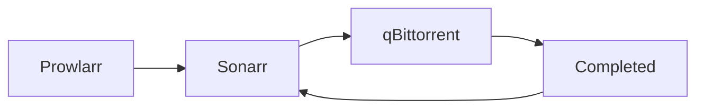
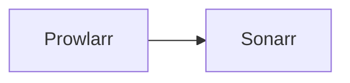
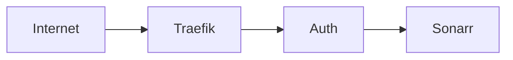
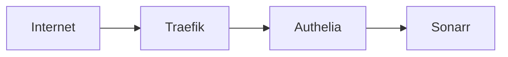
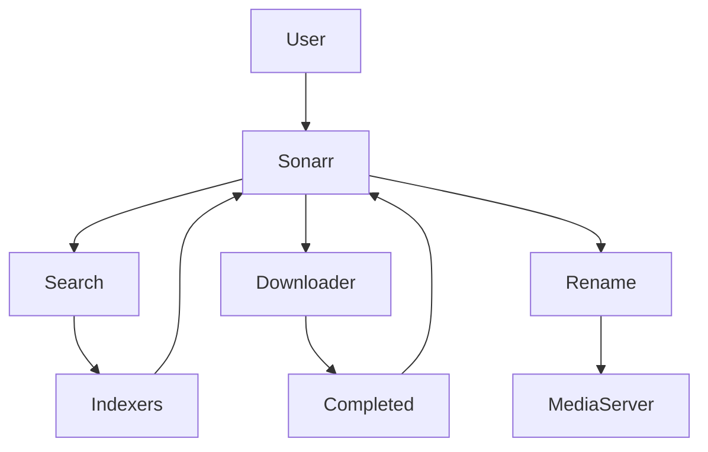

# 📺 Sonarr — Architecture & Configuration Premium

!!! abstract ""
    **Automatisation intelligente de vos séries**  
    Optimisé Docker • Multi-épisodes • Qualité maîtrisée • Workflow propre & évolutif

---

# 🎯 Vision moderne de Sonarr

Sonarr n’est pas un simple téléchargeur automatique.

C’est :

- 🧠 Un moteur de gestion d’épisodes
- 📦 Un organisateur intelligent multi-saisons
- 🔎 Un orchestrateur d’indexeurs
- 🔄 Un moteur d’upgrade progressif

Il connecte :

- Prowlarr
- Client torrent
- Stockage
- Plex / Jellyfin

---

# 🏗️ Architecture globale



---

# 🧠 Philosophie de configuration Premium

Une configuration propre repose sur 6 piliers :

1. 🎯 Profils qualité intelligents
2. 📊 Gestion des saisons complètes
3. 🧩 Custom Formats avancés
4. 🔄 Monitoring efficace
5. 💾 Hardlinks optimisés
6. 🛡️ Sécurisation via Reverse Proxy

---

# 🎬 1️⃣ Profils Qualité — Le cœur stratégique

Sonarr doit gérer :

- Épisodes uniques
- Saisons complètes
- Web vs Bluray
- Anime vs Series classiques

---

## 📊 Exemple Profil 1080p Standard

Ordre recommandé :

1. Bluray 1080p
2. WEB-DL 1080p
3. HDTV 1080p



🎯 Objectif : upgrade automatique si meilleure version détectée.

---

# 🎬 2️⃣ Gestion des Saisons Complètes

Sonarr peut :

- Télécharger saison complète
- Remplacer épisode par épisode
- Prioriser releases multi-épisodes

Configuration recommandée :

✔ Activer “Preferred word” pour `Season`  
✔ Autoriser Multi-Episode releases  

---

# 🧩 3️⃣ Custom Formats (niveau avancé)

Permet de :

- Prioriser x265
- Favoriser HDR
- Bloquer releases LQ
- Éviter releases mal encodées

---

## 🎯 Exemple scoring intelligent

| Format | Score |
|--------|-------|
| x265 | +100 |
| HDR | +150 |
| Proper | +50 |
| LQ | -10000 |

Cela évite les mauvaises releases et améliore la cohérence bibliothèque.

---

# 📁 4️⃣ Organisation Premium des Fichiers

Structure recommandée :

```
/data/media/series/
    Series Name/
        Season 01/
            Series Name - S01E01 - 1080p WEB-DL x265.mkv
```

---

## 🎬 Renaming Template recommandé

```
{Series Title} - S{season:00}E{episode:00} - {Quality Full} - {MediaInfo VideoCodec}
```

Résultat :

```
The Last of Us - S01E03 - 1080p WEB-DL - x265.mkv
```

---

# 💾 5️⃣ Hardlinks (Optimisation Disque)

Recommandé si ton stockage le permet :

✔ Pas de duplication  
✔ Move instantané  
✔ Pas de double espace  

Activer :

- “Use Hardlinks”
- Completed Download Handling

---

# 🔎 6️⃣ Intégration avec Prowlarr

Architecture recommandée :



Avantages :

✔ Centralisation des indexeurs  
✔ Maintenance simplifiée  
✔ API unique  

---

---

# ⚙️ Configuration Recommandée Sonarr (SSDV2)

Cette configuration est optimisée pour :

- qBittorrent
- Prowlarr
- Hardlinks
- Reverse Proxy
- SSDv2 Docker

Objectif : stabilité + cohérence + automatisation propre.

---

# 📁 1️⃣ Root Folder (CRUCIAL)

Dans **Settings > Media Management**

Root folder recommandé :

```
/data/media/series
```

⚠️ Important :

- Ce dossier doit être sur le même filesystem que `/data/downloads`
- Sinon les hardlinks ne fonctionneront pas

---

# 🔄 2️⃣ Media Management

Activer :

- ✅ Rename Episodes
- ✅ Replace Illegal Characters
- ✅ Use Hardlinks instead of Copy
- ✅ Delete Empty Folders

Désactiver :

- ❌ Import using Copy

---

## 📺 Naming Template recommandé

Series Folder :

```
{Series Title}
```

Season Folder :

```
Season {season:00}
```

Episode File :

```
{Series Title} - S{season:00}E{episode:00} - {Quality Full} - {MediaInfo VideoCodec}
```

Résultat :

```
The Last of Us - S01E03 - 1080p WEB-DL - x265.mkv
```

---

# 🎯 3️⃣ Profils Qualité

Dans **Settings > Profiles**

Ordre recommandé 1080p :

1. Bluray-1080p
2. WEB-1080p
3. HDTV-1080p

Pour Anime, profil spécifique recommandé.

---

## 📏 Size Limits recommandés

Exemple 1080p :

- Minimum : 1GB
- Preferred : 3–6GB
- Maximum : 10–15GB

Évite les releases trop compressées ou trop lourdes.

---

# 🧩 4️⃣ Custom Formats (Niveau Premium)

Dans **Settings > Custom Formats**

Exemple scoring :

| Format | Score |
|--------|-------|
| x265 | +100 |
| HDR | +150 |
| Proper | +50 |
| LQ | -10000 |

Permet :

- Favoriser x265
- Prioriser HDR
- Bloquer releases douteuses

---

# 📺 5️⃣ Gestion Multi-Épisodes

Sonarr gère :

- Episodes simples
- Double épisodes
- Saisons complètes

Recommandé :

- Activer Multi-Episode Releases
- Autoriser Season Packs

Cela réduit les téléchargements multiples inutiles.

---

# 🔎 6️⃣ Indexers (via Prowlarr recommandé)

Architecture recommandée :



Ne pas configurer indexers directement si Prowlarr utilisé.

Avantages :

- Centralisation
- Maintenance simplifiée
- API unique

---

# ⬇️ 7️⃣ Download Client (qBittorrent)

Dans **Settings > Download Clients**

Ajouter :

- Host : qbittorrent
- Port : interne Docker
- Category : series

Activer :

- ✅ Completed Download Handling
- ✅ Remove Completed Downloads (optionnel)

---

# 🔗 8️⃣ Hardlinks — Vérification

Pour que les hardlinks fonctionnent :

- `/data/downloads`
- `/data/media`

Doivent être montés correctement dans Docker.

Sinon :

- Copie au lieu de hardlink
- Double espace disque utilisé

---

# 🔄 9️⃣ Monitoring

Dans chaque série :

- Activer Monitoring
- Sélectionner saisons suivies
- Utiliser “All Episodes” pour séries complètes

Recommandé :

👉 Surveiller uniquement saisons désirées si série longue.

---

# 🛡️ 10️⃣ Sécurisation Sonarr

Ne jamais exposer Sonarr directement.

Architecture recommandée :



Ajouter :

- HTTPS obligatoire
- Authentification externe
- CrowdSec en amont

---

# ⚡ 11️⃣ Performance VPS

Recommandations :

- Intervalle RSS raisonnable (15 min)
- Limiter scan automatique si bibliothèque volumineuse
- Surveiller logs régulièrement

---

# 🚨 Erreurs fréquentes

❌ Downloads et Media sur deux disques différents  
❌ Catégorie qBittorrent incorrecte  
❌ Hardlinks non activés  
❌ Profil qualité mal ordonné  
❌ Size limits mal définies  
❌ Exposition directe sur Internet  

---

# 🧠 Résumé Configuration Premium

✔ Root folder propre  
✔ Hardlinks activés  
✔ Profil qualité intelligent  
✔ Custom formats configurés  
✔ Prowlarr centralisé  
✔ Reverse proxy sécurisé  

---

# 🎯 Conclusion Technique

Une configuration Sonarr bien pensée :

- Automatise proprement les séries
- Gère multi-épisodes efficacement
- Optimise l’espace disque
- Améliore la qualité globale
- Sécurise l’accès

Dans SSDv2, Sonarr devient :

📺 Un orchestrateur de séries  
🔄 Un moteur d’upgrade intelligent  
📦 Une brique essentielle du pipeline media

---

# 🛡️ 7️⃣ Sécurisation via Traefik

Ne jamais exposer Sonarr directement.

Architecture recommandée :



Ajouts recommandés :

- HTTPS obligatoire
- Authentification externe
- CrowdSec en amont

---

# 📊 Configuration optimale recommandée

| Élément | Recommandation |
|----------|----------------|
| Profil qualité | Bluray > WEB > HDTV |
| Custom formats | x265 + HDR boost |
| Multi-episodes | Activé |
| Hardlinks | Activés |
| Monitoring | Actif sur toutes séries suivies |

---

# 🚀 Workflow Premium Final



---

# 🧠 Ce que ça change réellement

Une configuration premium permet :

✔ Téléchargement propre et cohérent  
✔ Upgrade automatique intelligent  
✔ Bibliothèque organisée  
✔ Zéro intervention manuelle  
✔ Optimisation espace disque  

---

# 🏢 Vision Architecture SSDv2

Sonarr devient :

- 📺 Orchestrateur séries
- 🧠 Moteur qualité intelligent
- 🔄 Automatisation complète
- 📦 Gestion propre multi-saisons
- 🔐 Service sécurisé via reverse proxy

---

<div class="stat-grid">

<div class="stat-card">
<div class="stat-number">📺</div>
<div class="stat-label">Séries maîtrisées</div>
</div>

<div class="stat-card">
<div class="stat-number">⚡</div>
<div class="stat-label">Automatisation totale</div>
</div>

<div class="stat-card">
<div class="stat-number">💾</div>
<div class="stat-label">Stockage optimisé</div>
</div>

<div class="stat-card">
<div class="stat-number">🛡️</div>
<div class="stat-label">Accès sécurisé</div>
</div>

</div>

---

# 🎯 Conclusion

Une configuration Sonarr premium repose sur :

- Profils intelligents
- Custom formats propres
- Organisation stricte
- Intégration Prowlarr
- Hardlinks activés
- Sécurisation via Traefik + CrowdSec

Ce n’est pas “juste un automatisme”.

C’est une **architecture media DevOps propre, scalable et maîtrisée**.

---
