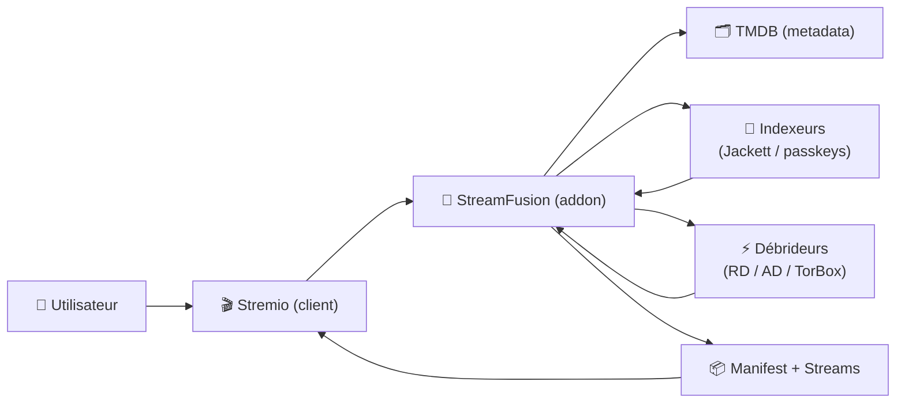

# 🌊 StreamFusion — Présentation & Configuration Premium (Stremio Addon)

### Addon Stremio orienté francophone : indexeurs + débrideurs + scoring + sécurité par API key
Optimisé pour reverse proxy existant • Multi-sources • Résultats “qualité d’abord” • Exploitation durable

---

## TL;DR

- **StreamFusion** est un **addon Stremio** qui agrège des sources (indexeurs + débrideurs) et renvoie des résultats “streamables” dans Stremio.
- Son “premium mode” repose sur : **API key**, **TMDB**, **providers (RD/AD/TorBox)**, **indexeurs (Jackett/Ygg passkeys)**, **tri FR**, **stabilité**.
- Objectif : **moins de bruit**, **meilleure pertinence**, **moins de clics**, **moins de pannes**.

> ⚖️ Note légale : utilise ces outils en respectant la loi et les conditions de service des plateformes utilisées. StreamFusion est généralement présenté comme un projet “éducatif/recherche”.

---

## ✅ Checklists

### Pré-configuration (avant usage réel)
- [ ] Une **API key** StreamFusion (clé secrète) est générée et stockée en sécurité
- [ ] Une **TMDB API key** valide est prête
- [ ] Stratégie sources décidée :
  - [ ] Débrideur unique (ex: RD) **ou** multi-débrideurs
  - [ ] Indexeurs via **Jackett** **ou** passkeys directs (YGG/Sharewood)
- [ ] Politique “qualité” : FR first / multi-audio / teams / tailles
- [ ] Reverse proxy existant : HTTPS + auth (SSO/forward-auth/VPN)

### Post-configuration (qualité opérationnelle)
- [ ] Stremio voit l’addon (install URL OK)
- [ ] Un film test renvoie des résultats cohérents (FR tri)
- [ ] Un résultat “cached” (si débrideur) sort en priorité
- [ ] Logs propres (pas de boucle d’erreurs providers)
- [ ] Procédure “validation / rollback” documentée (ci-dessous)

---

> [!TIP]
> StreamFusion donne ses meilleurs résultats quand tu **limites les sources** au départ, puis tu élargis progressivement (sinon tu te retrouves avec du bruit + des erreurs difficiles à diagnostiquer).

> [!WARNING]
> Les tokens (RD/AD/etc.) + passkeys (YGG/Sharewood) = secrets.  
> Stockage : variables d’environnement / gestionnaire de secrets / vault — jamais en clair dans un repo.

> [!DANGER]
> Un addon Stremio est un **point d’entrée** : ne l’expose pas publiquement sans **contrôle d’accès** (au minimum VPN/SSO).  
> Et ne partage jamais une URL d’install contenant des secrets.

---

# 1) StreamFusion — Vision moderne

StreamFusion n’est pas juste “un moteur de liens”.

C’est :
- 🧠 un **orchestrateur** (sources multiples)
- 🎯 un **moteur de tri** orienté FR (langues / teams)
- 🔐 un service **protégé par clé API**
- 🔎 un pont Stremio ↔ indexeurs ↔ débrideurs (liens streamables)

---

# 2) Architecture globale



---

# 3) Les 5 piliers “premium” (ce qui évite 90% des galères)

1. 🔐 **Sécurité** : clé API + reverse proxy + secrets propres  
2. 🧭 **Sources maîtrisées** : indexeurs cohérents + débrideur(s) stables  
3. 🎯 **Tri & pertinence** : FR first, cached first, teams reconnues  
4. 🔄 **Résilience** : retries raisonnables, timeouts, logs lisibles  
5. 🧪 **Validation / rollback** : tests rapides + retour arrière simple

---

# 4) Secrets & Variables (ce qui compte vraiment)

## 4.1 Indispensables
- `SECRET_API_KEY` : protège le panneau/accès admin (et/ou endpoints sensibles)
- `TMDB_API_KEY` : métadonnées (films/séries)

## 4.2 Sources (optionnelles selon ta stratégie)
- `JACKETT_API_KEY` : si tu passes par Jackett
- `YGG_PASSKEY` : si indexeur direct type YGG (passkey)
- `SHAREWOOD_PASSKEY` : idem (passkey)

## 4.3 Débrideurs (optionnels)
- `RD_TOKEN` : Real-Debrid (compte unique)
- `AD_TOKEN` : AllDebrid (compte unique)
- (TorBox selon implémentation/variables disponibles dans ta version)

> [!TIP]
> Stratégie recommandée : commence avec **1 débrideur** + **1 source indexeur**.  
> Valide, puis seulement ajoute le reste.

---

# 5) Stratégie de résultats (qualité, pertinence, FR)

## 5.1 Ordre de priorité “propre”
1. ✅ Cached / instant (si débrideur et dispo)  
2. ✅ Match fiable (hash / release group / naming cohérent)  
3. ✅ Langue FR (ou multi-audio FR)  
4. ✅ Taille raisonnable (éviter micro-encodes et giga remux si tu ne veux pas)  

## 5.2 “FR-first” sans casser le fallback
- Prioriser FR
- Autoriser EN en fallback (sinon tu te retrouves parfois avec 0 résultat)
- Si tu utilises Stremio : garde la possibilité de choisir, mais mets les meilleurs en haut

---

# 6) Débrideurs : logique “cached-first”

Le gain énorme d’un débrideur :
- ⚡ disponibilité rapide (quand c’est en cache)
- 🧹 moins de sources mortes
- 🧠 expérience plus fluide

Bonnes pratiques :
- 1 token par usage (éviter de partager)
- surveiller quotas / limitations
- éviter les refresh agressifs (rate limit)

---

# 7) Indexeurs : Jackett vs passkeys

## 7.1 Jackett (centralisation)
- Un point unique pour gérer les indexeurs
- API stable, maintenance simplifiée
- Recommandé si tu as déjà une stack “indexers”

## 7.2 Passkeys (direct)
- Plus direct, moins de dépendances
- Mais gestion des secrets plus sensible
- Debug plus “à la main”

> [!WARNING]
> Beaucoup d’“instabilités” ressenties viennent d’indexeurs qui throttlent, changent, ou bloquent.  
> En premium ops : tu gardes une liste courte + fiable.

---

# 8) Sécurisation (sans recettes d’installation)

Objectif : StreamFusion doit rester **privé**.
- HTTPS via reverse proxy existant
- Auth externe (SSO/forward-auth) ou VPN
- Rotation des clés/tokens si suspicion

Checklist sécurité :
- [ ] secrets jamais dans l’URL partagée
- [ ] logs sans secrets (ou masqués)
- [ ] accès admin limité

---

# 9) Observabilité & Debug (la méthode “qui marche”)

## 9.1 Ce que tu surveilles
- erreurs TMDB (clé invalide / rate limit)
- erreurs indexeurs (timeouts / 401/403)
- erreurs débrideurs (token expiré / quota / API down)
- latence (temps de réponse addon)

## 9.2 Patterns de recherche utiles
```bash
# Exemples génériques (adaptés à tes logs)
grep -iE "error|exception|traceback|timeout|rate|quota|401|403|429" streamfusion.log
```

> [!TIP]
> Quand “ça ne marche plus”, commence par :  
> 1) TMDB OK ? 2) clé API OK ? 3) indexeur répond ? 4) débrideur répond ?  
> Tu identifies 95% des causes en 2 minutes.

---

# 10) Validation / Tests / Rollback

## 10.1 Tests de validation (smoke tests)
- Ouvrir l’URL de configuration / install addon dans Stremio
- Tester 1 film très connu + 1 série très connue
- Vérifier :
  - résultats affichés
  - cohérence langue (FR en haut)
  - cached-first si débrideur actif
  - pas d’erreurs en boucle dans les logs

## 10.2 Tests de non-régression (après changement)
- Ajouter un provider → retester un film + une série
- Modifier indexeurs → retester une recherche identique
- Changer tokens → vérifier latence + résultats

## 10.3 Rollback (simple)
- Revenir à l’ancienne config de variables (snapshot)
- Désactiver le provider ajouté en dernier
- Régénérer `SECRET_API_KEY` si fuite suspectée
- En dernier recours : revenir à une version d’image précédente (si tu utilises une image taggée)

---

# 11) Erreurs fréquentes (et fixes)

## “Aucun résultat”
- TMDB KO / clé invalide
- Indexeurs KO (Jackett down / passkey invalide)
- Filtrage trop strict (FR-only sans fallback)
- Débrideur configuré mais token invalide

## “Résultats bruités / mauvais”
- Trop de sources actives
- Tri/score pas aligné (langue/teams)
- Indexeur renvoie beaucoup de faux positifs

## “Ça marche puis ça casse”
- rate limits
- indexeur instable
- token expiré / révoqué

---

# 12) Sources — Images Docker (format demandé, URLs brutes)

## 12.1 Image principale StreamFusion
- `ghcr.io/limedrive/stream-fusion:latest` (déclarée dans le compose officiel) : https://raw.githubusercontent.com/LimeDrive/stream-fusion/master/deploy/docker-compose.yml  
- Repo (référence projet) : https://github.com/LimeDrive/stream-fusion  
- Docs “StreamFusion Stack” : https://docs.stremio-stack.com/StreamFusion/streamfusion/  

## 12.2 Images “dépendances” visibles dans la stack officielle
- `redis:latest` (utilisé par la stack) : https://raw.githubusercontent.com/LimeDrive/stream-fusion/master/deploy/docker-compose.yml  
- `postgres:16.3-alpine3.20` (utilisé par la stack) : https://raw.githubusercontent.com/LimeDrive/stream-fusion/master/deploy/docker-compose.yml  
- `ipromknight/zilean:latest` (utilisé par la stack) : https://raw.githubusercontent.com/LimeDrive/stream-fusion/master/deploy/docker-compose.yml  
- `lscr.io/linuxserver/jackett:latest` (utilisé par la stack) : https://raw.githubusercontent.com/LimeDrive/stream-fusion/master/deploy/docker-compose.yml  
- LinuxServer (Jackett) — source image : https://docs.linuxserver.io/images/docker-jackett/  

## 12.3 Catalogue addon (référence communautaire)
- Page addon “StreamFusion” : https://stremio-addons.net/addons/streamfusion  

---

# ✅ Conclusion

StreamFusion devient “premium” quand :
- tes **secrets** sont gérés proprement,
- tes **sources** sont limitées et fiables,
- ton **tri FR** est cohérent,
- tu as une routine **validation / rollback** rapide.

Résultat : une expérience Stremio plus stable, plus pertinente, et beaucoup moins “bruitée”.