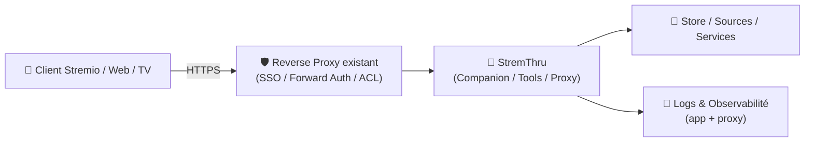
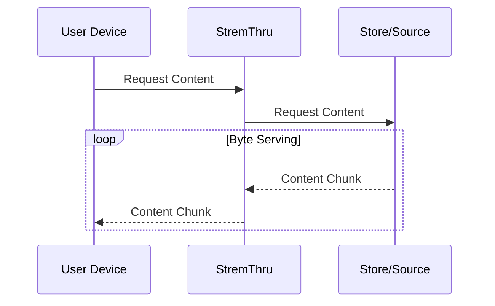

# 🧰 StremThru — Présentation & Usage Premium (Companion Stremio)

### “Multitool” pour enrichir et proxyfier des flux/addons Stremio, avec une couche d’outils autour
Optimisé pour reverse proxy existant • Multi-usage • Gouvernance • Exploitation durable

---

## TL;DR

- **StremThru** n’est pas un addon “classique” : c’est une **collection d’outils** qui s’intercale entre ton client Stremio et des sources/outils (“store”, “wrap”, “proxy”, etc.).
- Il peut agir comme **Store Content Proxy** : ton client demande un contenu → StremThru relaie/stream le contenu en chunks.
- Version “premium ops” : **contrôle d’accès**, **segmentation**, **journalisation**, **tests**, **rollback**, **surface exposée minimale**.

---

## ✅ Checklists

### Pré-usage (avant d’ouvrir StremThru à d’autres)
- [ ] Définir le périmètre d’usage (test perso / équipe / multi-users)
- [ ] Mettre StremThru **derrière** ton reverse proxy existant (HTTPS + auth/SSO/ACL)
- [ ] Décider ce qui est autorisé (quels endpoints/outils, quelles routes)
- [ ] Définir une politique de logs (PII/secrets, rotation)
- [ ] Écrire un mini-runbook : “où regarder quand ça ne marche pas”

### Post-configuration (qualité opérationnelle)
- [ ] Les routes publiques non nécessaires sont bloquées
- [ ] Les utilisateurs non autorisés ne peuvent rien consulter
- [ ] Un flux de test fonctionne de bout en bout (lecture + stabilité)
- [ ] Les logs sont lisibles (corrélation par request id / user)
- [ ] Le rollback est documenté et “simple”

---

> [!TIP]
> StremThru est utile quand tu veux **ajouter une couche de contrôle/compatibilité** sans modifier toutes tes sources une par une.

> [!WARNING]
> StremThru peut se retrouver au cœur d’un flux média : **latence**, **débit**, **timeouts** et **ressources** (CPU/RAM) deviennent visibles. Surveille-le.

> [!DANGER]
> StremThru est un **point de passage** : si mal protégé, il expose des métadonnées, des URLs, des tokens, ou des flux.  
> Garde une approche “zero trust” : auth obligatoire + routes minimales.

---

# 1) StremThru — Vision moderne

StremThru sert de **companion** : une “boîte à outils” autour de Stremio.

Il peut fournir (selon fonctionnalités/versions) :
- 🧩 des outils “addon” (ex: store/list/wrap, etc.)
- 🔁 une couche de proxying (Store Content Proxy)
- 🧠 des fonctions d’enrichissement/normalisation autour des flux

📌 Références (concept & fonctionnalités) :
- https://github.com/MunifTanjim/stremthru
- https://docs.elfhosted.com/app/stremthru/

---

# 2) Architecture globale (schéma de principe)



---

# 3) “Store Content Proxy” (le cœur côté streaming)

StremThru peut **proxyfier** le contenu : il reçoit la requête du client et relaie les données depuis la source en “chunks”.



Source (doc du repo) :
- https://github.com/MunifTanjim/stremthru

---

# 4) Posture “Premium” (5 piliers)

1. 🔐 **Contrôle d’accès fort** (auth/SSO via ton reverse proxy existant)
2. 🧱 **Surface exposée minimale** (routes strictement nécessaires)
3. 🧭 **Gouvernance d’usage** (qui utilise quoi, quotas, segmentation)
4. 📈 **Observabilité** (logs exploitables, erreurs actionnables)
5. 🧪 **Validation & Rollback** (tests simples, retour arrière rapide)

---

# 5) Sécurité applicative (sans recettes reverse proxy)

## 5.1 Stratégie d’exposition : “allowlist”
Recommandation :
- Bloquer par défaut
- N’autoriser que :
  - l’UI (si nécessaire)
  - les endpoints strictement requis par tes clients
  - les endpoints requis par ton mode d’usage

💡 Exemple d’approche (principe, pas une conf proxy) :
- Autoriser `/` (UI) seulement pour admins
- Autoriser `/stremio/*` seulement pour clients authentifiés
- Bloquer tout le reste

Discussion “lockdown by default” (référence communautaire) :
- https://github.com/MunifTanjim/stremthru/discussions/393

## 5.2 Hygiène des secrets
- Ne jamais logguer : tokens, URLs signées, headers sensibles
- Rotation régulière des secrets (si applicable)
- Séparer les environnements (test ≠ prod)

---

# 6) Observabilité & diagnostic (ce qui évite les galères)

## 6.1 Catégories d’erreurs utiles
- **Auth/ACL** : 401/403
- **Upstream** : 502/504, timeouts, DNS
- **Débit** : throttling, buffer, backpressure
- **Compat client** : range requests, headers, CORS (web)

## 6.2 “Runbook logs-first” (mini modèle)
Quand un utilisateur dit “ça ne marche pas” :
1) Identifier le chemin (UI vs streaming)
2) Filtrer par timeframe + user (ou request id)
3) Repérer :
   - status code
   - upstream target
   - latence
   - erreurs réseau
4) Corriger : ACL/route, upstream, timeout, headers

---

# 7) Bonnes pratiques d’usage (éviter les pièges)

## 7.1 Performance (principes)
- StremThru peut devenir un **goulot** : garde une marge CPU/RAM
- Les flux en proxy consomment :
  - connexions simultanées
  - bande passante
  - buffers

## 7.2 Compatibilité clients
- Certains clients sont sensibles à :
  - `Range` / partial content
  - timeouts agressifs
  - redirections
- Tester au minimum :
  - web
  - TV/box
  - mobile

---

# 8) Validation / Tests / Rollback

## 8.1 Smoke tests (réseau & service)
```bash
# 1) Le service répond (interne)
curl -I http://STREMTHRU_HOST:PORT | head

# 2) Si tu as une URL publique (via reverse proxy existant)
curl -I https://stremthru.example.tld | head
```

## 8.2 Tests fonctionnels (manuels, rapides)
- Charger l’UI (si activée) → vérifier auth
- Installer/activer le point d’entrée côté client → vérifier qu’une requête arrive en logs
- Lire un flux test → vérifier stabilité 2–3 minutes

## 8.3 Rollback (procédure “simple”)
Objectif : retour arrière en <10 minutes
- Revenir à la config précédente (routes/ACL)
- Désactiver temporairement le proxying si c’est la cause
- Revenir à une version précédente (si tu as une stratégie de pinning)
- Valider avec le même test de lecture

---

# 9) Notes légales / conformité (important)

StremThru est un outil technique (proxy/outils autour de sources).  
Assure-toi que ton usage respecte :
- les lois locales
- les conditions d’utilisation des services
- les droits d’auteur et licences de contenu

---

# 10) Sources — Images Docker & Références (URLs brutes uniquement)

## 10.1 Image communautaire la plus citée
- `muniftanjim/stremthru` (Docker Hub) : https://hub.docker.com/r/muniftanjim/stremthru  
- Repo (référence produit) : https://github.com/MunifTanjim/stremthru  
- Releases (versioning) : https://github.com/MunifTanjim/stremthru/releases  

## 10.2 Docs d’usage (hébergement & guides)
- Docs ElfHosted (présentation/usage) : https://docs.elfhosted.com/app/stremthru/  
- Instance publique (référence UI/outils) : https://stremthru.elfhosted.com/  

## 10.3 LinuxServer.io (LSIO)
- Catalogue LSIO (vérifier existence d’une image) : https://www.linuxserver.io/our-images  
- Profil Docker Hub LSIO (éditeur) : https://hub.docker.com/u/linuxserver  

---

# ✅ Conclusion

StremThru est une **couche de tooling + proxy** qui peut rendre ton écosystème Stremio plus flexible — à condition de l’aborder comme un **service sensible** :
- auth obligatoire
- routes minimales
- logs propres
- tests + rollback

Tu obtiens une expérience plus contrôlée, plus observable, et plus gouvernable.