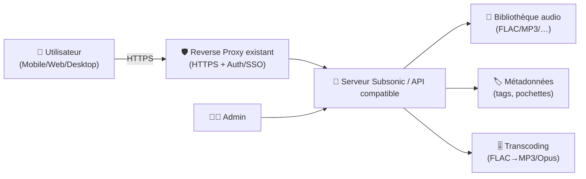
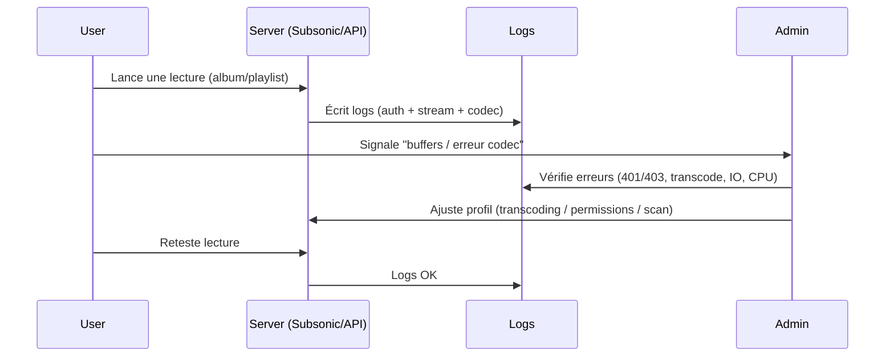

# 🎵 Subsonic — Présentation & Exploitation Premium (Streaming audio “self-hosted”)

### Serveur média “music-first” + écosystème Subsonic API (clients, scanners, transcoding)
Optimisé pour reverse proxy existant • Qualité & métadonnées • Multi-clients • Exploitation durable

---

## TL;DR

- **Subsonic** est un serveur web de streaming audio (et parfois vidéo) pour ta bibliothèque locale.
- Son atout historique : un **écosystème de clients** grâce à la **Subsonic API**.
- En pratique, beaucoup d’installations modernes utilisent des **serveurs compatibles Subsonic API** (Navidrome, Airsonic-Advanced, Gonic) tout en gardant les mêmes clients.
- Une approche premium = **structure de librairie**, **métadonnées propres**, **transcoding maîtrisé**, **droits d’accès**, **observabilité**, **tests & rollback**.

---

## ✅ Checklists

### Pré-usage (avant d’ouvrir aux utilisateurs)
- [ ] Bibliothèque normalisée (tags, pochettes, artistes/album artists)
- [ ] Règles de nommage stables (dossiers/artistes/albums)
- [ ] Stratégie comptes & permissions (admin vs users)
- [ ] Accès via reverse proxy existant (HTTPS + auth/SSO si besoin)
- [ ] Politique de transcoding (formats, qualité, CPU budget)
- [ ] Sauvegarde DB/config + bibliothèque (et test de restauration)

### Post-configuration (qualité opérationnelle)
- [ ] Scan/indexation OK (pas de boucles, pas de “missing files”)
- [ ] 3 clients différents testés (web + mobile + desktop)
- [ ] Transcoding validé (ex: FLAC → Opus/MP3) sans saturer CPU
- [ ] Logs propres (auth, scans, conversions)
- [ ] Runbook “incident streaming” (latence, erreurs, codecs)

---

> [!TIP]
> Le vrai “game changer” Subsonic, c’est la **Subsonic API** : elle te permet de changer de serveur (Subsonic → Navidrome/Airsonic/Gonic) sans changer tes apps côté clients.

> [!WARNING]
> Les bibliothèques mal taggées = résultats de recherche mauvais, artistes dupliqués, pochettes incohérentes.  
> Un nettoyage metadata au début évite des mois de friction.

> [!DANGER]
> Ne rends pas l’interface accessible publiquement sans contrôle d’accès robuste (SSO/forward-auth/VPN).  
> Les logs, playlists, users et parfois chemins de fichiers peuvent fuiter via une mauvaise exposition.

---

# 1) Subsonic — Vision moderne

Subsonic (et son univers) peut être vu comme :

- 🎶 Un **serveur de bibliothèque** (indexation, recherche, playlists)
- 📡 Un **serveur de streaming** (multi-clients, multi-formats)
- 🧠 Un **moteur de compatibilité** via la **Subsonic API**
- ⚙️ Un **outil d’exploitation** (scans planifiés, transcoding, logs)

Aujourd’hui, il est courant de raisonner en 2 couches :
- **Serveur** : Subsonic *ou* un compatible API (Navidrome / Airsonic-Advanced / Gonic…)
- **Clients** : Substreamer, DSub, Ultrasonic, apps diverses “Subsonic compatible”

---

# 2) Architecture globale



---

# 3) Le pilier #1 — Bibliothèque & métadonnées (ce qui rend tout “premium”)

## 3.1 Structure recommandée (simple et robuste)
- `/Music/Artist/Album/Track.ext`
- Disques multi-CD : `/Album/CD1`, `/Album/CD2` (ou “Disc 1”)

## 3.2 Règles metadata qui évitent 90% des soucis
- **Album Artist** cohérent (surtout compilations)
- **Year / Original Year** propre
- **Track number** + **Disc number**
- Pochettes au bon format (éviter 10 images différentes par album)
- Genres : sobres (éviter 50 variantes)

> [!TIP]
> “Artist vs Album Artist” : c’est LA source #1 de duplication d’artistes.  
> Décide d’une convention et tiens-la.

---

# 4) Le pilier #2 — Comptes, accès, gouvernance

## Stratégie de rôles (recommandée)
- 👑 **Admin** : configuration, maintenance, logs
- 🎧 **Users** : streaming + playlists
- 🧪 **Test user** : validation (clients + transcoding) avant changements

## Bonnes pratiques
- Désactiver/limiter les fonctionnalités non nécessaires (ex: upload, partage public) si tu n’en as pas l’usage
- Politique de mots de passe forte ou SSO via reverse proxy existant
- Logs d’auth consultables et surveillés

---

# 5) Le pilier #3 — Transcoding (qualité vs CPU)

Le transcoding est utile si :
- tu as beaucoup de **FLAC** et tu streams en mobilité
- certains clients gèrent mal certains codecs
- tu veux maîtriser bande passante

### Recommandations premium
- Définir une **qualité cible** (ex: Opus moyen/élevé, ou MP3 V0/V2)
- Mettre des limites (ne pas transcoder inutilement quand le client sait lire)
- Tester avec 2–3 devices (Android/iOS/web) sur réseau faible

> [!WARNING]
> Le transcoding peut devenir un “CPU furnace”.  
> Si tu vois des pics lors de grosses écoutes, réduis la qualité ou désactive certains profils.

---

# 6) Le pilier #4 — Expérience client (ce que les gens ressentent)

## “Happy path” premium
- Recherche rapide
- Artistes/Albums non dupliqués
- Pochettes cohérentes
- Lecture gapless (si support)
- Playlists stables et synchronisées

## Patterns d’usage (et quoi optimiser)
- Mobilité : privilégier transcoding + cache offline côté client
- Maison : FLAC direct + réseau local
- Multi-room : latence faible, transcoding minimal

---

# 7) Workflows premium (ops & incident)

## 7.1 Debug streaming (séquence)


## 7.2 Runbook “symptômes → causes”
- **Buffering** : CPU transcode, débit sortant, disque lent, trop de conversions simultanées
- **Artistes dupliqués** : Album Artist incohérent, tags hétérogènes
- **Albums incomplets** : scan partiel, permissions filesystem, fichiers corrompus
- **Erreur client** : version API/compat, codec non supporté, HTTPS/cert

---

# 8) Validation / Tests / Rollback

## Tests de validation (fonctionnels)
```bash
# 1) Le service répond (endpoint web)
curl -I https://music.example.tld | head

# 2) Test API de base (selon serveur, endpoint Subsonic API)
# (Adapter au serveur : /rest/ping.view ou équivalent)
curl -s "https://music.example.tld/rest/ping.view?u=USER&p=PASS&v=1.16.1&c=test" | head
```

## Tests clients (minimum)
- Web UI : recherche + lecture
- Mobile : login + lecture + transcoding (si activé)
- Desktop : playlist + gapless (si supporté)

## Rollback (approche safe)
- Revenir à la config précédente (snapshot config/DB)
- Revenir à une version de serveur précédente si mise à jour casse des clients
- Restaurer un état “clean metadata” si un import a dupliqué la librairie

> [!TIP]
> Avant changement majeur : “snapshot + test user + 10 minutes de smoke tests” = énorme gain de stabilité.

---

# 9) Alternatives compatibles Subsonic API (quand tu veux moderniser)

Tu peux conserver tes clients Subsonic tout en changeant de backend :
- **Navidrome** : très populaire, moderne, Subsonic API compat
- **Airsonic-Advanced** : fork orienté compat et features
- **Gonic** : implémentation légère Subsonic API

---

# 10) Sources — Images Docker (format demandé)

## 10.1 Images Subsonic (communautaires, “Subsonic server”)
- `stuckj/subsonic` (Docker Hub) : https://hub.docker.com/r/stuckj/subsonic  
- `hurricane/subsonic` (Docker Hub) : https://hub.docker.com/r/hurricane/subsonic/  
- `phasmatis/subsonic` (Docker Hub) : https://hub.docker.com/r/phasmatis/subsonic  

## 10.2 Serveurs “Subsonic API compatible” (souvent recommandés aujourd’hui)
- `deluan/navidrome` (Docker Hub) : https://hub.docker.com/r/deluan/navidrome  
- `sentriz/gonic` (Docker Hub) : https://hub.docker.com/r/sentriz/gonic  

## 10.3 LinuxServer.io (si tu veux un packaging LSIO)
- `lscr.io/linuxserver/airsonic-advanced` (Doc LSIO) : https://docs.linuxserver.io/images/docker-airsonic-advanced/  
- `linuxserver/airsonic-advanced` (Docker Hub) : https://hub.docker.com/r/linuxserver/airsonic-advanced  

## 10.4 Clients web Subsonic API (pratique en complément)
- `ghenry22/substreamer` (Docker Hub) : https://hub.docker.com/r/ghenry22/substreamer  

---

# ✅ Conclusion

Subsonic (ou un serveur compatible Subsonic API) devient “premium” quand tu verrouilles :
- 🏷️ des métadonnées propres
- 🔐 un accès sécurisé via ton reverse proxy existant
- 🎚️ un transcoding cohérent (qualité/CPU)
- 🧪 des tests simples + rollback
- 📱 une validation multi-clients

Résultat : une bibliothèque qui “se comporte bien”, et une expérience streaming stable sur tous tes appareils.