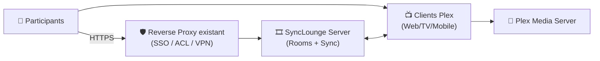
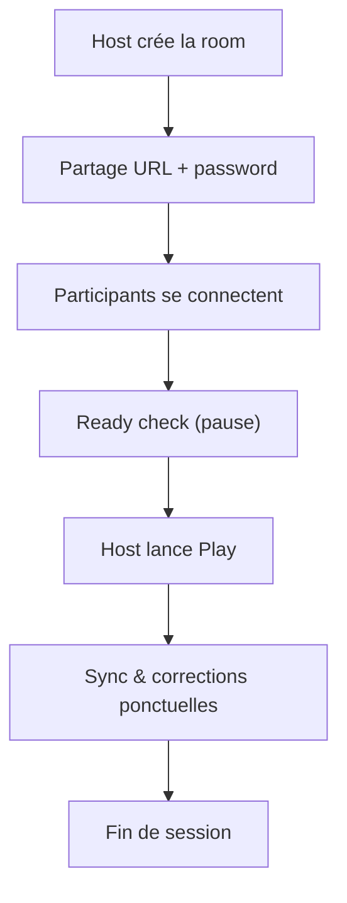
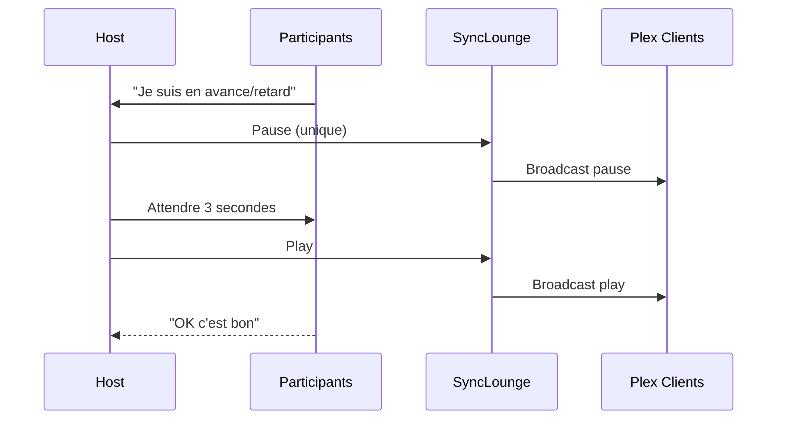

# 🎞️ SyncLounge — Présentation & Exploitation Premium (Watch Party Plex “en synchro”)

### Regarder Plex à plusieurs, synchronisé, avec salons, contrôle d’accès et expérience fluide
Optimisé pour reverse proxy existant • Multi-serveurs • Rooms & passwords • Exploitation durable

---

## TL;DR

- **SyncLounge** (ex PlexTogether) synchronise la lecture **Plex** entre plusieurs participants (mêmes pauses / seek / lecture).
- Modèle mental : **un serveur SyncLounge** + des **rooms** + des **clients Plex** (Web, TV, mobile) qui se rejoignent.
- Version “premium” = **accès sécurisé**, **naming/gouvernance de rooms**, **paramètres de serveur propres**, **procédures tests/rollback**.

---

## ✅ Checklists

### Pré-configuration (avant de le donner aux équipes/amis)
- [ ] URL publique stable (idéalement HTTPS via reverse proxy existant)
- [ ] Stratégie d’accès : SSO / auth externe / whitelist / VPN (au choix)
- [ ] Conventions de rooms (noms, passwords, durée, modération)
- [ ] Règles de “commande” (qui contrôle lecture ? host unique ?)
- [ ] Une page “How-to Join” (simple) rédigée dans ta doc interne

### Post-configuration (qualité d’usage)
- [ ] Création room + join OK (2 appareils différents)
- [ ] Pause/seek sync OK (test 60s)
- [ ] Reconnexion OK (perte réseau simulée)
- [ ] Logs : pas d’erreurs répétées, pas de boucle reconnect
- [ ] Expérience : latence acceptable / pas de “drift” en 10 minutes

---

> [!TIP]
> Le meilleur “boost qualité” : **un seul host** (chef de lecture) + participants en “suiveurs”, et des rooms bien gouvernées.

> [!WARNING]
> Une watch party expose des métadonnées (titres regardés, activité, éventuels identifiants). Traite SyncLounge comme une **app sensible**.

> [!DANGER]
> Éviter l’accès public non protégé : même si “ce n’est que des logs/rooms”, tu ouvres une surface d’abus (spam rooms, scraping, tentatives d’accès).

---

# 1) SyncLounge — Vision moderne

SyncLounge n’est pas un “lecteur”.

C’est :
- 🔄 Un **orchestrateur de synchronisation** (pause/lecture/seek)
- 🧑‍🤝‍🧑 Un **système de salons (rooms)** pour réunir un groupe
- 🧭 Une **couche d’expérience** au-dessus des clients Plex
- ⚙️ Une **brique self-host** (simple à exploiter si bien cadrée)

---

# 2) Architecture globale



---

# 3) Concepts clés (ce que tu dois vraiment maîtriser)

## 3.1 Rooms (salons)
Une room, c’est :
- un nom (ex: `movie-night`)
- parfois un mot de passe
- des participants
- un “host” logique (ou des rôles) selon ton mode d’usage

Bonnes pratiques “premium” :
- Rooms temporaires (évite accumulation)
- Passwords par événement (évite le “room squatting”)
- Conventions de nommage (date/équipe)

Exemples :
- `watch-friday-2026-03-06`
- `team-core-retro-night`
- `family-sunday`

## 3.2 Serveur(s)
Tu peux présenter plusieurs serveurs SyncLounge dans l’UI (ex: prod/staging ou multi-sites).
Chaque entrée de serveur peut avoir :
- un nom, une localisation, une URL, une image (logo)
- une room par défaut (et password optionnel)

Référence champs de configuration serveur (name/location/url/image/defaultRoom/defaultPassword) :
https://docs.synclounge.tv/self-hosted/settings/

---

# 4) Gouvernance “premium” (règles qui évitent le chaos)

## 4.1 Modération & “qui contrôle ?”
Choisis une règle explicite et documente-la :
- **Host unique** : un seul pilote (recommandé)
- **Vote/consensus** : tout le monde peut agir (souvent chaotique)
- **Host + co-host** : 2 personnes max

## 4.2 Règles d’événement
Mini-runbook à coller dans ta doc :
- 1) créer room
- 2) partager lien + password
- 3) choisir contenu Plex
- 4) “Ready check”
- 5) démarrer
- 6) si drift → pause 3s / reprise
- 7) fin → room supprimée / password changé

> [!TIP]
> Le “Ready check” (tout le monde pause, compte à rebours, play) réduit drastiquement les écarts initiaux.

---

# 5) Qualité d’expérience (anti-drift, anti-friction)

## 5.1 Causes fréquentes de désynchronisation
- latence réseau hétérogène (mobile vs fibre)
- clients Plex différents (TV vs Web) avec comportements distincts
- transcodage serveur Plex (variabilité)
- seek/pause en rafale (trop d’actions)

## 5.2 Mesures “premium”
- privilégier un format que tout le monde peut **Direct Play** sur Plex
- limiter le transcodage (quand possible)
- nommer un host qui pilote, les autres évitent le contrôle
- si drift : pause → attendre stabilisation → play

---

# 6) Sécurité & exposition (sans firewall recipes)

## 6.1 Principe
- SyncLounge **ne doit pas être une page “publique ouverte”**
- Mets-le derrière ton reverse proxy existant avec :
  - SSO / auth externe
  - ou restriction IP/VPN
  - ou au minimum une couche d’auth

## 6.2 Protection “rooms”
- passwords sur rooms “publiques”
- rotation des passwords
- pas de rooms “permanentes” ouvertes

> [!WARNING]
> Si tu relies l’accès à des headers d’auth via proxy, teste avec un compte non privilégié : la sécurité réelle = ce que l’UI permet de voir.

---

# 7) Workflows premium (flow + séquence)

## 7.1 Workflow “watch party” (simple & robuste)


## 7.2 Séquence “incident drift”


---

# 8) Validation / Tests / Rollback

## 8.1 Smoke tests
```bash
# 1) Vérifier que l'URL répond
curl -I https://synclounge.example.tld | head

# 2) Vérifier qu'une page HTML est servie
curl -s https://synclounge.example.tld | head -n 20
```

## 8.2 Tests fonctionnels (manuels, indispensables)
- Test A : 2 participants (Web + TV)
  - pause/play synchro OK
  - seek 30s OK
- Test B : coupure réseau 10s d’un participant
  - reconnexion OK
- Test C : transcodage forcé (si possible)
  - vérifier que ça ne casse pas la session (sinon recommander Direct Play)

## 8.3 Rollback (retour arrière “safe”)
- Revenir à la configuration “stable” :
  - retirer les changements de base path / URL
  - désactiver temporairement l’accès externe (SSO/VPN only)
  - revenir aux conventions simples (host unique, rooms temporaires)
- Si mise à jour applicative problématique :
  - repasser sur le tag/version précédente (si tu utilises une image taggée)
  - vérifier avec un smoke test + session courte

---

# 9) Erreurs fréquentes (et fixes)

## “Les gens ne voient pas le même timestamp”
Causes :
- plusieurs personnes contrôlent lecture
- clients Plex très différents
- transcodage aléatoire
Fix :
- host unique
- privilégier un fichier compatible Direct Play
- limiter actions (pas de seek en rafale)

## “Redirections bizarres / assets qui cassent”
Cause :
- URL/base path incohérents avec ton exposition
Fix :
- vérifier que l’URL déclarée côté SyncLounge correspond à l’URL réelle (HTTPS, domaine, subpath)

Référence (server url/base) :
https://docs.synclounge.tv/self-hosted/settings/

---

# 10) Sources — Images Docker & Références (URLs brutes uniquement)

## 10.1 Image LinuxServer.io (souvent la plus utilisée)
- `linuxserver/synclounge` (Docker Hub) : https://hub.docker.com/r/linuxserver/synclounge  
- Tags `linuxserver/synclounge` (Docker Hub) : https://hub.docker.com/r/linuxserver/synclounge/tags  
- Doc LinuxServer “docker-synclounge” : https://docs.linuxserver.io/images/docker-synclounge/  
- Repo de packaging LinuxServer : https://github.com/linuxserver/docker-synclounge  
- Package GHCR LinuxServer (ex versions) : https://github.com/orgs/linuxserver/packages/container/synclounge/679675633  

## 10.2 Images alternatives citées par la doc SyncLounge
- Doc officielle “Running with Docker” (mentionne LSIO + Starbix) : https://docs.synclounge.tv/self-hosted/docker/  
- `starbix/synclounge` (Docker Hub) : https://hub.docker.com/r/starbix/synclounge  

## 10.3 Images officielles SyncLounge (Docker Hub)
- `synclounge/synclounge` (Docker Hub) : https://hub.docker.com/r/synclounge/synclounge  
- `synclounge/syncloungeserver` (Docker Hub) : https://hub.docker.com/r/synclounge/syncloungeserver  

## 10.4 Références projet & docs
- Repo principal SyncLounge : https://github.com/synclounge/synclounge  
- Repo socket server : https://github.com/synclounge/syncloungeserver  
- Docs “Getting started (self-hosted)” : https://docs.synclounge.tv/self-hosted/getting-started/  
- Docs “Settings (servers/rooms)” : https://docs.synclounge.tv/self-hosted/settings/  

---