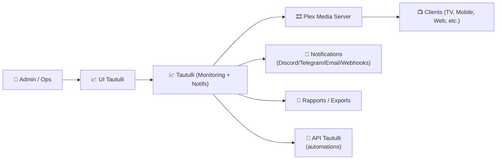
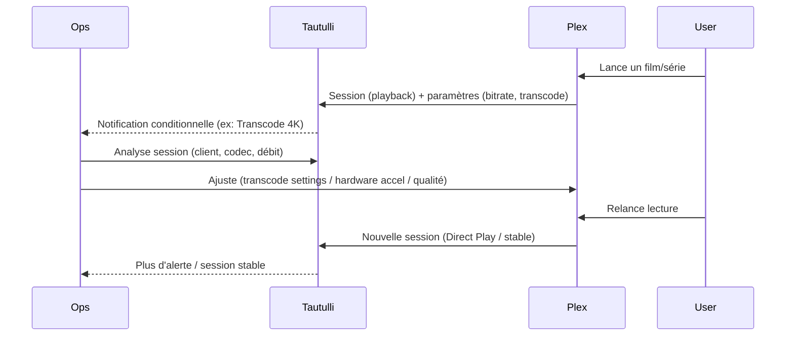

# 📈 Tautulli — Présentation & Configuration Premium (Plex Analytics & Monitoring)

### Supervision, analytics et notifications pour Plex — avec une vraie approche “ops”
Optimisé pour reverse proxy existant • Notifications fiables • Gouvernance • Exploitation durable

---

## TL;DR

- **Tautulli** observe ton **Plex Media Server** : lectures, utilisateurs, devices, qualité, transcodage, historiques.
- Il sert à : **diagnostiquer** (buffering/transcode), **auditer** (qui/quoi/quand), **notifier** (début/fin, erreurs, quotas), **améliorer** (performances & UX).
- Une config premium = **agents & logs propres**, **notifications utiles**, **privacy maîtrisée**, **backups**, **tests**, **rollback**.

---

## ✅ Checklists

### Pré-configuration (avant de “brancher” des notifications partout)
- [ ] Plex stable (accès local OK, utilisateurs en place)
- [ ] Objectifs clairs : perf / usage / alerting / gouvernance
- [ ] Règles privacy définies (conservation, anonymisation, accès)
- [ ] Canaux de notif choisis (Discord/Telegram/Email/Slack/etc.)
- [ ] Convention de naming (serveur Plex, libs, users, appareils)

### Post-configuration (qualité opérationnelle)
- [ ] Tautulli relié à Plex (token OK, refresh OK)
- [ ] Notifications testées (un message “test” par canal)
- [ ] Droits d’accès (qui voit quoi) validés
- [ ] Dashboard “santé Plex” prêt (transcode, bande passante, erreurs)
- [ ] Backups & restauration testés (au moins une fois)

---

> [!TIP]
> La valeur #1 de Tautulli : **comprendre pourquoi ça buffer** (transcode, débit, CPU, réseau) + **rendre visible l’usage réel**.

> [!WARNING]
> Tautulli manipule des données sensibles (activité, IP, devices, horaires).  
> Décide dès le départ : **qui a accès**, **combien de temps**, **quels détails**.

> [!DANGER]
> “Tout le monde admin” + notifications spam + pas de règles = perte de confiance.  
> Une bonne doc/monitoring commence par **moins d’alertes, mais meilleures**.

---

# 1) Tautulli — Vision moderne

Tautulli n’est pas un gadget stats.

C’est :
- 🔎 Un **observateur** (activité Plex détaillée)
- 🧠 Un **outil de diagnostic** (transcode vs direct play, bitrate, erreurs)
- 🔔 Un **moteur de notifications** (événements, conditions, webhooks)
- 🧾 Un **journal d’usage** (historique, rapports, exports)
- 🧩 Un **pont d’intégration** (API, scripts, automatisations)

---

# 2) Architecture globale



---

# 3) Philosophie premium (5 piliers)

1. 🧩 **Connexion Plex fiable** (token stable, bon serveur sélectionné)
2. 🔐 **Gouvernance & privacy** (accès, rétention, anonymisation)
3. 🔔 **Notifications intelligentes** (signal > bruit)
4. 📊 **Lecture “ops” des métriques** (transcode, débit, erreurs)
5. 🧪 **Validation / tests / rollback** (avant de généraliser)

---

# 4) Connexion à Plex (fiabilité)

## Objectif
- Tautulli doit **reconnaître** ton serveur Plex
- Il doit **récupérer** l’activité en continu
- Il doit **rester stable** après redémarrages / changements réseau

## Bonnes pratiques
- Utiliser le serveur Plex “réel” (nom clair)
- Vérifier que Tautulli voit correctement :
  - sessions actives
  - bibliothèques
  - utilisateurs
  - historiques

> [!TIP]
> Donne un nom explicite à ton serveur Plex et à tes libs (ex: `Plex-Prod`, `Movies-4K`, `TV-1080p`). Les rapports deviennent immédiatement lisibles.

---

# 5) Dashboards & métriques utiles (ce qui compte vraiment)

## KPI “ops” recommandés
- **Transcode vs Direct Play/Direct Stream**
- **Bitrate réel** vs capacité réseau
- **CPU / RAM** côté Plex (si tu corrèles via autre monitoring)
- **Top erreurs** (playback failed, timeouts, etc.)
- **Top devices** (clients problématiques)
- **Top contenus** (pression sur stockage, popularité)

## Lecture rapide d’un incident “buffering”
- Si **transcode** : CPU/GPU insuffisant, codec non supporté client, paramètres qualité
- Si **direct play** mais buffering : réseau (Wi-Fi), débit upstream, disque, saturation I/O
- Si erreurs récurrentes : permissions médias, corruption, sous-titres PGS, etc.

---

# 6) Notifications Premium (signal, pas spam)

## Stratégie recommandée (simple et efficace)
- ✅ **Playback started/stopped** : uniquement si besoin (ou sur users spécifiques)
- ✅ **Transcode started** : utile pour diagnostiquer et dimensionner
- ✅ **Playback error** : indispensable (alerte actionable)
- ✅ **Server down / unreachable** : si tu relies à un check externe ou webhook
- ✅ **New user / new device** : audit / sécurité (option)

## Règles anti-bruit
- Ne pas notifier “tout le temps, pour tout le monde”
- Ajouter :
  - conditions (ex: seulement `transcode`, seulement `4K`, seulement `remote`)
  - throttling / cooldown
  - exclusions (ex: user “test”, device “dev”)

> [!WARNING]
> Une notif utile doit être **actionable** : elle dit quoi faire / où regarder (log, dashboard, user, device).

---

# 7) Gouvernance & Privacy (vraiment important)

## Accès
- Compte admin réservé (1–2 personnes)
- Comptes read-only si partage interne
- Éviter de donner l’accès complet à toute la famille / équipe

## Données sensibles
- Historique de visionnage
- IP / localisation approximative
- Devices / noms d’appareils
- Heures et habitudes

## Recommandations premium
- Définir une **politique de rétention** (ex: 90 jours, 180 jours, etc.)
- Masquer/anonymiser certains détails si nécessaire
- Documenter “qui a le droit de voir quoi”

> [!DANGER]
> Si tu partages Tautulli (même en interne), considère-le comme un outil de supervision contenant des données personnelles.

---

# 8) API & Automations (pour aller plus loin)

Tautulli expose une API pour :
- extraire des métriques (usage, sessions, transcodes)
- déclencher des actions (selon intégrations)
- alimenter Grafana/Prometheus “à ta manière” (via scripts)

Exemples d’usages premium :
- envoyer un webhook “transcode 4K” vers un canal ops
- générer un rapport hebdo automatique (top erreurs, top transcodes)
- corréler “playback errors” avec un incident réseau

---

# 9) Workflows premium (incidents & diagnostic)



---

# 10) Validation / Tests / Rollback

## Tests (fonctionnels)
```bash
# Vérifier que l'UI répond (exemple)
curl -I http://TAUTULLI_HOST:PORT | head

# Test notifications : utiliser le bouton "Test" dans chaque canal (UI)
# Test réel : lancer une lecture Plex et vérifier l'événement côté Tautulli
```

## Tests “qualité”
- Lancer un contenu qui force transcode (ex: sous-titres PGS, 4K HEVC sur client non compatible)
- Vérifier que :
  - l’événement “transcode” est capté
  - la notif (si activée) est bien déclenchée
  - les infos utiles sont présentes (user, device, bitrate, raison transcode)

## Rollback (pratique)
- “Rollback” notifications : désactiver les triggers trop bruyants, garder uniquement erreurs + transcodes
- “Rollback privacy” : réduire la rétention / masquer champs / restreindre accès
- Restaurer une sauvegarde si une config a cassé l’instance (voir section backups)

---

# 11) Backups (minimum pro)

À sauvegarder :
- Config Tautulli
- DB interne / fichiers de données (selon ton mode de déploiement)
- Templates de notifications / scripts

Bonnes pratiques :
- Backup planifié
- Une restauration testée
- Un export des templates critiques (webhooks, conditions)

> [!TIP]
> Le test de restauration vaut plus que 100 backups non testés.

---

# 12) Erreurs fréquentes (et remèdes)

- ❌ **Notifications spam**  
  ✅ Ajouter conditions + cooldown + réduire périmètre
- ❌ **Données trop visibles**  
  ✅ Restreindre accès + réduire rétention + anonymiser
- ❌ **Impossible de diagnostiquer**  
  ✅ Standardiser naming + activer notifs “transcode” + conserver erreurs
- ❌ **Clients “problématiques”**  
  ✅ Identifier device/codec → ajuster Plex/clients ou recommander un client compatible

---

# 13) Sources — Images Docker (format demandé, URLs brutes)

## 13.1 Image officielle la plus citée
- `tautulli/tautulli` (Docker Hub) : https://hub.docker.com/r/tautulli/tautulli  
- Wiki Tautulli “Installation” (mentionne l’image officielle) : https://github.com/Tautulli/Tautulli/wiki/Installation  
- Repo Tautulli (upstream) : https://github.com/Tautulli/Tautulli  

## 13.2 Image LinuxServer.io (très utilisée)
- `lscr.io/linuxserver/tautulli` (Doc LinuxServer) : https://docs.linuxserver.io/images/docker-tautulli/  
- `linuxserver/tautulli` (Docker Hub) : https://hub.docker.com/r/linuxserver/tautulli  
- Repo de packaging LinuxServer : https://github.com/linuxserver/docker-tautulli  

## 13.3 (Optionnel) Image GHCR (publisher Tautulli)
- `ghcr.io/tautulli/tautulli` (Packages GitHub) : https://github.com/orgs/Tautulli/packages/container/package/tautulli  

---

# ✅ Conclusion

Tautulli “premium”, c’est :
- 📈 des métriques qui servent à décider (transcode, débit, erreurs)
- 🔔 des notifications utiles (conditionnelles, non bruyantes)
- 🔐 une gouvernance et une privacy maîtrisées
- 🧪 des tests et un rollback réalistes
- 🧾 une exploitation durable, lisible et documentée