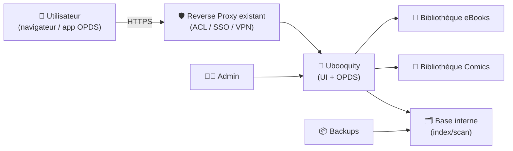
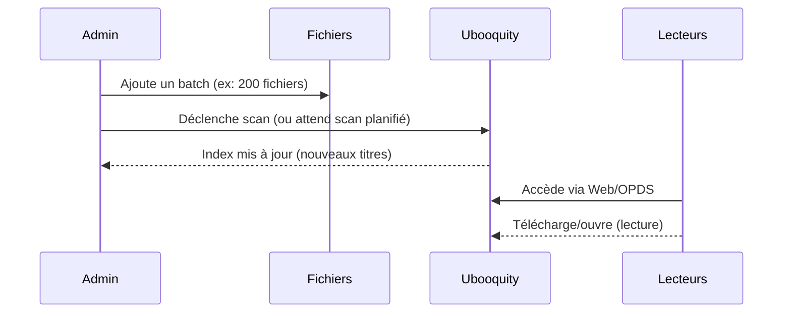

# 📖 Ubooquity — Présentation & Exploitation Premium (Comics & eBooks)

### Serveur de lecture “maison” pour BD/Mangas/eBooks : bibliothèque web + OPDS + accès multi-appareils
Optimisé pour reverse proxy existant • Qualité bibliothèque • Organisation durable • Exploitation & rollback

---

## TL;DR

- **Ubooquity** est un serveur léger pour **comics** (CBZ/CBR) et **ebooks** (EPUB/PDF, selon usages) avec une **UI web** + **accès OPDS**.
- Objectif “premium” : **bibliothèque propre**, **scans maîtrisés**, **métadonnées cohérentes**, **accès sécurisé**, **backups testés**.
- À retenir : Ubooquity = “lecture & accès” (pas un Calibre complet) ; on vise une **expérience stable** et **prévisible**.

---

## ✅ Checklists

### Pré-usage (avant ouverture aux utilisateurs)
- [ ] Structure de dossiers standardisée (ebooks/comics séparés)
- [ ] Conventions de nommage (séries, tomes, années)
- [ ] Stratégie de scan (éviter rescans inutiles)
- [ ] Authentification admin configurée + comptes si besoin
- [ ] Stratégie d’accès (reverse proxy existant / VPN / SSO)
- [ ] Backups : config + base + bibliothèque (au minimum inventoriée)

### Post-configuration (qualité opérationnelle)
- [ ] Les bibliothèques se remplissent sans doublons
- [ ] Recherche OK (titre/série/auteur si metadata fournie)
- [ ] OPDS fonctionne (tests sur 2 apps différentes)
- [ ] Temps de scan acceptable (pas de boucle)
- [ ] Rollback documenté (restaurer config/base + relancer scan)

---

> [!TIP]
> Ubooquity devient “premium” quand tu fais **le ménage en amont** : dossiers propres, séries cohérentes, tomes bien nommés.

> [!WARNING]
> L’expérience dépend beaucoup de la **qualité des fichiers** (métadonnées EPUB, noms de volumes, cover).  
> Si ta librairie est “sale”, Ubooquity ne pourra pas “magiquement” tout corriger.

> [!DANGER]
> Évite d’exposer l’admin en public. L’admin pilote le scan et la structure : c’est une surface sensible.

---

# 1) Ubooquity — Vision moderne

Ubooquity n’est pas un simple “partage de fichiers”.

C’est :
- 📚 Un **catalogueur** (scan + base interne)
- 🖼️ Un **viewer** web (comics + ebooks selon formats)
- 📡 Un **serveur OPDS** (lecture via clients externes)
- 👥 Un **portail multi-utilisateurs** (selon configuration)

Site & documentation : https://vaemendis.net/ubooquity/  
Docs (manuel, FAQ, thèmes) : https://vaemendis.github.io/ubooquity-doc/

---

# 2) Architecture globale



---

# 3) Modèle “bibliothèque premium” (ce qui évite 90% des problèmes)

## 3.1 Séparation stricte
- `/books` pour ebooks
- `/comics` pour BD/mangas
- (option) `/files` pour “brut” non classé (à éviter en production)

Cette séparation est aussi la convention la plus courante dans les déploiements containerisés et limite les erreurs de scan.

## 3.2 Conventions de nommage (simples mais puissantes)

### eBooks
- `Auteur - Titre (Année).epub`
- Séries :
  - `Série/T01 - Titre.epub`
  - `Série/T02 - Titre.epub`

### Comics / Mangas
- `Série/T01.cbz`
- `Série/T02.cbz`
- (option) inclure l’année ou l’éditeur si ambigu

> [!TIP]
> Vise un nommage “humain + stable”, pas un dump de tags. Une fois la convention décidée, **ne change plus**.

---

# 4) Configuration “premium” (sans recettes d’installation)

## 4.1 Accès admin vs accès bibliothèque (URLs usuelles)

Sur beaucoup de déploiements (notamment via images community), on retrouve :
- Admin : `/ubooquity/admin`
- Bibliothèque : `/ubooquity/`

Exemple LSIO (référence de chemins) :
- Admin : `http://<ip>:2203/ubooquity/admin`
- Web : `http://<ip>:2202/ubooquity/`

Source : https://docs.linuxserver.io/images/docker-ubooquity/

> [!WARNING]
> Si tu es en sous-chemin (subpath) via ton reverse proxy existant, veille à conserver un chemin stable (ex: `/ubooquity/`). Les apps OPDS aiment la stabilité.

---

## 4.2 Scans & indexation (performance + stabilité)

### Bonnes pratiques
- Laisser Ubooquity scanner **à froid** (au démarrage) puis limiter les rescans “plein”.
- Ajouter des gros volumes par “batch” (ex: 500 fichiers), puis scan, puis next batch.
- Éviter de modifier massivement l’arborescence en continu (sinon la base “churn”).

### Symptômes et remèdes
- Scan interminable → trop de fichiers “bruts”, archives énormes, stockage lent
- Doublons → nommage incohérent, réimport depuis dossiers multiples
- Résultats incomplets → dossiers mal séparés, permissions, ou fichiers non supportés

---

## 4.3 Métadonnées & covers (qualité perçue)

### eBooks (EPUB)
- Si possible : métadonnées EPUB propres (titre, auteur, série)
- Cover intégrée (ou fichier cover propre)
- Évite les EPUB “cassés” (certains viewers réagissent mal)

### Comics (CBZ/CBR)
- CBZ (zip) est souvent plus “standard” côté outils
- Un tome = une archive (évite “un chapitre par fichier” si tu veux un catalogue lisible)

> [!TIP]
> “Premium UX” = cover visible + séries cohérentes. C’est ce que les utilisateurs retiennent.

---

## 4.4 OPDS (lecture mobile/tablette)

Ubooquity expose généralement un flux OPDS pour :
- navigation catalogue
- téléchargement/lecture via apps compatibles

Tests recommandés :
- 1 app OPDS “ebooks”
- 1 app OPDS “comics”

Doc générale Ubooquity : https://vaemendis.github.io/ubooquity-doc/

---

## 4.5 Comptes & permissions (gouvernance simple)

Stratégie minimale recommandée :
- 1 compte admin (rarement utilisé)
- 1 ou plusieurs comptes “lecture” (usage quotidien)

Objectifs :
- limiter l’exposition admin
- segmenter si tu partages la bibliothèque (famille/amis)

---

# 5) Workflows premium (exploitation)

## 5.1 Ajout de contenu “sans casser la bibliothèque”


## 5.2 “Qualité catalogue” (routine)
- Chaque semaine :
  - corriger 5–10 titres “moches” (cover/titre/série)
- Chaque mois :
  - vérifier doublons + séries cassées
- Avant partage externe :
  - audit rapide : “est-ce que je serais content de naviguer ça ?”

---

# 6) Sauvegardes & Restauration (propre)

## 6.1 Ce qu’il faut sauvegarder
- La **config + base interne** (là où Ubooquity stocke ses données)
- La **bibliothèque** (idéalement via ta stratégie de backup storage)

## 6.2 Stratégie premium
- Backups réguliers + **un test de restauration** (sinon ça ne compte pas)
- Snapshot avant gros import ou refonte d’arborescence
- Conserver 1 backup “N-1” (avant dernière grosse opération)

---

# 7) Validation / Tests / Rollback

## Tests de validation (smoke tests)
```bash
# 1) Web répond (adapté à ton URL)
curl -I https://docs.exemple.tld/ubooquity/ | head

# 2) Admin répond (si exposé en interne)
curl -I https://docs.exemple.tld/ubooquity/admin | head
```

## Tests fonctionnels
- Recherche d’un titre connu (web)
- Lecture d’un comic (web)
- Connexion OPDS depuis une app (liste + ouverture d’un item)

## Rollback (quand un import a “cassé” la base)
- Restaurer config/base depuis backup (etat “avant import”)
- Revenir à l’arborescence précédente (si renommage massif)
- Relancer un scan contrôlé (par batch)

> [!WARNING]
> Le rollback le plus rapide, c’est souvent : “restaurer base + revenir sur l’arborescence”.  
> D’où l’intérêt d’un snapshot avant refonte.

---

# 8) Sources — Images Docker (format demandé, URLs brutes)

## 8.1 Image LinuxServer.io (référence la plus utilisée)
- `linuxserver/ubooquity` (Docker Hub) : https://hub.docker.com/r/linuxserver/ubooquity  
- Doc LSIO “docker-ubooquity” : https://docs.linuxserver.io/images/docker-ubooquity/  
- Repo GitHub LSIO (packaging) : https://github.com/linuxserver/docker-ubooquity  
- Package GHCR (tags & digest) : https://github.com/orgs/linuxserver/packages/container/package/ubooquity  

## 8.2 Images/community alternatives (à évaluer selon ton besoin)
- Repo “ubooquity-docker” (community) : https://github.com/zerpex/ubooquity-docker  
- Repo “ubooquity-docker” (community) : https://github.com/cromigon/ubooquity-docker  

---

# ✅ Conclusion

Ubooquity “premium” = une bibliothèque **propre**, des scans **maîtrisés**, une expérience **OPDS** fiable, et une exploitation **sérieuse** (backups + rollback).  
Si tu veux un rendu “Netflix de tes mangas/ebooks”, la clé est moins la techno… et plus la **gouvernance de contenu**.