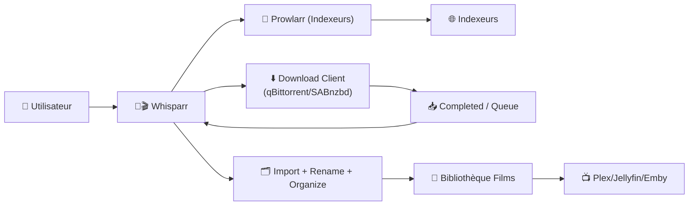
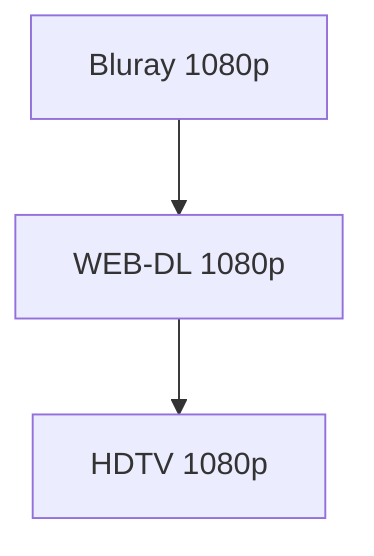
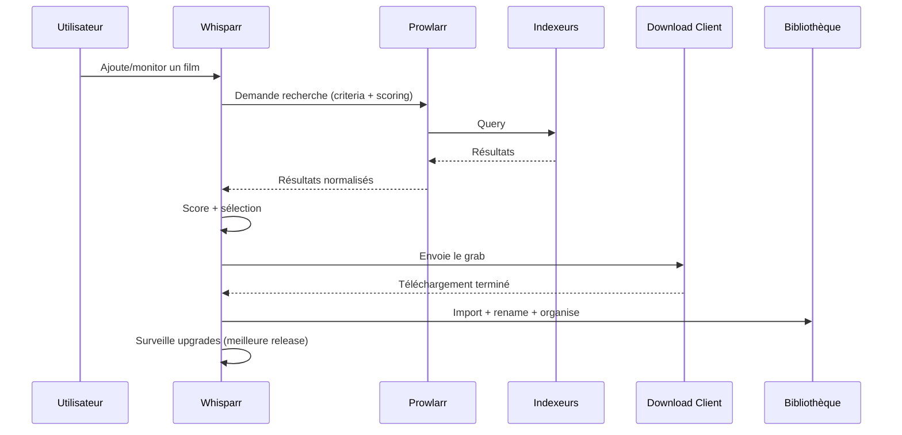

# 🔞🎬 Whisparr — Présentation & Configuration Premium (Qualité • Scoring • Gouvernance)

### Gestionnaire “*arr” pour films adultes : automatisation, organisation, upgrades, qualité maîtrisée
Optimisé pour reverse proxy existant • Prowlarr recommandé • Scoring avancé • Exploitation durable

---

## TL;DR

- **Whisparr** automatise l’acquisition, l’organisation et l’upgrade qualité de **films adultes** via **Usenet / BitTorrent**.
- Il s’intègre à **Prowlarr** (indexeurs) + un **download client** (qBittorrent / SABnzbd).
- Une config premium = **profils qualité intelligents**, **custom formats** (x265/HDR/PROPER…), **organisation stricte**, **gestion des doublons**, **sécurité d’accès**, **tests & rollback**.

Sources produit :  
- https://github.com/Whisparr/Whisparr  
- https://whisparr.org/  
- https://whisparr.com/docs/api/

---

## ✅ Checklists

### Pré-configuration (avant de “remplir” la bibliothèque)
- [ ] Définir ton objectif qualité (1080p x265 vs 2160p HDR, etc.)
- [ ] Définir la stratégie “un seul type par film” (ou multi-instances)
- [ ] Convention de dossiers & noms (stable et lisible)
- [ ] Prowlarr prêt (indexeurs centralisés)
- [ ] Download client prêt + catégories cohérentes
- [ ] Choix “hardlinks / atomic moves” selon ton filesystem (si applicable)

### Post-configuration (validation premium)
- [ ] Recherche manuelle : indexer → grab → import → renommage OK
- [ ] Upgrade automatique : un meilleur release remplace bien l’ancien
- [ ] Les fichiers finissent au bon endroit + nom propre
- [ ] Pas de doublons / pas de “mismatch” de films
- [ ] Logs propres (pas de boucle “failed import”)
- [ ] Rollback documenté (DB + config + média)

---

> [!TIP]
> Whisparr hérite des meilleures pratiques Radarr/Sonarr : **profils qualité + scoring + structure + indexeurs centralisés** = résultats propres.

> [!WARNING]
> Whisparr ne gère **qu’un seul type d’un film** par instance (ex: pas 1080p + 4K pour le même film dans la même instance).  
> Si tu veux plusieurs versions, utilise **plusieurs instances**.  
> Source : https://github.com/Whisparr/Whisparr

> [!DANGER]
> Les métadonnées et titres “adult” peuvent être sensibles.  
> Applique le **moindre privilège** (auth, ACL, accès réseau) et évite l’exposition publique.

---

# 1) Whisparr — Vision moderne

Whisparr n’est pas “un téléchargeur”.

C’est :
- 🧠 Un **moteur de décision** (qualité, upgrades, scoring)
- 🔎 Un **orchestrateur d’indexeurs** (via Prowlarr)
- 📦 Un **gestionnaire de bibliothèque** (import, tri, renommage, dossiers)
- 🔄 Un **automatisateur** (monitoring, RSS, re-grab si échec)

Référence : https://github.com/Whisparr/Whisparr

---

# 2) Architecture globale (écosystème *arr)



---

# 3) Philosophie de configuration Premium (5 piliers)

1. 🎯 **Profils qualité** (ordre + limites de taille)
2. 🧩 **Custom Formats** (scoring pro)
3. 📁 **Organisation & naming** (structure durable)
4. 🔎 **Indexation propre** (Prowlarr centralisé)
5. 🔄 **Fiabilité d’import** (mapping chemins, catégories, retries)

---

# 4) Profils Qualité — Le cœur stratégique

## 4.1 Objectif : “qualité stable + upgrades intelligents”
Un profil premium définit :
- Résolution minimale acceptable
- Ordre des qualités préférées (BluRay > WEB-DL > HDTV…)
- **Limites de taille** (évite les releases trop compressées)
- Politique d’upgrade (quand remplacer)

### Exemple logique (1080p “propre”)


### Conseils premium
- Si tu vises **x265**, fais-le surtout via **Custom Formats** (scoring), pas seulement via le nom du profil.
- Mets des limites :  
  - **Min** évite les micro-fichiers douteux  
  - **Max** évite les releases absurdes (ou multi-pistes inutiles)

---

# 5) Custom Formats — Scoring avancé (le “mode premium”)

## 5.1 Pourquoi c’est crucial
Le scoring transforme Whisparr en **moteur de sélection** :
- Favorise x265 / HDR / DV / PROPER
- Évite CAM/LQ/encodes douteux
- Réduit les faux positifs

### Exemple de scoring “moderne” (à adapter)
| Format | Score |
|---|---:|
| x265 / HEVC | +100 |
| HDR | +150 |
| Dolby Vision | +200 |
| Proper / Repack | +50 |
| LQ / CAM / TS | -10000 |

> [!TIP]
> Commence simple (x265 + HDR + gros malus LQ), puis ajuste après 1–2 semaines d’observation réelle.

---

# 6) Organisation & Naming (ce qui rend la bibliothèque “propre”)

## 6.1 Structure recommandée
Objectif : un film = un dossier = un fichier clair.

Exemple :
```
/data/media/movies/
  Movie Title (Year)/
    Movie Title (Year) - 1080p WEB-DL - x265.mkv
```

## 6.2 Templates “premium” (idée)
- **Dossier film** : `Titre (Année)`
- **Fichier** : `Titre (Année) - Qualité - Codec`

But :
- lisible à l’œil
- stable dans le temps
- compatible Plex/Jellyfin

> [!WARNING]
> Évite les templates qui injectent 15 champs (audio, release group, tags…) : ça casse la lisibilité et augmente les renommages inutiles.

---

# 7) Indexeurs via Prowlarr (recommandé)

Principe : **ne pas dupliquer** tes indexeurs partout.
- Prowlarr centralise la config
- Whisparr reçoit tout via API
- Maintenance plus simple (1 endroit à gérer)

Architecture :


Source (Prowlarr est l’approche standard de l’écosystème *arr) : https://github.com/Prowlarr/Prowlarr

---

# 8) Download Client (intégration propre)

## Points premium à vérifier
- Catégorie dédiée (ex: `movies-adult`) pour éviter les collisions
- “Completed Download Handling” actif côté *arr (selon client)
- Retours d’état cohérents (queue → completed → import)

> [!TIP]
> Une catégorie dédiée + un dossier “completed” clair = imports propres + moins d’erreurs.

---

# 9) Stratégies avancées (doublons, multi-versions, instances)

## 9.1 “Un seul type par film” (rappel important)
Si tu veux :
- 1080p x265 **et** 2160p HDR
- version “light” **et** version “remux”

➡️ solution propre : **2 instances** Whisparr, chacune avec :
- son profil qualité
- sa racine bibliothèque
- ses règles

Source : https://github.com/Whisparr/Whisparr

---

# 10) Workflows premium (opérations & qualité)

## 10.1 Workflow acquisition → import → upgrade


## 10.2 “Qualité maîtrisée”
- 1 semaine : observe ce qui est choisi
- ajuste scoring (malus sur tags indésirables)
- verrouille limites de taille

---

# 11) Validation / Tests / Rollback

## 11.1 Smoke tests (rapides)
```bash
# Santé de l'UI (à adapter à ton URL)
curl -I https://whisparr.example.tld | head

# Vérifier que l'API répond (si tu utilises un token/API key, adapte)
# curl -H "X-Api-Key: <key>" https://whisparr.example.tld/api/v3/system/status
```

## 11.2 Tests fonctionnels (must-have)
- Recherche manuelle sur 1 film test :
  - résultat → grab → import → fichier nommé correctement
- Test upgrade :
  - simuler une meilleure qualité dispo (ou relancer recherche)  
  - vérifier remplacement conforme aux règles

## 11.3 Rollback (propre)
- Sauvegarde :
  - config/appdata Whisparr
  - DB (si séparée) ou DB interne selon ton déploiement
- Retour arrière :
  - restaurer DB + config
  - relancer un “rescan” contrôlé
  - vérifier que l’inventaire correspond

> [!DANGER]
> Un rollback sans sauvegarde testée = pari. Fais au moins 1 restauration de test sur une copie.

---

# 12) Erreurs fréquentes (diagnostic express)

- ❌ Import qui boucle (permissions / paths / catégorie client)  
  ✅ vérifier mapping chemins + dossier completed + droits d’écriture

- ❌ Mauvaises releases (LQ, faux tags)  
  ✅ renforcer scoring + blacklist + limites de taille

- ❌ Doublons / confusion versions  
  ✅ 1 film = 1 “type” par instance, sinon multi-instance

---

# 13) Sources — Images Docker (URLs brutes comme demandé)

## 13.1 Image communautaire la plus citée
- `thespad/whisparr` (Docker Hub) : https://hub.docker.com/r/thespad/whisparr  
- Tags (v2/v3, arch) : https://hub.docker.com/r/thespad/whisparr/tags  
- Repo de packaging (référence image) : https://github.com/thespad/docker-whisparr  

## 13.2 Alternative populaire
- `hotio/whisparr` (docs hotio) : https://hotio.dev/containers/whisparr/  
- Repo de packaging hotio : https://github.com/hotio/whisparr  
- Package container (GHCR hotio) : https://github.com/orgs/hotio/packages/container/package/whisparr  

## 13.3 LinuxServer (si tu veux du “LSIO-like”)
- Image “labs” liée à *arr (prarr) avec tags Whisparr-Eros : https://github.com/orgs/linuxserver-labs/packages/container/prarr/568846184?tag=whisparr-eros-3.0.1.1343  
- Discussion LSIO (demande whisparr) : https://discourse.linuxserver.io/t/request-whisparr-container/4180  
- Catalogue LSIO (pour vérifier disponibilité) : https://www.linuxserver.io/our-images  

---

# ✅ Conclusion

Whisparr “premium” = mêmes standards que Radarr/Sonarr :
- profils qualité solides
- scoring intelligent via custom formats
- structure de bibliothèque durable
- indexeurs centralisés via Prowlarr
- tests & rollback documentés

Résultat : moins de bruit, moins de mauvaises releases, et une bibliothèque stable.