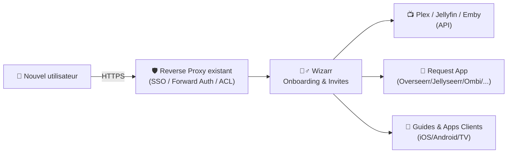
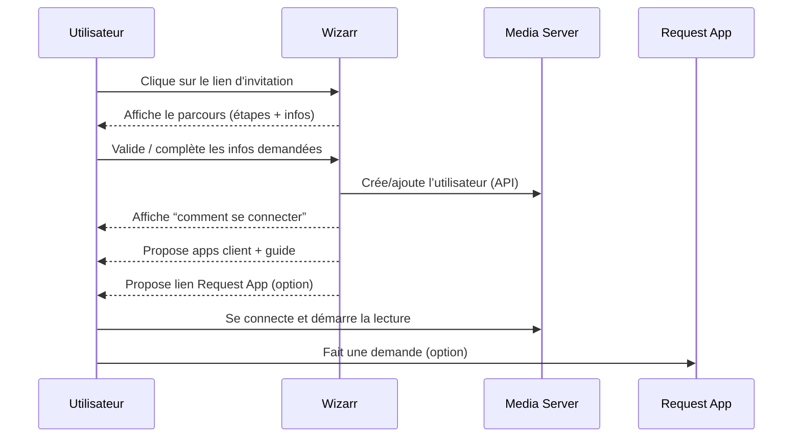

# 🧙‍♂️ Wizarr — Présentation & Configuration Premium (Invitations Plex / Jellyfin / Emby)

### Onboarding automatisé des utilisateurs : lien d’invitation, guidage, ajout serveur, clients, et “request apps”
Optimisé pour reverse proxy existant • UX Family/Friends • Intégrations • Exploitation durable

---

## TL;DR

- **Wizarr** simplifie l’invitation de proches sur ton media server : tu crées un **lien**, ils suivent un **parcours guidé** et sont **ajoutés automatiquement** (selon le serveur).
- Valeur : **moins de support**, onboarding cohérent, centralise les “liens utiles” (apps client, règles, request system).
- Version “premium ops” = **auth**, **limites**, **templates**, **segmentation**, **validation**, **rollback**.

Sources produit (site + docs + repo) :
- https://wizarr.org/
- https://docs.wizarr.dev/
- https://github.com/wizarrrr/wizarr

---

## ✅ Checklists

### Pré-configuration (avant d’inviter qui que ce soit)
- [ ] Définir le(s) serveur(s) cible(s) : Plex / Jellyfin / Emby / etc.
- [ ] Choisir la stratégie d’accès : SSO/forward-auth via reverse proxy existant, ou auth Wizarr
- [ ] Définir une politique d’invitations : durée, usage unique vs réutilisable, quotas
- [ ] Préparer un “pack onboarding” : apps clients, règles, bonnes pratiques, request app
- [ ] Vérifier la cohérence des URLs externes (HTTPS, domaine, base path si besoin)

### Post-configuration (qualité & fiabilité)
- [ ] Test d’invitation complet (utilisateur “dummy”) : du clic au playback
- [ ] Vérifier que l’utilisateur créé tombe dans le bon “groupe/role” côté serveur
- [ ] Vérifier qu’aucune page n’expose des infos sensibles (tokens / URLs internes)
- [ ] Logs propres + pas d’erreurs API récurrentes
- [ ] Procédure de rollback écrite (désactiver invites / couper intégration / revenir à config safe)

---

> [!TIP]
> Wizarr est surtout un **outil UX** : la “qualité premium” vient de la clarté du parcours, pas du nombre d’options.

> [!WARNING]
> Les invitations touchent à l’identité (création d’utilisateurs, accès à un serveur).  
> Traite Wizarr comme un **service sensible** : contrôle d’accès, journaux, limites.

> [!DANGER]
> Ne publie pas une page d’invitation sans garde-fous (auth / anti-abus / expiration).  
> Un lien public sans limites = risque de comptes indésirables.

---

# 1) Wizarr — Vision moderne

Wizarr n’est pas un simple “générateur de lien”.

C’est :
- 🧭 Un **parcours onboarding** (guidé)
- 🔗 Un **connecteur** vers tes services (media server + request systems)
- 🧩 Un **standard d’accueil** (règles, apps, accès, explications)
- 🛡️ Un **point de contrôle** (invites, limitations, gestion)

Objectif : transformer “invite tes proches” en une opération **simple, répétable, propre**.

Référence (intro + objectif) :
- https://docs.wizarr.dev/

---

# 2) Architecture globale



---

# 3) Parcours utilisateur (le “flow” qui doit être parfait)



---

# 4) Configuration Premium (sans “installation”)

## 4.1 URLs externes & cohérence HTTPS
- Assure-toi que Wizarr “sait” quelle est son URL publique (HTTPS, domaine).
- Si tu utilises un base path (ex: `/wizarr`), vérifie que la doc Wizarr couvre ce cas côté config.

Docs (point d’entrée) :
- https://docs.wizarr.dev/

## 4.2 Stratégie d’accès (recommandations)
Choisis UNE approche claire :

### Option A — Accès “privé”
- Accessible uniquement via LAN/VPN / réseau interne
- Le plus simple et souvent suffisant

### Option B — Accès public mais protégé
- Reverse proxy existant + SSO/forward-auth
- Idéal si tu invites souvent et veux un lien “simple”

> [!TIP]
> L’approche la plus robuste : **lien d’invite** accessible, mais **action d’invitation** soumise à un contrôle (auth / limitations / expiration).

---

# 5) Intégrations (Plex / Jellyfin / Emby + request apps)

## 5.1 Media servers
Wizarr vise à automatiser :
- création / ajout utilisateur
- rattachement à un serveur (selon plateforme)
- affichage des instructions de connexion

Référence projet (cibles listées) :
- https://github.com/wizarrrr/wizarr

## 5.2 Request apps (Overseerr/Jellyseerr/Ombi/…)
Approche premium :
- afficher un lien unique vers la request app
- expliquer “comment demander un film/série”
- ajouter 2–3 règles simples (qualité, délais, abus)

> [!WARNING]
> Si ta request app est publique, elle doit être protégée comme Wizarr (auth, rate limits, etc.).

---

# 6) Anti-abus & Qualité d’invitations (ce qui évite les problèmes)

Même sans entrer dans les détails d’implémentation, une posture “premium” =

- ⏳ **Expiration** des liens (courte si public)
- 🔒 **Usage unique** pour les invites sensibles
- 🔢 **Quotas** (ex: N invites/jour)
- 🧾 **Journalisation** : qui a créé quoi, quand, pour quel service
- 🧠 **Messages clairs** : quoi faire si ça échoue (support minimal)

---

# 7) Exploitation (runbook court)

## 7.1 Routine hebdo (2 minutes)
- vérifier erreurs récurrentes (API media server)
- vérifier que les invites “aboutissent” (1 test rapide mensuel)
- vérifier que les liens “apps client” sont toujours corrects

## 7.2 Logs : ce qu’on cherche
- erreurs d’auth API (token expiré / permission insuffisante)
- timeouts réseau entre Wizarr et media server
- erreurs de création d’utilisateur (email déjà utilisé, règles serveur)

---

# 8) Validation / Tests / Rollback

## 8.1 Tests fonctionnels (smoke tests)
```bash
# 1) La page d'accueil répond
curl -I https://wizarr.example.tld | head

# 2) Invitation: vérifier que la page d'invite charge (URL exacte selon ton instance)
# (manuel) Ouvrir le lien d'invite -> parcourir toutes les étapes

# 3) Vérifier côté media server: l'utilisateur existe et a le bon accès
# (manuel) Se connecter avec l'utilisateur invité et lancer une lecture
```

## 8.2 Tests de sécurité (must-have)
- lien d’invite expiré → doit refuser
- lien d’invite usage unique → second essai doit refuser
- un utilisateur non autorisé ne doit pas pouvoir générer des invites (si UI admin)

## 8.3 Rollback (plan simple)
- Désactiver la génération d’invitations (mode maintenance)
- Retirer temporairement l’intégration (API token)
- Remplacer le parcours par une page “invite fermée” le temps de corriger
- Révoquer les comptes créés par erreur côté media server (si incident)

---

# 9) Erreurs fréquentes (et fixes rapides)

## “L’invite se valide mais l’utilisateur n’a pas accès”
- cause : permissions/groupe/role incorrect côté serveur
- fix : vérifier le mapping “rôle par défaut” + accès bibliothèque

## “Erreur API / Unauthorized”
- cause : token expiré / droits insuffisants
- fix : régénérer token, vérifier permissions minimales requises

## “Le lien marche mais la UX est confuse”
- cause : parcours trop long, trop de liens, trop de jargon
- fix : 3 écrans max, 1 CTA principal, texte simple, captures d’écran si besoin

---

# 10) Sources — Images Docker (format demandé, URLs brutes)

## 10.1 Image “officielle” la plus citée (GitHub Container Registry)
- `ghcr.io/wizarrrr/wizarr` (GitHub Packages / Container) : https://github.com/orgs/wizarrrr/packages/container/package/wizarr  
- Repo upstream (référence du container) : https://github.com/wizarrrr/wizarr  
- Docs Wizarr (entrée “getting started”) : https://docs.wizarr.dev/  

## 10.2 Image Docker Hub (historique / community)
- `realashleybailey/wizarr` (Docker Hub) : https://hub.docker.com/r/realashleybailey/wizarr  

## 10.3 LinuxServer.io (LSIO)
- Liste officielle des images LSIO (référence catalogue) : https://www.linuxserver.io/our-images  
- Thread “request Wizarr” (indique qu’il n’y a pas d’image LSIO officielle dédiée au moment du post) : https://discourse.linuxserver.io/t/request-wizarr-invitation-server-for-plex/5652  

---

# ✅ Conclusion

Wizarr est la “porte d’entrée” premium de ton media server :
- moins de support
- onboarding clair
- invites contrôlées
- intégrations propres

La recette : **UX simple + contrôle d’accès + limites + tests**.