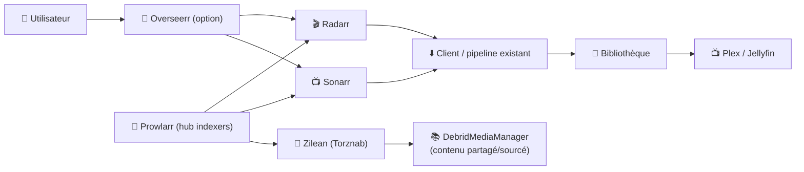
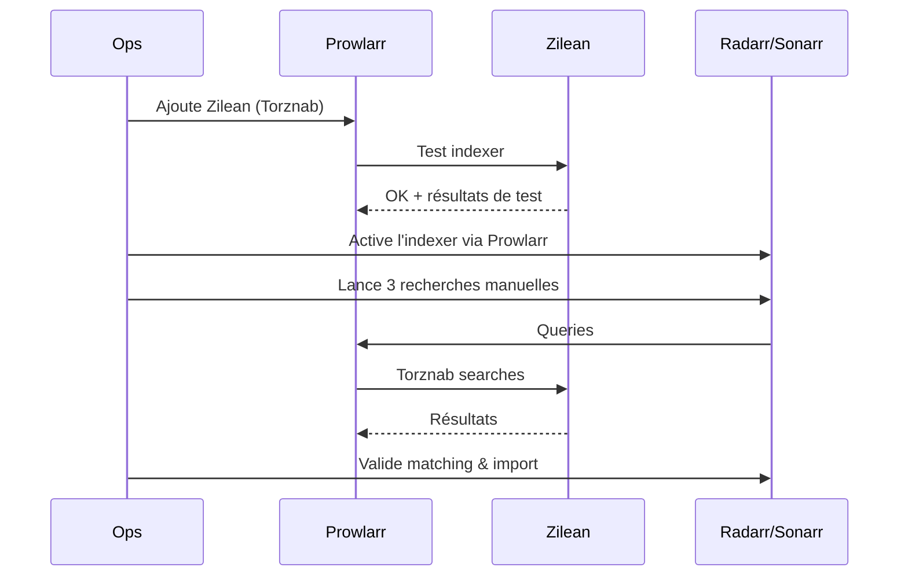

# 🧠 Zilean — Présentation & Configuration Premium (Torznab “DebridMediaManager-sourced”)

### Indexer Torznab pour l’écosystème *Arr / Prowlarr (contenu partagé via DebridMediaManager)
Optimisé pour Reverse Proxy existant • Qualité de résultats • Gouvernance • Exploitation durable

---

## TL;DR

- **Zilean** est un service qui permet de **rechercher du contenu “sourcé DebridMediaManager”** et de l’exposer comme **indexer Torznab** pour **Prowlarr / Sonarr / Radarr**.
- Sa valeur : **un “indexer logique”** pour des contenus déjà référencés/partagés, utilisable comme n’importe quel Torznab.
- Une config premium = **périmètre**, **qualité des résultats**, **anti-bruit**, **tests**, **rollback**, et **accès sécurisé via ton reverse proxy existant**.

---

## ✅ Checklists

### Pré-configuration (avant de brancher Prowlarr)
- [ ] Tu sais qui doit y accéder (privé / équipe / multi-users)
- [ ] Tu as un plan de nommage & tags côté *Arr (catégories, priorités)
- [ ] Tu as une stratégie “qualité” (préférences, exclusions, upgrades)
- [ ] Tu sais où placer Zilean dans ta chaîne (Prowlarr recommandé comme hub)
- [ ] Tu as une stratégie de protection (SSO/forward-auth/VPN via reverse proxy existant)

### Post-configuration (validation)
- [ ] Prowlarr teste l’indexer Torznab Zilean en **OK**
- [ ] Une recherche renvoie des résultats cohérents (titre/année/épisode)
- [ ] Les catégories Torznab sont correctement mappées
- [ ] Les logs ne montrent pas de boucles d’erreurs / timeouts
- [ ] Tu as une procédure “désactiver Zilean” (rollback simple)

---

> [!TIP]
> Pense Zilean comme un **indexer Torznab spécialisé**. Le “premium” consiste surtout à **maîtriser le bruit** (faux positifs) et **contrôler l’accès**.

> [!WARNING]
> Un mauvais calibrage = résultats “hors-sujet” → import foireux → incidents de matching dans Sonarr/Radarr.

> [!DANGER]
> Ne l’expose pas publiquement sans contrôle d’accès (reverse proxy existant + auth/SSO/VPN). Un Torznab accessible publiquement est une surface d’abus.

---

# 1) Zilean — Vision moderne

Zilean n’est pas un tracker.

C’est :
- 🔎 Un **moteur de recherche** “DMM-sourced”
- 🧩 Un **pont Torznab** (consommable par *Arr/Prowlarr)
- 🔄 Un service qui peut aussi **scraper** depuis des sources (ex: Zurg / autres instances), selon tes usages

Objectif : te donner un “indexer” utilisable **comme Jackett/Indexer classique**, mais alimenté par ce modèle de sourcing.

---

# 2) Architecture globale (recommandée)



---

# 3) “Premium config mindset” (5 piliers)

1. 🧭 **Qualité de matching** (*Arr : titres, années, SxxExx, langues)
2. 🏷️ **Catégories & priorités** (TV/Movie, profils, règles d’acceptation)
3. 🔕 **Anti-bruit** (filtres, exclusions, limites)
4. 🧪 **Validation** (tests reproductibles + baselines)
5. 🔐 **Accès maîtrisé** (reverse proxy existant + auth/SSO/VPN)

---

# 4) Intégration Prowlarr (recommandée)

## Pourquoi Prowlarr au centre
- Centralise l’indexer (Zilean) pour **Sonarr + Radarr**
- Un seul endroit pour :
  - tester
  - ajuster catégories
  - activer/désactiver rapidement (rollback)

## Configuration “Torznab custom” (logique)
Dans Prowlarr :
- Type : **Torznab (Custom)**
- URL : **endpoint Torznab Zilean** (voir doc Zilean)
- API Key : si Zilean en exige une (selon configuration)
- Catégories :
  - Movies (ex: 2000)
  - TV (ex: 5000)
  - (ajuste selon le mapping utilisé dans ton stack)

> [!TIP]
> Démarre avec **une seule catégorie** (Movies ou TV), valide, puis élargis.

---

# 5) Intégration Radarr / Sonarr (stratégie premium)

## 5.1 Radarr (films)
- Associer l’indexer Zilean via Prowlarr
- Profils qualité : garde tes règles habituelles (1080p/2160p, x265, HDR, etc.)
- Évite les imports agressifs au début :
  - commence en “monitoring” propre
  - lance des recherches manuelles de validation

## 5.2 Sonarr (séries)
- Même logique : indexer via Prowlarr
- Attention aux faux positifs :
  - séries aux titres proches
  - saisons “pack” vs épisodes
- Stratégie premium :
  - tester 3 séries “faciles”, 2 séries “compliquées”
  - calibrer avant de généraliser

---

# 6) Qualité, filtres & anti-bruit (le vrai différenciateur)

## Règles simples qui sauvent la prod
- ✅ Prioriser les résultats avec métadonnées cohérentes (année, SxxExx)
- ✅ Rejeter les titres ambigus (ex: “2021” manquant, saison inconnue)
- ✅ Limiter le volume :
  - “max results” raisonnable
  - éviter de “spammer” les recherches automatiques
- ✅ Définir des exclusions :
  - langues non désirées
  - tags de releases que tu ne veux jamais

> [!WARNING]
> Plus tu laisses *Arr “deviner”, plus tu risques des imports foireux.
> Le premium consiste à **forcer la précision** (matching strict + profils).

---

# 7) Workflows premium

## 7.1 Démarrage contrôlé (recommandé)


## 7.2 Runbook “incident : résultats bizarres”
- Étape 1 : reproduire avec une requête simple (titre + année / SxxExx)
- Étape 2 : réduire le scope (1 catégorie, moins de résultats)
- Étape 3 : vérifier le matching côté *Arr (logs import)
- Étape 4 : si doute → désactiver Zilean temporairement dans Prowlarr (rollback)

---

# 8) Validation / Tests / Rollback

## 8.1 Tests “smoke” (Torznab)
> Adapte l’URL selon ton endpoint Zilean (voir doc officielle).

```bash
# Vérifier que le endpoint répond (exemple générique)
curl -I "https://zilean.example.tld/torznab/api" | head

# Exemple de recherche Torznab (générique)
curl -s "https://zilean.example.tld/torznab/api?t=search&q=dune" | head -n 20
```

## 8.2 Tests fonctionnels
- Prowlarr : bouton “Test” → doit passer
- Sonarr/Radarr :
  - 1 film, 1 série (épisode), 1 saison pack (si tu utilises)
  - vérifier : titre exact, année, SxxExx, pas de confusion

## 8.3 Rollback (simple)
- Désactiver l’indexer Zilean dans Prowlarr
- Revenir à tes indexers habituels
- Garder Zilean accessible seulement aux admins le temps d’investigation

---

# 9) Limitations & attentes réalistes

- Zilean est un **indexer** : la qualité perçue dépend :
  - du sourcing disponible
  - des conventions de nommage
  - de la rigueur du matching *Arr
- Ce n’est pas un système de “qualité vidéo” : c’est *Arr qui applique tes profils (x265/HDR/etc.)

---

# 10) Sources — Images Docker & Docs (URLs brutes)

## 10.1 Image communautaire la plus citée
- `ipromknight/zilean` (Docker Hub) : https://hub.docker.com/r/ipromknight/zilean  
- Repo (référence upstream) : https://github.com/iPromKnight/zilean  
- Documentation officielle Zilean : https://ipromknight.github.io/zilean/  

## 10.2 Variante “package registry” (ElfHosted / GHCR)
- Package container `elfhosted/zilean` (GitHub Packages) : https://github.com/orgs/elfhosted/packages/container/package/zilean  

## 10.3 Docs tierces (usage dans des stacks “debrid”)
- Page wiki “Zilean” (debrid/wiki) : https://github.com/debrid/wiki/blob/main/content/docs/%28scrapers%29/zilean.mdx  

## 10.4 LinuxServer.io
- Collection des images LSIO (vérification présence) : https://www.linuxserver.io/our-images  
- (À ce jour, pas d’image LSIO dédiée “zilean” listée dans cette collection.)

---

# ✅ Conclusion

Zilean apporte un **Torznab spécialisé** pour intégrer un sourcing “DMM” dans ton écosystème *Arr.

Version “premium” = **matching strict**, **anti-bruit**, **tests reproductibles**, **rollback simple**, et **accès maîtrisé via ton reverse proxy existant**.