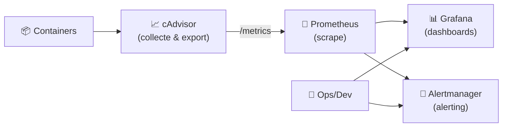
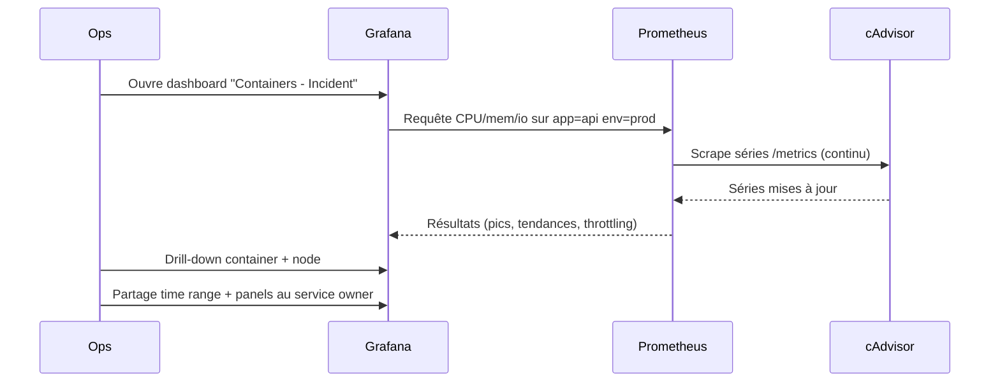

# 📈 cAdvisor — Présentation & Exploitation Premium (Metrics containers)

### Télémétrie “container-level” : CPU / mémoire / FS / réseau → export Prometheus / intégrations
Optimisé pour Prometheus/Grafana • Multi-host • Dashboards • Exploitation durable

---

## TL;DR

- **cAdvisor (Container Advisor)** collecte et expose des **métriques détaillées** sur les containers et la machine (CPU, mémoire, réseau, filesystem…).
- Il expose des métriques **Prometheus “out of the box”** via un endpoint HTTP (souvent `/metrics`).
- En “premium ops” : **naming & labels**, **scrape Prometheus propre**, **dashboards**, **tests**, **rollback**, et conscience des **limites** (cardinalité, multi-runtime, permissions).

Références : repo officiel + guide Prometheus.  
- https://github.com/google/cadvisor  
- https://prometheus.io/docs/guides/cadvisor/

---

## ✅ Checklists

### Pré-usage (avant de brancher Prometheus)
- [ ] Définir le scope : Docker seul vs aussi containerd (selon ton runtime)
- [ ] Définir les labels standard : `env`, `team`, `app`, `node`, `cluster`
- [ ] Fixer une stratégie de rétention côté Prometheus (pas côté cAdvisor)
- [ ] Prévoir un dashboard Grafana (baseline) + un “incident board”
- [ ] Prévoir le filtrage des métriques à forte cardinalité si besoin

### Post-configuration (qualité opérationnelle)
- [ ] Prometheus scrape OK (target UP, latence stable)
- [ ] Dashboard OK (CPU, mémoire, IO, réseau)
- [ ] Alertes minimales (CPU throttling, OOM, FS fill rate, restarts via autres sources si besoin)
- [ ] Runbook “metrics-first” (où regarder en incident + seuils)
- [ ] Plan rollback prêt (désactiver scrape / revenir à version précédente)

---

> [!TIP]
> cAdvisor = **collecteur/exposeur**.  
> La valeur arrive avec **Prometheus + Grafana** (corrélation, historique, alerting).

> [!WARNING]
> Attention aux **labels et à la cardinalité** : trop de séries = Prometheus coûteux (RAM/CPU).

> [!DANGER]
> cAdvisor doit lire des infos bas niveau (cgroups, FS, runtime).  
> Un déploiement mal borné peut exposer de la surface / des infos sensibles. Traite-le comme un composant d’observabilité “privilégié”.

---

# 1) cAdvisor — Vision moderne

cAdvisor fournit une compréhension fine de l’usage des ressources et des caractéristiques de performance des containers.  
Il collecte, agrège et exporte des stats par container + machine-wide.  
Source : https://github.com/google/cadvisor

---

# 2) Architecture globale (référence)



Guides/Docs :  
- Prometheus guide cAdvisor : https://prometheus.io/docs/guides/cadvisor/  
- Prometheus storage doc cAdvisor : https://github.com/google/cadvisor/blob/master/docs/storage/prometheus.md

---

# 3) “Premium config mindset” (5 piliers)

1. 🧭 **Labels cohérents** (env/team/app/node) → requêtes simples, dashboards réutilisables
2. 🧲 **Scrape propre** (intervalle, relabeling, filtrage si nécessaire)
3. 📊 **Dashboards standardisés** (baseline + incident)
4. 🧪 **Validation/Tests** (targets UP, métriques clés présentes, latences)
5. 🔁 **Rollback** (revenir à une version image stable / désactiver scrape rapidement)

---

# 4) Exposition Prometheus (ce qui compte vraiment)

## Endpoint metrics
cAdvisor expose des métriques Prometheus par défaut.  
Docs : https://github.com/google/cadvisor/blob/master/docs/storage/prometheus.md

### Exemple minimal Prometheus scrape (snippet)
> Ce n’est pas une “installation”, juste la partie config scrape.

```yaml
scrape_configs:
  - job_name: "cadvisor"
    metrics_path: /metrics
    static_configs:
      - targets: ["NODE_OR_IP:CADVISOR_PORT"]
    relabel_configs:
      - source_labels: [__address__]
        target_label: instance
        replacement: "node-01"
```

> [!TIP]
> Mets un label `instance` stable (nom logique du node) plutôt que l’IP brute, sinon tes dashboards changent à chaque migration.

---

# 5) Dashboards Grafana (baseline + incident)

## Baseline
Objectif : “santé” rapide
- CPU usage & throttling
- Memory usage & OOM indications
- Filesystem usage + IO
- Network rx/tx

Un exemple de dashboard public (point de départ) :  
- Grafana dashboard “cAdvisor Docker Insights” : https://grafana.com/grafana/dashboards/19908-docker-container-monitoring-with-prometheus-and-cadvisor/

> [!WARNING]
> Les dashboards publics sont très variables. Considère-les comme **templates**, puis normalise tes labels/variables (env/app/node).

---

# 6) Workflows premium (incident & debug)

## “Incident triage” (séquence)


## Patterns utiles (ce qu’on cherche)
- **CPU throttling** : container CPU limit trop bas ou burst non prévu
- **Memory** : hausse progressive = fuite, pics = batch, OOM = limites
- **Disk IO** : saturation IO → latence app, timeouts upstream
- **Network** : rx/tx anormaux, erreurs, drops (selon metrics dispo)

Référence généraliste cAdvisor : https://github.com/google/cadvisor

---

# 7) Validation / Tests / Rollback

## Tests de validation (smoke)
```bash
# 1) Endpoint répond (exemple)
curl -s http://NODE_OR_IP:CADVISOR_PORT/metrics | head -n 20

# 2) Prometheus : target "cadvisor" = UP (à vérifier côté UI)
# 3) Vérifier une métrique clé existe
curl -s http://NODE_OR_IP:CADVISOR_PORT/metrics | grep -E "container_cpu|container_memory" | head
```

## Tests “qualité”
- Vérifier que `instance`, `env`, `app` sont cohérents dans Grafana/PromQL
- Vérifier l’intervalle de scrape (pas trop agressif)
- Vérifier que Prometheus ne sature pas (RAM/CPU) après activation cAdvisor

## Rollback (pragmatique)
- Désactiver rapidement le scrape job `cadvisor` (toggle config Prometheus) si surcharge
- Revenir à une version image antérieure (si une version introduit un changement de registry/tag)
- Réduire l’intervalle de scrape / filtrer des métriques si cardinalité excessive

> [!WARNING]
> Le nom/registry des images cAdvisor a connu des changements (gcr.io → ghcr.io) et des subtilités de tags. Garde une note interne “image source of truth”.  
> Exemple de discussion : https://github.com/google/cadvisor/issues/3807

---

# 8) Limitations (pour éviter de mauvaises attentes)

- cAdvisor ne remplace pas un système de logs/traces.
- Le coût peut venir de :
  - trop de séries (labels dynamiques)
  - scrape trop fréquent
  - environnements très “churn” (containers éphémères)

Guide Prometheus : https://prometheus.io/docs/guides/cadvisor/

---

# 9) Sources — Images Docker (comme demandé)

## Images “officielles / courantes” cAdvisor
- GitHub repo officiel : https://github.com/google/cadvisor  
- Docker Hub (image `google/cadvisor`) : https://hub.docker.com/r/google/cadvisor  
- Registry historique (souvent référencée) : `gcr.io/cadvisor/cadvisor` (existe selon versions/miroirs) : https://gcr.io/cadvisor/cadvisor  
- Évolutions/mention GHCR (`ghcr.io/google/cadvisor`) : voir releases & issues :
  - Releases : https://github.com/google/cadvisor/releases
  - Issue registry change : https://github.com/google/cadvisor/issues/3807
  - Issue mention GHCR : https://github.com/google/cadvisor/issues/3712

## LinuxServer.io (LSIO)
- Liste officielle des images LSIO : https://www.linuxserver.io/our-images  
À date, **pas d’image cAdvisor dédiée** listée comme image LSIO sur leur catalogue (vérification via la page “Our Images”).  
Source : https://www.linuxserver.io/our-images

---

# ✅ Conclusion

cAdvisor est une brique essentielle si tu veux :
- des métriques “container-level” rapides à brancher,
- une visibilité par container et par node,
- un socle solide pour dashboards et alerting (via Prometheus/Grafana).

La version “premium” = labels cohérents + scrape maîtrisé + dashboards standard + tests + rollback.