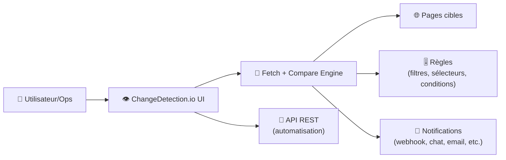
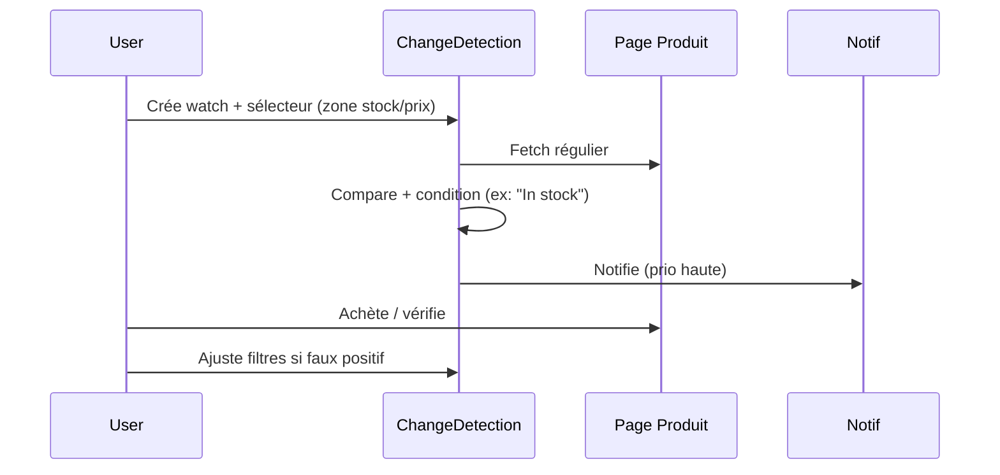

# 👁️ ChangeDetection.io — Présentation & Configuration Premium

### Monitoring de changements web + alerting multi-canaux, avec sélecteurs visuels et fetch “headless” si besoin
Optimisé pour reverse proxy existant • Qualité des règles • Anti-bruit • Exploitation durable

---

## TL;DR

- **ChangeDetection.io** surveille des pages web (ou des portions ciblées) et **notifie** quand ça change.
- Le vrai “premium” = **réduction du bruit** (filtres, sélecteurs, règles), **groupes/tags**, **notifications fiables**, **tests/rollback**, et **mode headless** (Playwright/WebDriver) uniquement quand nécessaire.
- Il peut être piloté via **API** (automatisation, IaC, scripts). :contentReference[oaicite:0]{index=0}

---

## ✅ Checklists

### Pré-usage (avant d’ajouter 200 watches)
- [ ] Définir objectifs : “restock”, “prix”, “texte légal”, “status page”, “annonces”
- [ ] Choisir la stratégie de détection : **texte** (par défaut) vs **sélecteur CSS/XPath** vs **visual selector**
- [ ] Définir une convention de tags : `env`, `team`, `prio`, `type` (restock/prix/news)
- [ ] Choisir canaux de notif (email/Discord/Telegram/webhook/ntfy…)
- [ ] Décider quand activer headless (pages JS/anti-bot), sinon rester en fetch simple

### Post-configuration (qualité)
- [ ] 10 watches “étalon” : faux positifs proches de zéro
- [ ] Notifs testées (latence, retry, format, throttling)
- [ ] Groupes + tags utilisables pour filtrer/assigner
- [ ] Procédures “validation” + “rollback” documentées

---

> [!TIP]
> Commence par **détecter moins** mais **mieux** : une règle stable vaut 50 watches bruyantes.

> [!WARNING]
> Beaucoup de sites bougent à cause de trackers, dates, pubs, A/B tests → sans filtres, tu vas te noyer.

> [!DANGER]
> Le mode headless (Playwright/WebDriver) augmente complexité + coûts (CPU/RAM) + risques de blocage. Ne l’active que si le fetch simple échoue.

---

# 1) ChangeDetection.io — Vision moderne

ChangeDetection.io n’est pas juste “surveiller une page”.

C’est :
- 🎯 Un moteur de détection (texte, portions ciblées, conditions)
- 🧹 Un système anti-bruit (filtres, ignore, triggers)
- 🔔 Un hub de notifications (multi-canaux)
- 🧩 Une plateforme automatisable (API)

Sources : site + repo + API. :contentReference[oaicite:1]{index=1}

---

# 2) Architecture globale



API officielle : :contentReference[oaicite:2]{index=2}

---

# 3) Philosophie premium (5 piliers)

1. 🎯 **Ciblage** : surveiller la bonne portion (CSS/XPath/visual selector)
2. 🧹 **Anti-bruit** : ignorer ce qui change “tout le temps”
3. 🏷️ **Gouvernance** : tags + groupes + priorités (opérationnel)
4. 🔔 **Notifs fiables** : templates, throttling, tests, canaux de secours
5. 🧪 **Validation / rollback** : vérifier avant de généraliser

---

# 4) Stratégies de détection (du plus stable au plus fragile)

## 4.1 Texte (simple, robuste)
- idéal pour changelogs, annonces, pages statiques
- faible coût

## 4.2 Sélecteur CSS/XPath (premium par défaut)
- cible un bloc (ex: prix, état “en stock”, section “news”)
- réduit les faux positifs

## 4.3 Visual selector / extraction ciblée
- quand la page est longue/bruyante
- on “dessine” la zone à surveiller (selon UI/outils dispo)

> [!TIP]
> Règle d’or : **plus tu cibles précisément**, moins tu alertes pour rien.

---

# 5) Anti-bruit (le vrai niveau “pro”)

Approches typiques :
- ignorer lignes/regex (dates, “last updated”, compteurs)
- normaliser espaces / HTML
- ignorer éléments dynamiques (bannières, recommandations)
- déclencher uniquement si “condition vraie” (ex: contient “In stock”)

> [!WARNING]
> Les pages e-commerce changent souvent sans intérêt (prix barré, tracking). Mets des filtres dès le début.

---

# 6) Headless fetch (Playwright / WebDriver) — seulement si nécessaire

Utilise headless quand :
- contenu rendu uniquement en JS
- protections anti-bot légères
- besoins d’auth/cookies complexes

ChangeDetection.io mentionne le support Playwright/WebDriver dans l’écosystème (et le changelog évoque Selenium). :contentReference[oaicite:3]{index=3}

> [!DANGER]
> Headless = plus fragile. Documente : “quand l’activer” + “comment revenir en fetch simple”.

---

# 7) Notifications (fiables et actionnables)

Bonnes pratiques :
- inclure : URL, horodatage, extrait avant/après, tag(s), priorité
- canaux :
  - “bruit faible” (email)
  - “urgence” (Discord/Telegram/ntfy/webhook vers incident tool)
- mettre un canal de secours si le principal tombe

Le projet met en avant de nombreux canaux de notif (Discord/Email/Slack/Telegram/Webhook, etc.). :contentReference[oaicite:4]{index=4}

---

# 8) Workflows premium

## 8.1 Pipeline “Restock” (faible bruit)


## 8.2 Workflow “Compliance / Legal”
- watch sur section précise (conditions, politique, CGU)
- tags : `type=legal`, `prio=medium`
- notif : email + archive

---

# 9) Validation / Tests / Rollback

## Tests de validation (smoke)
```bash
# 1) Vérifier que l’API répond (si exposée)
curl -s http://CHANGED_HOST:PORT/api/v1/ | head || true

# 2) Tester un watch “étalon” (manuel via UI)
# - page statique connue, faible bruit
# - vérifier 0 faux positifs sur 24h

# 3) Vérifier notifications
# - envoyer un test sur chaque canal
# - vérifier latence + formatting
```

## Rollback (opérationnel)
- revenir d’un watch “complexe” à :
  - fetch simple (désactiver headless)
  - sélecteur plus strict
  - filtres (ignore) plus agressifs
- désactiver temporairement un groupe bruyant via tags

---

# 10) Sources — Images Docker & références

```bash
# Site & docs
https://changedetection.io/
https://changedetection.io/docs/api_v1/index.html
https://github.com/dgtlmoon/changedetection.io
https://changedetection.io/CHANGELOG.txt
https://pypi.org/project/changedetection.io/

# Docker images (upstream)
https://hub.docker.com/r/dgtlmoon/changedetection.io
https://hub.docker.com/r/dgtlmoon/changedetection.io/tags

# Docker images (LinuxServer.io / LSIO)
https://docs.linuxserver.io/images/docker-changedetection.io/
https://hub.docker.com/r/linuxserver/changedetection.io
https://hub.docker.com/r/linuxserver/changedetection.io/tags

# Catalogue LSIO (preuve de présence dans "our images")
https://www.linuxserver.io/our-images
```

Références utilisées : :contentReference[oaicite:5]{index=5}