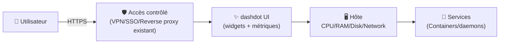
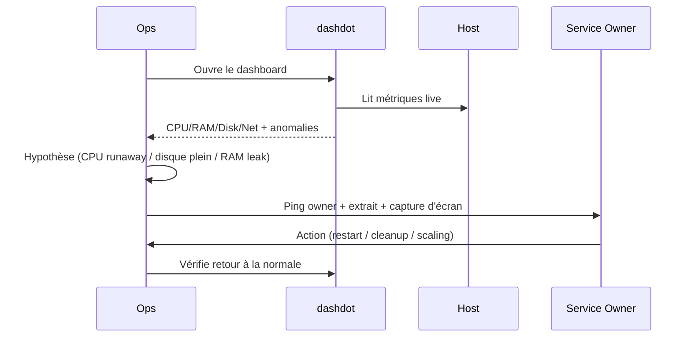

# ✨ dash. (Dashdot) — Présentation & Exploitation Premium (sans install / sans nginx / sans docker / sans UFW)

### Dashboard moderne “glassmorphism” pour un aperçu instantané de la santé d’un serveur
Focus : architecture logique • widgets & métriques • gouvernance • sécurité d’accès (principes) • validation/tests/rollback • pièges fréquents

---

## TL;DR

- **dash. / dashdot** = une **page de monitoring visuelle** pour un **single-node** (VPS / home server), pensée pour être **simple** et **belle**.
- Valeur : **vue immédiate** (CPU/RAM/disque/réseau, etc.) + **widgets** configurables.
- En “premium ops” : **accès contrôlé**, **périmètres**, **naming clair**, **procédures de validation** + **rollback**.

---

## ✅ Checklists

### Pré-usage (avant ouverture aux équipes)
- [ ] Définir le périmètre : serveur unique vs multi-serveurs (dashdot est surtout single-node)
- [ ] Définir l’accès : interne/VPN/SSO via reverse proxy existant
- [ ] Définir conventions : hostnames, tags d’environnement, “ce qui est critique”
- [ ] Définir ce qui est acceptable dans l’UI (métriques vs infos sensibles)

### Post-configuration (qualité opérationnelle)
- [ ] Les widgets critiques sont visibles “sans scroller”
- [ ] Les métriques sont cohérentes (CPU/RAM/disque)
- [ ] Un runbook “dashboard-first” existe (quoi vérifier en 30 secondes)
- [ ] Un plan de rollback est documenté

---

> [!TIP]
> dashdot excelle comme **panneau d’instruments** “1 écran / 1 serveur”.  
> Pour l’historique, l’alerting et la corrélation : Prometheus/Grafana, Loki/ELK, etc.

> [!WARNING]
> Un dashboard peut révéler des infos utiles à un attaquant (charge, disques, noms de services).  
> Traite-le comme une **surface d’observation sensible** : accès strict.

> [!DANGER]
> Ne confonds pas “j’ai un dashboard” avec “j’ai du monitoring”.  
> Sans historique + alerting + SLO, tu n’as qu’une **photo live**.

---

# 1) Vision moderne

dashdot n’est pas un SIEM, ni un stack de logs.

C’est :
- 🧭 Une **vue instantanée** de l’état machine
- 🧩 Un système de **widgets** (personnalisation)
- 🎛️ Une **interface** pour voir “est-ce que mon serveur respire ?”
- 🧠 Un outil de triage rapide avant d’aller plus loin (SSH, metrics stack, etc.)

---

# 2) Architecture logique



---

# 3) Philosophie premium (5 piliers)

1. 🔐 **Accès contrôlé** (pas de dashboard public)
2. 🧩 **Widgets utiles** (anti “gadget”) : infos actionnables
3. 🧭 **Lecture rapide** : 30 secondes pour détecter l’anormal
4. 🧪 **Validation** : vérifier cohérence des métriques
5. 🔄 **Rollback** : revenir à une config safe si ça casse

---

# 4) Widgets & Métriques (comment le rendre “actionnable”)

## 4.1 “Widget set” recommandé (écran 1 = triage)
- CPU global + par cœur (si utile)
- RAM (utilisée / cache / swap)
- Disque (occupation + I/O si disponible)
- Réseau (TX/RX)
- Uptime / load average
- Températures (si la plateforme le permet)

## 4.2 Lecture en 30 secondes (pattern mental)
- CPU haut + load haut → saturation compute / process runaway
- RAM haute + swap → pression mémoire / fuite / OOM possible
- Disque > 85% → risque d’incident (DB, logs, downloads)
- Réseau saturé → backup, sync, attaque, ou gros transferts

> [!TIP]
> Mets un widget “Disk usage” **en haut** si tu fais du self-hosted média (c’est souvent le premier “killer”).

---

# 5) Gouvernance & Sécurité d’accès (principes, sans recette d’infra)

## 5.1 Modèle d’accès (recommandé)
- **Option A (simple & solide)** : accès uniquement via **VPN** (WireGuard/Tailscale)
- **Option B** : via **reverse proxy existant** + **SSO** (Authelia/Authentik/Keycloak)
- **Option C** : réseau interne seulement (LAN), pas de public

## 5.2 Règles premium
- Accès “read-only mindset”
- Comptes nominatif si possible (via SSO)
- Journaux d’accès au niveau proxy (qui a consulté, quand)

> [!WARNING]
> Un dashboard public même “anodin” peut aider à profiler ton infra.  
> Ne l’ouvre jamais “juste pour voir”.

---

# 6) Workflows premium (triage & escalade)

## 6.1 Triage incident (séquence)


## 6.2 “Runbook dashboard-first” (template)
- Symptôme observé (ex: disque 92%)
- Impact (services affectés)
- Hypothèses probables
- Actions immédiates (safe)
- Validation (retour métriques)
- Post-mortem (cause racine + prévention)

---

# 7) Validation / Tests / Rollback

## 7.1 Tests de validation (fonctionnels)
```bash
# Contrôle d’accès (manuel)
# - Non connecté VPN/SSO => accès refusé
# - Connecté VPN/SSO => dashboard OK

# Cohérence (manuel)
# - Compare RAM/CPU avec une source de vérité (top/htop, node_exporter, etc.)
# - Vérifie que le disque affiché correspond bien à la partition attendue
```

## 7.2 Tests “anti surprise”
- Le dashboard ne doit pas empêcher la mise en veille disque (si NAS) : vérifier comportements (I/O inattendues)
- Les widgets ne doivent pas provoquer charge excessive (polling trop agressif)

## 7.3 Rollback (simple)
- Revenir à une configuration minimale : moins de widgets, pas d’options avancées
- Désactiver l’accès externe (retour “VPN only”)
- Revenir à une version antérieure si une mise à jour cause régression (garder un point de restauration de config)

---

# 8) Pièges fréquents (et fixes)

## “Le dashboard montre des métriques bizarres”
- Cause : permissions insuffisantes pour lire certaines infos / différences OS
- Fix : réduire attentes (certaines métriques ne sont pas disponibles partout), valider avec un outil système

## “Le dashboard est lent”
- Cause : widgets trop lourds, machine sous-dimensionnée, polling agressif
- Fix : simplifier widgets, réduire rafraîchissement, optimiser host

## “Infos sensibles visibles”
- Cause : exposition trop large, pas de SSO
- Fix : accès strict (VPN/SSO), audit ce qui est affiché

---

# 9) Sources (adresses vérifiées) — en bash, sans liens “cassés”

```bash
# Site & documentation officielle
echo "https://getdashdot.com/"
echo "https://getdashdot.com/docs/"

# Dépôt GitHub (code, issues, README)
echo "https://github.com/MauriceNino/dashdot"

# Releases (changelog / versions)
echo "https://github.com/MauriceNino/dashdot/releases"

# Image Docker officielle (éditeur du projet)
echo "https://hub.docker.com/r/mauricenino/dashdot"
echo "https://hub.docker.com/r/mauricenino/dashdot/tags"

# LinuxServer.io (collection d’images) — utile pour vérifier s’il existe une image LSIO
# (À ce jour, aucune page d’image LSIO dédiée à dashdot n’est mise en avant dans leur index public.)
echo "https://www.linuxserver.io/our-images"
echo "https://docs.linuxserver.io/images/"
```

---

# ✅ Conclusion

dashdot est un **dashboard esthétique et efficace** pour obtenir un **signal rapide** sur l’état d’un serveur.
En mode premium : **accès contrôlé**, **widgets actionnables**, **validation de cohérence**, **rollback** documenté.

C’est un excellent “premier écran” — à compléter par une vraie stack de monitoring si tu veux de l’historique et des alertes.