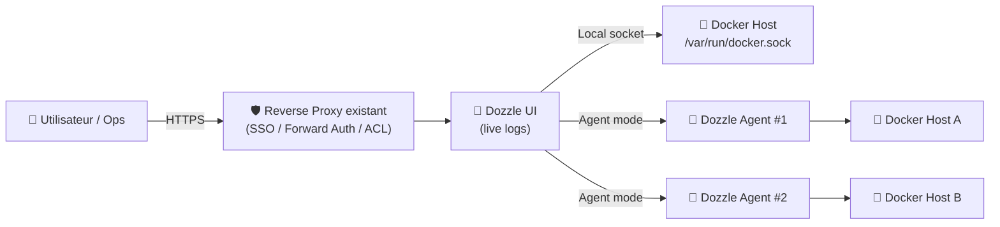
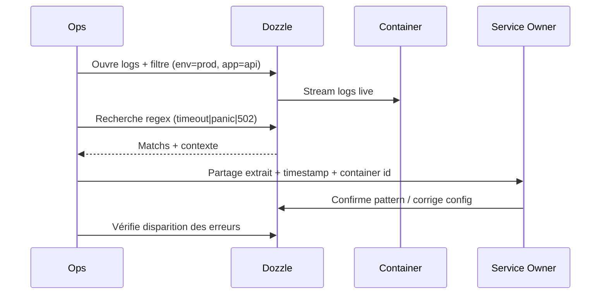

# 🐳 Dozzle — Présentation & Usage Premium (Logs Docker en temps réel)

### Observabilité “instantanée” pour containers : live logs, filtres, multi-host, auth
Optimisé pour reverse proxy existant • Multi-tenant possible • Agent mode • Exploitation durable

---

## TL;DR

- **Dozzle** est une **UI web ultra légère** pour **voir les logs Docker en temps réel** (sans stockage historique).
- Valeur : **débug rapide**, tri/filtre, recherche, split view, stats, multi-host via **agent mode**.
- En “premium ops” : **auth**, **scopes d’accès**, **labels**, **multi-host**, **procédures de validation** + **rollback**.

Sources “produit” : site officiel & repo. :contentReference[oaicite:0]{index=0}

---

## ✅ Checklists

### Pré-usage (avant d’ouvrir Dozzle aux équipes)
- [ ] Définir qui doit voir quoi (tous containers vs périmètres par labels)
- [ ] Activer une stratégie d’auth (proxy headers/SSO ou auth Dozzle)
- [ ] Décider mono-host vs multi-host (agent mode)
- [ ] Valider règles de naming/labels (ex: `env=prod`, `team=core`, `app=api`)
- [ ] Définir une convention “incident” (quoi chercher / quoi capturer)

### Post-configuration (qualité opérationnelle)
- [ ] Un user non-admin ne voit que son périmètre (test réel)
- [ ] Les containers critiques sont retrouvables en 2 secondes (naming/labels OK)
- [ ] Un runbook “logs-first” existe (pattern d’erreurs, regex utiles)
- [ ] Procédure de rollback (désactivation auth/agent) documentée

---

> [!TIP]
> Dozzle est parfait pour “**je veux voir ce qui se passe maintenant**”.  
> Pour la recherche historique / corrélation long terme : ELK/Loki/Cloud logging.

> [!WARNING]
> Dozzle lit des logs potentiellement sensibles (tokens, emails, stack traces).  
> Traite-le comme un **outil d’accès privilégié**.

> [!DANGER]
> N’ouvre pas Dozzle sans contrôle d’accès. Si tu actives des restrictions par labels/utilisateurs, **teste-les** : une mauvaise config peut exposer plus que prévu.

---

# 1) Dozzle — Vision moderne

Dozzle n’est pas une “stack logging”.

C’est :
- 🔭 Un **viewer live** (temps réel)
- 🧠 Un **outil de tri** (fuzzy search, filtre, regex, etc.)
- 🧩 Un **hub de lecture** multi-containers (split view)
- 🌐 Un **multi-host** via agent(s)

Références features & concept : :contentReference[oaicite:1]{index=1}

---

# 2) Architecture globale



Agent mode & multi-agent : :contentReference[oaicite:2]{index=2}

---

# 3) “Premium config mindset” (5 piliers)

1. 🔐 **Contrôle d’accès** (SSO/proxy headers ou auth interne)
2. 🏷️ **Gouvernance par labels** (team/env/app)
3. 🧭 **Ergonomie de recherche** (naming, tags, patterns)
4. 🌐 **Multi-host propre** (agents, conventions)
5. 🧪 **Validation / rollback** (tests + retour arrière)

---

# 4) Auth & Contrôle d’accès (propre)

Dozzle supporte deux grandes approches :
- **Bring-your-own auth via proxy** : Dozzle lit certains headers d’auth fournis par ton reverse proxy/SSO
- **Auth Dozzle** (multi-user) selon la configuration choisie

Doc officielle auth : :contentReference[oaicite:3]{index=3}

## Gouvernance recommandée
- **Admins** : visibilité globale + troubleshooting
- **Teams** : visibilité restreinte (via labels / filtres / règles)
- **Read-only culture** : l’objectif = lecture, pas administration

> [!WARNING]
> Il existe des considérations sécurité autour des mécanismes de restrictions par labels dans certains contextes (advisories).  
> Garde Dozzle à jour et valide le périmètre réel côté UI. :contentReference[oaicite:4]{index=4}

---

# 5) Labels & “scoping” (ce qui rend Dozzle scalable)

## Convention labels (recommandée)
- `env=prod|staging|dev`
- `team=core|data|support`
- `app=api|worker|frontend`
- `tier=critical|standard`

Bénéfices :
- 🔎 Filtrage instantané par équipe/environnement
- 🧠 Recherche prévisible (tu sais quoi taper)
- 🧩 Base saine pour du multi-tenant

---

# 6) Base path & reverse proxy existant (sans recettes d’install)

Si tu exposes Dozzle derrière un **subpath** (ex: `/dozzle`), Dozzle peut changer sa base de montage via un **flag** ou env var (ex: `DOZZLE_BASE`). :contentReference[oaicite:5]{index=5}

> [!TIP]
> Deux styles d’exposition “propres” :
> - **Sous-domaine** (souvent le plus simple)
> - **Subpath** (possible, mais nécessite base path correct)

---

# 7) Multi-host (Agent mode) — quand tu as plusieurs serveurs

## Quand l’utiliser
- plusieurs Docker hosts (VPS + NAS + nodes)
- besoin d’une UI unique
- segmentation par host + labels

Principe :
- Dozzle UI se connecte à un ou plusieurs **agents**
- tu peux aussi inclure le host local (si pertinent)

Doc agent : :contentReference[oaicite:6]{index=6}

---

# 8) Workflows premium (incident & debug)

## 8.1 “Incident triage” (séquence conseillée)


## 8.2 “Debug sans bruit”
- Filtrer par `env=prod` + `tier=critical`
- Pin 2 panneaux : `api` + `db` (split view)
- Rechercher :
  - `error|exception|panic|fatal`
  - `timeout|context deadline|connection refused`
  - `429|rate limit|quota`
  - `OOM|killed|out of memory`

---

# 9) Validation / Tests / Rollback

## Tests de validation (smoke tests)
```bash
# 1) Dozzle répond (depuis le réseau interne)
curl -I http://DOZZLE_HOST:PORT | head

# 2) Vérifier que la page charge (si tu as une URL)
curl -s https://dozzle.example.tld | head -n 5

# 3) Vérifier qu'un container "critique" apparaît via filtre (test fonctionnel UI)
# (manuel) Filtre env=prod + app=api → doit apparaître
```

## Tests de sécurité (must-have)
- utilisateur “Team A” :
  - ✅ voit `team=a`
  - ❌ ne voit pas `team=b`
- vérifie que les logs sensibles ne sont pas accessibles sans auth

## Rollback (simple et rapide)
- Revenir à une config “safe” :
  - désactiver base path custom
  - retirer agents externes temporaires
  - repasser en accès strict (VPN/SSO only)
- Documenter le “plan de retour” (5 minutes max)

---

# 10) Limitations (à connaître pour éviter de mauvaises attentes)

- Dozzle ne stocke pas les logs : **pas de recherche historique fiable**
- Pour l’historique/alerting/corrélation :
  - Loki/Promtail, ELK, OpenSearch, solutions cloud

Positionnement “live viewer” : :contentReference[oaicite:7]{index=7}

---

# 11) Sources — Images Docker (ce que tu demandais)

## Image officielle Dozzle
- Docker Hub : `amir20/dozzle` :contentReference[oaicite:8]{index=8}
- Documentation “Getting Started” (mention GHCR possible) : :contentReference[oaicite:9]{index=9}
- Repo GitHub (référence upstream) : :contentReference[oaicite:10]{index=10}

## LinuxServer.io (LSIO)
- À date, **pas d’image Dozzle officielle LSIO** dans la documentation LSIO (Dozzle n’apparaît pas comme image dédiée ; LSIO fournit surtout une collection d’images standardisées pour d’autres apps). :contentReference[oaicite:11]{index=11}

---

# ✅ Conclusion

Dozzle = **le meilleur “radar temps réel”** pour tes containers quand :
- tu veux diagnostiquer vite,
- tu veux une UI simple,
- et tu acceptes que ce n’est pas un système de logs historique.

Version “premium” = **auth + périmètres + labels + multi-host + tests + rollback**.