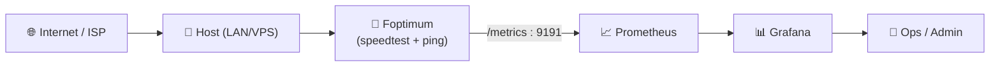
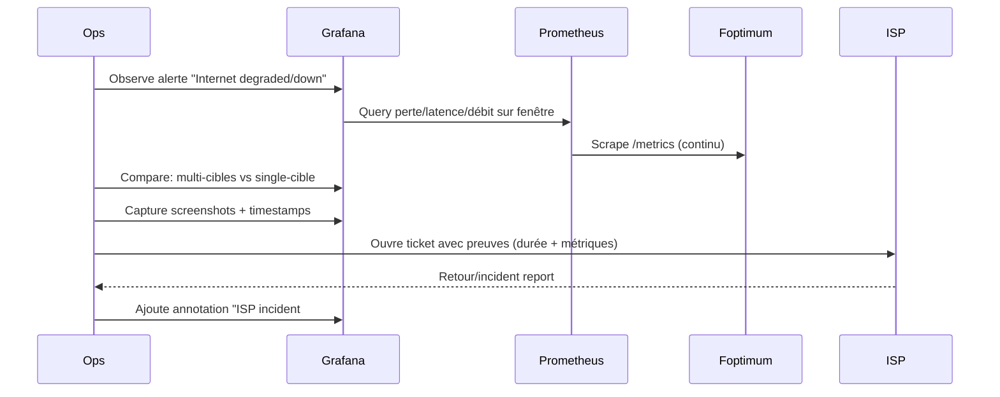

# 📡 Foptimum — Présentation & Exploitation Premium (Monitoring Internet + Prometheus)

### Surveille débit + latence/uptime pour “tenir ton ISP accountable”
Observabilité Prometheus-native • Dashboard Grafana prêt • Incidents & preuves • Exploitation durable

---

## TL;DR

- **Foptimum** mesure périodiquement :
  - un **speedtest** (débit/latence selon l’outil interne)
  - des **pings** vers une liste d’IP (uptime/latence)
- Il **exporte des métriques Prometheus** (port **9191**) pour afficher dans **Grafana**. :contentReference[oaicite:0]{index=0}
- La config “premium” = **intervalles raisonnables**, **liste de cibles bien choisie**, **dashboards**, **runbook d’incident**, **validation & rollback**.

---

## ✅ Checklists

### Pré-usage (avant mise en prod)
- [ ] Définir l’objectif : “preuve ISP”, “diagnostic Wi-Fi”, “qualité WAN”, “SLA”
- [ ] Choisir des cibles ping **représentatives** (DNS publics + routeur + un endpoint proche)
- [ ] Fixer des intervalles **anti-rate-limit** (speedtest ≥ 30 min recommandé par l’auteur)
- [ ] Définir où vont les métriques (Prometheus) + qui les voit (Grafana/alerts)
- [ ] Prévoir une politique “données sensibles” (IP, horaires, corrélation usages)

### Post-configuration (qualité opérationnelle)
- [ ] Les métriques sont scrapées par Prometheus (targets UP)
- [ ] Le dashboard Grafana s’importe sans erreur
- [ ] Une coupure simulée se voit clairement (ping down / latence / débit)
- [ ] Runbook incident prêt (quoi vérifier, quoi capturer, quoi conclure)

---

> [!TIP]
> Pour “prouver” un problème ISP, ce qui compte c’est la **corrélation** : pings (perte/latence) + débit + timestamps + durée.

> [!WARNING]
> Le speedtest trop fréquent peut échouer (rate limiting). L’auteur recommande **30 min minimum**. :contentReference[oaicite:1]{index=1}

> [!DANGER]
> Ne confonds pas “Internet down” et “une cible down”. D’où l’intérêt d’une **liste multi-cibles** (ex: 1.1.1.1 + 8.8.8.8 + gateway). :contentReference[oaicite:2]{index=2}

---

# 1) Foptimum — Vision moderne

Foptimum n’est pas un simple speedtest.

C’est :
- 🧪 un **collecteur** (speed + ping)
- 📈 un **exporter Prometheus** (pour dashboards/alerting)
- 🧾 un **outil de preuve** (historique via TSDB Prometheus/Grafana)
- 🔍 un **diagnostic** (différencier “WAN down” vs “DNS down” vs “cible down”)

Description + Prometheus/Grafana : :contentReference[oaicite:3]{index=3}

---

# 2) Architecture globale (référence)



---

# 3) Philosophie premium (5 piliers)

1. ⏱️ **Intervalles intelligents** (fiables, non agressifs)
2. 🎯 **Cibles ping bien choisies** (multi-points, multi-fournisseurs)
3. 📈 **KPI clairs** (perte, latence, jitter si dispo, débit, disponibilité)
4. 🚨 **Alerting actionnable** (pannes réelles vs flapping)
5. 🧪 **Validation & rollback** (tests simples, retour arrière immédiat)

---

# 4) Paramètres de configuration (les 3 knobs essentiels)

Foptimum utilise des variables (conceptuellement) :
- `SPEEDTEST_INTERVAL` : fréquence speedtest (secondes)
- `PING_INTERVAL` : fréquence ping (secondes)
- `SERVER_LIST` : liste d’IP pingées (séparées par virgules)

Détails & exemples : :contentReference[oaicite:4]{index=4}

## Recommandations (pragmatiques)
- `SPEEDTEST_INTERVAL` : **1800–3600** (30–60 min) (stabilité > granularité)
- `PING_INTERVAL` : **10–30** (détecte rapidement sans bruit excessif)
- `SERVER_LIST` : **3 à 6** cibles max (sinon bruit + interprétation difficile)

> [!TIP]
> Mix conseillé :
> - 1 DNS public (1.1.1.1)
> - 1 DNS public (8.8.8.8)
> - 1 cible “proche” (gateway/box si pertinent)
> - 1 cible “réseau opérateur” (si tu as une IP stable côté ISP)
> - 1 endpoint de prod (si tu veux corréler impact service)

---

# 5) Observabilité (Prometheus + Grafana)

## 5.1 Scrape Prometheus (exemple propre)
> Le service d’export est exposé sur **9191** côté container/instance. :contentReference[oaicite:5]{index=5}

```yaml
# prometheus.yml (extrait)
scrape_configs:
  - job_name: "foptimum"
    static_configs:
      - targets: ["foptimum:9191"]
```

## 5.2 Dashboard Grafana
Un dashboard “starter” est fourni dans le repo (fichier `Grafana_Dashboard.json`). :contentReference[oaicite:6]{index=6}

Workflow premium :
- Import du JSON
- Ajuster variables (job/instance)
- Ajouter annotations “incident ISP” (tickets, appels, interventions)

---

# 6) KPIs & Lecture “ISP proof” (comment interpréter)

## Signaux forts
- **Ping down** simultané sur plusieurs cibles + **speedtest KO** → panne WAN probable
- **Ping OK** mais **débit chute** sur plusieurs runs → congestion / shaping / Wi-Fi saturé
- **Une seule cible down** mais autres OK → cible problématique (pas ton Internet)

## Graphes “qui racontent une histoire”
- Disponibilité (ping success rate)
- Latence (p50/p95 si possible)
- Débit down/up (tendance + creux)
- “Outage windows” (durée des périodes de perte)

> [!WARNING]
> Si ton host est en Wi-Fi, tu mesures autant le Wi-Fi que l’ISP. Pour un diagnostic ISP, mesure idéalement depuis une machine **en Ethernet**.

---

# 7) Workflows premium (incident & diagnostic)



---

# 8) Validation / Tests / Rollback

## Tests de validation (simples et efficaces)
```bash
# Vérifier que la cible Prometheus est UP (exemples)
# - via UI Prometheus : Status -> Targets (manuel)
# - via curl du endpoint metrics (si accessible)
curl -s http://FOPTIMUM_HOST:9191/metrics | head -n 20
```

### Test “réalité terrain”
- Débrancher le WAN 60 secondes (si possible) :
  - vérifier ping down multi-cibles
  - vérifier retour à la normale (pas de “stuck state”)
- Lancer un download lourd :
  - vérifier dégradation débit/latence (bufferbloat visible)

## Rollback (opérationnel)
- Revenir à des valeurs “safe” :
  - augmenter `SPEEDTEST_INTERVAL`
  - réduire `SERVER_LIST` aux cibles les plus fiables
  - désactiver un module en mettant son intervalle à `0` (ping ou speedtest) :contentReference[oaicite:7]{index=7}
- Re-importer un dashboard propre (si modifications hasardeuses)

---

# 9) Erreurs fréquentes (et correctifs)

- ❌ **Speedtest échoue régulièrement**
  - ✅ Augmenter intervalle (≥ 30 min), vérifier rate limiting :contentReference[oaicite:8]{index=8}
- ❌ **“Internet down” alors qu’un service marche**
  - ✅ Trop peu de cibles / cible unique fragile → ajouter 2e/3e cibles
- ❌ **Aucune métrique dans Grafana**
  - ✅ Vérifier target Prometheus UP + port 9191 + labels/job :contentReference[oaicite:9]{index=9}

---

# 10) Sources (URLs en bash, comme demandé)

```bash
# Projet (README + dashboard + variables + port)
https://github.com/kennethprose/Foptimum

# Image Docker référencée par le projet
https://hub.docker.com/r/roseatoni/foptimum

# Prometheus (référence exporter/metrics)
https://prometheus.io/

# Grafana (visualisation)
https://grafana.com/

# LinuxServer.io — catalogue d’images (référence pour vérifier existence d’une image LSIO)
https://www.linuxserver.io/our-images
```

## Notes “images Docker LinuxServer”
- Le projet Foptimum référence explicitement l’image **`roseatoni/foptimum`** sur Docker Hub. :contentReference[oaicite:10]{index=10}
- Je n’ai pas trouvé d’image **LinuxServer.io** dédiée à Foptimum dans leur liste publique d’images. :contentReference[oaicite:11]{index=11}

---