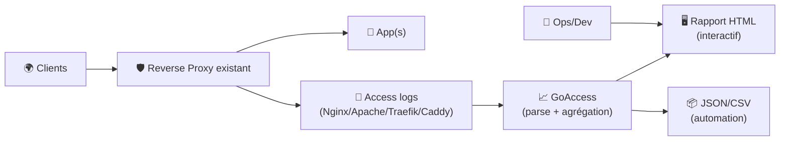
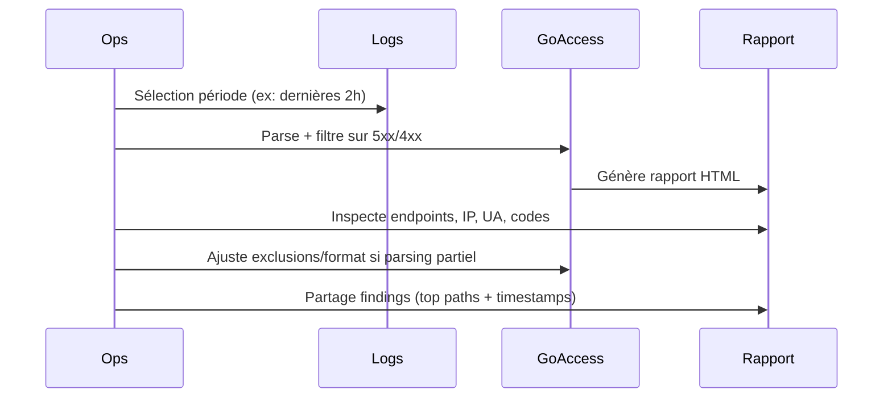

# 📈 GoAccess — Présentation & Exploitation Premium (Analyse de logs web)

### Analytics “temps réel / offline” depuis tes logs (Nginx/Apache/Caddy/Traefik…), sans SaaS
Optimisé pour reverse proxy existant • Tableaux HTML interactifs • JSON/CSV export • Workflow incident-friendly

---

## TL;DR

- **GoAccess** transforme tes **logs d’accès** en dashboard lisible (HTML) ou en exports (JSON/CSV).
- Deux modes :
  - **Offline** : tu génères un rapport HTML à partir d’un fichier de log.
  - **Temps réel** : tu “stream” un fichier qui s’écrit (tail) pour voir l’activité live.
- Une config premium = **log format maîtrisé**, **filtrage bot**, **géoloc**, **métriques pertinentes**, **validation & rollback**, **exports**.

---

## ✅ Checklists

### Pré-configuration (qualité des données)
- [ ] Tu sais quel fichier log analyser (vhost/service)
- [ ] Ton **log format** est identifié (Nginx/Apache/Traefik/Caddy…)
- [ ] L’horodatage + timezone sont cohérents
- [ ] Les IP clients sont correctes (reverse proxy = headers XFF à gérer)
- [ ] Tu as décidé si tu veux GeoIP (optionnel)
- [ ] Tu sais si tu veux exclure des paths (ex: `/health`, `/metrics`) et/ou des bots

### Post-configuration (exploitation)
- [ ] Rapport HTML généré sans erreurs de parsing
- [ ] Les “Top endpoints” ressemblent à la réalité (pas 80% `/health`)
- [ ] Les codes HTTP et latences sont cohérents
- [ ] Tu as une commande “rapport daily” reproductible
- [ ] Tu as un mode “incident” (filtre sur 5xx/4xx, ou période)

---

> [!TIP]
> GoAccess est excellent pour répondre vite à :  
> “Qui tape mon site ? Quoi ? Quand ? Quel endpoint casse ? Quel user-agent spam ?”

> [!WARNING]
> La qualité des insights dépend à 90% du **format de log** (et de l’IP réelle client derrière proxy).

> [!DANGER]
> Ne publie pas un rapport HTML en public si ton log contient des données sensibles (IP, query strings, tokens).  
> Privilégie un accès restreint et/ou anonymise.

---

# 1) GoAccess — Vision moderne

GoAccess n’est pas une “stack observability”.

C’est :
- 🧾 Un **parseur** de logs performant
- 📊 Un **dashboard** (HTML) immédiatement exploitable
- ⚡ Un outil **temps réel** (suivi live)
- 🧩 Un générateur d’exports (JSON/CSV) pour intégration

---

# 2) Architecture globale



---

# 3) Le cœur : Log format (ce qui fait tout)

## 3.1 Identifier le format
GoAccess doit connaître :
- `--log-format` (structure des champs)
- `--date-format` / `--time-format` (horodatage)

### Exemples “classiques” (à adapter)
- Nginx “combined” (souvent proche du standard web)
- Apache “combined”
- Traefik / Caddy : formats spécifiques (souvent JSON ou champs custom)

> [!TIP]
> Si tu as un reverse proxy, l’IP visible peut être celle du proxy.  
> Il faut que le log contienne la vraie IP (via `$http_x_forwarded_for` côté Nginx, ou équivalent) — sinon GoAccess analysera… ton proxy.

---

# 4) Config premium (goaccess.conf) : lisible & versionnable

## 4.1 Stratégie recommandée
- Un fichier `goaccess.conf` par “type de logs” (site public, API, admin…)
- Un dossier `filters/` (paths à exclure, user-agents à exclure)
- Une commande reproductible pour générer le rapport

### Exemples d’options utiles (conceptuellement)
- exclure `/health`, `/metrics`, `/favicon.ico`
- exclure bots connus (ou au minimum gros crawlers)
- activer GeoIP si tu as la DB (optionnel)
- définir le titre du rapport + fuseau

> [!WARNING]
> Ne sur-filtre pas au début : tu risques de masquer un vrai trafic (ou une attaque).  
> Commence par exclure seulement les endpoints “bruit” évidents.

---

# 5) Workflows premium (incident, capacity, produit)

## 5.1 Mode “incident” (se concentrer sur l’erreur)
Objectif : comprendre en 2 minutes :
- quels endpoints produisent le plus de 5xx/4xx
- depuis quelles IP / ASN (si tu ajoutes des enrichissements)
- quels user-agents
- sur quelle période



## 5.2 Mode “produit” (usage)
- Top pages / endpoints
- Origines (pays si GeoIP)
- Heures de pic
- Browsers / OS (si log contient UA)

## 5.3 Mode “sécurité légère”
- Top IPs
- Top 404 / 401 / 403
- User-agents suspects
- Paths de scan (`/.env`, `/wp-admin`, etc.)

---

# 6) Bonnes pratiques “premium” sur les logs

## 6.1 Normaliser
- Toujours loguer : méthode, path, status, bytes, referrer, user-agent, temps de réponse (si possible)
- Si API : inclure `request_time`/latency, upstream status, etc.

## 6.2 Minimiser le risque (privacy)
- Éviter de loguer des tokens dans query string
- Masquer/anonymiser si nécessaire (selon contexte légal/contrats)
- Restreindre l’accès aux rapports

---

# 7) Validation / Tests / Rollback

## 7.1 Validation (parsing)
- Test rapide sur un petit échantillon de lignes :
  - Pas d’erreurs de format
  - Date/heure correctes
  - Status codes plausibles
  - Endpoints cohérents

## 7.2 Tests fonctionnels “rapport”
- Générer un HTML
- Vérifier :
  - Top requests ≠ uniquement bruit
  - Répartition des status (2xx/3xx/4xx/5xx) réaliste
  - Période affichée correcte

## 7.3 Rollback (simple)
- Revenir à :
  - un `goaccess.conf` minimal (sans exclusions agressives)
  - un `--log-format` précédent si tu viens de changer tes logs
- Garder un historique des configs (git) :
  - `goaccess.conf` versionné
  - `filters/` versionné
  - commandes standardisées documentées

---

# 8) Commandes “premium” (exemples)

> Adapte les chemins et formats à ton environnement.

```bash
# Offline (rapport HTML)
goaccess /var/log/nginx/access.log \
  --log-format=COMBINED \
  --date-format=%d/%b/%Y \
  --time-format=%T \
  -o /var/www/reports/goaccess.html

# Temps réel (suivre un log qui s'écrit)
tail -F /var/log/nginx/access.log | goaccess \
  --log-format=COMBINED \
  --date-format=%d/%b/%Y \
  --time-format=%T \
  --real-time-html \
  -o /var/www/reports/goaccess-live.html

# Debug parsing (très utile)
goaccess /var/log/nginx/access.log \
  --log-format=COMBINED \
  --date-format=%d/%b/%Y \
  --time-format=%T \
  --debug-file=/tmp/goaccess-debug.log \
  -o /tmp/report.html
```

---

# 9) Erreurs fréquentes (et fixes)

- ❌ “Invalid date/time” / stats absurdes  
  ✅ Vérifier `--date-format` / `--time-format` et la locale (mois abrégés).

- ❌ IP = celle du proxy  
  ✅ Mettre la vraie IP dans le log (X-Forwarded-For) ou adapter le format.

- ❌ Rapport dominé par `/health`  
  ✅ Exclure paths bruités (mais seulement après validation).

- ❌ Trop de “Unknown” sur UA/referrer  
  ✅ Vérifier que le log contient bien ces champs (ou ajuster format).

---

# 10) Sources (adresses en bash)

```bash
# Site officiel
echo "https://goaccess.io/"

# Documentation officielle
echo "https://goaccess.io/man"

# Repository (code + issues + releases)
echo "https://github.com/allinurl/goaccess"

# Exemples / guide HTML report
echo "https://goaccess.io/get-started"

# Référence Apache LogFormat (utile pour adapter le parsing)
echo "https://httpd.apache.org/docs/current/mod/mod_log_config.html"

# Référence Nginx log_format (utile pour définir un format stable)
echo "https://nginx.org/en/docs/http/ngx_http_log_module.html"

# Image Docker la plus courante (si tu dois juste vérifier la source)
# (note: ce n'est pas une recommandation d'installation, juste la source)
echo "https://hub.docker.com/r/allinurl/goaccess"
```