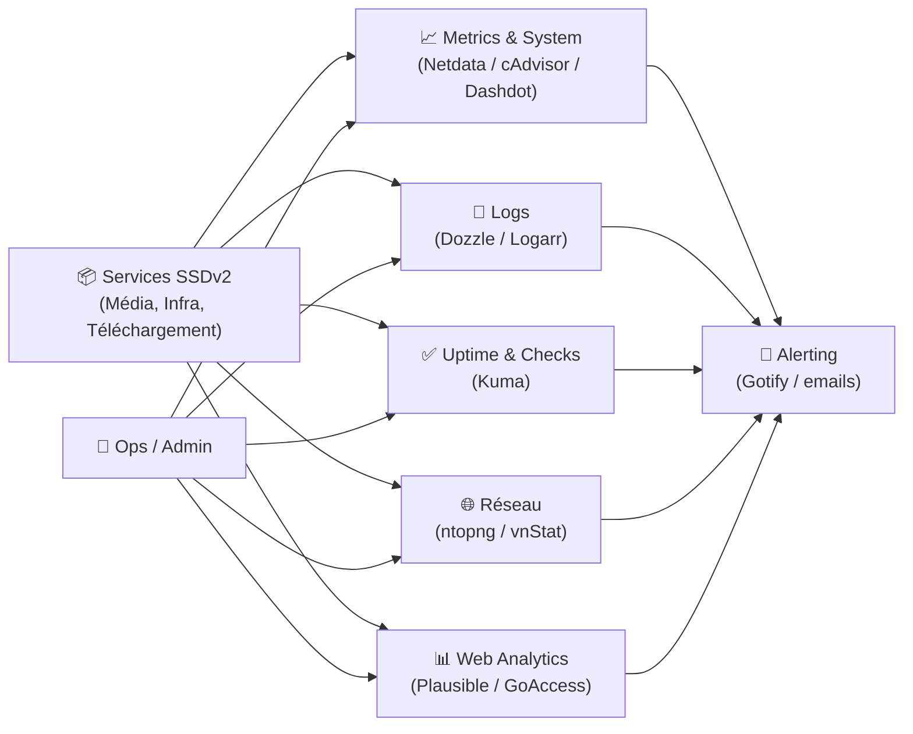

# 📊 Applications Monitoring

> Cette catégorie regroupe l’ensemble des applications dédiées à la supervision, l’observabilité et la mesure de ton environnement SSDv2 : disponibilité, performance, logs, réseau, métriques, analytics et alerting.

---

## 🧠 Objectif

Les applications Monitoring permettent :

- ✅ La surveillance de la disponibilité (uptime, checks HTTP/TCP)
- 📈 Le suivi des performances (CPU, RAM, disque, I/O, conteneurs)
- 🧾 La consultation des logs (debug temps réel, diagnostic rapide)
- 🌐 La visibilité réseau (trafic, latence, interfaces, top talkers)
- 📊 Les métriques & tableaux de bord (synthèse exploitable)
- 🔔 L’alerte proactive (avant que ça casse, ou dès que ça casse)

L’idée : **voir tôt**, **comprendre vite**, **agir proprement**.

---

## 🏗 Architecture Type

---

## 📦 Applications Disponibles

### ✅ Kuma (Uptime Kuma)
Surveillance de disponibilité : checks HTTP/TCP/ping, statuts, historiques, notifications.

### 🧾 Dozzle
Vue live des logs Docker en temps réel (diagnostic rapide, filtres, multi-containers).

### 📈 Netdata
Observabilité système complète : métriques, dashboards, alertes, visibilité host + services.

### 🧩 cAdvisor
Métriques conteneurs : CPU/RAM/IO par container (souvent utilisé avec des dashboards).

### 🧮 Dashdot
Vue “health” simple et visuelle : ressources système, disques, état global.

### 🌐 ntopng
Analyse réseau avancée : trafic, protocoles, top talkers, visibilité L7 selon config.

### 📶 vnStat
Mesure simple de trafic réseau : compteurs interfaces, historique, lightweight.

### 🔎 GoAccess
Analyse temps réel / post-mortem des logs web (NGINX/Apache), dashboards utiles.

### 📊 Plausible
Analytics web self-hosted : privacy-friendly, stats claires, alternative à GA.

### 🧪 ChangeDetection
Surveillance de changements sur pages web : détection, notifications, tracking.

### 🧪 Scrutiny
Surveillance disques (SMART) + tableaux de bord : détection précoce des problèmes.

### ⚡ Librespeed / Speedtest / Speedtest Tracker
Mesure du débit : tests ponctuels ou planifiés, historique, comparaisons.

### 📌 Statping
Statut page + monitoring : pages d’état, checks, alerting (selon usage).

### 🧠 Logarr
Outil orienté logs/observabilité dans certains stacks : centralisation légère et lecture (selon config).

### 🧩 Autres (selon ton stack)
Foptimum, Jfago, MediaFlowProxy (souvent utile pour debug/flux), Watchtower (suivi updates)…

> [!TIP]
> Un monitoring “premium” ne veut pas dire “10 outils”.  
> Ça veut dire : **1 outil uptime + 1 outil logs + 1 outil métriques + alerting fiable**.

---

## 🔗 Intégration

Ces applications s’intègrent avec :

- 📦 Infrastructure : toutes les apps (cibles des checks)
- 🎬 Média / 📥 Téléchargement : supervision des pipelines (queues, erreurs, latences)
- 🌐 Reverse Proxy : source de logs (GoAccess), status checks, latence
- 🔐 Sécurité : détection comportements anormaux, corrélation incidents
- 🔔 Notifications : Gotify/email pour alertes (downtime, disque, erreurs)

---

# 🎯 Résumé

La catégorie Monitoring est le **système nerveux** de SSDv2.

Elle assure :
- la visibilité (métriques, logs, réseau),
- la détection (uptime, alertes),
- et l’accélération du dépannage (diagnostic rapide).

Bien structurée, elle te donne une exploitation **proactive, stable et maîtrisée**.