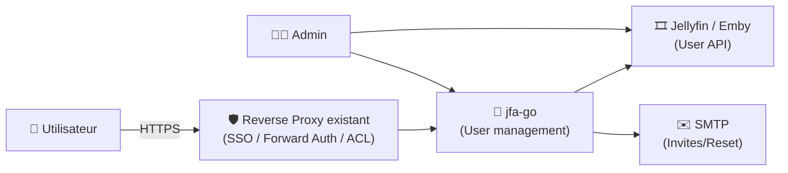

# 👥 jfa-go — Présentation & Configuration Premium (Jellyfin / Emby User Management)

### Invitations, self-service, templates utilisateur, reset password, quotas & règles — le tout avec une gouvernance propre
Optimisé pour reverse proxy existant • Sécurité d’accès • Exploitation durable • Workflows “ops-ready”

---

## TL;DR

- **jfa-go** ajoute une couche **user-management** à Jellyfin (et Emby en support secondaire) : **invitations**, **création de comptes**, **reset**, **templates**, **règles**, etc.
- Objectif : arrêter de “créer les comptes à la main”, tout en gardant contrôle et traçabilité.
- Une config premium = **flows d’invitation clairs**, **templates**, **SMTP**, **règles d’accès**, **base path/proxy correct**, **validation + rollback**.

---

## ✅ Checklists

### Pré-configuration (avant d’ouvrir aux utilisateurs)
- [ ] Définir le parcours : invite → inscription → règles → expiration
- [ ] Définir les rôles : admin jfa-go vs admin Jellyfin
- [ ] Décider : sous-domaine dédié vs subpath
- [ ] Préparer SMTP (recommandé) ou méthode alternative d’envoi d’invites
- [ ] Définir une “template user” (profil modèle) côté Jellyfin
- [ ] Définir les garde-fous : durée d’invite, quotas, restrictions, auto-join

### Post-configuration (go-live)
- [ ] Test complet : invitation → création → login Jellyfin → reset
- [ ] Vérifier URLs (externes) + base path (si subfolder)
- [ ] Vérifier que les emails sortent (SPF/DKIM si domaine)
- [ ] Vérifier logs : pas de boucle erreurs, pas de timeouts
- [ ] Documenter le runbook “invites” (support)

---

> [!TIP]
> La meilleure approche : **un template user Jellyfin** (profil/paramètres) + jfa-go qui clone ce modèle à chaque nouvel utilisateur.

> [!WARNING]
> Le point #1 qui casse tout : **URL externe / subfolder mal réglés** → assets cassés, redirections bizarres, setup bloqué.

> [!DANGER]
> jfa-go gère des actions sensibles (création/gestion comptes). Ne l’expose pas sans contrôle d’accès (SSO/forward-auth/VPN) et sans limiter les droits.

---

# 1) Vision moderne

jfa-go n’est pas un simple “invite tool”.

C’est :
- ✉️ **Invitations** (lien + expiration + contrôles)
- 🔁 **Self-service** (reset, actions utilisateur, onboarding)
- 🧩 **Templates** (hériter d’un utilisateur modèle Jellyfin)
- 🧠 **Règles & garde-fous** (quotas, limites, policies)
- 🔐 **Gouvernance** (qui peut inviter / qui peut administrer)

---

# 2) Architecture globale



---

# 3) Philosophie Premium (5 piliers)

1. 🧭 **URLs & Proxy corrects** (subdomain vs subpath + base)
2. ✉️ **Parcours d’invitation** (simple, fiable, traçable)
3. 🧩 **Templates** (homogénéité des comptes)
4. 🛡️ **Sécurité d’accès** (auth, restrictions, moindre privilège)
5. 🧪 **Validation & Rollback** (tests récurrents)

---

# 4) Parcours d’invitation (design “pro”)

## Parcours recommandé
1. Admin crée une invitation (durée courte, ex: 24–72h)
2. L’utilisateur reçoit un email (ou lien) et s’inscrit
3. jfa-go crée le compte Jellyfin via API
4. L’utilisateur se connecte à Jellyfin
5. (Option) l’utilisateur peut initier un reset de mot de passe via jfa-go

## Bonnes pratiques
- Durée d’invite courte + renouvellement facile
- Limiter le nombre d’invites actives si nécessaire
- Conserver un “runbook support” :
  - invite expirée
  - email non reçu
  - lien invalide
  - utilisateur déjà existant

---

# 5) Templates utilisateur (le “game changer”)

## Principe
- Tu crées **un utilisateur modèle** dans Jellyfin (ex: `template_default`)
- Tu règles :
  - langue / sous-titres / audio
  - limitations
  - préférences
  - (selon tes choix) bibliothèques visibles, etc.
- jfa-go copie ce template au moment de la création de compte

## Pourquoi c’est critique
- ✅ Onboarding cohérent
- ✅ Moins de support (“pourquoi j’ai pas les bons réglages ?”)
- ✅ Paramètres stables même si plusieurs admins invitent

> [!TIP]
> Définis 2–3 templates max (ex: `template_family`, `template_friends`, `template_power`) plutôt que 15.

---

# 6) URLs, subdomain vs subpath (sans recette proxy)

## Sous-domaine (recommandé)
- Simple, propre, peu de pièges
- Exemple : `accounts.exemple.tld`

## Subpath (possible, plus fragile)
- Exemple : `exemple.tld/accounts`
- Nécessite de régler le **subfolder** / **URL base** côté jfa-go

Règle d’or :
- La config jfa-go doit refléter **exactement** l’URL publique (schéma + host + path)

> [!WARNING]
> En subpath, certaines confs proxy peuvent injecter des headers (CSP) qui cassent le rendu. Vérifie l’UI après changement.

---

# 7) SMTP & délivrabilité (pour une expérience “clean”)

## Pourquoi SMTP est quasi indispensable
- Invitations fiables
- Reset password fluide
- Traçabilité et support (“renvoyer l’invite”)

## Checklist SMTP
- [ ] From: domaine contrôlé
- [ ] SPF/DKIM/DMARC (si domaine)
- [ ] Test envoi + réception (Gmail/Outlook)
- [ ] Pas de pièces jointes, liens courts, objet clair

> [!TIP]
> Même avec un SMTP basique, tu gagnes énormément en support utilisateur.

---

# 8) Sécurité & gouvernance (sans firewalling)

## Accès
- Idéal : via reverse proxy existant avec **SSO/forward-auth**
- Alternative : accès via VPN
- Évite l’accès public “anonyme” même en HTTPS

## Moindre privilège
- Admin jfa-go ≠ admin Jellyfin : garde les rôles séparés
- Limite qui peut :
  - créer des invitations
  - modifier templates
  - accéder aux journaux

## Hygiène
- Mettre à jour régulièrement
- Surveiller annonces sécurité / advisories
- Vérifier régulièrement que les URLs et le subpath n’ont pas dérivé

---

# 9) Workflows premium (Ops & Support)

## Support “invite non reçue”
- Vérifier l’adresse
- Vérifier le journal SMTP (ou logs jfa-go)
- Renvoyer une invite avec durée courte
- Conseiller check spam + “safe sender”

## Support “lien ouvre une page cassée”
- Vérifier URL externe jfa-go
- Vérifier subfolder/base (si subpath)
- Vérifier si un header proxy (CSP) casse les assets
- Tester navigation “incognito”

---

# 10) Validation / Tests / Rollback

## Tests de validation (smoke)
```bash
# 1) Endpoint répond (interne)
curl -I http://JFAGO_HOST:PORT | head

# 2) Endpoint répond (externe via proxy)
curl -I https://accounts.example.tld | head

# 3) (Manuel) Parcours complet :
# - créer une invite
# - recevoir l’email
# - créer compte
# - login Jellyfin
# - reset password
```

## Rollback (principe)
- Revenir à la config précédente (URLs / subfolder / templates)
- Désactiver temporairement les invitations (si incident)
- Revenir à un tag de version connu (si tu pin la version d’image)
- Restaurer backup de config si nécessaire

> [!TIP]
> Le rollback le plus efficace en incident : **désactiver les invites** + repasser en mode admin-only le temps de corriger.

---

# 11) Erreurs fréquentes (et fixes rapides)

- ❌ **URLs incorrectes** → corriger URL externe + subfolder
- ❌ **Subpath mal géré** → vérifier base path côté jfa-go + proxy
- ❌ **SMTP muet** → vérifier creds + from + logs + DNS (SPF/DKIM)
- ❌ **Template incohérent** → figer 1 template stable, documenter
- ❌ **Trop de permissions** → réduire rôles, limiter qui invite

---

# 12) Sources (adresses en bash)

```bash
# Docs / Repo
https://github.com/hrfee/jfa-go
https://wiki.jfa-go.com/
https://wiki.jfa-go.com/docs/reverse-proxy/
https://wiki.jfa-go.com/docs/faq/

# Image Docker officielle (upstream)
https://hub.docker.com/r/hrfee/jfa-go
https://hub.docker.com/r/hrfee/jfa-go/tags

# LinuxServer.io (pas d’image jfa-go dédiée, mais conf reverse proxy existante)
https://www.linuxserver.io/our-images
https://github.com/linuxserver/reverse-proxy-confs/blob/master/jfa-go.subdomain.conf.sample
```