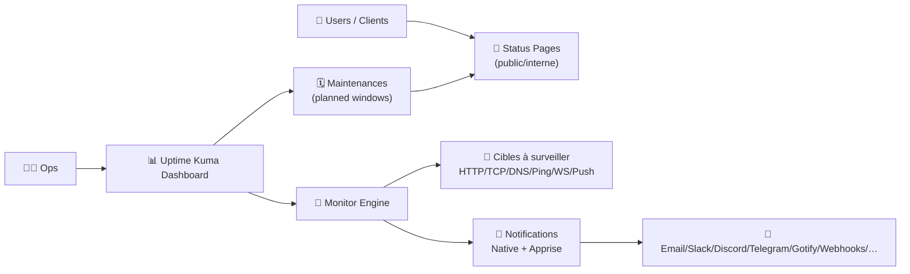
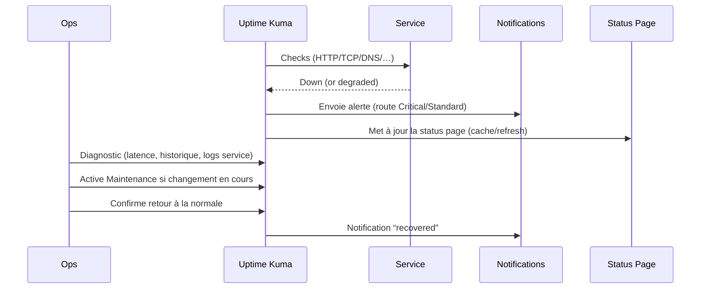

# 🐻 Uptime Kuma — Présentation & Configuration Premium (Sans install / Sans Docker / Sans Nginx / Sans UFW)

### Supervision “uptime + latence” simple, moderne, et très efficace
Optimisé pour reverse proxy existant • Notifications riches (Apprise) • Status pages • Maintenance windows • Exploitation durable

---

## TL;DR

- **Uptime Kuma** = monitoring “synthetic” **depuis** ton serveur : HTTP(S), TCP, Ping, DNS, Keyword, JSON Query, WebSocket, Push, etc. :contentReference[oaicite:0]{index=0}  
- Il excelle pour : **détection rapide**, **notifications multi-canaux**, **status pages** publiques et **maintenance planifiée**. :contentReference[oaicite:1]{index=1}  
- “Premium” = conventions (naming/labels), templates de monitors, alerting propre (route + anti-bruit), pages statut maîtrisées, validation + rollback.

---

## ✅ Checklists

### Pré-configuration (avant de créer 50 monitors)
- [ ] Définir une convention de noms (service/env/critique)
- [ ] Choisir les types de checks (HTTP vs TCP vs DNS vs Push)
- [ ] Définir une stratégie d’alerting (qui reçoit quoi, quand)
- [ ] Préparer une page statut (public vs interne) + groupes
- [ ] Prévoir les maintenances récurrentes (cron / intervalle / fenêtre unique)

### Post-configuration (qualité opérationnelle)
- [ ] Un incident “test” déclenche une alerte (et seulement une)
- [ ] Un faux positif (maintenance) ne spamme pas
- [ ] Les status pages affichent exactement ce que tu veux (cache/refresh compris)
- [ ] Un runbook “diagnostic” existe (que regarder, dans quel ordre)
- [ ] Plan de rollback documenté (désactiver règles, revert config)

---

> [!TIP]
> Uptime Kuma n’est pas un APM. C’est un **radar de disponibilité** (et un peu de perf via latence). Parfait en complément de logs/metrics.

> [!WARNING]
> Les notifications “trop bavardes” tuent l’outil. La config premium vise **signal > bruit** (routes, seuils, fenêtres, regroupements).

> [!DANGER]
> Une status page publique peut divulguer des infos (noms internes, endpoints, IP, topology). Publie **uniquement** ce qui est nécessaire.

---

# 1) Vision moderne

Uptime Kuma n’est pas juste “ping”.

C’est :
- 🧪 du **synthetic monitoring** multi-protocoles (HTTP/TCP/DNS/Ping/WebSocket/Keyword/JSON Query/Push…) :contentReference[oaicite:2]{index=2}  
- 🔔 un **hub de notifications** (natif + Apprise 78+ services) :contentReference[oaicite:3]{index=3}  
- 🌐 des **status pages** (multiples, domaines, cache/refresh) :contentReference[oaicite:4]{index=4}  
- 🗓️ de la **maintenance** (fenêtre unique, cron, récurrences) :contentReference[oaicite:5]{index=5}  

---

# 2) Architecture globale



---

# 3) Modèle de configuration premium (5 piliers)

1. 🧭 **Naming & organisation** (lisible + scalable)
2. 🧪 **Monitors “templates”** (cohérence)
3. 🔔 **Alerting propre** (routing + anti-bruit)
4. 📣 **Status pages maîtrisées** (public vs interne)
5. 🧪 **Validation / Tests / Rollback** (exploitation)

---

# 4) Monitors (choisir le bon type, au bon endroit)

## Types utiles (repères)
- **HTTP(S)** : disponibilité + code HTTP + latence
- **Keyword** : détecter une panne “fonctionnelle” (ex: page charge mais contenu KO)
- **JSON Query** : valider un champ (ex: `status=ok`, `version`, `queue_depth`)
- **TCP** : port ouvert (DB, MQ, SMTP)
- **DNS** : résolution correcte (A/AAAA/CNAME)
- **Ping** : reachability réseau (attention aux ICMP filtrés)
- **WebSocket** : services temps réel
- **Push** : jobs/cron (l’app “push” un heartbeat) :contentReference[oaicite:6]{index=6}  

> [!TIP]
> Pour une API : **HTTP + Keyword/JSON** donne un signal bien plus fiable qu’un simple 200.

---

# 5) Notifications (le cœur “ops”)

Uptime Kuma propose :
- des providers “natifs” (Telegram/Discord/Gotify/Slack/SMTP/Webhook/…)  
- et surtout **Apprise** (78+ services) :contentReference[oaicite:7]{index=7}  

## Stratégie premium (anti-bruit)
- **Routing par criticité** :
  - *Critical* → canal “on-call” (instant)
  - *Standard* → canal “ops” (regroupé)
  - *Dev/Staging* → canal “bruit contrôlé”
- **Seuils & retries** :
  - 1 échec = pas toujours une alerte
  - 2–3 échecs consécutifs = alerte (réduit faux positifs)
- **Fenêtres** :
  - utiliser la **Maintenance** pour supprimer le spam pendant les changements :contentReference[oaicite:8]{index=8}  

---

# 6) Status Pages (publication propre)

## Ce qu’il faut savoir (important)
- La status page est destinée au public, et **met en cache les résultats ~5 minutes** + refresh périodique. :contentReference[oaicite:9]{index=9}  
- Le slug `default` a un statut spécial pour compatibilité. :contentReference[oaicite:10]{index=10}  

## Design premium
- Une page **publique** : uniquement les services “externes” (web, api, auth, paiement…)
- Une page **interne** : inclure DB, MQ, backoffice, etc.
- Grouper par domaine :
  - “Front”
  - “API”
  - “Dependencies”
  - “Regions”

> [!WARNING]
> Le cache de la status page peut surprendre : incident vu “live” sur dashboard mais status page pas instantanée. C’est attendu. :contentReference[oaicite:11]{index=11}  

---

# 7) Maintenance (zéro spam pendant les changements)

Uptime Kuma permet d’afficher un message de maintenance en haut des status pages et propose plusieurs stratégies :
- activation manuelle
- fenêtre unique
- **cron expression**
- récurrence par intervalle / jour de semaine / jour du mois :contentReference[oaicite:12]{index=12}  

## Pattern premium
- Toujours créer une maintenance pour :
  - upgrades infra
  - migrations DB
  - changements DNS
  - maintenance reverse proxy

---

# 8) Workflow incident “premium”



---

# 9) Validation / Tests / Rollback

## Tests (avant go-live)
```bash
# Smoke test HTTP (exemple)
curl -I https://ton-service.example.tld | head

# Simuler une panne contrôlée :
# - couper temporairement l’upstream (ou un port)
# - vérifier: dashboard DOWN + notif + status page cohérente

# Vérifier qu'une maintenance stoppe le spam (test réel)
```

## Tests de cohérence (qualité)
- un service critique doit avoir :
  - monitor HTTP + (Keyword/JSON si possible)
  - notification route “Critical”
  - inclusion (ou non) claire dans la status page publique
  - runbook lié (lien dans la description)

## Rollback (simple)
- Désactiver une règle de notification trop bruyante
- Réduire la fréquence de check / augmenter retries
- Retirer un service de la status page publique
- Annuler une maintenance planifiée mal configurée

---

# 10) Sources — Images Docker (et sources officielles) en adresses “brutes”

```bash
# Uptime Kuma — sources officielles
https://github.com/louislam/uptime-kuma
https://github.com/louislam/uptime-kuma/wiki
https://uptime.kuma.pet/

# Docs officielles utiles (wiki)
https://github.com/louislam/uptime-kuma/wiki/Notification-Methods
https://github.com/louislam/uptime-kuma/wiki/Status-Page
https://github.com/louislam/uptime-kuma/wiki/Maintenance
https://github.com/louislam/uptime-kuma/wiki/Reverse-Proxy

# Image Docker officielle (upstream)
https://hub.docker.com/r/louislam/uptime-kuma
https://hub.docker.com/r/louislam/uptime-kuma/tags

# LinuxServer.io (LSIO) — état “image”
# À ce jour, il n’y a pas de page de doc LSIO "uptime-kuma" (image dédiée) dans leur catalogue de docs;
# on trouve surtout des discussions/mods autour de SWAG et "auto-uptime-kuma".
https://docs.linuxserver.io/images/
https://discourse.linuxserver.io/t/request-uptime-kuma/3129
https://github.com/linuxserver/docker-mods/issues/787
```

---

# ✅ Conclusion

Uptime Kuma devient “premium” quand tu l’utilises comme un produit :
- **monitors bien choisis** (pas juste ping),
- **notifications routées** (signal > bruit),
- **status pages propres** (cache/visibilité assumés),
- **maintenance planifiée** (zéro spam),
- **validation + rollback** documentés.