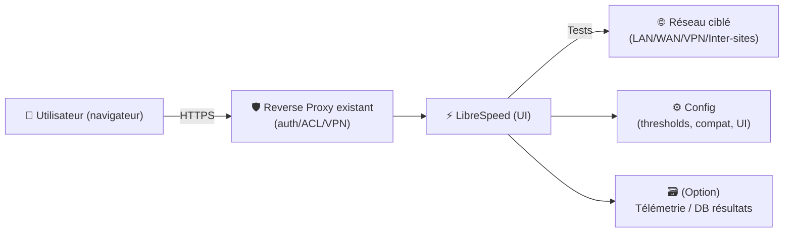
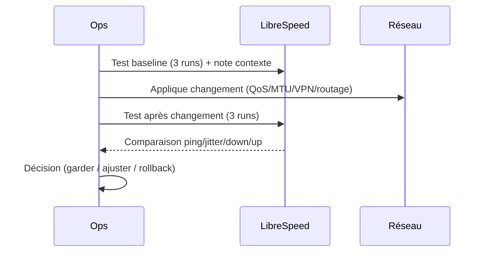

# ⚡ LibreSpeed — Présentation & Exploitation Premium (Speedtest auto-hébergeable)

### Test de débit self-hosted, léger, configurable, orienté “privacy”
Optimisé pour reverse proxy existant • Multi-serveurs possible • Télémetrie contrôlable • Exploitation durable

---

## TL;DR

- **LibreSpeed** est une page **HTML5** de speedtest auto-hébergeable (download/upload/ping/jitter) pensée pour rester **simple et légère**. :contentReference[oaicite:0]{index=0}
- Son vrai intérêt “pro” : **mesurer ton réseau** sans dépendre d’un service externe, et standardiser une méthode de test.
- En “premium ops” : **privacy**, **télémetrie maîtrisée**, **multi-serveurs**, **conventions de test**, **validation** et **rollback**.

---

## ✅ Checklists

### Pré-usage (avant de publier à des utilisateurs)
- [ ] Définir l’objectif : diagnostic LAN, WAN, inter-sites, VPN, Wi-Fi, etc.
- [ ] Choisir un mode : mono-serveur vs multi-serveurs (sélection de serveur)
- [ ] Décider politique **télémetrie** (désactivée / limitée / activée)
- [ ] Définir un protocole de test (3 runs, heures fixes, même device, etc.)
- [ ] Sécuriser l’accès via ton reverse proxy existant (auth/ACL/VPN si besoin)

### Post-configuration (qualité opérationnelle)
- [ ] Résultats cohérents sur 3 tests consécutifs
- [ ] Latence/jitter plausibles (pas de valeurs “folles”)
- [ ] Upload/download stables (pas d’écarts extrêmes sans raison)
- [ ] Politique privacy documentée (qui collecte quoi, où, combien de temps)
- [ ] Plan de rollback documenté (revenir à un réglage safe)

---

> [!TIP]
> LibreSpeed est idéal pour des **tests comparatifs** (avant/après changement réseau) : MTU, QoS, VLAN, nouveau routeur, tuning VPN, etc.

> [!WARNING]
> Les tests peuvent être **fortement influencés** par le Wi-Fi, le CPU du client, le navigateur, et la congestion. Standardise la méthode (même machine, câble, heures, 3 essais).

> [!DANGER]
> Si tu actives la collecte de résultats (télémetrie / DB), traite ça comme des **données potentiellement sensibles** (IP, timestamps, perf). Rédige une note privacy interne.

---

# 1) LibreSpeed — Vision moderne

LibreSpeed n’est pas un “service de speedtest cloud”.

C’est :
- 🧪 Un **outil de mesure** auto-hébergeable (HTML5 + XHR + Web Workers)
- 🧰 Un **outil de diagnostic** (ping/jitter/download/upload)
- 🧭 Un **outil de comparaison** (avant/après changements)
- 🏢 Un **outil interne** (LAN/VPN/inter-sites) plutôt qu’un benchmark Internet “grand public” :contentReference[oaicite:1]{index=1}

---

# 2) Architecture globale



---

# 3) Philosophie “Premium” (5 piliers)

1. 📏 **Mesure standardisée** (protocole de test, répétabilité)
2. 🧭 **Ciblage clair** (LAN vs WAN vs VPN, quel chemin réseau ?)
3. 🕵️ **Privacy maîtrisée** (télémetrie off par défaut / politique explicite)
4. 🧰 **Config & UI propres** (serveurs, sélection, branding interne)
5. 🧪 **Validation / Rollback** (tests, garde-fous, retour arrière)

---

# 4) Protocole de test (la partie qui fait “pro”)

## Recommandation de protocole (simple et robuste)
- Faire **3 tests** consécutifs
- Noter : date/heure, device, mode réseau (Ethernet/Wi-Fi), chemin (VPN oui/non)
- Utiliser **le même navigateur** et fermer les onglets lourds
- Pour Wi-Fi : noter distance/SSID/bande (2.4/5/6 GHz)

## Interprétation rapide
- **Ping** élevé mais débit bon → latence chemin (VPN, interco, bufferbloat)
- **Jitter** élevé → instabilité (Wi-Fi, congestion, QoS)
- **Upload** faible uniquement → saturation upstream/ISP/shape

> [!TIP]
> En interne, compare “LibreSpeed LAN” vs “LibreSpeed via VPN” : tu identifies vite le coût réel du tunnel.

---

# 5) Multi-serveurs (quand tu as plusieurs sites)

LibreSpeed peut être organisé pour proposer **plusieurs serveurs** (ex: Paris, Lyon, DC1, DC2) afin que l’utilisateur choisisse une cible et que tu mesures un chemin précis. :contentReference[oaicite:2]{index=2}

Cas d’usage :
- comparer inter-sites (MPLS/SD-WAN)
- mesurer l’impact d’un nouveau peering
- valider un changement de routage

---

# 6) Télémetrie / Résultats (privacy & sécurité)

Le serveur public LibreSpeed indique quand la **télémetrie est activée** (selon la configuration). :contentReference[oaicite:3]{index=3}

Bonnes pratiques :
- défaut recommandé : **pas de collecte** si inutile
- si collecte : définir
  - durée de rétention
  - accès (qui peut voir)
  - anonymisation (si applicable)
  - documentation privacy

> [!WARNING]
> Si tu utilises SQLite/DB, suis les recommandations du projet : des versions récentes ont inclus des correctifs liés à l’emplacement du fichier DB pour réduire les risques (ex. éviter webroot). :contentReference[oaicite:4]{index=4}

---

# 7) Workflows premium (incidents & changements)

## “Avant / Après” un changement réseau


## Modèle de page interne (RUN-)
- Objectif (LAN/WAN/VPN ?)
- Conditions (device, câble/Wi-Fi, navigateur)
- Résultats “baseline”
- Changement appliqué
- Résultats “after”
- Conclusion + next steps
- Rollback si dégradation

---

# 8) Validation / Tests / Rollback

## Smoke tests (rapides)
```bash
# 1) Page accessible (URL publique interne)
curl -I https://speed.example.tld | head

# 2) Test de latence basique (depuis un poste)
ping -c 10 speed.example.tld

# 3) Vérifier cohérence (manuel): 3 tests d'affilée, mêmes conditions
```

## Tests de non-régression (conseillés)
- 1 machine Ethernet (référence)
- 1 machine Wi-Fi (usage réel)
- 1 test via VPN (si concerné)
- écart acceptable défini (ex: +/-10% débit, jitter < X)

## Rollback (pratique)
- revenir à une config “safe” :
  - désactiver télémetrie si elle cause débat
  - revenir à une UI/serveur unique si multi-serveurs confus
  - restaurer ancienne config (versionnée) si bug ou perf bizarre

---

# 9) Erreurs fréquentes (et fixes)

- ❌ Débits incohérents → CPU client, Wi-Fi instable, onglets lourds  
  ✅ Tester en Ethernet, fermer apps, répéter 3 fois
- ❌ Jitter élevé → Wi-Fi congestion, bufferbloat, QoS absent  
  ✅ Tester filaire + analyser QoS
- ❌ Mesure “WAN” fausse → serveur LibreSpeed trop loin / chemin non maîtrisé  
  ✅ Héberger par site, ou choisir une cible précise

---

# 10) Sources — Images Docker (format demandé)

## 10.1 Image officielle / upstream (référence projet)
- `librespeed/speedtest` (Repo officiel) : https://github.com/librespeed/speedtest :contentReference[oaicite:5]{index=5}
- Doc Docker LibreSpeed (dans le repo) : https://github.com/librespeed/speedtest/blob/master/doc_docker.md :contentReference[oaicite:6]{index=6}

## 10.2 Image LinuxServer.io (si tu veux la version LSIO)
- `lscr.io/linuxserver/librespeed` (Doc LSIO) : https://docs.linuxserver.io/images/docker-librespeed/ :contentReference[oaicite:7]{index=7}
- `linuxserver/librespeed` (Docker Hub) : https://hub.docker.com/r/linuxserver/librespeed :contentReference[oaicite:8]{index=8}
- `linuxserver/docker-librespeed` (releases/notes LSIO) : https://github.com/linuxserver/docker-librespeed/releases :contentReference[oaicite:9]{index=9}

---

# ✅ Conclusion

LibreSpeed devient “premium” quand tu l’utilises comme **instrument** :
- protocole de test standard,
- cibles (sites) claires,
- privacy maîtrisée,
- et une vraie discipline de validation/rollback.

Ça transforme un simple speedtest en **outil d’exploitation réseau**.