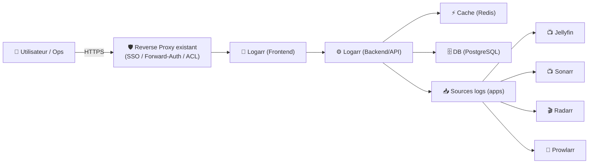
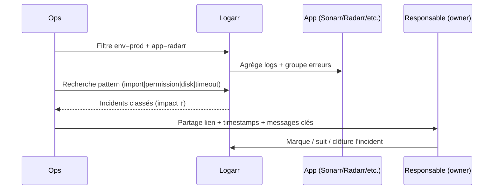

# 🧠 Logarr — Présentation & Exploitation Premium (Logs unifiés pour media stack)

### Centralisation intelligente des logs (Jellyfin / Sonarr / Radarr / Prowlarr) + détection d’incidents
Optimisé pour reverse proxy existant • Multi-host • Tri par impact • Exploitation durable

---

## TL;DR

- **Logarr** agrège les logs de ton stack media dans **un tableau de bord unique** et aide à **détecter / regrouper / prioriser** les erreurs.
- Intérêt “premium ops” : **réduction du MTTR** (tu vois vite *quoi casse* et *où ça cascade*).
- À bien cadrer : **périmètre d’accès**, **naming/labels**, **rétention** (Logarr ≠ SIEM), **procédure incident**.

---

## ✅ Checklists

### Pré-usage (avant d’ouvrir aux équipes)
- [ ] Définir le périmètre (quels services : Jellyfin/Sonarr/Radarr/Prowlarr/…)
- [ ] Définir l’objectif : debug temps réel vs analyse “dernières 24–72h”
- [ ] Normaliser **noms/labels** des containers (app/env/host/team)
- [ ] Définir une politique “secrets dans les logs” (redaction/discipline)
- [ ] Valider le modèle d’accès (SSO/proxy, ACL, réseau)

### Post-configuration (qualité opérationnelle)
- [ ] Un incident type est diagnostiqué en < 2 minutes (test réel)
- [ ] Les erreurs sont correctement regroupées (pas 200 doublons)
- [ ] Les faux positifs sont acceptables (sinon tuning)
- [ ] Un runbook “logs-first” existe (patterns + actions)
- [ ] Plan rollback documenté (désactiver intégration/collector/AI si activé)

---

> [!TIP]
> Le vrai “gain” Logarr = **corrélation** et **déduplication** : tu arrêtes de naviguer dans 4 UIs différentes.

> [!WARNING]
> Les logs contiennent souvent des données sensibles (tokens, URLs privées, mails, stack traces).  
> **Traite Logarr comme un outil privilégié**.

> [!DANGER]
> Sans contrôle d’accès solide, tu transformes tes logs en fuite de secrets.  
> Si tu actives du multi-tenant, **teste les scopes** avec un user non-admin.

---

# 1) Logarr — Vision moderne

Logarr n’est pas un simple “viewer” :

- 🧩 **Agrégateur** multi-apps (unifie la lecture)
- 🧠 **Détecteur** d’incidents (regroupe erreurs, dédoublonne, score/impact)
- 🧭 **Guide de résolution** (suivi d’issues jusqu’à fermeture)
- 🌐 **Multi-host** (si tu as plusieurs serveurs)

Objectif : quand une panne cascade (indexers → downloader → import → media server), tu vois la chaîne au même endroit.

Référence produit (concept + screenshots) :
- Repo Logarr (itz4blitz) : https://github.com/itz4blitz/Logarr

---

# 2) Architecture globale



---

# 3) Philosophie premium (5 piliers)

1. 🔐 **Accès & cloisonnement** (SSO/ACL/réseau)
2. 🏷️ **Conventions (labels/naming)** pour filtrer vite
3. 🧠 **Tuning détection** (déduplication, score, bruit acceptable)
4. 🔎 **Playbooks de recherche** (regex/patterns par app)
5. 🧪 **Validation + rollback** (tests réels, retour arrière immédiat)

---

# 4) Conventions “labels & naming” (ce qui fait la différence)

## Convention minimale recommandée
- `app=jellyfin|sonarr|radarr|prowlarr|qbittorrent|…`
- `env=prod|staging|dev`
- `host=nas|vps|node1|…`
- `team=media|infra|…` (si plusieurs personnes)

Bénéfices :
- 🔎 filtres instantanés
- 🧭 tri par environnement/host
- 🧠 diagnostic plus rapide (tu sais où regarder)

---

# 5) Workflows premium (incident & debug)

## 5.1 Triage incident (séquence)


## 5.2 Patterns utiles (par famille d’apps)
### *arr (Sonarr/Radarr/Prowlarr)
- `permission denied|access denied`
- `no such file|path does not exist`
- `database is locked|timeout|context deadline`
- `unable to connect|connection refused`
- `apikey|unauthorized|forbidden`

### Jellyfin
- `transcode|ffmpeg|decoder`
- `metadata|fetch|provider`
- `permission denied|I/O error`
- `playback failed`

> [!TIP]
> Garde une page “RUN-LOGS-TRIAGE” dans ta doc : patterns + action associée + lien vers la correction.

---

# 6) Qualité de signal (bruit vs incidents réels)

## Règles pratiques
- ✅ Regrouper par “signature” (message + stack trace tronquée)
- ✅ Déprioriser les warnings connus/inoffensifs (liste blanche)
- ✅ Marquer les incidents récurrents (ex: “quota provider subs”)
- ✅ Lier chaque incident à une action (fix / doc / monitoring)

> [!WARNING]
> Sans discipline, tu obtiens un “mur de logs” et l’équipe ignore l’outil.

---

# 7) Validation / Tests / Rollback

## Tests de validation (smoke)
```bash
# 1) UI répond
curl -I https://logarr.example.tld | head

# 2) Test fonctionnel (manuel)
# - appliquer un filtre app=sonarr
# - vérifier que des logs récents apparaissent
# - vérifier que les erreurs sont regroupées (pas 1 ligne = 1 incident)
```

## Tests de sécurité (must-have)
- user “read-only” :
  - ✅ accès UI
  - ✅ voit uniquement le périmètre attendu (env/team/host)
  - ❌ ne voit pas les autres environnements (si cloisonnement)

## Rollback (simple, sans douleur)
- Désactiver temporairement :
  - la collecte de certaines apps (source bruyante)
  - les agents multi-host
  - toute intégration “AI” si activée
- Revenir à un mode minimal : **lecture limitée** + **périmètre restreint**
- Documenter la procédure en 5 étapes max

---

# 8) Clarification importante — il existe “deux Logarr” (souvent confondu)

## Logarr (moderne, “media stack unified logging dashboard”)
- Projet : itz4blitz/Logarr
- Architecture typique : frontend + backend + DB + cache
- Cible : agrégation + incidents + suivi

## Logarr (legacy, PHP log viewer / consolidation tool)
- Projet : Monitorr/logarr
- Cible : consolidation/lecture de fichiers logs (plus ancien)

> [!TIP]
> Si ton besoin est *“unifier Jellyfin/Sonarr/Radarr/Prowlarr et scorer les erreurs”* → vise **itz4blitz/Logarr**.  
> Si ton besoin est *“afficher des fichiers logs sur une page”* → le **Monitorr/logarr** historique peut suffire, mais il est ancien.

---

# 9) Sources — Images Docker (format demandé)

## 9.1 Images officielles (Logarr moderne — itz4blitz)
- `ghcr.io/itz4blitz/logarr-backend` (GHCR) : https://github.com/itz4blitz/Logarr  
- `ghcr.io/itz4blitz/logarr-frontend` (GHCR) : https://github.com/itz4blitz/Logarr  
- `itz4blitz/logarr-backend` (Docker Hub) : https://github.com/itz4blitz/Logarr  
- `itz4blitz/logarr-frontend` (Docker Hub) : https://github.com/itz4blitz/Logarr  

> Note : le README indique explicitement les registries (GHCR + Docker Hub) et les noms d’images.

## 9.2 Image historique (Logarr legacy — Monitorr)
- `monitorr/logarr` (Docker Hub) : https://hub.docker.com/r/monitorr/logarr/  
- Repo “Logarr” (legacy) : https://github.com/Monitorr/logarr  

## 9.3 LinuxServer.io (LSIO)
- Image LSIO dédiée “Logarr” : **non référencée** dans le catalogue d’images LSIO : https://www.linuxserver.io/our-images  

---

# ✅ Conclusion

Logarr “premium”, c’est :
- un **hub unique** de logs,
- une **vision incidents** (dédup + score/impact),
- un outil qui marche vraiment quand tu poses :
  - des conventions (labels/naming),
  - une discipline de tri,
  - un contrôle d’accès strict,
  - et des tests/rollback simples.

Si tu me donnes ton stack exact (apps + multi-host ou non + besoin de cloisonnement), je peux te générer une section “Filtres & patterns par app” encore plus ciblée.