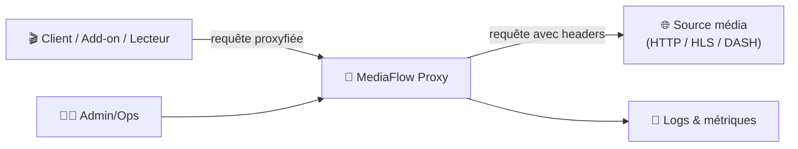
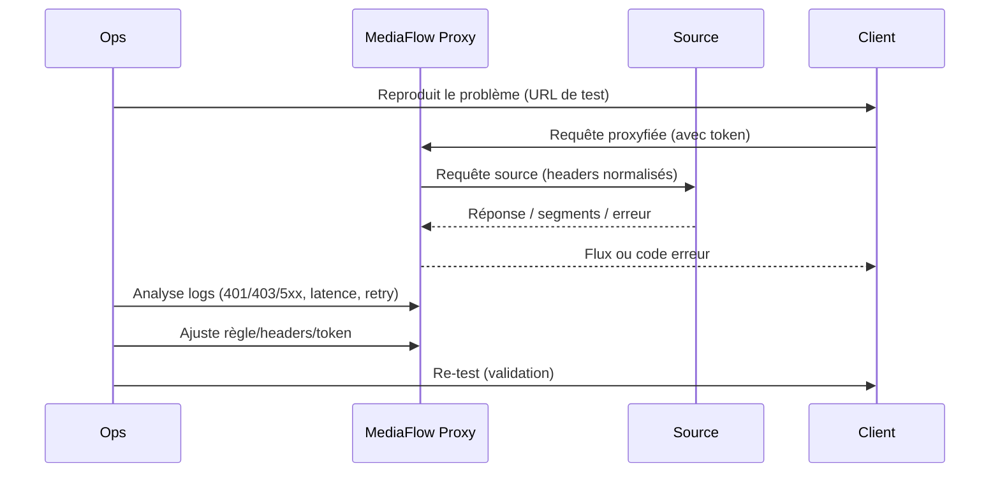

# 🌊 MediaFlow Proxy — Présentation & Configuration Premium (Streaming Proxy)

### Proxy intelligent pour flux médias (HTTP/HLS/DASH) • Headers • Stabilisation IP • Compat intégrations
Optimisé pour reverse proxy existant • Segmentation par token • Observabilité & runbooks • Exploitation durable

---

## TL;DR

- **MediaFlow Proxy** sert d’**intermédiaire** entre un lecteur / add-on et une source média afin d’appliquer des **headers**, uniformiser l’**origine IP**, et améliorer la **compatibilité** de lecture (notamment HLS/DASH).
- Il est utile quand certaines sources imposent des contraintes (headers requis, restrictions réseau, lecture segmentée HLS…).
- En “premium ops” : **tokens**, **scopes**, **limitation d’exposition**, **logs**, **tests**, **rollback**, et **conformité** (respect des droits/licences).

Référence produit (README) : MediaFlow Proxy (GitHub).  
:contentReference[oaicite:0]{index=0}

---

## ✅ Checklists

### Pré-usage (avant de brancher des apps dessus)
- [ ] Définir le périmètre : quels clients / quelles sources / quels usages
- [ ] Activer une stratégie d’auth (**token / password**) et la documenter
- [ ] Décider si tu fais du mono-instance ou multi-instance (prod/staging)
- [ ] Définir la politique de logs (ce qu’on accepte d’exposer / masquage)
- [ ] Préparer une page “Runbook incidents” (403/401, timeouts, buffering, segments HLS)

### Post-configuration (validation)
- [ ] Un flux de test HTTP simple passe
- [ ] Un flux HLS (m3u8) passe et charge plusieurs segments
- [ ] Les erreurs auth renvoient le bon code (401/403) et sont lisibles dans les logs
- [ ] Aucun secret (token) ne fuit dans les logs partagés
- [ ] Rollback documenté (désactiver/proxy bypass)

---

> [!TIP]
> Le gain principal vient souvent de la **normalisation des headers** + du fait que le trafic “sort” d’un **seul point** (une seule IP) côté sources.

> [!WARNING]
> Un proxy média peut manipuler des flux sensibles. Utilise-le uniquement dans un cadre **légal** et conforme aux conditions d’utilisation des services concernés.

> [!DANGER]
> N’expose pas l’instance publiquement sans contrôle d’accès : tokens/URLs + logs peuvent suffire à compromettre des flux et des comptes.

---

# 1) MediaFlow Proxy — Vision moderne

MediaFlow Proxy n’est pas un player.

C’est :
- 🧩 Un **proxy applicatif** orienté streaming
- 🧠 Un **moteur d’adaptation** (headers, compat HLS/DASH, règles)
- 🔐 Un **point de contrôle** (auth, tokens, scoping)
- 🔎 Un **outil de diagnostic** (logs live, erreurs, corrélation)

Description & features : support HTTP(S), HLS (M3U8), MPEG-DASH, et autres éléments selon doc. :contentReference[oaicite:1]{index=1}

---

# 2) Architecture globale



---

# 3) Cas d’usage (ceux qui justifient vraiment l’outil)

## 3.1 Headers requis / compat segmentée HLS
Certains flux HLS exigent des headers spécifiques (ex: referer, user-agent, etc.). Un proxy peut les appliquer de façon homogène.

Exemple d’explication “proxy headers pour HLS” (contexte Stremio) : :contentReference[oaicite:2]{index=2}

## 3.2 Unifier l’origine IP (stabilité multi-clients)
Quand un service impose une contrainte d’IP/source, centraliser les requêtes via une instance proxy peut stabiliser l’IP vue côté source.

Contexte “IP strict / multi IP” mentionné dans des intégrations : :contentReference[oaicite:3]{index=3}

## 3.3 Intégrations d’add-ons / plateformes
Certains projets listent MediaFlow Proxy comme option pour étendre la compatibilité de hosters/streams.

Exemple d’intégration mentionnant MediaFlow Proxy : :contentReference[oaicite:4]{index=4}

---

# 4) Stratégie “Premium config” (5 piliers)

1. 🔐 **Auth & tokens** : secrets courts, rotation, scopes par usage
2. 🧭 **Routage & règles** : cohérence des endpoints, normalisation des headers
3. 🧾 **Observabilité** : logs exploitables, niveaux (info/debug), corrélation
4. 🧪 **Tests** : HTTP simple + HLS + erreurs attendues (401/403/5xx)
5. ♻️ **Rollback** : bypass immédiat + retour à la config précédente

---

# 5) Auth, tokens & gouvernance

## Recommandations
- 1 token = 1 usage (ex: “stremio-prod”, “stremio-test”, “mobile”)
- Rotation programmée (mensuelle/trimestrielle selon criticité)
- Ne jamais mettre un token dans une page publique / capture d’écran non floutée
- Si le reverse proxy existant gère déjà SSO/ACL, garde quand même un **secret applicatif** côté proxy (défense en profondeur)

> [!TIP]
> Si plusieurs apps consomment le proxy, sépare par token **et** par environnement (prod vs staging). Ça simplifie le debug.

---

# 6) Performance & qualité de lecture (bonnes pratiques)

## Symptômes → pistes
- **Buffering** : latence réseau, source lente, segments HLS volumineux
- **403/401** : token invalide, headers manquants, restrictions source
- **m3u8 OK mais segments KO** : headers appliqués au manifest mais pas aux segments, ou redirections non suivies

## Politique “safe”
- Commencer avec un flux HTTP simple
- Ensuite un flux HLS public
- Enfin les flux à contraintes (headers/DRM/… si applicable dans ton cadre légal)

---

# 7) Workflows premium (support & incident)



---

# 8) Validation / Tests / Rollback

## 8.1 Tests rapides (smoke tests)
> Remplace `MFP_URL` et `PROXY_URL_TEST` par tes valeurs.

```bash
# 1) Service répond (health / page / endpoint selon ton setup)
curl -I "$MFP_URL" | head

# 2) Test proxy HTTP simple (doit renvoyer 200/3xx ou un flux)
curl -I "$PROXY_URL_TEST" | head

# 3) Test HLS manifest (m3u8) : vérifier qu'on obtient bien du texte m3u8
curl -s "$PROXY_URL_TEST_M3U8" | head -n 20
```

## 8.2 Tests d’erreur attendue
```bash
# Token invalide -> doit renvoyer 401/403 (selon ta config)
curl -I "$PROXY_URL_WITH_BAD_TOKEN" | head
```

## 8.3 Rollback (opérationnel)
- **Bypass immédiat** : repasser le client sur l’URL source (si possible) ou désactiver l’usage proxy côté app
- **Rollback config** : revenir à la dernière config headers/tokens connue “good”
- **Rollback réseau** : fermer l’accès externe et limiter au LAN/VPN le temps du diagnostic

> [!WARNING]
> Avoir un bypass “en 2 clics” côté client est souvent la meilleure assurance anti-incident.

---

# 9) Erreurs fréquentes (et remèdes)

- ❌ *“Ça marche sur le manifest mais pas sur les segments”*  
  ✅ vérifier propagation headers, redirections, CORS/Origin, referer/UA

- ❌ *“Ça marche en local mais pas via reverse proxy”*  
  ✅ vérifier base URL, headers X-Forwarded-*, taille buffers, timeouts proxy

- ❌ *“403 aléatoire”*  
  ✅ vérifier rotation token, limitations côté source, quotas, IP/rate-limit

---

# 10) Sources — Images Docker (format demandé)

## 10.1 Image communautaire la plus citée
- `mhdzumair/mediaflow-proxy` (Docker Hub) : https://hub.docker.com/r/mhdzumair/mediaflow-proxy  
- Repo officiel (référence produit/packaging) : https://github.com/mhdzumair/mediaflow-proxy  
- Package Python (référence projet, versions) : https://pypi.org/project/mediaflow-proxy/  

## 10.2 Docs / Guides d’intégration (contexte d’usage)
- Doc ElfHosted “MediaFlow-Proxy” : https://docs.elfhosted.com/app/mediaflow-proxy/  
- Exemple d’intégration mentionnant MediaFlow Proxy : https://github.com/webstreamr/webstreamr  

## 10.3 LinuxServer.io (LSIO)
- Catalogue images LSIO (vérification de disponibilité) : https://www.linuxserver.io/our-images  
- À date de la vérification, **pas d’image dédiée “mediaflow-proxy” listée** dans le catalogue LSIO (à confirmer si ton écosystème change). :contentReference[oaicite:5]{index=5}

---

# ✅ Conclusion

MediaFlow Proxy devient “premium” quand tu le traites comme un **point de contrôle** :
- 🔐 tokens + gouvernance
- 🧭 règles/headers maîtrisés
- 🧾 logs exploitables
- 🧪 tests systématiques
- ♻️ rollback simple

Résultat : lecture plus stable, intégrations plus fiables, et diagnostic plus rapide — tout en gardant un cadre sécurisé et conforme.