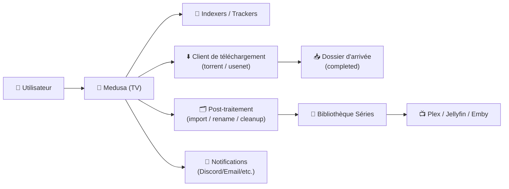
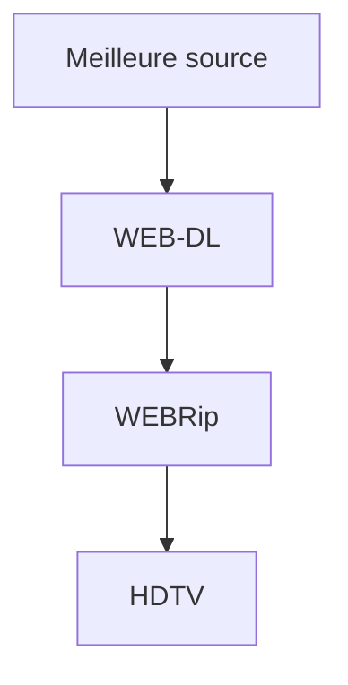
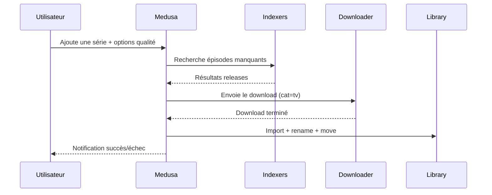

# 🐍 Medusa (PyMedusa) — Présentation & Configuration Premium

### Gestionnaire automatique de séries TV (PVR) : recherche, téléchargement, post-traitement, organisation
Optimisé pour écosystème media (indexers + downloader + bibliothèque) • Qualité maîtrisée • Exploitation durable

---

## TL;DR

- **Medusa (PyMedusa)** = **gestionnaire automatique de séries TV** : il surveille tes séries, trouve les nouveaux épisodes, les récupère via indexers + client de téléchargement, puis **renomme / range / met à jour** ta bibliothèque.
- Une config premium repose sur : **sources metadata fiables**, **profils qualité**, **post-traitement propre**, **anti-doublons**, **notifications**, **tests & rollback**.
- Ne pas confondre avec **MedusaJS** (e-commerce). Ici on parle de **PyMedusa (TV shows)**.

---

## ✅ Checklists

### Pré-configuration (préflight)
- [ ] Bibliothèque séries **structurée** et stable (dossiers / permissions)
- [ ] Client de téléchargement prêt (torrent/NZB) + catégories dédiées
- [ ] Indexers/trackers choisis (qualité + disponibilité)
- [ ] Choix des sources metadata (TVDB/TVmaze/TMDb selon ton usage)
- [ ] Stratégie de qualité (720p/1080p/4K, codecs, tailles)
- [ ] Stratégie “multi-sources” (si tu utilises plusieurs emplacements de séries)

### Post-configuration (validation)
- [ ] Ajout d’une série → épisode trouvé automatiquement (test réel)
- [ ] Téléchargement → import/post-traitement OK (renommage + déplacement)
- [ ] Aucun “download loop” (ne retélécharge pas un épisode existant)
- [ ] Notifications OK (succès/échec)
- [ ] Sauvegarde/restauration testée (config + DB)

---

> [!TIP]
> Medusa devient “premium” quand tu verrouilles 3 choses : **qualité**, **naming**, **post-traitement**.  
> Sans ça, tu auras des doublons, des imports ratés et une bibliothèque “sale”.

> [!WARNING]
> La plupart des problèmes viennent de : **chemins incohérents**, **permissions**, **mauvaise détection des releases** (qualité/tags).

> [!DANGER]
> Si Medusa voit tes épisodes mais n’arrive pas à les **déplacer/renommer**, tu vas accumuler des downloads non importés.  
> Résultat : “il retélécharge” ou “il ne marque pas comme acquis”.

---

# 1) Medusa — Vision moderne

Medusa n’est pas juste “un outil qui télécharge”.

C’est :
- 🔎 Un **moteur de recherche** (indexers)
- ⬇️ Un **orchestrateur** (client de téléchargement)
- 🗂️ Un **post-processeur** (move/copy, renommage, nettoyage)
- 🧠 Un **gestionnaire d’état** (déjà acquis / manquant / archivé)
- 🔔 Un **centre d’alertes** (notifications)

---

# 2) Architecture globale



---

# 3) Philosophie premium (5 piliers)

1. 🎯 **Qualité maîtrisée** (profils + tailles + codecs)
2. 🗂️ **Organisation stricte** (naming + structure)
3. 🔄 **Post-traitement fiable** (import propre, anti-doublons)
4. 🧾 **Metadata & matching** (sources stables, évite les mismatches)
5. 🧪 **Validation / rollback** (tests + retour arrière)

---

# 4) Organisation des fichiers (critique)

## Structure recommandée
```
/data/media/tv/
  Show Name/
    Season 01/
      Show Name - S01E01 - Episode Title.ext
```

> [!TIP]
> Si tu utilises **plusieurs emplacements** (ex: local + remote), Medusa gère des “multiple show sources” : garde une convention strictement identique.

---

# 5) Qualité & décisions (le “cerveau”)

## Stratégie qualité (exemples)
- **1080p** : WEB-DL > WEBRip > HDTV
- **720p** : WEB-DL > WEBRip > HDTV
- **Codec preference** (option) : x265 si tu privilégies l’espace disque



## Taille (anti “micro releases”)
- Mets un **minimum raisonnable** (évite les fichiers ultra-compressés)
- Mets un **maximum** (évite les releases absurdes ou mal taggées)

> [!WARNING]
> Trop permissif = tu récupères tout et n’importe quoi.  
> Trop strict = tu rates des épisodes ou tu boucles en “snatch/retry”.

---

# 6) Indexers / Trackers (stratégie propre)

## Principes premium
- Peu d’indexers, mais **fiables**
- Prioriser ceux qui taggent bien les releases (qualité, source, groupe)
- Éviter les doublons de résultats (mêmes sources, même contenu)

## Anti-bruit
- Blacklist intelligente (mots-clés indésirables)
- Exclusions “cam / ts / lq” si tu veux une bibliothèque propre
- Préférences de groupes (si tu as des groupes de release fiables)

---

# 7) Client de téléchargement & catégories (logique d’intégration)

## Bonnes pratiques
- Une **catégorie dédiée** (ex: `tv`)
- Un dossier “completed” stable
- “Completed Download Handling” côté downloader si pertinent
- Gestion claire : **qui déplace quoi** (idéalement Medusa gère l’import final)

> [!TIP]
> Le workflow premium = downloader télécharge → Medusa importe/renomme → bibliothèque propre.  
> Évite les doubles post-traitements (downloader + Medusa) qui se marchent dessus.

---

# 8) Post-traitement premium (zéro chaos)

## Objectifs
- Renommer de façon déterministe
- Ranger dans Season folders si tu veux
- Nettoyer :
  - sample files
  - nfo inutiles
  - fichiers parasites
- Gérer les “repacks/proper” si tu veux upgrader

## Nommage recommandé
- Dossier série : `Show Name`
- Episode : `Show Name - S01E01 - Episode Title`

Exemple :
```
Severance - S01E01 - Good News About Hell.mkv
```

> [!WARNING]
> Si ton nommage est instable, tu perds : détection, matching, upgrades, et tu crées des doublons.

---

# 9) Metadata & matching (éviter les catastrophes)

## Sources courantes
- TVDB / TVmaze / TMDb (selon ton choix)
- L’important : **choisir une source principale** et s’y tenir

## Règles premium anti-mismatch
- Verrouiller l’identifiant d’une série si possible
- Vérifier les séries “remakes” / mêmes noms
- Attention aux “year in title” et aux variations de titres

---

# 10) Automatisation & cycle de vie

## Workflow idéal (de bout en bout)



## Planification “saine”
- Recherche : intervalle raisonnable (évite le spam)
- “Backlog searches” : planifiées, pas en boucle
- Retrying : maîtrisé (et pas agressif)

---

# 11) Observabilité (exploitation)

## Ce que tu surveilles
- Logs : erreurs d’import, permissions, mismatch
- Queue : éléments bloqués
- État : épisodes “wanted” qui ne se résolvent pas

## Patterns d’erreurs utiles
- `permission denied`
- `cannot move/rename`
- `postprocessing failed`
- `unable to parse`
- `no video files found`

---

# 12) Validation / Tests / Rollback

## Tests de validation (fonctionnels)
```bash
# 1) Ajoute une série test (ou une mini-série)
# 2) Lance une recherche manuelle d'un épisode manquant
# 3) Vérifie :
#    - download déclenché
#    - import terminé
#    - fichier renommé
#    - épisode marqué acquis
```

## Tests “anti-boucle”
- Lancer une recherche sur une saison déjà complète
- Attendu : **aucune re-demande** si la bibliothèque est correcte

## Rollback (retour arrière)
- Sauvegarder avant changement :
  - configuration / base / fichiers de state
- Si une modification casse l’import :
  - revenir au dernier snapshot
  - annuler la règle de post-traitement/naming
  - refaire un test sur 1 épisode

> [!TIP]
> Un rollback utile est **rapide** : “je reviens à l’état stable en < 10 minutes”.

---

# 13) Erreurs fréquentes (et fixes)

## “Il télécharge mais n’importe pas”
- Cause : permissions / chemins / post-traitement
- Fix : vérifier accès RW + dossier d’arrivée + règle move/rename

## “Il retélécharge un épisode existant”
- Cause : épisode non reconnu comme acquis (naming / mismatch / archive)
- Fix : forcer rescan, corriger naming, marquer l’existant correctement

## “Mauvaise série / mauvais épisode”
- Cause : source metadata / identifiant / séries homonymes
- Fix : corriger l’identifiant, verrouiller la source, renommer dossier série

---

# 14) Sources — Images Docker (comme ton format demandé)

## 14.1 Image officielle / communautaire la plus citée (PyMedusa)
- `pymedusa/medusa` (Docker Hub) : https://hub.docker.com/r/pymedusa/medusa  
- Repo principal (référence produit) : https://github.com/pymedusa/Medusa  
- Wiki “What is Medusa” : https://github.com/pymedusa/Medusa/wiki/What-is-Medusa  

## 14.2 Image LinuxServer.io (LSIO) — si tu standardises ton stack
- `linuxserver/medusa` (Docker Hub) : https://hub.docker.com/r/linuxserver/medusa  
- Doc LSIO “docker-medusa” : https://docs.linuxserver.io/images/docker-medusa/  
- Package GHCR (tags/sha) : https://github.com/orgs/linuxserver/packages/container/package/medusa  

## 14.3 Alternative souvent mentionnée (option)
- `binhex/arch-medusa` (Docker Hub) : https://hub.docker.com/r/binhex/arch-medusa  

---

# ✅ Conclusion

Medusa “premium”, c’est :
- 🎯 une stratégie qualité claire,
- 🗂️ un post-traitement béton (rename/move),
- 🧾 des metadata stables (anti-mismatch),
- 🔄 une automatisation raisonnable,
- 🧪 des tests + rollback.

Résultat : une bibliothèque séries **propre**, **fiable**, et **automatisée**.