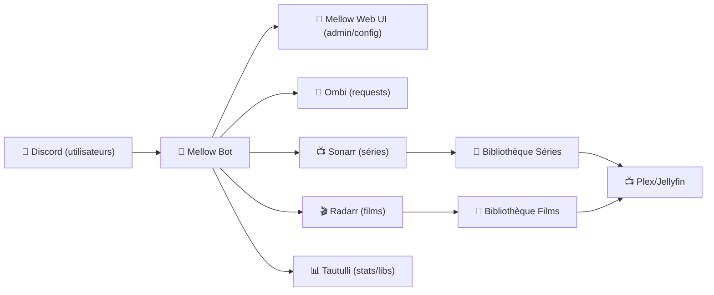
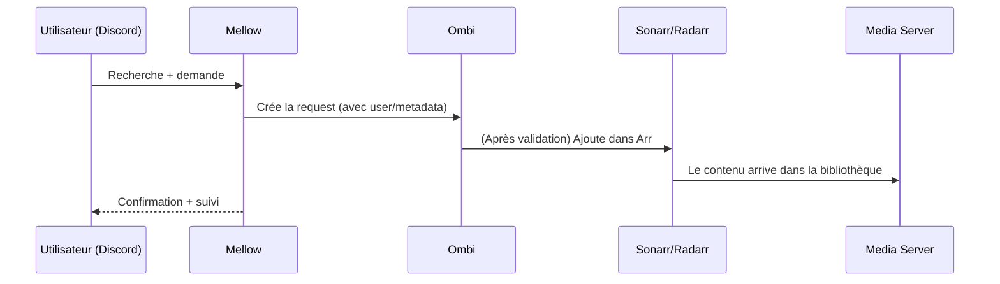

# 🤖 Mellow — Présentation & Configuration Premium (Discord Bot pour l’écosystème *Arr*)

### Piloter Ombi / Sonarr / Radarr / Tautulli depuis Discord (recherche, demandes, infos)
Optimisé pour reverse proxy existant • Permissions & sécurité • Exploitation durable

---

## TL;DR

- **Mellow** est un **bot Discord** + **interface web** qui parle aux API de **Sonarr/Radarr/Ombi/Tautulli** pour :
  - rechercher des films/séries
  - demander du contenu (via Ombi ou directement Sonarr/Radarr selon config)
  - remonter des infos (bibliothèques Tautulli, etc.)
- **Point important** : le repo historique **v0idp/Mellow est archivé (read-only)** → à traiter comme projet “legacy” (fonctionne si déjà en place, mais à durcir et surveiller).

---

## ✅ Checklists

### Pré-configuration (avant de le brancher à tes services)
- [ ] Token Discord prêt + bot invité sur le serveur
- [ ] APIs accessibles : Sonarr/Radarr/Ombi/Tautulli (URL + API keys)
- [ ] Stratégie d’accès : qui peut *request* vs qui peut *search*
- [ ] Convention de noms : catégories, profils qualité (côté Sonarr/Radarr)
- [ ] Politique “secrets” : clés API et token stockés hors logs / hors screenshots

### Post-configuration (validation)
- [ ] Commande de recherche OK (film/série)
- [ ] Commande de demande OK (création request / ajout dans Arr)
- [ ] Mellow ne spamme pas : rate-limit et permissions Discord cohérentes
- [ ] Logs propres (pas de secrets en clair)
- [ ] Plan de rollback documenté (désactiver intégrations / révoquer tokens)

---

> [!TIP]
> Le vrai “premium” ici, c’est **la gouvernance** : *qui* peut demander *quoi*, et *où* ça atterrit (profils qualité, tags, racines).

> [!WARNING]
> Un bot Discord connecté à tes APIs, c’est un **pont privilégié**.  
> Applique le moindre privilège : permissions Discord minimales + clés API restreintes si possible.

> [!DANGER]
> Si tu suspectes une fuite (token Discord, clé API), **révoque immédiatement** et régénère. Ne “nettoie” pas : remplace.

---

# 1) Mellow — Vision moderne

Mellow n’est pas juste un bot “fun”.

C’est :
- 🔎 un **frontend conversationnel** (Discord) pour la recherche/demande
- 🔗 un **orchestrateur d’APIs** (Ombi, Sonarr, Radarr, Tautulli)
- 🧠 un **outil d’anti-friction** : moins de clics, plus d’adoption familiale/équipe

---

# 2) Architecture globale



---

# 3) Philosophie de configuration Premium (5 piliers)

1. 🔐 **Sécurité & secrets** (tokens, API keys, logs)
2. 👥 **Permissions** (Discord + règles fonctionnelles)
3. 🎯 **Qualité & destination** (profils, tags, root folders côté Arr/Ombi)
4. 🧭 **Observabilité** (logs utiles, erreurs actionnables)
5. 🧪 **Validation & rollback** (tests, révocation, désactivation rapide)

---

# 4) Permissions & Gouvernance (ce qui évite le chaos)

## 4.1 Modèle “3 niveaux” (recommandé)
- 👑 **Admin** : configure Mellow + gère secrets + intégrations
- ✍️ **Requester** : peut demander du contenu
- 👀 **Searcher** : peut rechercher / consulter uniquement

## 4.2 Règles premium anti-abus
- Limiter les channels autorisés (ex: `#requests`)
- Limiter par rôle (pas d’@everyone)
- Appliquer un quota “social” :
  - demandes via Ombi (workflow validé)
  - demandes direct Arr seulement pour un groupe réduit

> [!TIP]
> Si tu as Ombi : fais d’Ombi la “porte d’entrée” des demandes (validation/approbation), et garde Sonarr/Radarr pour l’exécution.

---

# 5) Intégrations (Sonarr / Radarr / Ombi / Tautulli)

## 5.1 Sonarr & Radarr
Objectifs premium :
- ✅ ajouter dans le bon **root folder**
- ✅ appliquer le bon **profil qualité**
- ✅ (option) appliquer **tags** (ex: `requested-discord`)

Bonnes pratiques :
- une clé API dédiée à Mellow si possible
- endpoints en interne (LAN/VPN), pas publics

## 5.2 Ombi (si présent)
Ombi apporte :
- workflow “request → approve → fulfill”
- historique + traçabilité
- une UX plus “grand public” que l’UI Arr

## 5.3 Tautulli
Utile pour :
- lister bibliothèques
- remonter des infos côté usage (selon features activées)

---

# 6) Workflows premium (expérience utilisateur + ops)

## 6.1 Demande standard (via Ombi)


## 6.2 Demande “ops” (direct Arr)
- réservé aux rôles avancés
- idéalement taggé (`requested-discord`)
- garde une règle : pas de demandes “en prod” depuis n’importe quel channel

---

# 7) Observabilité (sans sur-ingénierie)

## Ce que tu veux voir dans les logs
- erreurs d’auth (Discord token invalide, API keys refusées)
- erreurs réseau (timeouts, DNS)
- erreurs métier (profil introuvable, request rejetée)
- rate limiting (Discord, services)

## Ce que tu ne veux JAMAIS voir
- tokens Discord
- API keys en clair
- URLs internes sensibles partagées publiquement

> [!WARNING]
> Si l’interface web de Mellow existe chez toi, protège-la (auth forte + accès restreint). Même en interne.

---

# 8) Validation / Tests / Rollback

## Tests fonctionnels (à faire à chaque changement)
```bash
# (manuel) 1) Recherche film/série -> résultat cohérent
# (manuel) 2) Demande via Ombi -> apparaît dans Ombi
# (manuel) 3) Si approbation: le contenu est bien envoyé vers Sonarr/Radarr
# (manuel) 4) Vérifier que le bon profil qualité / root folder / tags sont appliqués
```

## Tests sécurité (indispensables)
```bash
# (manuel) 1) Un "Searcher" ne peut pas demander
# (manuel) 2) Un user hors channels autorisés ne peut pas déclencher de demandes
# (manuel) 3) Vérifier que les logs ne contiennent pas de secrets après actions
```

## Rollback (plan simple)
- Désactiver temporairement la capacité “request”
- Révoquer/regénérer :
  - token Discord
  - clés API Ombi/Sonarr/Radarr/Tautulli
- Revenir à la config précédente (snapshot/export si tu en as)
- Documenter l’incident (cause + action corrective)

> [!DANGER]
> En cas de doute sur une compromission : **révoque d’abord, enquête ensuite**.

---

# 9) Statut projet (important)

Le dépôt **v0idp/Mellow** est **archivé** et en lecture seule (legacy).  
Ça ne veut pas dire “inutile”, mais :
- privilégie une exposition minimale
- maintiens une hygiène stricte des secrets
- surveille les erreurs et comportements anormaux

---

# 10) Sources — Images Docker (URLs brutes uniquement)

## 10.1 Image communautaire la plus citée
- `voidp/mellow` (Docker Hub) : https://hub.docker.com/r/voidp/mellow  
- Doc Mellow (README, section “Docker Setup & Start” mentionne `voidp/mellow`) : https://github.com/v0idp/Mellow  

## 10.2 Référence projet / code
- Repo principal (archivé) : https://github.com/v0idp/Mellow  

## 10.3 LinuxServer.io
- Liste des images LSIO (pour vérifier si une image “mellow” existe) : https://www.linuxserver.io/our-images  
- À ma connaissance via cette liste, **pas d’image LSIO dédiée “Mellow”** (à revalider si LSIO ajoute de nouvelles images).

---

# ✅ Conclusion

Mellow est un **pont Discord → media stack** :
- rapide à utiliser,
- puissant pour l’adoption,
- mais à traiter comme un **composant sensible** (tokens + APIs).

Version “premium” = permissions + gouvernance + secrets propres + tests + rollback.