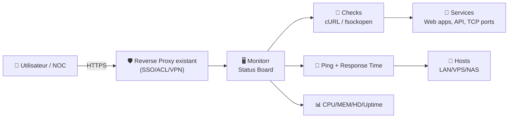
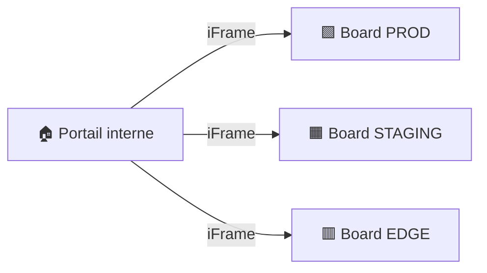

# 🖥️ Monitorr — Présentation & Configuration Premium (Status Board / Service Monitor)

### Tableau de statut auto-hébergé : services web + réseau + ressources host (CPU/RAM/Disque/Ping/Uptime)
Optimisé pour reverse proxy existant • Affichage TV / NOC • Configuration gouvernée • Exploitation durable

---

## TL;DR

- **Monitorr** est une **web app PHP auto-hébergée** qui affiche en temps réel le statut de **services web / apps / hôtes**.  
- Il vérifie les services via **cURL (principal)** avec **fsockopen (fallback)**, et peut afficher **temps de réponse ping** + **ressources système** (CPU/MEM/HD/PING/Uptime).  
- Une config “premium” = **naming cohérent**, **groupes** (prod/staging), **seuils visuels**, **auth activée**, **mode iFrame** pour dashboards, **procédures de test & rollback**.

---

## ✅ Checklists

### Pré-configuration (qualité)
- [ ] Définir la taxonomie : `env`, `team`, `criticality`
- [ ] Normaliser les services (noms courts + icônes) + URLs/ports stables
- [ ] Fixer une convention de couleurs/seuils (OK / warning / down)
- [ ] Activer l’auth Monitorr (ou auth via ton reverse proxy existant)
- [ ] Préparer un “mur d’écrans” : résolution, mode plein écran, refresh

### Post-configuration (validation)
- [ ] Un service HTTP, un service TCP, un host ping : tests OK
- [ ] Les temps de réponse affichent une logique cohérente
- [ ] Les seuils déclenchent bien les couleurs attendues
- [ ] Le mode “Minimal UI / iFrame” fonctionne dans ton dashboard
- [ ] Backup/restore de la configuration testé (1 fois)

---

> [!TIP]
> Monitorr est excellent pour un **NOC board** (TV, tablette, écran mural) : tu vois “up/down/degraded” immédiatement.

> [!WARNING]
> Le tableau peut exposer des **URLs internes**, des noms d’hôtes, et des infos d’infra.  
> Même derrière un reverse proxy, garde-le **restreint** (SSO / ACL / VPN).

> [!DANGER]
> Une mauvaise config de check (URL instable, DNS, timeouts trop courts) crée du bruit (“false down”).  
> Le but est la **confiance** : mieux vaut 15 checks fiables que 80 checks douteux.

---

# 1) Monitorr — Vision moderne

Monitorr n’est pas une stack de monitoring (Prometheus, Zabbix, etc).

C’est :
- 🟩🟧🟥 Un **panneau de statut** temps réel (visuel, instantané)
- 🔎 Un **outil de vérification simple** (HTTP/TCP + ping)
- 📺 Un **affichage multi-écrans** (HD displays) + mobile responsive
- 🧩 Un widget “status” intégrable (iFrame / minimal UI)

Fonctions clés (résumé) :
- LIVE (pause possible)
- Checks services (cURL + fallback fsockopen)
- Ping + temps de réponse
- Ressources host (CPU/MEM/HD/PING/Uptime)
- Page settings intégrée + authentification
- Couleurs/seuils personnalisables + custom CSS
- Mode minimal UI pour iFrame

---

# 2) Architecture globale



---

# 3) Philosophie premium (5 piliers)

1. 🧭 **Lisibilité** : un écran doit suffire (noms courts, regroupements, icônes)
2. 🧱 **Fiabilité** : checks stables + timeouts réalistes (anti faux négatifs)
3. 🎛️ **Seuils & couleurs** : signal > bruit (warning avant down)
4. 🔐 **Accès maîtrisé** : auth + restriction réseau (via ton proxy)
5. 🧪 **Opérabilité** : tests, dépannage, rollback (sans surprise)

---

# 4) Modèle de tableau (conventions recommandées)

## 4.1 Naming “pro”
- `API` (prod) → `api-prod`
- `API` (staging) → `api-stg`
- `DB` (prod) → `db-prod`
- `Plex` → `plex`
- `Traefik` → `edge`

## 4.2 Groupes (lecture instantanée)
- **Edge / Auth** (reverse proxy, SSO)
- **Apps** (Plex, Sonarr, Radarr, etc.)
- **Data** (DB, cache, storage)
- **Infra** (hosts, DNS, backups)

> [!TIP]
> Si tu affiches sur TV : pense “**décision en 3 secondes**”.  
> Trop de lignes = personne ne lit.

---

# 5) Configuration “Services” (checks propres)

## 5.1 Types de checks (logique)
- **HTTP(S)** : page /health, /status, endpoint API
- **TCP port** : vérifier qu’un port répond (service vivant)
- **Ping host** : connectivité de base

## 5.2 Stratégie d’endpoints (pour éviter les faux down)
- Préfère `/health` ou `/ping` plutôt que la home page
- Évite les endpoints lents / auth-only
- Ajoute un timeout raisonnable (et identique partout)

## 5.3 Hotlinking (option)
- Activer le hotlinking seulement si :
  - tu veux “cliquer” vers l’outil
  - l’accès est protégé (SSO/ACL/VPN)

---

# 6) Seuils, couleurs, et “signal visuel”

## Stratégie simple qui marche
- 🟩 **OK** : service répond
- 🟧 **Warning** : latence > seuil (ex: API lente)
- 🟥 **Down** : pas de réponse / erreur

> [!WARNING]
> “Down” doit rester rare.  
> Si tu vois du rouge souvent, c’est que tes checks sont mal calibrés (ou ton infra est vraiment instable).

---

# 7) Ressources système (host stats) — usage premium

Quand activer l’affichage CPU/MEM/HD/PING/Uptime :
- pour un “mur d’écrans” NOC
- pour un NAS/VPS unique où l’info est actionnable

Bonnes pratiques :
- se concentrer sur **Disque** (HD) + **Uptime**
- éviter de transformer Monitorr en “monitoring complet” (ce n’est pas son rôle)

---

# 8) Sécurité d’accès (sans recettes de proxy)

## Principe
- Monitorr : **jamais** “public” sans contrôle d’accès
- Deux niveaux :
  1) Auth au niveau du reverse proxy existant (SSO/ACL/VPN)
  2) Auth Monitorr (en plus) si tu veux une barrière interne

> [!TIP]
> Si ton board est affiché sur TV en open-space : utilise un périmètre “lecture seule” et évite d’afficher des URLs sensibles.

---

# 9) Mode “Minimal UI” / iFrame (dashboarding)

Use cases :
- intégrer dans un portail (homepage, dashboard interne)
- afficher sur écran mural avec UI minimale
- inclure plusieurs boards (prod/stg) en mosaïque



---

# 10) Validation / Tests / Rollback

## 10.1 Tests de validation (smoke tests)
```bash
# 1) Page accessible (depuis ton réseau interne)
curl -I https://monitorr.example.tld | head

# 2) Vérifier qu'un endpoint "health" retourne bien un code 200 (exemple)
curl -s -o /dev/null -w "%{http_code}\n" https://api.example.tld/health

# 3) Test TCP simple (si tu as un service port)
nc -zv host.example.lan 5432
```

## 10.2 Tests fonctionnels (UI)
- Ajouter 3 entrées de test :
  - 1 HTTP (OK)
  - 1 TCP (OK)
  - 1 host ping (OK)
- Simuler un “warning” (latence) en pointant vers un endpoint volontairement lent
- Vérifier que les couleurs changent comme prévu

## 10.3 Rollback (approche pro)
- Avant toute mise à jour :
  - sauvegarder le dossier `data` (config, users, etc.)
  - sauvegarder `custom.css` si tu l’utilises (Monitorr a eu un historique de précautions sur ce point)
- Rollback = restaurer la config + redémarrer le service web

```bash
# Exemple générique : archiver un dossier de config (adapter au chemin réel)
tar -czf monitorr-backup_$(date +%F_%H%M%S).tgz /path/to/monitorr/assets/data
```

---

# 11) Dépannage (patterns rapides)

## “Service DOWN mais il marche”
Causes fréquentes :
- DNS différent entre serveur Monitorr et ton PC
- endpoint nécessite auth / redirection
- timeout trop court
- TLS interne (cert non validé / SNI / hostname)

Actions :
- tester depuis le même réseau/host que Monitorr (`curl` depuis le serveur)
- remplacer la home page par un endpoint `/health`
- augmenter timeout

## “Board instable / bruit permanent”
- réduire le nombre de checks
- regrouper par criticité (ne montrer que le vital sur l’écran principal)
- calibrer warning vs down

---

# 12) Sources — Images Docker (format demandé, URLs brutes)

## 12.1 Image communautaire la plus citée
- `monitorr/monitorr` (Docker Hub) : https://hub.docker.com/r/monitorr/monitorr  
- Repo upstream (référence de l’app) : https://github.com/Monitorr/Monitorr  
- Releases/Tags (référence versions) : https://github.com/monitorr/monitorr/releases  

## 12.2 LinuxServer.io (LSIO)
- Aucune image Monitorr officielle LSIO identifiée dans le catalogue LSIO : https://www.linuxserver.io/our-images  
- Profil Docker Hub LinuxServer (pour vérification) : https://hub.docker.com/u/linuxserver  

---

# ✅ Conclusion

Monitorr est un **status board** simple et efficace quand tu :
- choisis des checks fiables,
- organises l’écran pour la décision rapide,
- sécurises l’accès,
- et gardes un plan de test/rollback.

C’est le bon outil pour “**voir l’état maintenant**” — et rester calme pendant les incidents.