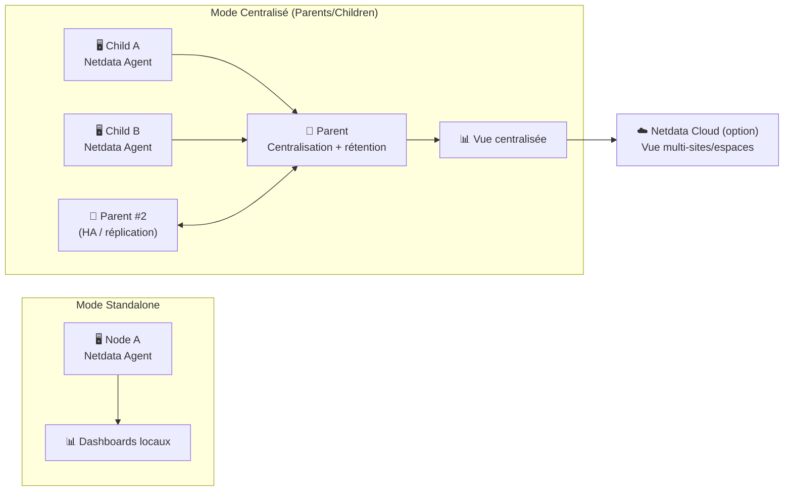
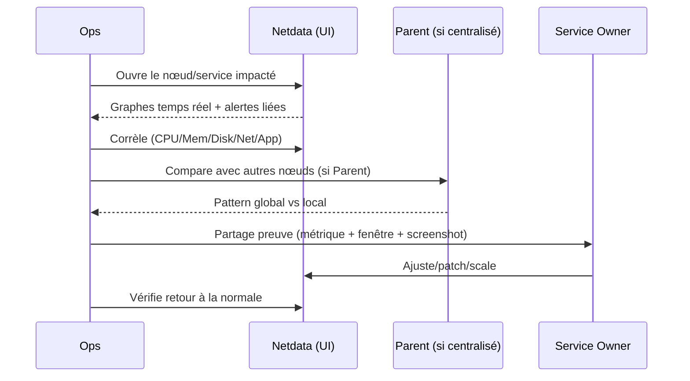

# 📈 Netdata — Présentation & Exploitation Premium (Observabilité Temps Réel)

### Monitoring haute résolution : métriques, logs d’alertes, corrélations, parents/children, Cloud & on-prem
Optimisé pour reverse proxy existant • Centralisation “Parents” • Alerting granulaire • Dépannage rapide

---

## TL;DR

- **Netdata Agent** collecte des métriques **en temps réel** (haute fréquence) et affiche des dashboards immédiats.
- **Netdata Cloud** agrège et centralise la visibilité multi-nœuds (selon ton usage).
- **Parents/Children (streaming)** = centralisation + rétention plus longue + haute dispo possible.
- Version “premium ops” = **naming**, **tags**, **alerting propre**, **runbooks**, **tests**, **rollback**, et **sécurité de configuration**.

Docs officielles (hub) : https://learn.netdata.cloud/docs/

---

## ✅ Checklists

### Pré-usage (avant ouverture aux équipes)
- [ ] Convention de nommage des nœuds (hostname stable + rôle)
- [ ] Stratégie de tags/labels (env/team/tier/service)
- [ ] Politique d’alerting (seuils, destinataires, bruit acceptable)
- [ ] Décision “centralisation” : standalone vs Parents/Children
- [ ] Stratégie d’accès (reverse proxy existant / SSO / VPN) + droits

### Post-configuration (qualité opérationnelle)
- [ ] Dashboards critiques accessibles en < 10s (CPU/Mem/Disk/Net/App)
- [ ] Alertes critiques testées (simulation) + réception validée
- [ ] Centralisation (si utilisée) : streaming stable, pas de trous
- [ ] Runbook “incident observabilité” prêt (quoi regarder + comment prouver)
- [ ] Procédure rollback documentée et testée

---

> [!TIP]
> Netdata est excellent pour la **corrélation instantanée** (une alerte → tu vois les graphes détaillés immédiatement).

> [!WARNING]
> Sans gouvernance, Netdata peut devenir bruyant : trop d’alertes, trop de nœuds non taggés, dashboards difficiles à filtrer.

> [!DANGER]
> Les fichiers de config (ex: `stream.conf`) peuvent contenir des secrets/clé de streaming. Protéger les permissions et éviter l’exposition.

---

# 1) Netdata — Vision moderne

Netdata n’est pas “un dashboard de plus”.

C’est :
- ⚡ **Observabilité temps réel** (haute résolution)
- 🧠 **Corrélation** (cause probable via context + historiques courts)
- 🔔 **Alerting** (health checks, seuils, notifications)
- 🏢 **Centralisation** via **Parents** (streaming) + réplication possible
- 🌐 **Vue multi-nœuds** via Netdata Cloud (si utilisé)

Doc “Parents / streaming” : https://learn.netdata.cloud/docs/netdata-parents/metrics-centralization-points/configuring-metrics-centralization-points

---

# 2) Architecture globale (standalone vs centralisée)



Références centralisation & best practices :
- https://learn.netdata.cloud/docs/netdata-parents/parent-child-configuration-reference
- https://learn.netdata.cloud/docs/netdata-parents/parent-configuration-best-practices
- https://learn.netdata.cloud/docs/netdata-parents/configuration-examples

---

# 3) Modèle mental “Premium” (5 piliers)

1. 🏷️ **Tags & organisation** (env/team/service/tier)
2. 🔔 **Alerting utile** (SNR > volume)
3. 🏢 **Centralisation** (Parents) quand tu scales
4. 🔐 **Contrôle d’accès** via ton reverse proxy existant / SSO / VPN
5. 🧪 **Validation / Rollback** systématiques avant/après changements

---

# 4) Dashboards & lecture “ops”

## 4.1 Lecture incident (ordre conseillé)
1) **Symptôme** : latence/erreurs/CPU spike
2) **Ressources** : CPU, mem, load, iowait
3) **Disque** : IOPS/latence/queue, espace
4) **Réseau** : drops/retransmits/conntrack
5) **Process/app** : workers, DB, cache, erreurs applicatives

> [!TIP]
> Utilise une routine fixe : “CPU → Mem → Disk → Net → App” pour éviter de te perdre.

## 4.2 Corrélation (ce que Netdata fait très bien)
- “Erreur 502” + hausse `iowait` + latence disque → piste stockage
- “Timeout DB” + saturation connexions + RAM stable → piste pool/threads
- “OOM kill” + RSS qui grimpe → fuite mémoire probable

---

# 5) Centralisation Parents/Children (quand et pourquoi)

## Quand passer en centralisé
- > 5–10 nœuds
- besoin de **rétention plus longue** au même endroit
- besoin de **haute dispo** (réplication de Parents)
- besoin d’un “NOC view” standard

## Points clés
- Child stream vers Parent (un Parent à la fois, failover possible)
- Possibilité d’active-active entre Parents (réplication)

Docs :
- https://learn.netdata.cloud/docs/netdata-parents/parent-child-configuration-reference
- https://learn.netdata.cloud/docs/netdata-parents/configuration-examples
- https://learn.netdata.cloud/docs/netdata-parents/streaming-routing-reference

---

# 6) Alerting (Health) — rendre les alertes actionnables

## 6.1 Principe premium
Une alerte doit répondre à :
- **Quoi ?** (métrique + seuil + fenêtre)
- **Impact ?** (service concerné)
- **Contexte ?** (graphes liés)
- **Action ?** (runbook / commande / check)

## 6.2 Stratégie anti-bruit
- Définir 3 niveaux : `info`, `warning`, `critical`
- Éviter les alertes “transitoires” : utiliser des fenêtres
- Router par équipe : `team=core` → canal core, etc.

> [!WARNING]
> Une alerte sans action = bruit. Si personne ne sait quoi faire, c’est à corriger (règle ou runbook).

---

# 7) Sécurité & bonnes pratiques (sans recettes proxy)

## Ce qu’il faut protéger
- Configs de streaming (`stream.conf`), tokens/keys
- Accès UI (logs/infos infra sensibles)
- Permissions fichiers config (lecture limitée)

Recommandations :
- Accès via reverse proxy existant + SSO/ACL
- Pas d’accès public sans auth forte
- Séparer “lecture dashboards” et “admin config” (process interne)

Référence “Configuration File Security” (mentionnée dans la doc streaming) :
- https://learn.netdata.cloud/docs/netdata-parents/metrics-centralization-points/configuring-metrics-centralization-points

---

# 8) Workflows premium (incident & exploitation)

## 8.1 Triage incident (séquence)


## 8.2 “Preuve” d’un problème (format recommandé)
- Timestamp exact
- Métrique + valeur + fenêtre
- Nœud + tags (`env/team/service`)
- Graphes corrélés (2–3 max)
- Action réalisée + résultat

---

# 9) Validation / Tests / Rollback

## 9.1 Tests de validation (smoke tests)
```bash
# 1) UI répond (adapter host/port/URL)
curl -I http://NETDATA_HOST:19999 | head

# 2) Vérifier que l'agent répond (page d'accueil HTML)
curl -s http://NETDATA_HOST:19999 | head -n 5

# 3) Vérifier que le node apparaît côté Cloud (si utilisé)
# (manuel) Espace Netdata Cloud -> Nodes -> le nœud est visible et à jour
```

## 9.2 Tests “alerting”
- Forcer un seuil sur un nœud de test (charge CPU, espace disque simulé)
- Vérifier la réception (email/webhook) + la réduction du bruit

## 9.3 Rollback (principe)
- Sauvegarder configs avant changement
- Revenir à la version précédente de config (ou désactiver règle/streaming)
- Valider : dashboards stables + alertes OK

---

# 10) Sources — Images Docker (format demandé, URLs brutes)

## 10.1 Image officielle la plus citée
- `netdata/netdata` (Docker Hub) : https://hub.docker.com/r/netdata/netdata  
- Tags `netdata/netdata` (Docker Hub) : https://hub.docker.com/r/netdata/netdata/tags  
- Doc Netdata “Install Netdata with Docker” : https://learn.netdata.cloud/docs/netdata-agent/installation/docker  

## 10.2 Image officielle alternative (GitHub Container Registry)
- `ghcr.io/netdata/netdata` (GitHub Packages) : https://github.com/orgs/netdata/packages/container/package/netdata  

## 10.3 LinuxServer.io (LSIO)
- Catalogue des images LinuxServer.io : https://www.linuxserver.io/our-images  
- Note : Netdata n’apparaît pas comme image LSIO officielle dans ce catalogue (si tu as un lien précis “lscr.io/.../netdata”, envoie-le et je l’ajoute).

---

# ✅ Conclusion

Netdata est une brique “premium” quand :
- tu veux comprendre **vite** (corrélation temps réel),
- tu veux scaler proprement (Parents/Children),
- et tu maintiens une gouvernance (tags, alerting utile, accès maîtrisé).

Si tu m’envoies ton contexte (standalone vs centralisé, nombre de nœuds, teams), je peux te produire un modèle de **taxonomie tags** + un **runbook incident** “Netdata-first”.