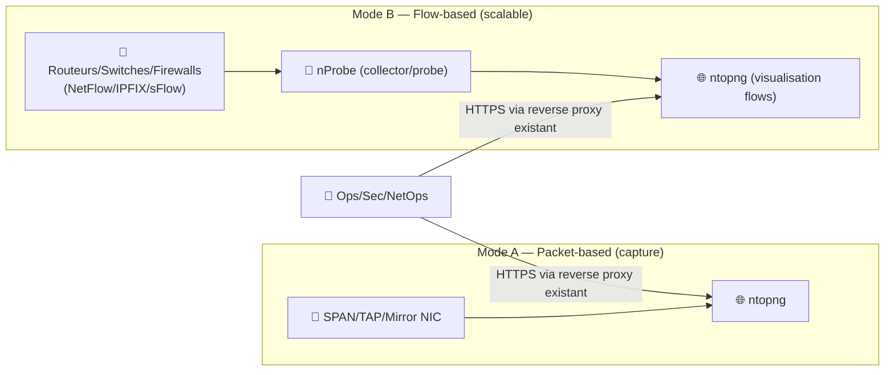
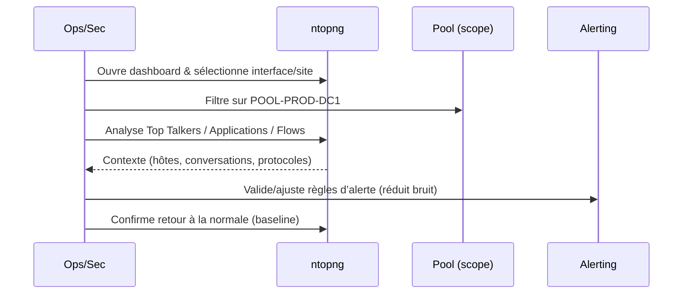

# 🌐 ntopng — Présentation & Configuration Premium (Observabilité Réseau)

### Analyse temps réel + visibilité applicative (nDPI) + flows (NetFlow/IPFIX/sFlow via nProbe) + alerting
Optimisé pour reverse proxy existant • Gouvernance par “pools” • Exploitation durable

---

## TL;DR

- **ntopng** = console web d’**analyse trafic réseau** : hôtes, flux, apps/protocoles, conversations, top talkers, anomalies.
- Deux approches “premium” :
  1) **Packet-based** (capture interface / miroir) pour visibilité riche
  2) **Flow-based** (NetFlow/IPFIX/sFlow) via **nProbe** pour scaler et centraliser
- La config pro repose sur : **choix du mode**, **scopes (interfaces/pools)**, **timeseries**, **alerting**, **rétention**, **tests & rollback**.

Sources officielles :  
- Produit ntopng : https://www.ntop.org/products/traffic-analysis/ntopng/  
- Documentation (guides) : https://www.ntop.org/guides/ntopng/  

---

## ✅ Checklists

### Pré-configuration (avant de “brancher en prod”)
- [ ] Définir le mode : **packets** (miroir/SPAN/TAP) vs **flows** (NetFlow/IPFIX/sFlow)
- [ ] Définir les périmètres : interfaces, VLANs, sites, segments
- [ ] Définir la gouvernance : **Host Pools** (par équipe / environnement / zone)
- [ ] Définir l’alerting : seuils, endpoints, bruit acceptable
- [ ] Définir la stratégie de timeseries / historique (RRD/InfluxDB selon contexte)
- [ ] Valider la confidentialité : masque/anonymisation si nécessaire (PII, IP internes)

### Post-configuration (qualité opérationnelle)
- [ ] Les hôtes sont classés (pools) et retrouvables en < 10s
- [ ] Les “top talkers” et protocoles clés correspondent à la réalité
- [ ] Les alertes utiles déclenchent correctement (et les inutiles sont réduites)
- [ ] Les pages clés sont documentées (Runbooks)
- [ ] Un rollback est prêt (retour paramètres + désactivation alert rules)

---

> [!TIP]
> ntopng excelle quand tu lui donnes un **périmètre clair** (interfaces/pools) et un **objectif** : capacité, sécurité, troubleshooting, ou observabilité applicative.

> [!WARNING]
> Si tu actives “tout partout”, tu obtiens : bruit, dashboards illisibles, faux positifs, charge inutile. Le premium = **scoper**.

> [!DANGER]
> En mode capture (packets), un mauvais choix d’interface/SPAN peut : saturer, perdre des paquets, et fausser l’analyse. Valide d’abord sur un segment maîtrisé.

---

# 1) ntopng — Vision moderne

ntopng n’est pas “un Wireshark web”.

C’est :
- 🔭 une **console de visibilité** (hôtes, flux, applis, conversations)
- 🧠 un **moteur de classification** (applications/protocoles via nDPI selon setup)
- 🚨 un **système d’alerting** orienté anomalies / comportements
- 🧩 une **brique d’écosystème** (nProbe, exports, endpoints d’alertes)

Page produit (capacité flows + nDPI via nProbe, use-cases) :  
https://www.ntop.org/products/traffic-analysis/ntopng/

---

# 2) Architecture globale (deux modes)

Référence officielle “ntopng avec nProbe” (NetFlow/sFlow collectés par nProbe puis visualisés dans ntopng) :  
https://www.ntop.org/guides/ntopng/using_with_other_tools/nprobe.html

---

# 3) Philosophie premium (5 piliers)

1. 🎯 **Choisir le bon mode** (packets vs flows)
2. 🧭 **Définir le scope** (interfaces, VLANs, sites)
3. 🏷️ **Segmenter via Host Pools** (gouvernance)
4. 🚨 **Alerting utile** (signal > bruit)
5. 📈 **Historique/timeseries** aligné au besoin (capacité vs forensic)

---

# 4) Scoping & Gouvernance via Host Pools

Les **Host Pools** servent à regrouper des hôtes (par zone, équipe, environnement) pour :
- filtrer les vues
- isoler des analyses
- cibler l’alerting

Doc Host Pools (UI) :  
https://www.ntop.org/guides/ntopng/user_interface/network_interface/interface/host_pools.html

## Convention premium (exemples)
- `POOL-PROD-DC1`
- `POOL-IOT`
- `POOL-GUEST`
- `POOL-CORE-SERVICES`

> [!TIP]
> Fais correspondre pools ↔ segmentation réseau (VLAN/subnets) : tu obtiens des dashboards lisibles + alerting contextualisé.

---

# 5) Packets vs Flows — décider correctement

## Mode Packets (capture)
✅ Idéal pour :
- troubleshooting applicatif “riche”
- visibilité locale sur un segment
- analyse de conversations sur un lien précis

⚠️ Points d’attention :
- SPAN/TAP correct
- débit supporté
- perte de paquets = biais

## Mode Flows (NetFlow/IPFIX/sFlow)
✅ Idéal pour :
- **scaler** (multi-sites, core)
- consolider des exporters réseau
- observer sans mirroring partout

Dans l’écosystème ntop : nProbe collecte/parse les flows et les transmet à ntopng.  
https://www.ntop.org/guides/ntopng/using_with_other_tools/nprobe.html

---

# 6) Timeseries & Historique (capacity vs forensic)

ntopng peut produire des statistiques persistantes (selon éditions et configuration) ; les choix classiques sont :
- séries temporelles pour capacity planning
- granularité adaptée (éviter trop fin partout)

Contexte officiel + écosystème :  
- Documentation ntopng (guides) : https://www.ntop.org/guides/ntopng/  
- Case study InfluxDB (contexte timeseries) : https://get.influxdata.com/rs/972-GDU-533/images/Customer%20Case%20Study_%20ntop.pdf

> [!WARNING]
> “Tout historiser finement” coûte cher (CPU/IO/stockage) et crée du bruit. Le premium = historiser ce qui répond à tes questions métier.

---

# 7) Alerting (signal > bruit)

L’alerting premium se pense en 3 couches :
1) **Anomalies de trafic** (pics, changements de pattern)
2) **Sécurité** (comportements suspects, scans, exfil potentielle)
3) **SLA/Qualité** (latence, pertes, erreurs applicatives si corrélées)

Doc endpoints d’alertes & filtrage (host pools, etc.) :  
https://www.ntop.org/guides/ntopng/user_interface/shared/alerts/available_endpoints.html

---

# 8) Workflows premium (Triage & escalade)

---

# 9) Validation / Tests / Rollback

## Tests de validation (fonctionnels)
- Vérifier que :
  - les “top talkers” attendus apparaissent (DNS, HTTPS, infra)
  - un segment/pool test est correctement isolé
  - les exports/alertes (si activées) déclenchent quand attendu
- Vérifier que la charge (CPU/RAM) reste stable pendant un pic

## Tests “réalité terrain”
- Génère un trafic contrôlé (ex: téléchargement + DNS + streaming)
- Vérifie la classification (apps/protocoles) et les flux associés

## Rollback (sécurisé)
- Revenir à un scope minimal :
  - désactiver règles d’alertes bruyantes
  - réduire interfaces/pools surveillés
  - baisser granularité historique
- Conserver une “config baseline” documentée (avant tuning)

---

# 10) Erreurs fréquentes (et comment les éviter)

- ❌ Scope trop large dès le début → dashboards inutiles  
  ✅ Commence par 1 site / 1 VLAN / 1 pool, puis étends.

- ❌ Mauvais mirroring (packets) → paquets perdus, analyse fausse  
  ✅ Valide SPAN/TAP, débit, interface, et compare à une source de vérité.

- ❌ Alerting non calibré → spam  
  ✅ Approche itérative : 1 règle = 1 hypothèse = 1 validation.

---

# 11) Sources — Images Docker (format demandé, URLs brutes)

## 11.1 Image “éditeur” (référence la plus sûre)
- `ntop/ntopng` (Docker Hub) : https://hub.docker.com/r/ntop/ntopng  
- Tags `ntop/ntopng` : https://hub.docker.com/r/ntop/ntopng/tags  
- Image dev/nightly `ntop/ntopng.dev` (Docker Hub) : https://hub.docker.com/r/ntop/ntopng.dev/tags  
- Repo des Dockerfiles ntop (référence de génération) : https://github.com/ntop/docker-ntop  
- Doc ntopng “Installing on a Container” (pointe vers Docker Hub) : https://www.ntop.org/guides/ntopng/installation.html  

## 11.2 LinuxServer.io (LSIO)
- Pas d’image officielle LSIO “ntopng” référencée dans leur catalogue public ; demande historique côté forum : https://discourse.linuxserver.io/latest?page=44  

---

# ✅ Conclusion

ntopng devient **premium** quand tu le traites comme une “console d’observabilité réseau” :
- scope clair (interfaces/pools),
- mode adapté (packets vs flows via nProbe),
- alerting utile,
- historique pensé,
- tests + rollback documentés.