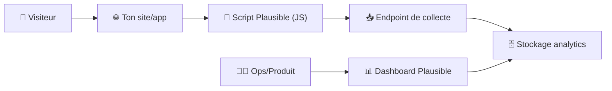
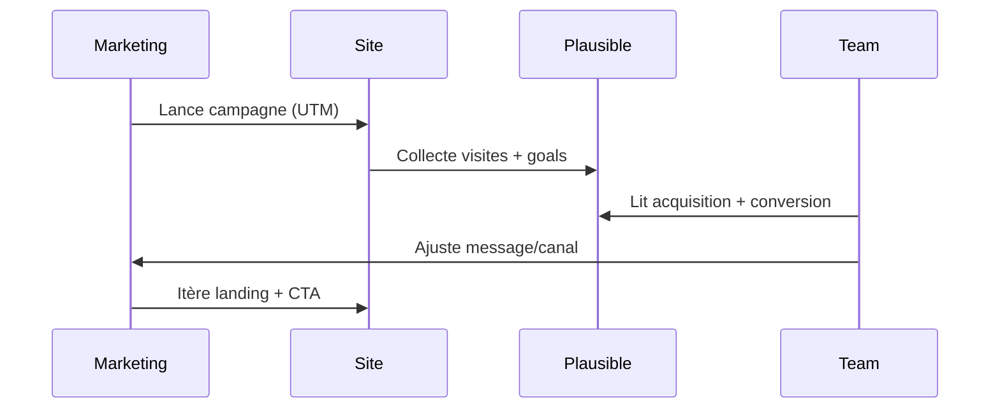

# 📈 Plausible Analytics — Présentation & Configuration Premium (Sans install / Sans Nginx / Sans Docker / Sans UFW)

### Analytics privacy-friendly, simple, gouvernable — pour une vraie “data hygiene”
Optimisé pour reverse proxy existant • Gouvernance d’équipe • Mesure propre (goals/events) • Exploitation durable

---

## TL;DR

- **Plausible** = analytics **sans cookies** (dans la plupart des cas), léger, orienté **privacy** et **simplicité**.
- Il mesure : **pages vues**, **sources**, **campagnes**, **appareils**, **pays**, et surtout des **objectifs (goals)**.
- Le “premium” = **plan de mesure** (goals/events), **exclusions**, **proxy du script** (option), **nomenclature UTM**, **validation**, **rollback**.

Sources produit :  
- https://plausible.io/  
- https://github.com/plausible/analytics  

---

## ✅ Checklists

### Pré-configuration (avant de collecter)
- [ ] Définir l’objectif business (ce qu’on veut piloter)
- [ ] Définir 5–10 KPIs max (sinon tu ne regarderas rien)
- [ ] Lister les parcours (landing → action)
- [ ] Décider : mesures **URL goals** vs **custom events**
- [ ] Décider : exclusion trafic interne (IP / header / segment)
- [ ] Poser une convention UTM (source/medium/campaign/content/term)

### Post-configuration (qualité de mesure)
- [ ] Vérifier que le script charge sur toutes les pages
- [ ] Vérifier que les goals déclenchent réellement (tests réels)
- [ ] Vérifier exclusions (trafic interne ≠ trafic client)
- [ ] Vérifier que les redirections ne cassent pas les URLs (HTTP→HTTPS, slash final)
- [ ] Documenter : conventions events, UTM, règles d’exclusion, “qui change quoi”

---

> [!TIP]
> Le meilleur analytics, c’est celui qui te donne **3 décisions** par semaine, pas 30 graphes “jolis”.

> [!WARNING]
> Sans plan de mesure (goals/events), tu finis avec “pageviews” et zéro action.

> [!DANGER]
> Évite de traquer des données sensibles (PII) dans les URLs, events, ou query params (emails, noms, tokens). Même en analytics “privacy-friendly”, c’est une dette.

---

# 1) Plausible — Vision moderne

Plausible n’est pas un “Google Analytics clone”.

C’est :
- 🧼 Un analytics **sobre** (moins de bruit, plus d’action)
- 🔐 Un analytics **privacy-first** (souvent sans cookies)
- 🧠 Un outil pour mesurer **l’essentiel** : acquisition → activation → conversion
- 🧩 Un système orienté **goals** (URL ou events)

Références :  
- https://plausible.io/  
- https://github.com/plausible/analytics  

---

# 2) Architecture globale (référence)



---

# 3) “Premium config mindset” (5 piliers)

1. 🎯 **Plan de mesure** (goals/events, nomenclature)
2. 🧭 **Hygiène des URLs** (slashes, canonicals, query params)
3. 🧹 **Exclusions & segmentation** (interne, staging, bots)
4. 🧪 **Validation / tests** (preuves, pas suppositions)
5. 🔁 **Rollback** (revenir en arrière sans casser la donnée)

---

# 4) Plan de mesure (ce qui fait 90% de la valeur)

## 4.1 Les 3 niveaux à définir
- **North Star Metric** : la métrique “business” (ex: demandes de démo)
- **Conversion goals** : 1–3 actions “money time”
- **Activation goals** : actions d’engagement (ex: création de compte, ajout au panier)

## 4.2 Goals : URL vs Events

### URL goals (simple, robuste)
Idéal si tu as une page de succès stable, ex :
- `/thank-you`
- `/checkout/success`
- `/signup/success`

Avantages :
- simple
- très fiable
- peu de dev

Risques :
- si tu changes l’URL, tu “casses” le goal

### Custom events (plus puissant)
Idéal si la conversion n’a pas d’URL dédiée, ex :
- clic bouton “Réserver”
- submit form AJAX
- paywall unlock

Avantages :
- très précis
- fonctionne en SPA
- mesure produit fine

Risques :
- demande une convention stricte
- dépend du front

---

# 5) Conventions events (naming premium)

## Règle d’or : un event = une action métier
Format recommandé :
- `Signup`
- `RequestDemo`
- `CheckoutStart`
- `CheckoutComplete`
- `NewsletterSubscribe`

Évite :
- `buttonClick`, `event123`, `testEvent`, `click_home_cta_v2_final`

> [!TIP]
> Si tu dois lire le code pour comprendre l’event, c’est un mauvais nom.

---

# 6) Implémentation “script” (sans recette d’install)

## 6.1 Script standard (exemple générique)
```html
<script defer data-domain="example.com" src="https://plausible.example.com/js/script.js"></script>
```

## 6.2 Custom events (exemple)
```html
<button onclick="plausible('RequestDemo')">Demander une démo</button>
```

> [!WARNING]
> En SPA (React/Vue/Next), assure-toi que les “pageviews” et events sont déclenchés au bon moment (route changes, hydration).

---

# 7) Hygiène des URLs (pour des stats “propres”)

## 7.1 Canonicalisation
Objectif : 1 contenu = 1 URL analytics.

À harmoniser :
- `https://example.com` vs `https://www.example.com`
- `/page` vs `/page/`
- `?ref=...` (query params) si elles polluent

## 7.2 Query params : stratégie
- Garder seulement celles qui ont du sens (UTM, éventuellement `ref`)
- Éviter tout ce qui est session/token/email

> [!TIP]
> Sans règles URL, tu obtiens 12 lignes différentes pour la même page.

---

# 8) Exclusions & environnements (anti-bruit)

## 8.1 Trafic interne
Objectif : tes équipes ne “gonflent” pas les stats.

Méthodes typiques :
- exclusion par IP (bureaux, VPN)
- segmentation par hostname (prod vs staging)
- règles au niveau reverse proxy (headers dédiés)

## 8.2 Staging / Preview
Recommandation :
- soit un **site Plausible séparé** (staging)
- soit une exclusion forte des hostnames staging

---

# 9) Workflows premium (pilotage produit & marketing)

## 9.1 Boucle “marketing → conversion”


## 9.2 Dashboard “lisible en 30 secondes”
- Top sources (UTM + referers)
- Top pages d’entrée
- Goals (conversion + activation)
- Appareils (mobile vs desktop)
- Pays (si utile, sinon ignore)

> [!TIP]
> Si ton dashboard n’aide pas à décider, coupe des widgets.

---

# 10) Validation / Tests / Rollback

## 10.1 Tests de validation (smoke tests)
```bash
# Vérifier que le script est accessible
curl -I https://plausible.example.com/js/script.js | head

# Vérifier qu'une page charge bien le script (si tu peux récupérer le HTML)
curl -s https://example.com | grep -i plausible || true
```

## 10.2 Tests fonctionnels (preuves)
- Ouvre ton site en navigation privée
- Déclenche 1 pageview
- Déclenche 1 goal (URL ou event)
- Vérifie que ça remonte dans le dashboard (temps réel / délai selon config)

## 10.3 Rollback (safe)
- Si le script casse une page : retire-le (feature flag) → retour immédiat
- Si un goal est mauvais : le désactiver + recréer avec bon nom
- Si UTM deviennent ingérables : standardiser & corriger campagnes futures (ne pas “réécrire le passé”)

> [!WARNING]
> En analytics, le rollback doit préserver : **site stable** + **données futures propres**. L’historique est rarement “réparable”.

---

# 11) Erreurs fréquentes (et fixes)

- ❌ “Je vois trop de pages différentes”
  - Fix : canonicals, slash policy, query params policy
- ❌ “Les conversions ne remontent pas”
  - Fix : goal URL incorrect, SPA route changes, event jamais appelé
- ❌ “Les stats sont gonflées”
  - Fix : exclusion trafic interne, staging, bots
- ❌ “UTM incohérents”
  - Fix : convention UTM + template obligatoire

---

# 12) Sources — Images Docker (comme tu le veux, URLs brutes)

## 12.1 Image officielle la plus citée
- `plausible/analytics` (Docker Hub) : https://hub.docker.com/r/plausible/analytics  
- Repo upstream (référence produit) : https://github.com/plausible/analytics  

## 12.2 Community Edition (si tu croises ce nom d’image)
- `plausible/community-edition` (Docker Hub) : https://hub.docker.com/r/plausible/community-edition  
- Repo Community Edition (compose & docs communautaires) : https://github.com/plausible/community-edition  

## 12.3 Repos “hosting” souvent référencés
- Repo hosting (Plausible) : https://github.com/plausible/hosting  

## 12.4 LinuxServer.io (LSIO)
- Liste officielle des images LSIO (pour vérifier l’existence d’une image dédiée) : https://www.linuxserver.io/our-images  
- À la date du 2026-03-01, je ne vois pas d’image “plausible” publiée officiellement par LSIO dans leur liste d’images (à revérifier via la page ci-dessus).

---

# ✅ Conclusion

Plausible devient “premium” quand tu :
- définis un **plan de mesure** clair (goals/events),
- nettoies tes **URLs** et tes **UTM**,
- exclues le **bruit** (interne/staging),
- valides par **tests réels**,
- gardes un **rollback** simple (feature flag / retrait script / goals propres).