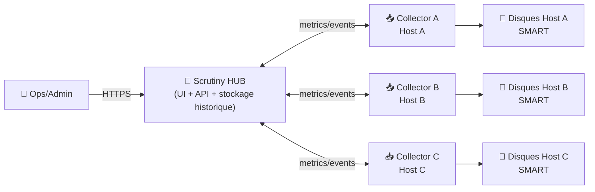
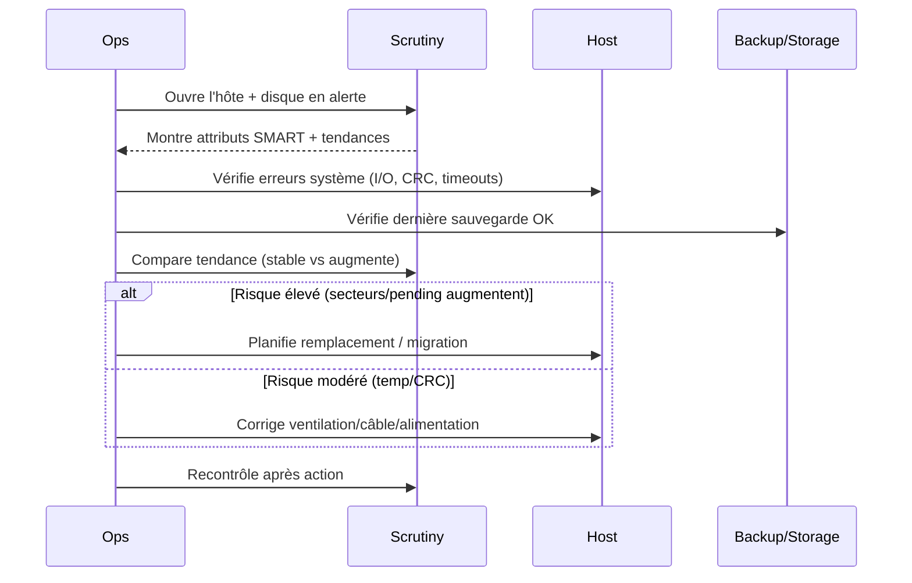

# 🧠 Scrutiny — Présentation & Exploitation Premium (SMART / Santé Disques)

### Dashboard de santé disque + tendances + seuils “réels” (Backblaze) + collecte multi-hôtes
Optimisé pour environnements homelab & prod • Gouvernance • Alerting • Validation & Rollback

---

## TL;DR

- **Scrutiny** centralise la **santé S.M.A.R.T.** des disques (températures, secteurs réalloués, erreurs, etc.) dans un **dashboard**.
- Il combine :
  - 📈 **tendances** et historique
  - 🧪 **seuils intelligents** basés sur des données de pannes “réelles” (Backblaze)
  - 🌐 **collecte multi-machines** (Hub/Spoke : UI centrale + collecteurs)
- Version “premium ops” = **scope clair**, **seuils**, **workflows incident**, **tests**, **rollback**, **discipline de logs**.

---

## ✅ Checklists

### Pré-usage (avant d’en faire une source de vérité)
- [ ] Définir le périmètre : quels hôtes, quels disques, quelle fréquence de collecte
- [ ] Définir des seuils “actionnables” (température, secteurs, erreurs critiques)
- [ ] Définir un “incident workflow” (quoi vérifier, quand escalader)
- [ ] Valider l’accès : outil réservé Ops / Admin (données sensibles possibles)
- [ ] Documenter : où trouver l’info, comment interpréter, quoi faire ensuite

### Post-configuration (qualité opérationnelle)
- [ ] Tous les hôtes remontent des données (noms cohérents)
- [ ] Les alertes (si utilisées) déclenchent des actions claires
- [ ] Les tendances sont lisibles (mêmes unités, pas de “host générique”)
- [ ] Un runbook “Disque en risque” existe (diagnostic + décision)
- [ ] Un plan de rollback (désactivation seuils/agents) est documenté

---

> [!TIP]
> Scrutiny est excellent pour passer de “je regarde SMART quand j’y pense” à “j’ai une vision continue, actionnable, et comparée à des seuils réalistes”.

> [!WARNING]
> SMART n’est pas une boule de cristal : certains disques meurent “sans prévenir”.  
> Scrutiny aide à **réduire** le risque, pas à l’annuler. Garde une stratégie de backup.

> [!DANGER]
> Si les noms d’hôtes/collecteurs sont mal définis (ou si la config est absente), tu peux te retrouver avec des hôtes génériques et des seuils par défaut → dashboard moins fiable et alertes peu pertinentes.

---

# 1) Scrutiny — Vision moderne

Scrutiny n’est pas juste “un viewer SMART”.

C’est :
- 🧠 Un **système de décision** (seuils + trends + signaux faibles)
- 📊 Un **dashboard** lisible pour la maintenance préventive
- 🌐 Un **modèle multi-hôtes** (Hub central + collecteurs)
- 🧰 Un **outil d’exploitation** (audit, preuves, historique, post-mortems)

Référence projet : https://github.com/AnalogJ/scrutiny

---

# 2) Architecture globale (Hub / Spoke)



Doc Hub/Spoke (installation hybride possible) :  
https://github.com/AnalogJ/scrutiny/blob/master/docs/INSTALL_HUB_SPOKE.md

---

# 3) Les 5 piliers d’une config “premium”

1. 🧭 **Inventaire fiable** : hôtes nommés correctement, disques identifiés
2. 🌡️ **Seuils actionnables** : températures / erreurs / secteurs → décisions
3. 📈 **Tendances > instantané** : surveiller les dérives (temp qui monte, erreurs qui s’accumulent)
4. 🔔 **Alerting discipliné** : peu d’alertes, mais utiles (sinon fatigue)
5. 🧪 **Validation + rollback** : tests périodiques, retour arrière simple

---

# 4) Interprétation SMART (pratique, pas “théorie”)

## Signaux typiques “à surveiller”
- 🌡️ **Température** : dérive progressive = ventilation, poussière, charge, placement NAS
- 🧱 **Secteurs réalloués / pending** : risque accru, surveiller l’évolution (pas juste “valeur non nulle”)
- ⚠️ **Erreurs CRC / interface** : souvent câble/port/alimentation plutôt que disque lui-même
- ⏱️ **Heures de fonctionnement** : utile pour comparer vieillissement / rotation / lot

> [!TIP]
> La valeur la plus utile est souvent la **tendance** : “ça augmente” > “c’est non nul”.

---

# 5) Seuils & “Real-world failure rates” (Backblaze)

Scrutiny met en avant l’idée de relier des métriques SMART à des seuils issus de données de pannes observées (Backblaze).

- Projet : https://github.com/AnalogJ/scrutiny
- Référence Backblaze Drive Stats : https://www.backblaze.com/cloud-storage/resources/hard-drive-test-data

> [!WARNING]
> Les stats Backblaze reflètent un contexte (datacenters, modèles de disques, lots).  
> Utilise-les comme **guide**, puis ajuste selon ton environnement.

---

# 6) Workflows premium (incident & maintenance)

## 6.1 Triage “Disque en risque”


## 6.2 Routine “maintenance mensuelle”
- vérifier : top disques les plus chauds
- repérer : dérives lentes (temp +2/+5°C sur 3 mois)
- lister : disques avec erreurs qui apparaissent
- noter : actions prises (post-mortem léger)

---

# 7) Sécurité & Gouvernance (sans recettes reverse-proxy)

## Accès (recommandations)
- Réserver Scrutiny à :
  - Ops / Admin / équipe infra
- Éviter l’accès public direct
- Considérer l’auth externe/SSO si plusieurs équipes

> [!WARNING]
> Les infos SMART + inventaire de disques peuvent aider un attaquant à profiler ton infra (matériel, volumes, usages).  
> Traite ça comme une donnée sensible.

---

# 8) Validation / Tests / Rollback

## Tests de validation (fonctionnels)
```bash
# 1) Vérifier que l’UI répond
curl -I https://scrutiny.example.tld | head

# 2) Vérifier qu’un hôte “critique” remonte bien des métriques
# (manuel) Ouvrir Scrutiny -> Hosts -> Host A -> Disks -> vérifier valeurs & graphiques

# 3) Vérifier la cohérence des noms (pas de host générique)
# (manuel) Vérifier que Hostname/ID = attendu (NAS-01, VPS-02, etc.)
```

## Tests “qualité” (mensuel)
- un disque “chaud” → action (ventilation) → vérifier baisse
- une alerte “secteurs” (si lab) → vérifier déclenchement + runbook

## Rollback (principe)
- Si un changement de seuils/alerting crée du bruit :
  - revenir aux seuils précédents (versionner les configs)
- Si un collecteur pose problème :
  - le désactiver sans casser le hub
- Objectif : rollback en **minutes**, pas en heures

> [!TIP]
> Versionne les configs (Git) et note le “pourquoi” des seuils.  
> Sinon, tu ne sauras pas si tu as “réparé” ou juste “désactivé l’alarme”.

---

# 9) Erreurs fréquentes (et comment les éviter)

- ❌ **Hôtes génériques / mal nommés**  
  ✅ fixer une convention (NAS-01 / NODE-02) et l’appliquer à tous les collecteurs

- ❌ **Alertes trop nombreuses**  
  ✅ réduire à quelques signaux critiques + seuils adaptés

- ❌ **Confondre CRC (câble) avec disque mourant**  
  ✅ investiguer connectique/alim/port avant remplacement

- ❌ **Se fier à un instantané**  
  ✅ regarder la tendance (7/30/90 jours) avant décision

---

# 10) Sources — Images Docker (format “URLs brutes”)

## 10.1 Images officielles Scrutiny (les plus citées)
- `ghcr.io/analogj/scrutiny:master-omnibus` (GitHub Container Registry) : https://github.com/AnalogJ/scrutiny/pkgs/container/scrutiny
- Repo Scrutiny (référence upstream, section Docker) : https://github.com/AnalogJ/scrutiny#docker
- Manuel Hub/Spoke (référence déploiement multi-hôtes) : https://github.com/AnalogJ/scrutiny/blob/master/docs/INSTALL_HUB_SPOKE.md

## 10.2 LinuxServer.io (existe, mais image dépréciée)
- `linuxserver/scrutiny` (Docker Hub) : https://hub.docker.com/r/linuxserver/scrutiny
- Notice de dépréciation (LSIO) : https://docs.linuxserver.io/deprecated_images/docker-scrutiny/
- Détail dépréciation (LSIO status/issue) : https://info.linuxserver.io/issues/2022-06-13-scrutiny/

## 10.3 Ressource “failure rates” citée
- Backblaze Hard Drive Test Data : https://www.backblaze.com/cloud-storage/resources/hard-drive-test-data