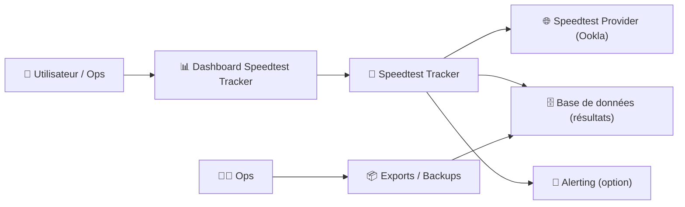
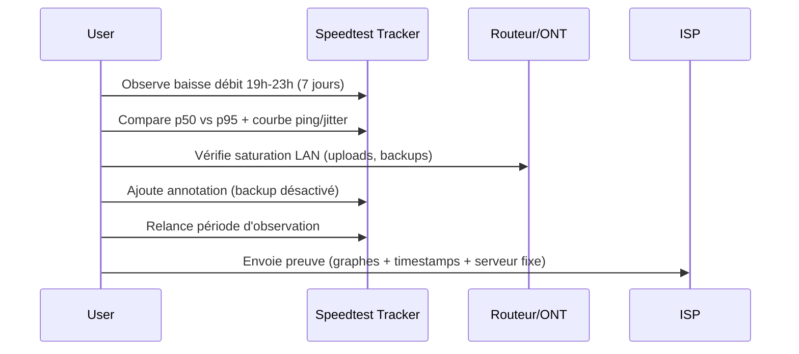

# 📶 Speedtest Tracker — Présentation & Configuration Premium (Mesure & suivi de débit)

### Monitoring de performance Internet (débit/latence/jitter) + dashboards + historique
Optimisé pour reverse proxy existant • Qualité de mesures • Gouvernance • Exploitation durable

---

## TL;DR

- **Speedtest Tracker** exécute des tests (souvent basés sur **Ookla Speedtest**) et **historise** les résultats (débit, ping, jitter, uptime).
- Objectif : **voir la réalité** de ta connexion (pics, heures, incidents, perte de perf) et **prouver** un problème ISP.
- Version “premium” : fréquence raisonnable + sélection serveur + cohérence métriques + alerting + règles de conservation + validation + rollback.

Docs projet : https://docs.speedtest-tracker.dev/  
Repo : https://github.com/alexjustesen/speedtest-tracker

---

## ✅ Checklists

### Pré-configuration (qualité de mesure)
- [ ] Définir l’objectif : “preuve ISP”, “SLA maison”, “stabilité VPN”, “upline DC”
- [ ] Choisir la fréquence (éviter de spammer / fausser) : ex. toutes les 30–60 min
- [ ] Définir un serveur de test fixe OU une stratégie de sélection (stabilité vs réalisme)
- [ ] Décider des seuils d’alerte (ex: ping/jitter/packet loss si dispo)
- [ ] Définir la rétention (ex: 90 jours, 1 an) + export (CSV/backup)

### Post-configuration (go-live)
- [ ] Les résultats se stockent correctement (pas de trous)
- [ ] Les graphiques sont cohérents (pas de valeurs aberrantes permanentes)
- [ ] Les alertes déclenchent correctement (test “incident simulé”)
- [ ] La timezone est correcte (sinon les graphes mentent)
- [ ] Le runbook “incident perf internet” est prêt

---

> [!TIP]
> Pour des graphes “parlants”, la **cohérence** est plus importante que la fréquence : même serveur, même protocole, même fenêtre horaire.

> [!WARNING]
> Tester trop souvent peut **fausser** tes propres résultats (saturation) et/ou te faire limiter par le fournisseur de test.

> [!DANGER]
> Ne traite pas les chiffres comme absolus : Wi-Fi, congestion locale, routage ISP, CGNAT, peering… Tout peut impacter. Documente le contexte (heure, réseau, équipement).

---

# 1) Vision moderne (ce que Speedtest Tracker apporte vraiment)

Speedtest Tracker n’est pas “un speedtest avec un joli graphe”.

C’est :
- 📈 Un **historien** (tendance, saisonnalité, incidentologie)
- 🧪 Un **instrument de mesure** (débit descendant/montant, latence, jitter selon implémentation)
- 🧠 Un **outil de décision** (est-ce le Wi-Fi ? l’ISP ? le routeur ?)
- 🧾 Un **élément de preuve** (tickets ISP, SLA, comparatifs avant/après)

---

# 2) Architecture globale



---

# 3) Stratégie de mesure (le cœur “premium”)

## 3.1 Fréquence recommandée (pragmatique)
- **30–60 min** : bon compromis (tendance + incidents)
- **15 min** : si tu diagnostiques un incident récurrent (temporaire)
- **1–3 h** : si tu veux juste “santé globale” sans bruit

🎯 Règle : augmente la fréquence seulement quand tu cherches une cause.

## 3.2 Serveur de test : fixe vs auto
- **Serveur fixe** (recommandé pour tendances) :
  - comparabilité maximale
  - moins de variance
- **Auto** (représente “l’expérience réelle”) :
  - variance plus forte
  - utile si tu veux refléter le routage du moment

> [!TIP]
> Mode “preuve ISP” : fixe un serveur proche/fiable, et garde-le identique pendant des semaines.

## 3.3 Où mesurer (placement réseau)
- **Idéal** : depuis un point câblé proche du routeur (évite le bruit Wi-Fi)
- **Comparatif** : un second point de mesure en Wi-Fi pour prouver l’écart LAN/Wi-Fi
- **Attention** : si tu mesures depuis un VPS, tu mesures surtout… le VPS et la route vers lui.

---

# 4) Lecture des métriques (pour éviter les mauvaises conclusions)

## Débit descendant / montant
- Sensible à : congestion, peering, QoS, bufferbloat, uploads simultanés
- Valeur utile : tendance sur 7/30 jours + percentiles (p50/p95)

## Latence (ping) & jitter
- La **latence** reflète la réactivité.
- Le **jitter** reflète l’instabilité (voix/visio/gaming).
- Une baisse de débit sans hausse de ping ≠ même cause qu’une hausse de ping + jitter.

> [!WARNING]
> Un “bon débit” avec un jitter élevé peut être pire qu’un débit moyen stable (visioconf / VoIP).

---

# 5) Alerting (quand et comment)

## Exemples de seuils (à adapter)
- Ping > X ms sur Y tests consécutifs
- Download < X Mbps sur Y tests consécutifs
- Upload < X Mbps sur Y tests consécutifs
- Jitter > X ms sur Y tests consécutifs

## Bonnes pratiques
- Privilégie **N tests consécutifs** pour éviter les faux positifs
- Ajoute une “fenêtre de maintenance” (ex: la nuit si l’ISP fait des travaux)
- Loggue le contexte : reboot routeur, MAJ firmware, changement câble, etc.

---

# 6) Qualité des données (anti “graphes menteurs”)

## 6.1 Normaliser le contexte
- même point de mesure (machine/host)
- même interface (Ethernet vs Wi-Fi)
- même charge réseau (éviter backups/seedbox pendant le test)
- mêmes DNS/routeur si possible

## 6.2 Gérer les valeurs aberrantes
- note les événements (coupure, reboot, maintenance)
- corrèle avec tes logs routeur/modem si tu les as
- ne panique pas sur un seul point isolé

---

# 7) Sécurité & exposition (sans recettes d’install)

- Accès via reverse proxy existant + auth (SSO/forward-auth/VPN)
- Comptes à privilèges minimaux
- Ne pas publier publiquement les graphes si ça révèle ton infra (heures d’absence, patterns)

> [!DANGER]
> Les historiques de performance peuvent aider un attaquant à comprendre tes habitudes, et parfois ton exposition (pannes, plages horaires).

---

# 8) Workflows premium (diagnostic “pro”)

## 8.1 Incident : “internet lent le soir”


## 8.2 Checklist “preuve ISP”
- Serveur fixe
- Mesure en Ethernet
- Fréquence 30–60 min
- Capture sur 7–14 jours
- Graphes débit + ping/jitter
- Notes des événements (reboot, travaux, etc.)

---

# 9) Validation / Tests / Rollback

## Tests de validation (smoke)
```bash
# Vérifier que l'UI répond (adapter host/url)
curl -I https://speedtest.example.tld | head

# Vérifier présence de nouveaux résultats (contrôle visuel dashboard)
# Vérifier que la courbe se met à jour après un test planifié
```

## Tests de cohérence (anti-faux)
- Les tests sont à intervalles réguliers (pas de trous)
- La timezone est correcte (courbes alignées sur les heures réelles)
- Les valeurs sont plausibles (pas 0 Mbps récurrent sans incident réel)

## Rollback (opérationnel)
- Revenir à la dernière configuration stable (fréquence, serveur, alertes)
- Restaurer les exports/backup DB si une mise à jour casse l’historique (si tu en fais)
- Garder un runbook “retour arrière” : 5 minutes max

---

# 10) Sources — Images Docker (format demandé, URLs brutes uniquement)

## 10.1 Image “officielle / recommandée” (LinuxServer.io)
- `lscr.io/linuxserver/speedtest-tracker` (registre LSIO) : https://lscr.io/linuxserver/speedtest-tracker  
- `linuxserver/speedtest-tracker` (Docker Hub) : https://hub.docker.com/r/linuxserver/speedtest-tracker  
- Doc LinuxServer (image) : https://docs.linuxserver.io/images/docker-speedtest-tracker/  
- Repo packaging LinuxServer : https://github.com/linuxserver/docker-speedtest-tracker  
- Docs Speedtest Tracker (indique que l’image est construite par LinuxServer.io) : https://docs.speedtest-tracker.dev/getting-started/installation  

## 10.2 Image communautaire la plus citée (upstream du projet)
- `ghcr.io/alexjustesen/speedtest-tracker` (GitHub Container Registry) : https://github.com/alexjustesen/speedtest-tracker  
- Site / docs projet : https://docs.speedtest-tracker.dev/  
- Repo source (référence) : https://github.com/alexjustesen/speedtest-tracker  

## 10.3 Alternatives “speedtest” (autres approches)
- `openspeedtest/latest` (Docker Hub — serveur speedtest web) : https://hub.docker.com/r/openspeedtest/latest  
- OpenSpeedTest (self-hosted info) : https://openspeedtest.com/selfhosted-speedtest  
- Repo Docker OpenSpeedTest : https://github.com/openspeedtest/Docker-Image  
- `lscr.io/linuxserver/librespeed` (LSIO — alternative self-hosted) : https://docs.linuxserver.io/images/docker-librespeed/  

---

# ✅ Conclusion

Speedtest Tracker est une brique “observabilité Internet” :
- utile quand tu veux **comprendre** et **prouver**,
- fiable quand tu rends la mesure **cohérente**,
- pro quand tu ajoutes **alerting + gouvernance + validation + rollback**.