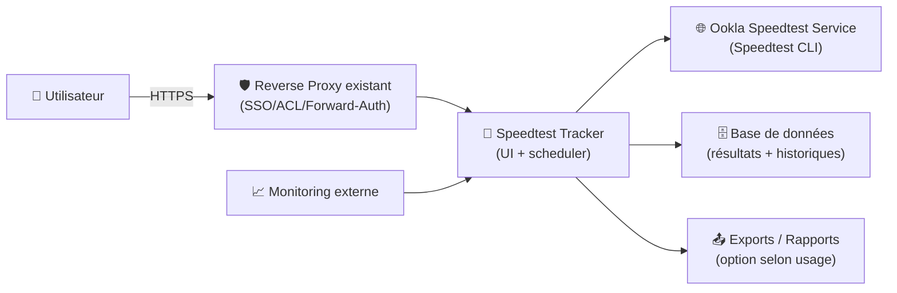
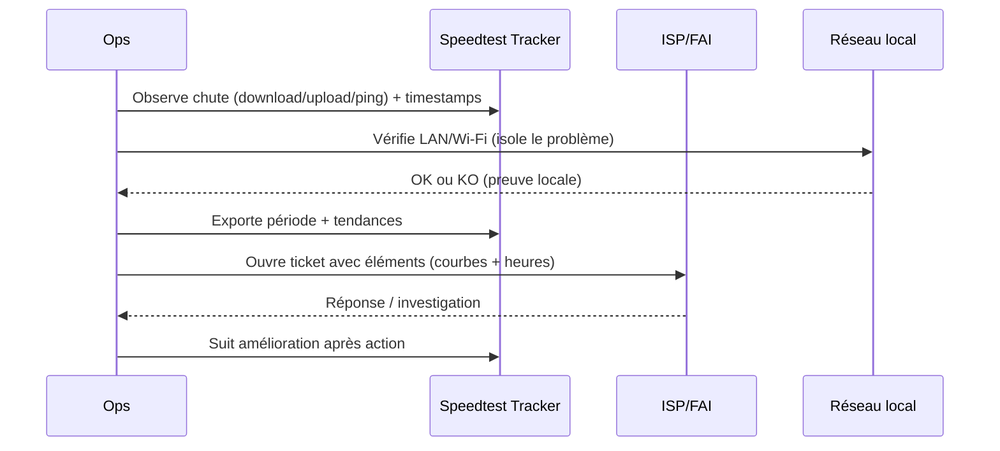

# 📡 Speedtest Tracker — Présentation & Configuration Premium (Observabilité Internet)

### Suivi automatique de débit + latence + disponibilité • Historique & graphiques • Alerting possible
Optimisé pour reverse proxy existant • Gouvernance & données propres • Exploitation durable

---

## TL;DR

- **Speedtest Tracker** mesure automatiquement ta connexion (download / upload / ping, selon config) via **Speedtest CLI (Ookla)**.
- Il stocke les résultats, affiche des **graphiques**, et aide à objectiver : “ça rame quand ? combien ?”.
- Une config premium = **cadence réaliste**, **serveurs cohérents**, **données propres**, **auth/accès**, **rétention**, **tests & rollback**.

> [!WARNING]
> L’exécution des tests implique d’accepter les conditions d’utilisation / privacy d’Ookla (Speedtest CLI).  
> Référence : https://docs.speedtest-tracker.dev/

---

## ✅ Checklists

### Pré-configuration (avant de l’ouvrir à d’autres)
- [ ] Définir l’objectif : suivi FAI / SLA interne / diagnostic Wi-Fi / baseline
- [ ] Choisir la cadence (éviter de spammer) + horaires (heures pleines vs aléatoire)
- [ ] Définir la zone/serveurs (cohérence des mesures)
- [ ] Décider quoi exposer : dashboard public ? privé ? multi-users ?
- [ ] Définir la rétention et l’export (reporting, litiges FAI)

### Post-configuration (qualité opérationnelle)
- [ ] Série de tests “baseline” validée (24–72h)
- [ ] Mesures cohérentes (pas de serveurs qui changent à chaque run)
- [ ] Alerting (si utilisé) testés avec un faux incident
- [ ] Procédure de validation + rollback documentée

---

> [!TIP]
> Pour des graphes “utilisables”, le secret c’est **la stabilité** : même environnement, mêmes plages horaires, mêmes serveurs (ou une stratégie contrôlée).

> [!DANGER]
> Trop de tests = surconsommation de data + risque de throttling/ban + résultats biaisés (tu mesures ton propre spam).  
> “Plus souvent” ≠ “plus précis”.

---

# 1) Speedtest Tracker — Vision moderne

Speedtest Tracker n’est pas juste “un speedtest dans un dashboard”.

C’est :
- 🧭 Un **capteur** (télémetrie Internet)
- 📈 Un **historique** (tendance, corrélation)
- 🧪 Un **outil de preuve** (dégradation, incidents, SLA)
- 🔔 Un **déclencheur** (alerting selon seuils, selon options)

Documentation officielle : https://docs.speedtest-tracker.dev/

---

# 2) Architecture globale

---

# 3) “Premium config mindset” (5 piliers)

1. ⏱️ **Cadence réaliste** (mesurer sans perturber)
2. 🧷 **Cohérence de serveur** (comparables dans le temps)
3. 🧹 **Données propres** (rétention, tags, contexte)
4. 🔐 **Accès maîtrisé** (privé par défaut)
5. 🧪 **Validation + rollback** (pro, reproductible)

---

# 4) Stratégie de mesure (ce qui fait la différence)

## 4.1 Cadence recommandée (pragmatique)
- **Toutes les 60 minutes** : bon compromis “tendance”
- **Toutes les 15 minutes** : si tu veux détecter des micro-coupures (attention charge)
- **Toutes les 3–6 heures** : si objectif “preuve FAI” à long terme

> [!TIP]
> Ajoute un test “heures de pointe” (ex: 19h–23h) + un test “heures creuses” (ex: 3h–6h) pour capturer la congestion.

## 4.2 Choix du serveur de test (comparabilité)
- Stratégie A (stable) : **serveur fixe** (mêmes conditions → comparables)
- Stratégie B (semi-stable) : **liste courte** de serveurs (failover)
- Stratégie C (auto) : server auto (plus “réaliste”, moins comparable)

> [!WARNING]
> Si le serveur change trop souvent, tu “mesures le serveur” autant que ton Internet.

## 4.3 Contexte (tags / notes d’événements)
Prévois un espace “événements” :
- changement de box / firmware
- nouveau routeur / nouveau Wi-Fi
- travaux opérateur
- modification QoS

But : expliquer les ruptures de tendance.

---

# 5) Gouvernance & Accès (sans recettes proxy)

## Approche recommandée
- ✅ Accès privé (SSO/forward-auth) via ton reverse proxy existant
- ✅ Multi-users si tu partages l’outil (lecture seule pour la plupart)
- ✅ Pas de dashboard public sauf besoin (et alors: anonymiser/limiter)

> [!DANGER]
> Les graphes de débit révèlent des infos sur ta ligne (habitudes, disponibilité). Traite ça comme un outil interne.

---

# 6) Rétention, export, “preuve FAI”

## Rétention
- Court terme (diagnostic) : 30–90 jours
- Long terme (tendance / litige) : 12–24 mois (selon stockage)

## Exports / Rapports
- Objectif : pouvoir sortir un “mois glissant” avec min/avg/max, p95, downtime (selon capacités/options)

Documentation (intro + versions) : https://docs.speedtest-tracker.dev/

---

# 7) Workflows premium (incident & support FAI)

## 7.1 Triage incident (séquence)

## 7.2 “Preuve” simple (méthode)
- montrer **avant / pendant / après**
- mêmes plages horaires
- serveur stable
- joindre 1–2 tests manuels externes en parallèle (pour corroborer)

---

# 8) Validation / Tests / Rollback

## 8.1 Validation (baseline 24–72h)
- Vérifier :
  - données qui s’ajoutent à l’intervalle prévu
  - graphes cohérents
  - pas de “trous” anormaux
  - latence/ping plausible (pas 0ms, pas 9999ms en continu)

## 8.2 Tests “anti-biais”
- Un test Ethernet vs Wi-Fi (si possible)
- Un test à heure fixe (ex: 21h) pendant 7 jours
- Un test à heure creuse (ex: 05h) pendant 7 jours

## 8.3 Rollback (simple)
- Revenir à une config stable :
  - cadence précédente
  - serveur précédent
  - désactiver alerting (si spam)
- Restaurer l’état (selon ta stratégie de sauvegarde de la DB/app)

---

# 9) Erreurs fréquentes (et corrections)

## “Graphes incohérents”
Cause : serveurs variables / horaires variables / Wi-Fi instable  
Fix : serveur fixe + Ethernet pour baseline + cadence stable

## “Résultats trop beaux / trop moches”
Cause : tests lancés quand le réseau est saturé (sauvegardes, cloud sync)  
Fix : planifier hors gros transferts + noter les événements

## “Trous / pas de résultats”
Cause : scheduler stoppé, dépendances, quota/erreur CLI  
Fix : vérifier logs, cadence, et stabilité du service Speedtest CLI

---

# 10) Sources — Images Docker (format demandé, URLs brutes)

## 10.1 Image officielle recommandée (LinuxServer.io)
- `linuxserver/speedtest-tracker` (Docker Hub) : https://hub.docker.com/r/linuxserver/speedtest-tracker  
- Tags (versions/arch) : https://hub.docker.com/r/linuxserver/speedtest-tracker/tags  
- Doc LinuxServer (image) : https://docs.linuxserver.io/images/docker-speedtest-tracker/  
- Repo de build (LinuxServer) : https://github.com/linuxserver/docker-speedtest-tracker  

## 10.2 Source applicative (projet upstream)
- Repo Speedtest Tracker : https://github.com/alexjustesen/speedtest-tracker  
- Documentation officielle : https://docs.speedtest-tracker.dev/  
- Page “Installation” (mentionne image LSIO) : https://docs.speedtest-tracker.dev/getting-started/installation  

## 10.3 Images communautaires (historiques / alternatives)
- `henrywhitaker3/speedtest-tracker` (Docker Hub) : https://hub.docker.com/r/henrywhitaker3/speedtest-tracker/  
- Repo HenryWhitaker3 (ancien packaging) : https://github.com/henrywhitaker3/Speedtest-Tracker  
- `ajustesen/speedtest-tracker-docker` (Docker Hub) : https://hub.docker.com/r/ajustesen/speedtest-tracker-docker  

---

# ✅ Conclusion

Speedtest Tracker devient “premium” quand tu :
- mesures **juste assez** (cadence),  
- restes **comparable** (serveur),  
- gardes des **données propres** (rétention + contexte),  
- sécurises l’accès,  
- et sais valider/rollback sans stress.