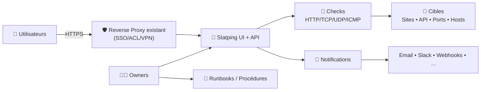
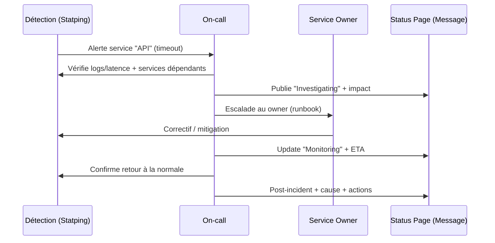

# 📡 Statping — Présentation & Configuration Premium (Sans install / Sans Nginx / Sans Docker / Sans UFW)

### Status Page + Monitoring léger : checks HTTP/TCP/UDP/ICMP, alerting, analytics
Optimisé pour reverse proxy existant • Gouvernance • Qualité des checks • Exploitation durable

---

## TL;DR

- **Statping** fournit une **page de statut** + un **moteur de checks** (sites/services) avec historique et notifications.
- Il est **historiquement très populaire**, mais le projet “Statping original” est souvent considéré comme **peu actif**, et la pratique moderne est plutôt d’utiliser **Statping-NG** (fork) voire **Statping NEXT** (fork du fork).
- Une configuration premium = **checks bien conçus**, **groupes + SLO**, **maintenance**, **alerting propre**, **sécurité d’accès**, **runbooks**, **validation & rollback**.

---

## ✅ Checklists

### Pré-configuration (design)
- [ ] Définir l’objectif : “statut public” vs “console interne”
- [ ] Lister les services : endpoints, ports, dépendances (DB, cache, queue)
- [ ] Définir la granularité : “service global” vs “composants”
- [ ] Définir les seuils : timeouts, retries, périodes de check
- [ ] Définir l’alerting : qui reçoit quoi, à partir de quel niveau
- [ ] Définir la maintenance : comment “mute” proprement les alertes

### Post-configuration (qualité)
- [ ] Chaque service a : description, owner, runbook, tags
- [ ] Chaque check a : timeout, intervalle, retries cohérents
- [ ] Les dépendances ne causent pas d’effet domino (grouping)
- [ ] Les notifications sont testées (panne simulée)
- [ ] Le statut est compréhensible par un non-tech (message + impact)
- [ ] Un plan rollback est documenté

---

> [!TIP]
> La valeur d’une status page ne vient pas des graphs : elle vient de **la clarté**, **la fiabilité**, et **le process incident**.

> [!WARNING]
> Une status page qui alerte trop = une status page ignorée. Les seuils et la stratégie d’alerting sont plus importants que le nombre de checks.

> [!DANGER]
> Ne mélange pas “monitoring interne bruité” et “statut client” : tu vas sur-notifier ou exposer des infos sensibles. Sépare ou filtre.

---

# 1) Statping — Vision moderne

Statping n’est pas seulement une page “vert/rouge”.

C’est :
- 🧪 Un **moteur de checks** (HTTP, TCP, UDP, ICMP, etc.)
- 🧩 Un **modèle de services** (groupes, visibilité, messages)
- 🔔 Un **moteur de notifications** (multi-canaux)
- 📊 Un **historique** (uptime, latence, incidents)
- 🧠 Une **surface de communication** (clients, équipes, post-mortems)

Référence projet original : https://github.com/statping/statping

---

# 2) Écosystème & réalité “projet vivant”

## Variante recommandée aujourd’hui (souvent)
- **Statping-NG** : fork “drop-in replacement” après ralentissement du projet original  
  https://github.com/statping-ng/statping-ng
- **Statping NEXT** : fork de Statping-NG, motivé par une volonté de changements non intégrés  
  https://github.com/statping-next/statping-next

> [!WARNING]
> Si tu pars de zéro et que tu veux un projet plus “vivant”, regarde aussi des alternatives modernes (ex: Uptime Kuma).  
> Mais si tu veux l’écosystème Statping, **Statping-NG** est généralement le point de départ actuel.

---

# 3) Architecture globale (conceptuelle)

---

# 4) Philosophie premium (5 piliers)

1. 🎯 **Design des checks** (signal > bruit)
2. 🧭 **Gouvernance** (groupes, ownership, messages)
3. 🔔 **Alerting** (escalade, silence/maintenance, tests)
4. 🛡️ **Accès sécurisé** (reverse proxy existant, SSO/ACL)
5. 🧪 **Validation & rollback** (tests, panne simulée, retour arrière)

---

# 5) Design des checks (le cœur stratégique)

## 5.1 Choisir le bon type de check
- **HTTP** : meilleure option pour API/web (code, latence, contenu)
- **TCP** : “port ouvert + handshake” (ex: 5432, 6379)
- **ICMP/Ping** : utile mais souvent trompeur (réseau OK ≠ service OK)
- **UDP** : cas spécifiques (DNS, syslog, etc.)

> [!TIP]
> Pour une API : préfère un endpoint “/healthz” qui teste le minimum vital (DB connect, queue, cache optionnel) et renvoie un code clair.

## 5.2 Timeouts, retries, intervals (anti-faux positifs)
Stratégie robuste :
- Timeout court mais réaliste (ex: 2–5s selon service)
- Retries limités (ex: 1–2) pour éviter le flapping
- Intervalle aligné sur la criticité (ex: 30s critique, 1–5 min standard)

## 5.3 Anti “domino failures”
Si ton service A dépend de B, et B dépend de C :
- si C tombe, A et B vont tomber → explosion d’alertes
Solution :
- séparer “service user-facing” et “dépendances” en **groupes**
- n’alerter fort que sur le “user-facing”, garder le reste en signal secondaire

---

# 6) Modèle de statut (communication claire)

## 6.1 Niveaux recommandés
- ✅ Operational
- ⚠️ Degraded Performance
- ❌ Partial Outage
- 🔥 Major Outage
- 🧰 Maintenance

## 6.2 Messages premium (templates)
- **Impact** (qui est touché)
- **Symptôme** (ce qui se voit)
- **Workaround** (si dispo)
- **Next update** (quand tu reparles)

Exemple :
- Impact : “Paiements carte indisponibles pour 30% des utilisateurs EU”
- Symptôme : “Timeout sur l’API /payments”
- Workaround : “Virement SEPA possible”
- Next update : “dans 30 minutes”

---

# 7) Notifications (fiables et actionnables)

## 7.1 Bonnes pratiques
- Un canal “ops” (temps réel)
- Un canal “managers/support” (résumé)
- Un canal “public” uniquement si c’est un statut client

## 7.2 Déclenchement premium
- Alerte immédiate sur “Major Outage”
- Alerte retardée ou agrégée sur “Degraded”
- Mécanisme “maintenance” pour muter sans perdre l’historique

> [!WARNING]
> Teste les notifications avec une panne simulée (désactiver un endpoint de test). Une intégration non testée = aucune intégration.

---

# 8) Workflow incident (runbook-friendly)

---

# 9) Validation / Tests / Rollback

## 9.1 Tests fonctionnels (qualité des checks)
- Créer 1 endpoint “test-down” (répond 500 ou timeout)
- Vérifier :
  - passage en “down” après X tentatives
  - notification envoyée
  - retour “up” et notification de recovery

## 9.2 Tests de non-régression (après changement)
- Changer un seuil → vérifier absence de spam
- Modifier un endpoint → vérifier latence et codes attendus
- Modifier un groupe → vérifier affichage page publique

## 9.3 Rollback (principes)
- Revenir à une config connue (export/backup config)
- Désactiver un check nouvellement ajouté s’il flappe
- Revenir aux anciens seuils si trop agressifs
- Documenter le “rollback minimal” (2–5 minutes)

> [!TIP]
> Le meilleur rollback est celui qui est **écrit**, pas celui qui est “dans la tête”.

---

# 10) Erreurs fréquentes (et comment les éviter)

- ❌ Checker uniquement “ping” → faux sentiment de sécurité  
  ✅ Ajouter au moins un check applicatif HTTP
- ❌ Tout en “critique” → fatigue d’alertes  
  ✅ Définir tiers “critical/standard”
- ❌ Pas de maintenance → spam lors des déploiements  
  ✅ Utiliser un mode maintenance / muting
- ❌ Page publique trop détaillée → fuite d’info  
  ✅ Simplifier le message public, garder les détails en interne
- ❌ Dépendances non modélisées → effet domino  
  ✅ Groupes + priorités d’alerting

---

# 11) Sources — Images Docker (format URLs brutes)

## 11.1 Image “officielle” Statping (projet original)
- `statping/statping` (Docker Hub) : https://hub.docker.com/r/statping/statping  
- Tags / activité de l’image : https://hub.docker.com/r/statping/statping/tags  
- Repo source (référence du projet) : https://github.com/statping/statping  

## 11.2 Image “la plus citée” pour Statping-NG (fork recommandé)
- `adamboutcher/statping-ng` (Docker Hub) : https://hub.docker.com/r/adamboutcher/statping-ng/  
- Doc Docker (Statping-NG Wiki) : https://github.com/statping-ng/statping-ng/wiki/Docker  
- Repo source (référence du fork) : https://github.com/statping-ng/statping-ng  
- Releases (mention Quay) : https://github.com/statping-ng/statping-ng/releases  

## 11.3 Alternative : Statping NEXT (fork du fork)
- Repo source : https://github.com/statping-next/statping-next  

## 11.4 LinuxServer.io (LSIO)
- Catalogue officiel d’images LSIO (vérification) : https://www.linuxserver.io/our-images  
- À ma connaissance via cette liste, **pas d’image LSIO dédiée “statping/statping/statping-ng”** dans le catalogue officiel (si tu veux, on peut verrouiller ça en cherchant “statping” dans leur docs).

---

# ✅ Conclusion

Statping (et surtout ses forks modernes) sert à :
- **détecter** vite (checks),
- **informer** proprement (statut),
- **réduire** le MTTR (runbooks + messages + validation).

Version premium = design de checks + gouvernance + alerting testé + exploitation (validation/rollback) + accès sécurisé via ton reverse proxy existant.