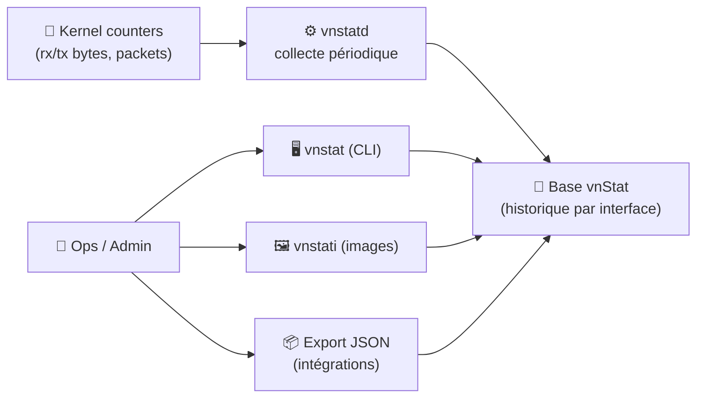
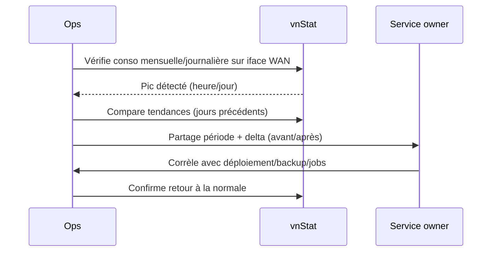

# 📈 vnStat — Présentation & Configuration Premium (Traffic réseau, durable & léger)

### Monitoring de bande passante basé kernel (sans sniffing) • Daemon + base locale • Rapports & exports
Optimisé pour serveurs Linux • Multi-interfaces • Reporting propre • Exploitation durable

---

## TL;DR

- **vnStat** mesure le trafic réseau **à partir des compteurs du kernel** (pas de capture de paquets).
- Il fonctionne avec un **daemon (`vnstatd`)** + une **base locale** (historique par interface).
- En “premium ops” : **interfaces bien choisies**, **naming stable**, **rétention maîtrisée**, **exports/rapports** (console, JSON, images via `vnstati`), **tests & rollback**.

Docs & repo upstream :
- https://github.com/vergoh/vnstat
- https://github.com/vergoh/vnstat/wiki
- https://humdi.net/vnstat/

---

## ✅ Checklists

### Pré-configuration (qualité)
- [ ] Identifier les interfaces à suivre (ex: `eth0`, `ens18`, `bond0`, `wg0`)
- [ ] Éviter les interfaces “éphémères” (veth*, docker0, cni*, etc.) sauf besoin
- [ ] Choisir un format d’affichage (IEC/GiB vs SI/GB) cohérent
- [ ] Définir la granularité utile (heure/jour/mois, top days, etc.)
- [ ] Décider si tu veux des **images** (`vnstati`) et/ou du **JSON** (intégrations)

### Post-configuration (validation)
- [ ] `vnstat` affiche des valeurs qui évoluent sur l’interface cible
- [ ] `vnstat -i <iface>` montre l’historique sans erreurs
- [ ] La base est persistante et sauvegardée
- [ ] Les rapports (console / json / image) sortent correctement
- [ ] Après reboot, l’historique continue (pas de “reset” surprise)

---

> [!TIP]
> vnStat est parfait pour : quotas mensuels, diagnostic “qui consomme”, suivi long terme léger, machines sans stack observabilité lourde.

> [!WARNING]
> Le piège #1 : suivre la **mauvaise interface** (ex: `docker0` au lieu de `eth0`) ou une interface renommée au reboot.

> [!DANGER]
> Sur certains environnements (VM/cloud), des resets de compteurs ou des changements d’interface peuvent créer des “trous” de données. Documente ton interface “source de vérité”.

---

# 1) vnStat — Vision moderne

vnStat n’est pas un outil “temps réel” comme `iftop`/`nethogs`.

C’est :
- 🧠 Un **historique** fiable (heure/jour/mois)
- 💾 Une **base locale** légère
- ⚙️ Un **daemon** discret (charge faible)
- 🧾 Un **reporting** (console, exports, images via `vnstati`)

Référence upstream :
- https://github.com/vergoh/vnstat
- https://github.com/vergoh/vnstat/wiki

---

# 2) Architecture globale



Docs usage/man pages (wiki) :
- https://github.com/vergoh/vnstat/wiki

---

# 3) Philosophie premium (5 piliers)

1. 🧭 **Interface stable & pertinente** (celle qui représente vraiment ton trafic)
2. 🗂️ **Historique propre** (rétention, granularité, reset maîtrisé)
3. 📏 **Unités & formats standardisés** (cohérence équipe)
4. 🧾 **Rapports reproductibles** (console, images, JSON)
5. 🧪 **Validation / rollback** (tests simples, sauvegarde base + conf)

---

# 4) Interfaces : choix “pro” (la qualité des stats dépend de ça)

## 4.1 Interfaces typiques (à considérer)
- Serveur simple : `eth0`, `ens3`, `ens18`, `enpXsY`
- Agrégation : `bond0`
- VLAN : `eth0.10`
- Tunnel : `wg0` (WireGuard), `tun0`
- Bridge : `br0` (si c’est TON interface logique principale)

## 4.2 Interfaces à éviter (souvent)
- `docker0`, `veth*` (containers), `cni*`, `flannel*`, etc.
- `lo` (loopback)
Sauf si tu veux précisément monitorer un segment interne.

> [!TIP]
> Si tu veux mesurer “Internet réel”, l’interface la plus “haut niveau” côté routage (WAN) est souvent la bonne : `eth0` / `bond0` / `br-wan`.

---

# 5) Configuration premium (conceptuelle)

vnStat s’appuie sur un fichier de conf unique (même conf pour `vnstat`, `vnstatd`, `vnstati`).

Documentation conf (man page Ubuntu) :
- https://manpages.ubuntu.com/manpages/jammy/man5/vnstat.conf.5.html

### Points clés à cadrer
- Interface(s) activées (explicites)
- Intervalle de collecte
- Units (IEC vs SI), arrondis
- Rétention / historiques (jours/mois, top, etc.)
- Output (couleurs, locale, formats)
- Chemin base (important pour persistance/backups)

> [!WARNING]
> Une conf “trop permissive” (trop d’interfaces, trop d’updates) = bruit + maintenance inutile.

---

# 6) Rapports premium (ce que tu produis et comment tu le consommes)

## 6.1 Console (usage quotidien)
Objectifs :
- voir la tendance (jour/mois)
- repérer un pic (top days)
- comprendre un incident bande passante

Exemples de patterns de lecture :
- “Aujourd’hui vs hier”
- “Ce mois-ci vs mois précédent”
- “Top 10 jours de conso”
- “Par interface (si multi)”

## 6.2 Images (vnstati) — reporting “partageable”
`vnstati` peut générer des graphes/rapports sous forme d’images à publier dans une page interne (wiki/status).

Ref man pages via wiki :
- https://github.com/vergoh/vnstat/wiki

## 6.3 Exports (JSON) — intégrations
Si tu veux intégrer dans Grafana/Influx/Prometheus-like, tu privilégieras un export machine-readable (JSON) via `vnstat`.

Ref : wiki upstream :
- https://github.com/vergoh/vnstat/wiki

---

# 7) Workflows premium (ops)

## 7.1 Diagnostic “bande passante saturée”


## 7.2 “Quota mensuel” (hébergement limité)
- suivre le cumul du mois
- définir seuils internes (ex: 70%, 90%)
- documenter les gros consommateurs (backup, sync, media, etc.)

---

# 8) Validation / Tests / Rollback

## Tests de validation (rapides)
```bash
# Afficher résumé global
vnstat

# Interface spécifique
vnstat -i eth0

# Forcer update (selon contexte)
vnstat -u -i eth0

# Vérifier que les compteurs évoluent (attendre un peu puis rechecker)
vnstat -i eth0
```

## Tests “qualité données”
- Les timestamps progressent correctement (pas de trous anormaux)
- L’interface suivie correspond au trafic réel (corroborer avec `ip -s link`)

## Rollback (simple)
- Sauvegarder/restaurer :
  - fichier de configuration
  - base vnStat (répertoire de données)
- Revenir à une conf minimale (1 interface, formats par défaut) si tu suspectes une mauvaise option

> [!TIP]
> Pour rendre le rollback trivial : versionne ta conf (git) + backup régulier du répertoire de base.

---

# 9) Erreurs fréquentes (et solutions)

- ❌ “Stats à zéro / pas d’update”  
  ✅ Mauvaise interface ou daemon non actif → vérifier interface, service, permissions.

- ❌ “Interface renommée après reboot”  
  ✅ Utiliser une interface stable (predictable names), documenter le mapping.

- ❌ “Données incohérentes après migration VM”  
  ✅ Les compteurs kernel peuvent reset → accepter une rupture, annoter, repartir propre.

- ❌ “Je veux du temps réel seconde par seconde”  
  ✅ vnStat n’est pas fait pour ça → compléter avec `iftop`/`nethogs` ponctuellement.

---

# 10) Sources — Images Docker (comme ton format)

> Note : vnStat est un binaire/daemon (pas “un service web” par nature), mais il existe des images communautaires utiles pour packager vnStat/vnstatd ou exposer des outputs.

## 10.1 Image communautaire la plus citée (vnStat “en container”)
- `vergoh/vnstat` (Docker Hub) : https://hub.docker.com/r/vergoh/vnstat  
- Tags `vergoh/vnstat` : https://hub.docker.com/r/vergoh/vnstat/tags  
- Repo “vnStat in a container” (référence de l’image) : https://github.com/vergoh/vnstat-docker  

## 10.2 Autre image communautaire (plus ancienne, CLI)
- `vimagick/vnstat` (Docker Hub) : https://hub.docker.com/r/vimagick/vnstat  

## 10.3 Upstream (code & docs)
- Repo vnStat : https://github.com/vergoh/vnstat  
- Wiki / man pages : https://github.com/vergoh/vnstat/wiki  
- Site historique / man pages : https://humdi.net/vnstat/  