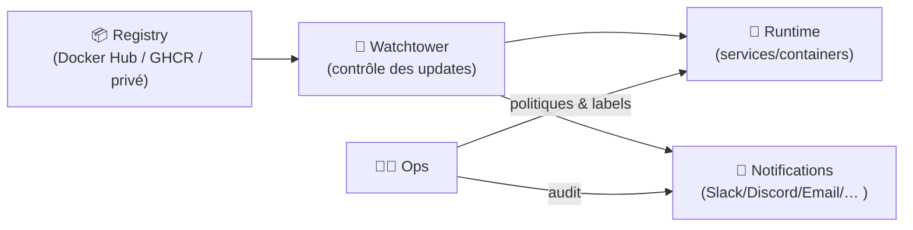
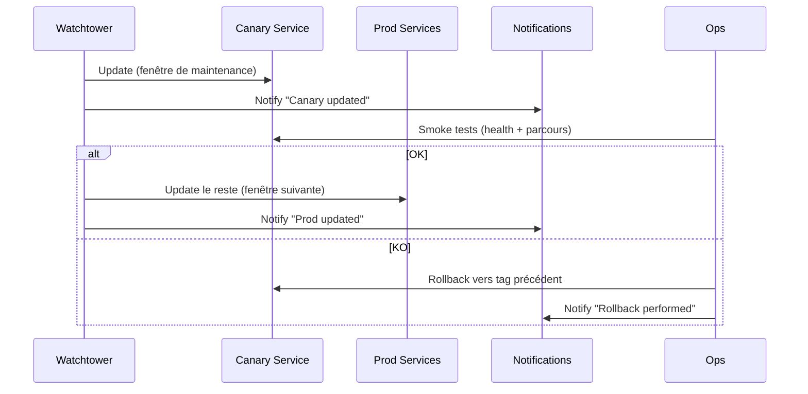

# 🔁 Watchtower — Présentation & Exploitation Premium (Mises à jour automatisées de conteneurs)

### Auto-update contrôlé, notifications, fenêtres de maintenance, stratégie “safe-by-design”
Optimisé pour reverse proxy existant (si UI/notifications) • Gouvernance • Observabilité • Rollback

---

## TL;DR

- **Watchtower** surveille tes conteneurs et met à jour automatiquement les images quand une nouvelle version est disponible.
- La version “premium” = **contrôle** : fenêtres de maintenance, sélection par labels, notifications, politique de tags, cadence, et **rollback**.
- À utiliser surtout pour : services non critiques, environnements dev/staging, ou prod **avec stratégie** (pinned tags + tests + canary).

---

## ✅ Checklists

### Pré-activation (avant de laisser Watchtower agir)
- [ ] Politique d’images définie (pinned versions vs `latest`)
- [ ] Services éligibles identifiés (exclure les critiques au début)
- [ ] Labels/Scopes en place (opt-in plutôt qu’opt-out)
- [ ] Notifications configurées (au minimum succès/échec)
- [ ] Fenêtre de maintenance définie (jours/heures)
- [ ] Plan de rollback documenté et testé sur 1 service

### Post-activation (qualité opérationnelle)
- [ ] Un update “non critique” validé de bout en bout
- [ ] Les notifications arrivent (Slack/Discord/email/etc.)
- [ ] La sélection par labels fonctionne (test : un service exclu ne bouge pas)
- [ ] Un rollback a été simulé (retour à une version précédente)
- [ ] Un “journal de changements” interne existe (même minimal)

---

> [!TIP]
> La meilleure pratique : **opt-in via labels** + **pinned tags** (ex: `1.2.3` ou `1.2`) plutôt que `latest`.

> [!WARNING]
> “Automatique” ≠ “sans risque”. Une image peut casser un service (changement de config, migration DB, bug).

> [!DANGER]
> Évite l’auto-update des composants à état (bases de données, brokers) tant que tu n’as pas une stratégie de versioning + sauvegardes + procédures de restauration.

---

# 1) Watchtower — Vision moderne

Watchtower n’est pas juste “mettre à jour tout”.

C’est :
- 🧠 Un **orchestrateur d’updates** (quand, quoi, comment)
- 🏷️ Un **moteur de ciblage** (par conteneur, par label, par scope)
- 📨 Un **agent de reporting** (notifications, audit)
- 🛡️ Un **outil de gouvernance** (maintenance windows, canary, exclusions)

Doc/Repo : https://github.com/containrrr/watchtower

---

# 2) Architecture globale (concept)



---

# 3) Philosophie premium (5 piliers)

1. 🎯 **Scope strict** (opt-in, pas “update all”)
2. 🧷 **Versioning propre** (pinned tags + stratégie de tags)
3. 🕒 **Fenêtres de maintenance** (planifiées)
4. 📨 **Observabilité & audit** (notifications + logs)
5. 🔄 **Rollback** (retour rapide à une version précédente)

---

# 4) Stratégies de déploiement (ce qui sépare “pro” de “YOLO”)

## 4.1 Opt-in via labels (recommandé)
Approche :
- Par défaut : aucun service n’est auto-updaté
- Tu actives Watchtower sur un service via label (ou groupe)

Objectif :
- Éviter de casser un service critique par accident
- Industrialiser : “tout service doit déclarer son éligibilité”

Référence labels/filters : https://containrrr.dev/watchtower/arguments/

## 4.2 Politique de tags : “pinned, then widen”
- **Phase 1** : tags stricts (ex: `1.2.3`)
- **Phase 2** : tags mineur (ex: `1.2`)
- **Phase 3** : `latest` uniquement pour dev/non critique

Pourquoi :
- Réduire les surprises (breaking changes)
- Garder une reproductibilité (tu sais ce qui tourne)

---

# 5) Fenêtres de maintenance (calmer le chaos)

Watchtower permet de planifier les mises à jour via une planification (type cron).

Approche recommandée :
- staging : updates plus fréquents
- prod : fenêtre hebdomadaire + supervision

Doc schedule : https://containrrr.dev/watchtower/arguments/#scheduling

> [!TIP]
> Une fenêtre de maintenance + notifications = tu transformes “mystery outage” en “changement attendu”.

---

# 6) Notifications & Audit (obligatoire si tu auto-updates)

Watchtower supporte plusieurs canaux (Slack, Discord, email, etc.) et différents niveaux (succès/échec).

Doc notifications : https://containrrr.dev/watchtower/notifications/

Bonnes pratiques :
- Notifier au minimum : **update appliqué**, **échec**, **redémarrage**
- Inclure : service concerné, ancien tag, nouveau tag, timestamp

---

# 7) Sécurité & Gouvernance (sans recettes d’install)

## Ce qu’il faut comprendre
Watchtower agit sur le runtime : il a donc un **pouvoir élevé** (il peut redémarrer / remplacer des conteneurs).

Recommandations premium :
- Limiter le périmètre (labels/scopes)
- Éviter les updates automatiques des services stateful
- Préférer des images signées/fiables quand possible
- Mettre en place un “change log” (même simple via notifications)

Docs sécurité/discussion : https://containrrr.dev/watchtower/

---

# 8) Workflows premium (canary & progressive rollout)

## 8.1 Canary (mise à jour d’abord sur 1 service)


## 8.2 Règle de prod simple
- 1 service “canary” (ou 1 host)
- 1 fenêtre dédiée
- 1 check minimal (HTTP 200, login, job critique)
- puis généralisation

---

# 9) Validation / Tests / Rollback

## 9.1 Tests de validation (smoke tests)
À adapter à tes services, mais la logique reste :

```bash
# Santé d'un endpoint (exemple)
curl -I https://service.example.tld | head

# Vérifier que le service répond et que la latence est normale
curl -s https://service.example.tld/health || true

# Regarder les logs du service après update (exemple générique)
# (commande dépend de ton environnement)
```

## 9.2 Rollback (principe)
Le rollback le plus fiable :
- Revenir à l’image précédente (tag précédent)
- Redéployer le service (ou réappliquer la config)
- Revalider les checks

Bonnes pratiques :
- Garder les tags précédents disponibles (ne pas “overwrite” un tag)
- Documenter “comment revenir à N-1” en 5 minutes

---

# 10) Erreurs fréquentes (et comment les éviter)

- ❌ Tout auto-updater par défaut  
  ✅ Opt-in par labels + exclure critiques

- ❌ Utiliser `latest` partout  
  ✅ Pinned tags, élargissement progressif

- ❌ Mettre à jour DB/brokers automatiquement  
  ✅ Updates manuelles, fenêtres dédiées, procédures de migration

- ❌ Pas de notifications  
  ✅ Audit systématique (succès + échec)

- ❌ Pas de rollback testé  
  ✅ Simulation sur un service non critique

---

# 11) Sources — Images Docker (format “URLs brutes”)

## 11.1 Image officielle Watchtower
- `containrrr/watchtower` (Docker Hub) : https://hub.docker.com/r/containrrr/watchtower  
- Documentation officielle Watchtower : https://containrrr.dev/watchtower/  
- Repo GitHub (référence upstream) : https://github.com/containrrr/watchtower  

## 11.2 LinuxServer.io (LSIO)
- Liste officielle des images LinuxServer.io : https://www.linuxserver.io/our-images  
- À date, **Watchtower n’est pas une image LSIO officielle** dans leur catalogue (référence : page “Our Images”) : https://www.linuxserver.io/our-images  

---

# ✅ Conclusion

Watchtower est excellent quand tu le traites comme un **système de change management** :
- périmètre strict,
- fenêtres de maintenance,
- notifications,
- canary,
- rollback.

C’est là que l’auto-update devient un vrai gain de stabilité, pas une loterie.