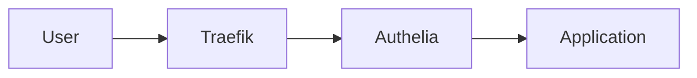
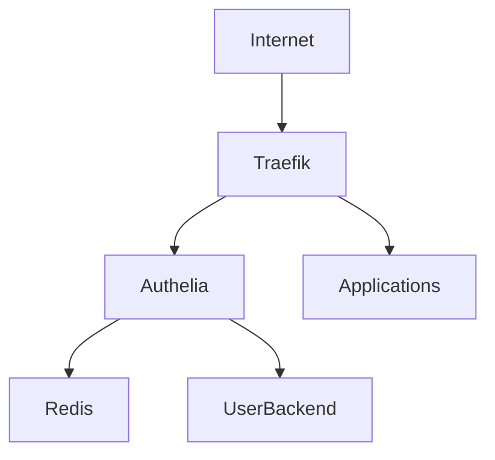
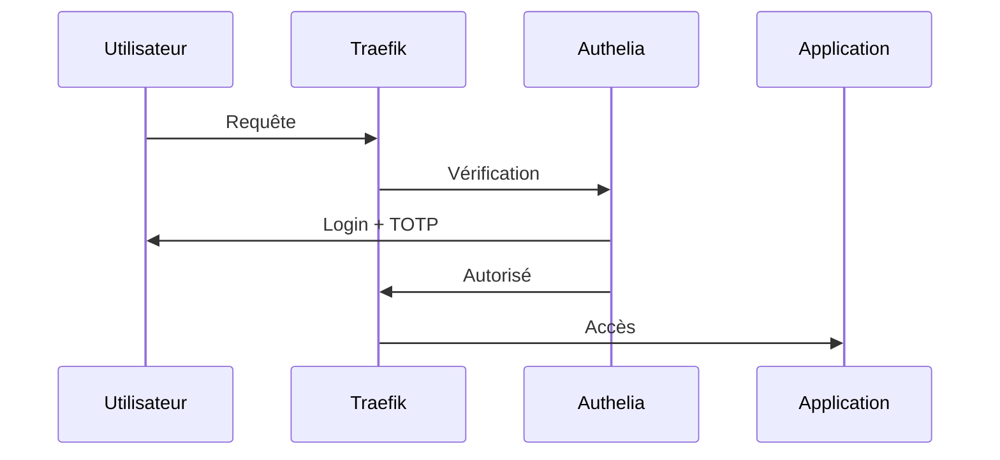
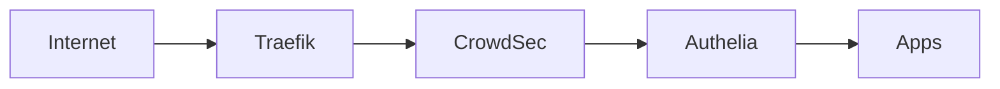

# 🔐 Authelia — Authentification Multi-Facteurs Enterprise

!!! abstract ""
    **Ajoutez une couche Zero-Trust à votre infrastructure SSDv2.**  
    SSO • MFA • Reverse Proxy • Protection centralisée

---

# 🎯 Qu’est-ce qu’Authelia ?

Authelia est une solution open-source d’authentification et d’autorisation.

Elle permet :

- 🔐 Authentification multi-facteurs (TOTP, WebAuthn)
- 🌐 Protection via reverse proxy
- 👥 Gestion des groupes utilisateurs
- 🛡️ Sécurisation des applications internes
- 🧠 Politique d’accès avancée

Authelia transforme une stack Docker classique en :

> 🔒 Infrastructure Zero-Trust

---

# 🧠 Rôle dans SSDv2

Architecture simplifiée :



Chaque requête passe par Authelia avant d’atteindre :

- Radarr
- Sonarr
- Pterodactyl
- Actual Budget
- etc.

---

# 🏗️ Architecture Complète



Composants :

- Reverse proxy (Traefik)
- Authelia
- Redis (sessions)
- Backend utilisateurs (fichier ou LDAP)

---

# 🔐 Fonctionnement MFA

Processus :

1. Accès à une app
2. Traefik redirige vers Authelia
3. Login + mot de passe
4. Vérification TOTP
5. Autorisation ou refus



---

# ⚙️ Configuration Complète (SSDV2)

---

# 📦 1️⃣ Volumes Recommandés

```
/data/authelia/config
/data/authelia/users
/data/authelia/secrets
```

---

# 🗄️ 2️⃣ Backend Utilisateurs

Option simple : fichier YAML

Exemple `users_database.yml` :

```yaml
users:
  admin:
    displayname: "Admin"
    password: "$argon2id$v=19$m=65536,t=3,p=4$..."
    email: admin@domain.com
    groups:
      - admins
```

Mot de passe généré avec :

```
authelia crypto hash generate argon2
```

---

# 🔧 3️⃣ Exemple configuration.yml minimal

```yaml
server:
  address: tcp://0.0.0.0:9091

log:
  level: info

authentication_backend:
  file:
    path: /config/users_database.yml

access_control:
  default_policy: deny
  rules:
    - domain: "*.domain.com"
      policy: two_factor

session:
  secret: "LONG_RANDOM_SECRET"
  redis:
    host: redis
    port: 6379

storage:
  local:
    path: /config/db.sqlite3

notifier:
  filesystem:
    filename: /config/notification.txt
```

---

# 🌐 4️⃣ Intégration Traefik

Middleware forwardAuth :

```yaml
- "traefik.http.middlewares.authelia.forwardauth.address=http://authelia:9091/api/verify?rd=https://auth.domain.com/"
- "traefik.http.middlewares.authelia.forwardauth.trustForwardHeader=true"
- "traefik.http.middlewares.authelia.forwardauth.authResponseHeaders=Remote-User,Remote-Groups"
```

Application protégée :

```yaml
- "traefik.http.routers.radarr.middlewares=authelia@docker"
```

---

# 🔑 5️⃣ Activation TOTP

Dans Authelia :

- Activer two_factor
- Configurer QR code
- Scanner via Google Authenticator / Authy

Recommandé :

- Obligatoire pour admins
- Optionnel pour users

---

# 🛡️ 6️⃣ Politique d’Accès Avancée

Exemple :

```yaml
rules:
  - domain: "radarr.domain.com"
    policy: two_factor
    subjects:
      - "group:admins"

  - domain: "budget.domain.com"
    policy: one_factor
```

Permet :

- Différencier apps critiques
- Restreindre accès par groupe

---

# 🔒 7️⃣ Sécurité Recommandée

✔ HTTPS obligatoire  
✔ Secret long et aléatoire  
✔ Redis protégé  
✔ Ne jamais exposer Authelia directement  
✔ CrowdSec en amont  

Architecture sécurisée :



---

# 💾 8️⃣ Sauvegardes

Sauvegarder :

- `/data/authelia/config`
- `/data/authelia/db.sqlite3`
- `/data/authelia/users`

Fréquence recommandée : hebdomadaire minimum.

---

# 🚨 Erreurs fréquentes

❌ default_policy en allow  
❌ Secret trop court  
❌ Pas de Redis  
❌ Exposition publique directe  
❌ Pas de sauvegarde  

---

# 📈 Cas d’usage

Authelia est idéal pour :

- 🔐 Protection Radarr/Sonarr
- 🎮 Sécuriser Pterodactyl
- 💰 Protéger outils financiers
- 🧠 Centraliser authentification

---

# 💎 Avantages dans SSDv2

<div class="features-grid">

<div class="feature-card">
<h3>🔐 MFA</h3>
<p>Double authentification sécurisée.</p>
</div>

<div class="feature-card">
<h3>🌐 SSO</h3>
<p>Connexion centralisée.</p>
</div>

<div class="feature-card">
<h3>🐳 Docker</h3>
<p>Isolation propre.</p>
</div>

<div class="feature-card">
<h3>🛡️ Zero Trust</h3>
<p>Accès basé sur règles.</p>
</div>

</div>

---

# 🎯 Conclusion

Authelia dans SSDv2 permet :

🔐 Authentification centralisée  
🛡️ Protection multi-facteurs  
🌐 Sécurisation reverse proxy  
👥 Gestion des groupes  
🏗️ Architecture Zero-Trust  

Ce n’est pas juste une couche login.

C’est le **pilier sécurité de votre infrastructure Docker moderne**.