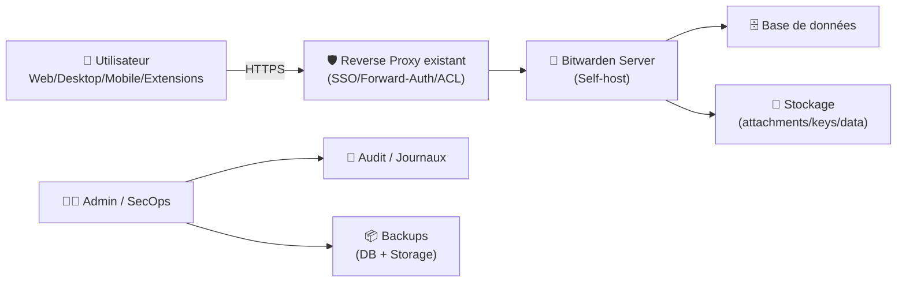
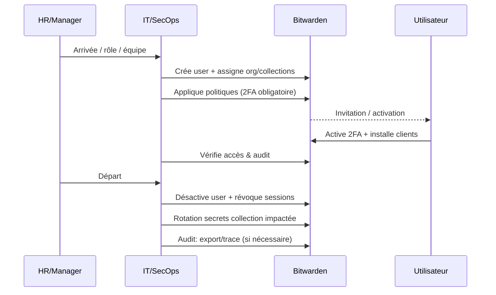

# 🔐 Bitwarden — Présentation & Exploitation Premium (Password Manager)

### Coffre-fort chiffré E2EE • Organisations & politiques • Auditabilité • Clients multiplateformes
Optimisé pour reverse proxy existant • SSO/SCIM possible • Gouvernance équipe • Backups & Rollback

---

## TL;DR

- **Bitwarden** = gestionnaire de mots de passe avec **chiffrement de bout en bout (E2EE)** et clients (web/desktop/mobile/extensions).
- En contexte “pro / homelab sérieux”, l’enjeu n°1 n’est pas “l’app”, mais la **gouvernance** : orga/collections, politiques, 2FA, accès d’urgence, journalisation.
- Deux approches côté self-host :
  - **Bitwarden officiel (Self-host)** : complet, orienté organisations/entreprise. :contentReference[oaicite:0]{index=0}
  - **Vaultwarden** (ex Bitwarden_RS) : implémentation compatible, plus légère, souvent prisée en homelab. :contentReference[oaicite:1]{index=1}

---

## ✅ Checklists

### Pré-configuration (avant d’ouvrir aux utilisateurs)
- [ ] Choisir le mode : **officiel** vs **Vaultwarden** (besoins org/politiques vs légèreté)
- [ ] Définir la gouvernance : **1 organisation** (ou plusieurs), **collections**, owners
- [ ] Définir la stratégie 2FA (obligatoire) + récupération + accès d’urgence
- [ ] Définir règles : invitations, enregistrements, domaines autorisés
- [ ] Définir la stratégie de sauvegarde : DB + données (pièces jointes)
- [ ] Définir la surface d’accès : reverse proxy existant + contrôle d’accès + HTTPS

### Post-configuration (qualité opérationnelle)
- [ ] 2FA obligatoire + test sur 2 comptes
- [ ] Un flux onboarding/outboarding documenté
- [ ] Sauvegarde + restauration testées (au moins 1 fois)
- [ ] Politique de rotation / revocation sessions documentée
- [ ] Journalisation activée et consultée (admin)

---

> [!TIP]
> Le “premium” sur Bitwarden, c’est une **politique d’usage** : qui crée quoi, qui partage quoi, comment on révoque, comment on récupère.

> [!WARNING]
> Le coffre est chiffré E2EE, mais **les métadonnées et la surface web** exigent une hygiène stricte (2FA, durcissement accès, mises à jour, backups testés).

> [!DANGER]
> Ne confonds pas “ça marche” avec “c’est exploitable en incident”.
> Sans test de restauration + procédure de récupération d’accès, un mot de passe admin perdu = catastrophe.

---

# 1) Bitwarden — Vision moderne

Bitwarden n’est pas seulement “un coffre à mots de passe”.

C’est :
- 🧠 Un **système d’identités & secrets** (logins, notes, clés, passkeys selon clients)
- 🧑‍🤝‍🧑 Une **plateforme de partage** (organisations, collections, rôles)
- 🛡️ Un **cadre de conformité** (politiques, audit, hygiène 2FA)
- 🔄 Un **outil de cycle de vie** (onboarding/offboarding, rotation, révocation)

Self-host officiel : options et guides. :contentReference[oaicite:2]{index=2}

---

# 2) Architecture globale



Référence “self-host” Bitwarden : :contentReference[oaicite:3]{index=3}

---

# 3) Officiel vs Vaultwarden (choix rationnel)

## Option A — Bitwarden officiel (self-host)
À privilégier si tu as besoin de :
- 🏢 fonctionnalités “organisation/entreprise” (politiques avancées, intégrations)
- 🔁 trajectoire support/roadmap Bitwarden
- 🧩 cohérence stricte avec l’écosystème Bitwarden

Docs : :contentReference[oaicite:4]{index=4}

## Option B — Vaultwarden (compatible Bitwarden)
À privilégier si tu cherches :
- ⚡ empreinte plus légère (homelab/PME simple)
- 🧰 simplicité opérationnelle (souvent “plus direct”)
- ✅ compat clients Bitwarden

Références : image & repo. :contentReference[oaicite:5]{index=5}

> [!WARNING]
> “Compatible” ne veut pas dire “identique” : compare les features dont tu dépends (SSO, politiques, logs, etc.) avant d’industrialiser.

---

# 4) Gouvernance premium (Organisations, Collections, Rôles)

## Modèle recommandé (simple et robuste)
- **1 organisation** (ex: `ACME`)
- **Collections** par domaine :
  - `Infra`
  - `Apps`
  - `Finance`
  - `Support`
- Rôles :
  - 👑 **Org Owner** (très limité en nombre)
  - 🛠️ **Admins** (gestion users/politiques)
  - ✍️ **Managers de collection** (gestion d’un périmètre)
  - 👀 **Read-only** quand possible

## Anti-patterns à éviter
- ❌ Tout le monde “Owner”
- ❌ Partage via vault perso au lieu des collections
- ❌ Secrets critiques mélangés avec secrets “support”

---

# 5) Politiques de sécurité (ce qui fait vraiment la différence)

## 5.1 2FA obligatoire (minimum vital)
- Obliger 2FA pour tous (TOTP / WebAuthn/FIDO2 selon contexte)
- Prévoir une stratégie de récupération :
  - codes de récupération
  - procédure admin (si applicable)
  - accès d’urgence (“emergency access”) si utilisé

## 5.2 Hygiène des secrets (standards)
- Longueur + unicité + générateur
- Rotation sur événements :
  - départ d’un employé
  - suspicion de fuite
  - exposition d’un token

## 5.3 Sessions & révocation
- Documenter :
  - comment invalider sessions
  - comment forcer relogin
  - comment gérer appareils perdus

---

# 6) Workflow “Onboarding / Offboarding” (pro, sans douleur)



---

# 7) Backups & Restauration (section exploitation)

## Ce qu’il faut sauvegarder (règle simple)
- **Base de données** (source de vérité)
- **Stockage** (pièces jointes / données associées, selon déploiement)
- **Config/Secrets** (de façon sécurisée : coffre offline / secret manager)

> [!WARNING]
> Un backup non restauré = pas un backup. Teste une restauration sur un environnement isolé.

## Tests (smoke)
```bash
# 1) L’endpoint répond (adapter URL)
curl -I https://vault.example.tld | head

# 2) Vérifier qu’un login est possible (test manuel)
# - compte test (non admin)
# - accès à 1 collection
# - 2FA OK
```

## Rollback (principe)
- Snapshot avant mise à jour
- Mise à jour
- Tests fonctionnels (login, sync, création entrée, partage)
- Si KO : restaurer DB + storage + revenir au tag précédent

> [!TIP]
> Garde une “fenêtre de retour arrière” simple : tag précédent + backup horodaté + procédure écrite.

---

# 8) Observabilité & Audit (minimum viable)

- **Logs applicatifs** : erreurs auth, erreurs DB, latence
- **Audit** (si dispo selon édition/mode) : actions admin, ajouts/retraits
- **Indicateurs** :
  - taux d’échecs login
  - volume erreurs 5xx
  - disponibilité page login + sync

---

# 9) Validation / Tests / Rollback (opérationnel)

## Plan de validation post-changement (5 minutes)
- [ ] Accès web OK (login)
- [ ] Sync client mobile OK
- [ ] Création d’un item + lecture depuis autre device OK
- [ ] Partage via collection OK
- [ ] 2FA toujours requis
- [ ] Logs : pas d’erreurs répétées

## Rollback rapide
- Restaurer snapshot DB + storage
- Revenir à l’image précédente
- Rejouer tests de validation

---

# 10) Sources — Images Docker (ce que tu as demandé)

## Bitwarden officiel (Self-host)
- Page self-host Bitwarden (guides + options) : :contentReference[oaicite:6]{index=6}
- Repo “server” (mention GHCR + docs déploiement) : :contentReference[oaicite:7]{index=7}
- Package container GHCR `ghcr.io/bitwarden/self-host` : :contentReference[oaicite:8]{index=8}
- Annonce migration images vers GHCR (self-host) : :contentReference[oaicite:9]{index=9}
- Profil Docker Hub Bitwarden (images maintenues) : :contentReference[oaicite:10]{index=10}

## Vaultwarden (alternative compatible)
- Image Docker Hub `vaultwarden/server` : :contentReference[oaicite:11]{index=11}
- Repo Vaultwarden (publie images ghcr/docker/quay) : :contentReference[oaicite:12]{index=12}

## LinuxServer.io (LSIO)
- LSIO a historiquement publié un billet sur **bitwarden_rs** (ancien nom de Vaultwarden), mais **ne propose pas** d’image “Bitwarden officiel” et recommande plutôt Vaultwarden dans certains échanges communautaires. :contentReference[oaicite:13]{index=13}

---

# ✅ Conclusion

Bitwarden (self-host) devient “premium” quand tu traites ça comme un **système de contrôle d’accès aux secrets** :
- gouvernance (org/collections/rôles),
- sécurité (2FA, révocation, process),
- exploitation (backups restaurés, audit, tests, rollback).

Si tu veux, donne-moi ton “profil d’usage” (homelab / PME / équipe dev / besoin SSO), et je te fais une version encore plus ciblée sur la gouvernance et les politiques.