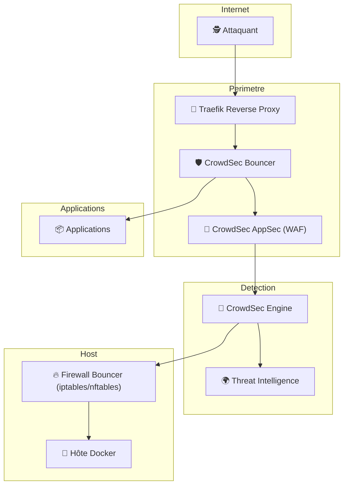

# 🛡️ Crowdsec - Défense Multicouche  
## Traefik + CrowdSec + AppSec + Firewall

Une approche Zero Trust périmétrique moderne  
Bloquer avant l’application. Bloquer avant le conteneur. Bloquer avant le kernel.

---

# 🎯 Vision Sécurité

L’intégration décrite dans le tutoriel met en place une **architecture de défense en profondeur** :

1. 🌐 Contrôle au niveau du Reverse Proxy  
2. 🧠 Analyse comportementale intelligente  
3. 🧱 Filtrage applicatif (WAF)  
4. 🔥 Blocage réseau au niveau hôte  
5. 🌍 Intelligence collective mondiale  

Ce n’est pas une simple installation.  
C’est une **stratégie de réduction de surface d’attaque**.

---

# 🏗️ Vue d’ensemble stratégique

---

# 🧠 Couche 1 — Reverse Proxy (Traefik)

Traefik devient :

- Point d’entrée unique
- Zone de filtrage
- Contrôle d’accès dynamique

Il applique le middleware CrowdSec avant routage vers les applications.

🎯 Objectif : stopper les menaces au plus tôt.

---

# 🧠 Couche 2 — CrowdSec Engine

CrowdSec :

- Analyse les logs Traefik
- Détecte les comportements suspects
- Compare avec la réputation mondiale
- Prend des décisions (ban / allow / captcha)

Il agit comme un **IDS comportemental collaboratif**.

---

# 🧱 Couche 3 — AppSec (WAF)

AppSec ajoute :

- Inspection des requêtes HTTP
- Analyse des paramètres
- Détection d’injections SQL
- Détection XSS
- Filtrage des exploits connus

## Différence stratégique

| Fonction | Bouncer IP | AppSec |
|----------|------------|--------|
| Bloque IP malveillante | ✅ | ❌ |
| Analyse payload HTTP | ❌ | ✅ |
| Bloque exploit précis | ❌ | ✅ |
| Détection comportementale | ✅ | ❌ |

Ensemble, ils créent une défense hybride :

> 🛡️ Comportement + Signature + Réputation

---

# 🔥 Couche 4 — Firewall Bouncer (Hôte)

Le tutoriel ajoute une protection au niveau système.

Cela signifie :

- Une IP bannie ne peut plus :
  - accéder aux services Docker
  - scanner les ports
  - tenter SSH
  - cibler d’autres services système

🎯 On protège l’infrastructure entière, pas seulement le web.

---

# 🌍 Couche 5 — Intelligence Collective

CrowdSec partage anonymement :

- Signaux d’attaque
- IP malveillantes
- Patterns détectés

Cela permet :

✔ Protection préventive  
✔ Blocage avant première attaque locale  
✔ Mise à jour continue  

---

# 📊 Comparaison Architecture

| Architecture | Niveau de protection |
|--------------|---------------------|
| Traefik seul | Proxy passif |
| Traefik + CrowdSec | Proxy intelligent |
| + AppSec | WAF applicatif |
| + Firewall Bouncer | Protection périmétrique complète |
| + Threat Intel | Défense collaborative mondiale |

---

# 🏢 Impact Entreprise (Vue RSSI)

Cette intégration permet :

- Réduction du risque d’exploitation
- Diminution du bruit dans les logs
- Protection automatisée sans intervention humaine
- Centralisation des décisions de sécurité
- Scalabilité en environnement Docker/Kubernetes

Elle s’inscrit dans une stratégie :

> Zero Trust + Defense in Depth + Automation

---

# 🚀 Bénéfices Concrets

✔ Moins d’exposition applicative  
✔ Moins de consommation CPU par attaques  
✔ Réduction des risques de brute-force  
✔ Blocage précoce des bots  
✔ Protection multi-niveaux  

---

# 🎯 Conclusion Stratégique

Ce que met réellement en place le tutoriel :

- Un IDS comportemental
- Un WAF HTTP
- Un middleware de blocage dynamique
- Un firewall collaboratif
- Une intégration DevOps Docker native

Ce n’est pas une simple configuration.

C’est la mise en place d’un **système de défense distribué moderne**.

---
