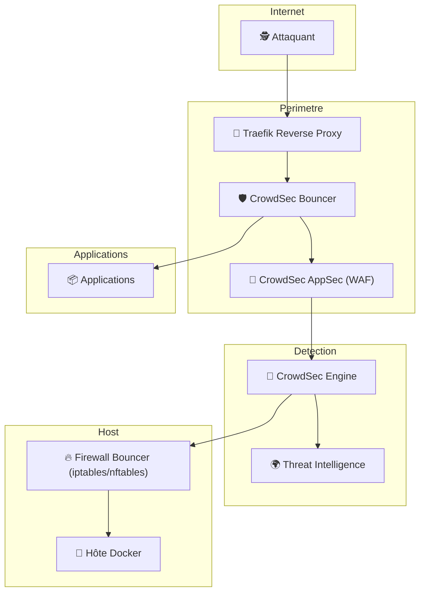
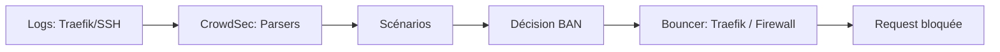
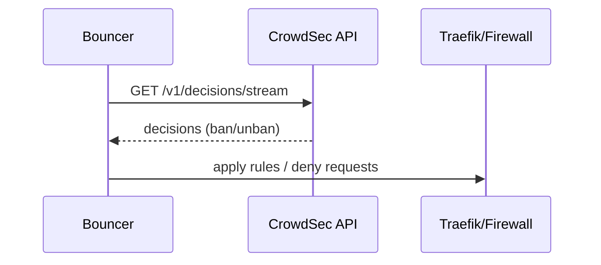

# 🛡️ Crowdsec - Défense Multicouche  
## Traefik + CrowdSec + AppSec + Firewall

<div class="hero">

Une approche Zero Trust périmétrique moderne  
Bloquer avant l’application. Bloquer avant le conteneur. Bloquer avant le kernel.

</div>

---

# 🎯 Vision Sécurité

L’intégration décrite dans le tutoriel met en place une **architecture de défense en profondeur** :

1. 🌐 Contrôle au niveau du Reverse Proxy  
2. 🧠 Analyse comportementale intelligente  
3. 🧱 Filtrage applicatif (WAF)  
4. 🔥 Blocage réseau au niveau hôte  
5. 🌍 Intelligence collective mondiale  

Ce n’est pas une simple installation.  
C’est une **stratégie de réduction de surface d’attaque**.

---

# 🏗️ Vue d’ensemble stratégique



---

# 🧠 Couche 1 — Reverse Proxy (Traefik)

Traefik devient :

- Point d’entrée unique
- Zone de filtrage
- Contrôle d’accès dynamique

Il applique le middleware CrowdSec avant routage vers les applications.

🎯 Objectif : stopper les menaces au plus tôt.

---

# 🧠 Couche 2 — CrowdSec Engine

CrowdSec :

- Analyse les logs Traefik
- Détecte les comportements suspects
- Compare avec la réputation mondiale
- Prend des décisions (ban / allow / captcha)

Il agit comme un **IDS comportemental collaboratif**.

---

# 🧱 Couche 3 — AppSec (WAF)

AppSec ajoute :

- Inspection des requêtes HTTP
- Analyse des paramètres
- Détection d’injections SQL
- Détection XSS
- Filtrage des exploits connus

## Différence stratégique

| Fonction | Bouncer IP | AppSec |
|----------|------------|--------|
| Bloque IP malveillante | ✅ | ❌ |
| Analyse payload HTTP | ❌ | ✅ |
| Bloque exploit précis | ❌ | ✅ |
| Détection comportementale | ✅ | ❌ |

Ensemble, ils créent une défense hybride :

> 🛡️ Comportement + Signature + Réputation

---

# 🔥 Couche 4 — Firewall Bouncer (Hôte)

Le tutoriel ajoute une protection au niveau système.

Cela signifie :

- Une IP bannie ne peut plus :
  - accéder aux services Docker
  - scanner les ports
  - tenter SSH
  - cibler d’autres services système

🎯 On protège l’infrastructure entière, pas seulement le web.

---

# 🌍 Couche 5 — Intelligence Collective

CrowdSec partage anonymement :

- Signaux d’attaque
- IP malveillantes
- Patterns détectés

Cela permet :

✔ Protection préventive  
✔ Blocage avant première attaque locale  
✔ Mise à jour continue  

---

# 📊 Comparaison Architecture

| Architecture | Niveau de protection |
|--------------|---------------------|
| Traefik seul | Proxy passif |
| Traefik + CrowdSec | Proxy intelligent |
| + AppSec | WAF applicatif |
| + Firewall Bouncer | Protection périmétrique complète |
| + Threat Intel | Défense collaborative mondiale |

---

# 🏢 Impact Entreprise (Vue RSSI)

Cette intégration permet :

- Réduction du risque d’exploitation
- Diminution du bruit dans les logs
- Protection automatisée sans intervention humaine
- Centralisation des décisions de sécurité
- Scalabilité en environnement Docker/Kubernetes

Elle s’inscrit dans une stratégie :

> Zero Trust + Defense in Depth + Automation

---

# 🚀 Bénéfices Concrets

✔ Moins d’exposition applicative  
✔ Moins de consommation CPU par attaques  
✔ Réduction des risques de brute-force  
✔ Blocage précoce des bots  
✔ Protection multi-niveaux  

---

# 🎯 Conclusion Stratégique

Ce que met réellement en place le tutoriel :

- Un IDS comportemental
- Un WAF HTTP
- Un middleware de blocage dynamique
- Un firewall collaboratif
- Une intégration DevOps Docker native

Ce n’est pas une simple configuration.

C’est la mise en place d’un **système de défense distribué moderne**.

---

# 🛡️ CrowdSec (Docker)

> **Objectif** : avoir un CrowdSec *vraiment* opérationnel — logs ingérés ✅, scénarios actifs ✅, bouncers connectés ✅, et blocage effectif ✅.

---

## ✨ TL;DR

```bash
docker exec -it crowdsec cscli metrics
docker exec -it crowdsec cscli bouncers list
docker exec -it crowdsec cscli decisions list
```

- Si **bouncers OK** et **Last API pull récent** → tu es protégé.
- Si **bouncer firewall** absent / invalide → `sudo systemctl restart crowdsec-firewall-bouncer`

---

## ✅ Pré-checklist “Ready-to-Defend”
- [ ] Le conteneur **crowdsec** tourne
- [ ] Les logs (Traefik / SSH) sont bien acquis
- [ ] Les bouncers sont **Valid** et “pull” régulièrement

---

## 0) 🧭 Repérer le conteneur CrowdSec
```bash
docker ps --format 'table {{.Names}}\t{{.Image}}\t{{.Status}}' | grep -i crowdsec
```

> **Tip** : si le conteneur ne s’appelle pas `crowdsec`, remplace-le dans toutes les commandes.

---

## 1) 📊 Health Check “Global” (la commande reine)
```bash
docker exec -it crowdsec cscli metrics
```

> À surveiller :
> - **Acquisition Metrics** : Lines read / parsed > 0  
> - **Scenario Metrics** : des instanciations/poured/expired  
> - **Bouncer Metrics** : hits sur `/v1/decisions/stream`

---

## 2) 🚫 Décisions (bans) — le concret
### Voir les bans actifs
```bash
docker exec -it crowdsec cscli decisions list
```

### Voir toutes les décisions (si supporté)
```bash
docker exec -it crowdsec cscli decisions list --all
```

### 🧪 Test “ban manuel” (validation end-to-end)
```bash
docker exec -it crowdsec cscli decisions add --ip 1.2.3.4 --type ban --duration 10m
```

### Unban
```bash
docker exec -it crowdsec cscli decisions delete --ip 1.2.3.4
```

> [!WARNING]
> Ajouter un ban dans CrowdSec **ne suffit pas** : il faut que le **bouncer** (Traefik/iptables) soit opérationnel pour que le trafic soit réellement bloqué.

---

## 3) 🚨 Alertes — comprendre “pourquoi ça ban”
### Alertes récentes
```bash
docker exec -it crowdsec cscli alerts list
```

### Historique
```bash
docker exec -it crowdsec cscli alerts list -a
```

### Détails d’une alerte
```bash
docker exec -it crowdsec cscli alerts inspect <ALERT_ID>
```

---

## 4) 🧱 Bouncers — *le point CRITIQUE*

### Lister les bouncers
```bash
docker exec -it crowdsec cscli bouncers list
```

> [!IMPORTANT]
> **Résultat attendu (style “OK on est blindé”)** :  
> tu dois voir tes bouncers avec :
> - `Valid` = ✔️  
> - `Last API pull` récent  
>
> ```text
> docker exec -it crowdsec cscli bouncers list
> ────────────────────────────────────────────────────────────────────────────────────────────────────────────────────────────────────────────────────────────────────────────────
>  Name              IP Address  Valid  Last API pull         Type                             Version                                                                  Auth Type
> ────────────────────────────────────────────────────────────────────────────────────────────────────────────────────────────────────────────────────────────────────────────────
>  traefik-bouncer   172.20.0.2  ✔️     2026-03-03T10:53:25Z  Crowdsec-Bouncer-Traefik-Plugin  1.X.X                                                                    api-key
>  firewall-bouncer  172.20.0.1  ✔️     2026-03-03T10:53:22Z  crowdsec-firewall-bouncer        v0.0.34-debian-pragmatic-arm64-4144555453620958398aee64253dfd90bbc1f698  api-key
> ────────────────────────────────────────────────────────────────────────────────────────────────────────────────────────────────────────────────────────────────────────────────
> ubuntu@maman:~/seedbox-compose$
> ```
>
> **Sinon (plan de secours immédiat)** :
> ```bash
> sudo systemctl restart crowdsec-firewall-bouncer
> ```

---

## 5) 🧩 Hub — scénarios/parsers/collections
### Voir ce qui est installé
```bash
docker exec -it crowdsec cscli hub list
```

### Voir tout le Hub (si besoin)
```bash
docker exec -it crowdsec cscli hub list -a
```

### Mettre à jour le Hub
```bash
docker exec -it crowdsec cscli hub update
```

---

## 6) 🛠️ Config & Logs — mode “chirurgical”
### Voir la config CrowdSec
```bash
docker exec -it crowdsec cscli config show
```

### Suivre les logs CrowdSec
```bash
docker logs -f --tail=200 crowdsec
```

---

## ✅ Post-checklist
- [ ] `metrics` montre des logs acquis (auth/traefik)
- [ ] `bouncers list` montre `traefik-bouncer` **Valid** avec `Last API pull` récent
- [ ] `firewall-bouncer` **Valid** (si tu l’utilises)  
- [ ] Un ban manuel apparaît dans `decisions list` puis disparaît après expiration
- [ ] Le trafic est effectivement bloqué côté bouncer (dropped requests / refus)

---

## Mermaid — Flow “décision → blocage” (vision claire)


## Mermaid — Sequence “Last API pull”

