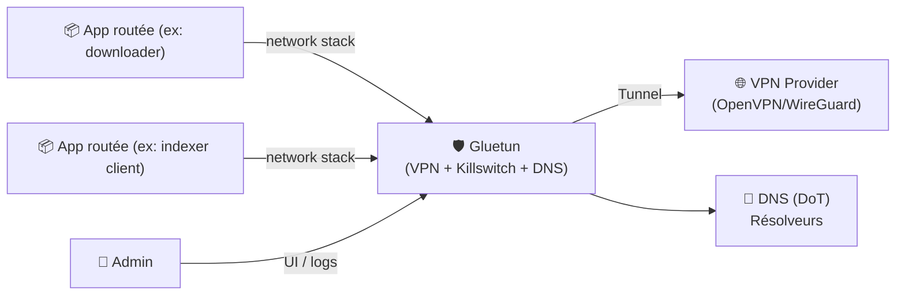
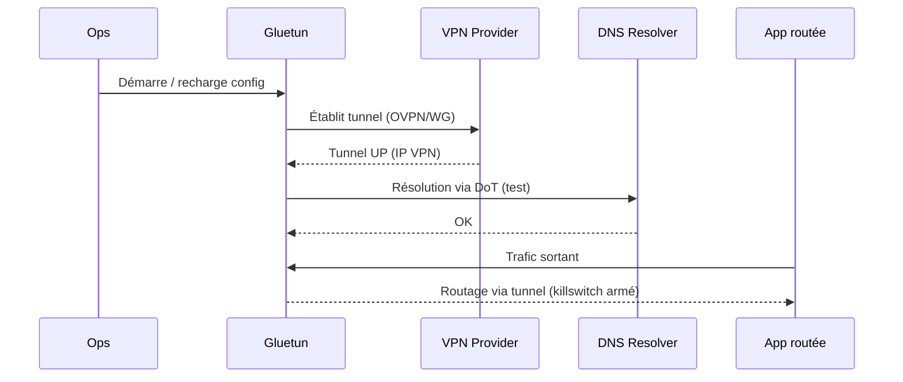

# 🛡️ Gluetun — Présentation & Configuration Premium (VPN Gateway / Killswitch / DNS)

### “Swiss-army knife” VPN pour router *d’autres services* en toute sécurité
Optimisé pour reverse proxy existant • OpenVPN/WireGuard • DNS over TLS • Killswitch • Proxies intégrés

---

## TL;DR

- **Gluetun** est un **client VPN** (OpenVPN ou WireGuard) empaqueté pour servir de **gateway réseau** à d’autres services.
- Valeur principale : **killswitch** (pas de fuite), **DNS sécurisé** (DoT), sélection serveur, multi-providers, options proxy.
- En “premium ops” : **routing clair**, **sélection serveur maîtrisée**, **DNS verrouillé**, **tests d’étanchéité**, **rollback documenté**.

Docs officielles : Docker Hub + Wiki GitHub. :contentReference[oaicite:0]{index=0}

---

## ✅ Checklists

### Pré-configuration (avant de brancher des apps derrière)
- [ ] Choisir le mode VPN : **WireGuard** (souvent + rapide) ou **OpenVPN**
- [ ] Définir la stratégie serveur : région / hostname / multi-hop (si provider)
- [ ] Fixer la stratégie DNS : DoT + résolveurs autorisés
- [ ] Définir le “périmètre routé” : quelles apps passent **obligatoirement** par Gluetun
- [ ] Définir les ports à exposer (UI/app/proxy) *uniquement* là où nécessaire
- [ ] Préparer un plan de tests : IP publique, DNS leak, WebRTC leak (si navigateur)

### Post-configuration (qualité opérationnelle)
- [ ] IP publique des apps derrière Gluetun = IP VPN (test)
- [ ] DNS résolu via la stratégie choisie (test)
- [ ] Killswitch effectif : si VPN down → trafic bloqué (test)
- [ ] Logs Gluetun propres (pas de boucle de reconnexion)
- [ ] Rollback prêt (désactiver routing ou revenir à config précédente)

---

> [!TIP]
> Pense Gluetun comme un **“pare-feu + tunnel + DNS”** : sa valeur est maximale quand tu l’utilises comme **sortie unique** pour des apps sensibles (indexeurs, downloaders, etc.).

> [!WARNING]
> Un mauvais paramétrage DNS/serveur peut sembler “fonctionner” tout en fuyant (leak). Les **tests** font partie de la config.

> [!DANGER]
> Le Docker Hub officiel avertit explicitement que seules certaines pages (Docker Hub + wiki officiel) sont légitimes, et que d’autres “sites officiels” peuvent être des scams. :contentReference[oaicite:1]{index=1}

---

# 1) Gluetun — Vision moderne

Gluetun n’est pas juste “un VPN dans un container”.

C’est :
- 🛣️ Une **gateway** : d’autres services peuvent utiliser son réseau comme sortie
- 🧯 Un **killswitch** : zéro trafic sortant si le tunnel n’est pas up
- 🧠 Un **orchestrateur de providers** : sélection serveurs, régions, hostnames
- 🔒 Un **DNS manager** : DNS over TLS + contrôle du chemin de résolution
- 🧩 Un **bundle d’outils** : proxies (selon config), contrôle, logs de diagnostic

Référence produit : repo Gluetun + Wiki. :contentReference[oaicite:2]{index=2}

---

# 2) Architecture globale



---

# 3) Philosophie premium (5 piliers)

1. 🧭 **Sélection serveur déterministe** (régions/hostnames)
2. 🔐 **DNS verrouillé** (DoT + résolveurs cohérents)
3. 🧯 **Killswitch vérifié** (vrai test de coupure)
4. 🧩 **Périmètre routé clair** (quelles apps passent par Gluetun)
5. 🧪 **Validation & rollback** (tests reproductibles)

---

# 4) Sélection des serveurs (régions / hostnames)

La sélection dépend du provider :
- certains utilisent **SERVER_REGIONS**
- d’autres supportent **SERVER_HOSTNAMES**
- certains ont des spécificités (multi-hop, etc.)

Exemple doc ProtonVPN (hostnames & multi-hop) : :contentReference[oaicite:3]{index=3}  
Doc “Servers” (référence des serveurs/choix) : :contentReference[oaicite:4]{index=4}

> [!TIP]
> Stratégie fiable : **proche géographiquement** (latence), puis bascule sur un fallback si instable.

---

# 5) Variables & Configuration (approche “safe”)

## 5.1 Variables “socle” (mental model)
- **VPN_SERVICE_PROVIDER** : provider (ou `custom`)
- Identifiants / clés selon protocole (OpenVPN/WG)
- Ciblage serveurs (regions/hostnames)
- DNS (DoT, résolveurs)
- Options réseau (ports à exposer, proxy, etc.)

Doc provider “custom” (montre clairement les variables requises) : :contentReference[oaicite:5]{index=5}  
Note : une liste exhaustive des variables a été discutée (preuve que c’est vaste). :contentReference[oaicite:6]{index=6}

## 5.2 Providers “custom”
Si ton provider n’est pas listé, **VPN_SERVICE_PROVIDER=custom** permet une config OpenVPN/WireGuard personnalisée (selon doc). :contentReference[oaicite:7]{index=7}

> [!WARNING]
> “Custom” = tu deviens responsable des fichiers/paramètres VPN. Documente ce que tu utilises (fichiers, endpoints, ciphers, MTU).

---

# 6) DNS (DoT) — ce qui évite les surprises

Objectifs :
- éviter que le DNS parte “ailleurs” que prévu
- réduire les leaks DNS
- stabiliser la résolution (moins de timeouts)

Gluetun met en avant le **DNS over TLS** comme fonctionnalité centrale. :contentReference[oaicite:8]{index=8}

Bonnes pratiques :
- choisir 1 à 2 résolveurs DoT fiables
- garder la config DNS identique entre environnements (prod/staging)
- tester résolution + latence

---

# 7) Routing des apps derrière Gluetun (le pattern gagnant)

Concept :
- une app “derrière” Gluetun utilise **son réseau** comme sortie
- toutes les sorties passent par le tunnel
- si tunnel down : **killswitch → blocage**

> [!TIP]
> Le pattern “gateway” marche très bien pour : downloaders, indexeurs, scrapers, outils réseau sensibles.

---

# 8) Workflows premium (diagnostic)

## 8.1 Démarrage / santé tunnel (séquence)


## 8.2 Incident : “ça rame / ça coupe”
Checklist :
- logs Gluetun : reconnexions, DNS timeouts
- tester un autre serveur/région
- vérifier MTU (selon provider)
- vérifier que les apps ne tentent pas de sortir hors périmètre

---

# 9) Validation / Tests / Rollback (obligatoire en premium)

## 9.1 Tests “étanchéité”
```bash
# Depuis une app routée derrière Gluetun :
# 1) IP publique
curl -s https://ifconfig.io ; echo

# 2) DNS (simple)
nslookup example.com 1.1.1.1

# 3) Trace rapide (optionnel)
traceroute -n 1.1.1.1 | head
```

> [!WARNING]
> Si tu testes depuis l’hôte au lieu de l’app routée, tu peux te tromper. Les tests doivent être faits **depuis le namespace réseau** de l’app.

## 9.2 Test killswitch (le test qui compte)
- couper volontairement le tunnel (ou simuler un down)
- vérifier que le trafic sortant **échoue** (timeout / blocage)
- rétablir le tunnel → trafic OK

## 9.3 Rollback
Plan minimal :
- revenir à une config précédente connue “stable”
- revenir à un serveur/région stable
- désactiver temporairement le routing des apps les plus critiques (le temps d’enquêter)

Doc sur les tags d’images (pour pinner une version au lieu de flotter en `latest`) : :contentReference[oaicite:9]{index=9}

---

# 10) Sources — Images Docker (incluant LinuxServer si applicable)

## Image officielle Gluetun
- Image Docker Hub : `qmcgaw/gluetun` :contentReference[oaicite:10]{index=10}
- Wiki GitHub (doc principale) : :contentReference[oaicite:11]{index=11}
- Repo Gluetun (code) : :contentReference[oaicite:12]{index=12}

## LinuxServer.io (LSIO)
- À partir de la liste officielle “Our Images”, Gluetun n’apparaît pas comme image LSIO dédiée (référence à vérifier via leur catalogue). :contentReference[oaicite:13]{index=13}
- Catalogue officiel LSIO : :contentReference[oaicite:14]{index=14}

> [!TIP]
> Si tu veux, je peux checker “nom exact” dans le catalogue LSIO pour confirmer l’absence/presence d’une image Gluetun — mais la source la plus sûre pour Gluetun reste `qmcgaw/gluetun`. :contentReference[oaicite:15]{index=15}

---

# 📌 Sources (adresses en bash, comme demandé)

```bash
# Officiel / recommandé
https://hub.docker.com/r/qmcgaw/gluetun
https://github.com/qdm12/gluetun
https://github.com/qdm12/gluetun-wiki
https://github.com/qdm12/gluetun-wiki/blob/main/setup/docker-image-tags.md
https://github.com/qdm12/gluetun-wiki/blob/main/setup/servers.md
https://github.com/qdm12/gluetun-wiki/blob/main/setup/providers/custom.md
https://github.com/qdm12/gluetun-wiki/blob/main/setup/providers/protonvpn.md

# Discussion utile (variables ENV)
https://github.com/qdm12/gluetun/discussions/2647
```