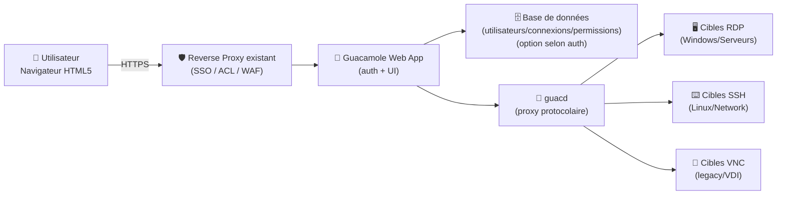
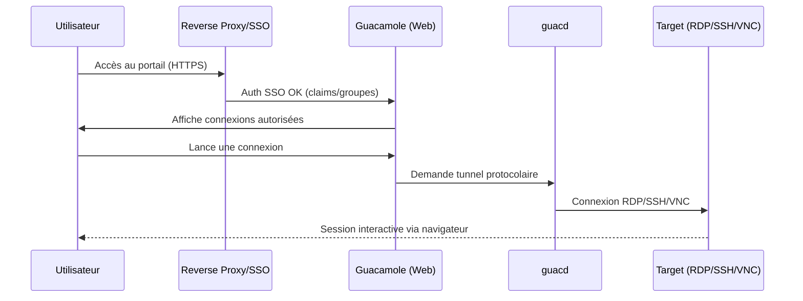

# 🥑 Apache Guacamole — Présentation & Configuration Premium (Bastion Web RDP/SSH/VNC)

### Portail d’accès distant “clientless” (HTML5) : RDP • SSH • VNC • Gouvernance • SSO/MFA • Audit
Optimisé pour reverse proxy existant • Accès sécurisé • Multi-protocoles • Exploitation durable

---

## TL;DR

- **Guacamole** est un **bastion web** : accès à des machines via **RDP / SSH / VNC** depuis un navigateur, sans client lourd.
- Il sépare :
  - **UI web** (auth, gestion des connexions, permissions)
  - **guacd** (proxy protocolaire côté serveur)
- En “premium ops” : **SSO (OIDC/SAML/CAS)**, **MFA (TOTP/Duo)**, **RBAC**, **restrictions**, **enregistrement de session**, **journalisation**, **tests & rollback**.

---

## ✅ Checklists

### Pré-configuration (avant d’ouvrir aux utilisateurs)
- [ ] Définir le périmètre : *qui accède à quoi* (groupes, environnements, tiers)
- [ ] Choisir le modèle d’identité : local DB / LDAP-AD / SSO (OIDC/SAML/CAS) / headers
- [ ] Décider MFA : TOTP (et/ou Duo) + politique de récupération
- [ ] Fixer conventions : noms de connexions, tags, dossiers, owners, rotation des secrets
- [ ] Décider fonctionnalités sensibles : transfert fichiers, presse-papiers, impression, drive mapping

### Post-configuration (qualité opérationnelle)
- [ ] RBAC testé : un utilisateur “Team A” ne voit pas “Team B”
- [ ] 1 connexion RDP + 1 SSH + 1 VNC validées (latence, clavier, encodage)
- [ ] Journaux exploitables (qui / quoi / quand / depuis où)
- [ ] Restrictions (heures/IP/limites) validées si activées
- [ ] Plan de rollback documenté (extensions SSO/MFA, paramètres, connexions)

---

> [!TIP]
> Guacamole est excellent comme **porte d’entrée unique** (bastion) : un lien web, des permissions, des traces, et une UX homogène.

> [!WARNING]
> Beaucoup de risques viennent de fonctionnalités “confort” : **clipboard**, **file transfer**, **drive redirection**. Active-les seulement si tu as une vraie justification.

> [!DANGER]
> Évite le “tout le monde admin” + connexions partagées. Un bastion = **moindre privilège**, traçabilité et identités personnelles.

---

# 1) Guacamole — Vision moderne

Guacamole n’est pas “juste un RDP dans le navigateur”.

C’est :
- 🧭 Un **portail d’accès** (catalogue de connexions, dossiers, permissions)
- 🔐 Une **couche d’identité** (auth, SSO, MFA)
- 🧰 Une **console d’exploitation** (audit, restrictions, session recording selon modules)
- 🧩 Un **hub multi-protocole** (RDP/SSH/VNC… selon besoins)

---

# 2) Architecture globale



🧠 Point clé : **la webapp ne parle pas RDP/SSH/VNC directement** — c’est **guacd** qui sert de pont protocolaire.

---

# 3) Modèle d’accès & Gouvernance (RBAC “propre”)

## 3.1 Objets à gouverner
- **Connexions** (RDP/SSH/VNC, paramètres, options)
- **Groupes / dossiers** (organisation)
- **Utilisateurs / groupes** (droits)
- **Partages** (accès direct ou via groupe)

## 3.2 Stratégie RBAC recommandée
- 👑 **Admins** : gestion globale (extensions, paramètres, connexions)
- 🛠️ **Ops** : gestion des connexions d’un périmètre + audit
- 👀 **Users** : exécution uniquement (pas d’édition)
- 🔒 **Break-glass** : compte d’urgence, rotation stricte, usage tracé

> [!TIP]
> Structure “dossiers par équipe + tags par environnement” :
> - `/PROD/Windows`, `/PROD/Linux`, `/STAGING/...`
> - tags : `env=prod`, `team=core`, `tier=critical`

---

# 4) Identité & Auth (SSO/MFA “premium”)

Guacamole supporte différentes extensions d’auth. En pratique, tu choisis :
- **Source d’identité** : LDAP/AD, SSO (OIDC/SAML/CAS), RADIUS, etc.
- **Source des connexions** : DB (souvent), LDAP (parfois), ou autres modules
- **MFA** : TOTP, Duo (ou MFA via ton IdP)

## 4.1 Approche recommandée (la plus simple à opérer)
- **SSO OIDC (ou SAML)** via ton IdP (Keycloak, Authentik, Azure AD, etc.)
- **MFA géré par l’IdP** (ou TOTP Guacamole si besoin)
- Connexions gérées via **DB** (interface admin), avec RBAC

## 4.2 MFA : TOTP (quand tu veux un 2e facteur côté Guacamole)
- TOTP s’ajoute **au-dessus** d’une auth existante (SSO/LDAP/DB).
- Bon usage : équipes techniques, accès prod, comptes sensibles.

---

# 5) Connexions — Paramètres critiques par protocole

## 5.1 RDP (Windows)
Paramètres “premium” à maîtriser :
- **Sécurité** : NLA/CredSSP selon politique (aligner avec durcissement Windows)
- **Qualité** : résolution, profondeur couleur, compression, audio
- **Périphériques** : clipboard, drive redirection, printers → *à limiter*
- **Sessions** : connexion à une session existante vs nouvelle session (selon usage)

> [!WARNING]
> Drive redirection + clipboard = canaux d’exfiltration.  
> Mets-les en “off par défaut”, et active *au cas par cas*.

## 5.2 SSH (Linux / équipements réseau)
Paramètres “premium” :
- **Clés** plutôt que mots de passe (quand possible)
- Forcer encodage/locale correct
- Désactiver copy/paste “dangereux” si besoin (selon ton contexte)
- Timeouts cohérents (évite sessions zombie)

## 5.3 VNC (legacy / consoles)
- VNC est souvent moins robuste en sécurité : privilégier un réseau isolé / VPN / bastion strict
- Fixer la qualité/encodage pour éviter lags
- Vérifier compat clavier

---

# 6) Restrictions d’accès (réduction de surface)

Guacamole propose des mécanismes de restrictions (selon version/extensions) :
- restrictions de connexion (plages horaires, limites, etc.)
- restrictions de sessions / connexions simultanées
- règles liées aux utilisateurs/groupes

> [!TIP]
> Même sans règles avancées, tu peux déjà faire “premium” :
> - RBAC strict
> - segmentation par environnement
> - suppression des fonctionnalités sensibles
> - audit + alerting sur événements clés

---

# 7) Session recording & audit (quand tu dois “prouver”)

Selon tes besoins conformité :
- **Traçabilité** : qui s’est connecté, quand, combien de temps, depuis où
- **Enregistrement** (si activé) : utile pour prod/privileged access
- Politique de rétention : courte mais suffisante, accès restreint

> [!WARNING]
> L’enregistrement peut capturer des secrets affichés à l’écran.  
> Gouverne l’accès aux replays comme un coffre-fort.

---

# 8) Workflows premium (usage réel)

## 8.1 Accès standard (SSO + RBAC)


## 8.2 Incident “break-glass”
- Utiliser un compte d’urgence **rarement**
- Journaliser l’action (ticket + justification)
- Rotation immédiate des secrets après usage

---

# 9) Validation / Tests / Rollback

## 9.1 Smoke tests (réseau & applicatif)
```bash
# 1) Le portail répond (HTTP)
curl -I https://guac.example.tld | head

# 2) Vérifier que la page login/SSO est servie
curl -s https://guac.example.tld | head -n 20

# 3) Vérifier l'accès websocket (souvent nécessaire via reverse proxy)
# (test indirect) -> si l'UI charge mais écran noir au connect, suspect WS.
```

## 9.2 Tests fonctionnels (à faire à chaque changement)
- RDP : ouvrir session, taper, copier/coller (si autorisé), vérifier latence
- SSH : encodage OK, resize terminal OK, copier/coller (si autorisé)
- VNC : clavier OK, stabilité OK
- RBAC : un user A ne voit pas les connexions B
- MFA : enrollement + login + recovery (process documenté)

## 9.3 Rollback (stratégie simple)
- Revenir à une configuration “safe” :
  - désactiver extension SSO/MFA nouvellement ajoutée
  - repasser sur auth “fallback” (DB local admin) si prévu
  - restaurer paramètres/connexions depuis backup DB
- Documenter le “chemin de retour” en 5 étapes max

> [!DANGER]
> Aie toujours un accès admin de secours (break-glass) **testé**.  
> Sans ça, une mauvaise config SSO peut te verrouiller.

---

# 10) Erreurs fréquentes (et symptômes)

- ❌ “Écran noir / connexion qui boucle” : WebSocket/proxy/timeout (souvent)
- ❌ “Clavier bizarre” : layout/locale/encodage mal réglés
- ❌ “RDP lent” : résolution trop haute, profondeur couleur, audio, compression
- ❌ “Users voient trop” : RBAC mal conçu (permissions héritées, groupes)
- ❌ “MFA pénible” : pas de procédure d’enrôlement & récupération

---

# 11) Sources (URLs en bash, comme demandé)

```bash
# Docs officielles Guacamole (manuel)
echo "https://guacamole.apache.org/doc/gug/"

# Architecture (webapp + guacd)
echo "https://guacamole.apache.org/doc/gug/guacamole-architecture.html"

# Reverse proxy (principes, headers, proxying)
echo "https://guacamole.apache.org/doc/gug/reverse-proxy.html"

# MFA TOTP (2FA)
echo "https://guacamole.apache.org/doc/gug/totp-auth.html"

# SSO OpenID Connect
echo "https://guacamole.apache.org/doc/gug/openid-auth.html"

# SSO SAML
echo "https://guacamole.apache.org/doc/gug/saml-auth.html"

# SSO CAS (versionnée mais utile)
echo "https://guacamole.apache.org/doc/1.5.4/gug/cas-auth.html"

# Images Docker officielles Apache Guacamole (références d'images)
echo "https://hub.docker.com/r/guacamole/guacamole"
echo "https://hub.docker.com/r/guacamole/guacd"
echo "https://hub.docker.com/u/guacamole"

# LinuxServer.io : image guacd (si tu utilises l'écosystème LSIO)
echo "https://hub.docker.com/r/linuxserver/guacd"

# LinuxServer.io : doc (dépréciée) guacd (contexte LSIO)
echo "https://docs.linuxserver.io/deprecated_images/docker-guacd/"

# LinuxServer.io : baseimage guacgui (base utilisée par certains projets, pas "Guacamole server" complet)
echo "https://docs.linuxserver.io/deprecated_images/docker-baseimage-guacgui/"
echo "https://hub.docker.com/r/lsiobase/guacgui"
```

---