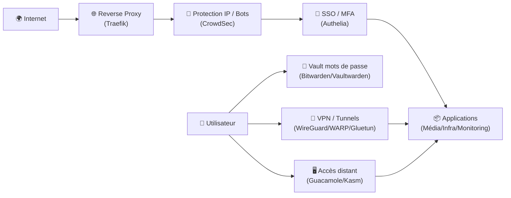

# 🔐 Applications Sécurité

> Cette catégorie regroupe l’ensemble des applications et briques de protection qui sécurisent l’accès, l’exposition et l’exploitation de ton environnement SSDv2 : authentification, contrôle d’accès, VPN, filtrage, protection anti-bot, durcissement et accès distant.

---

## 🧠 Objectif

Les applications Sécurité permettent :

- 🛡️ La protection des services exposés (anti-bot, anti-bruteforce, réputation IP)
- 🔑 L’authentification centralisée (SSO, 2FA, politiques d’accès)
- 🔒 Le chiffrement et la gestion de secrets (mots de passe, vault)
- 🌐 La sécurisation des accès distants (VPN, tunnels, accès web sécurisés)
- 🧰 La réduction de surface d’attaque (gates d’accès, segmentation, règles)
- 🧪 L’observabilité sécurité (alertes, décisions, blocages, journaux)

L’idée : **rendre l’accès simple pour toi, difficile pour un attaquant**.

---

## 🏗 Architecture Type

---

## 📦 Applications Disponibles

### 🛡️ CrowdSec
Protection collaborative : détection, décisions, blocages (bouncers) pour réduire les attaques (bruteforce, scan, abuse).

### 🔑 Authelia
SSO/2FA : portail d’accès sécurisé, règles par domaine/service, MFA, politiques d’authentification.

### 🔐 Bitwarden / Vaultwarden
Gestionnaire de mots de passe : coffre-fort, partage d’accès, secrets d’équipe, 2FA, audit.

### 🧊 Gluetun
Tunnel VPN applicatif : faire passer certains services par VPN (segmentation et confidentialité selon besoins).

### 🖥️ Guacamole
Accès distant via navigateur : RDP/SSH/VNC sans exposer directement les ports, pratique pour accès admin.

### 🧳 Kasm
Postes/applications isolés dans le navigateur (workspaces) : réduire les risques d’exposition d’un poste local, sandboxing.

### 🔑 SSH
Accès d’administration : durcissement, clés, politiques, gestion des utilisateurs et des permissions.

### 🛟 WireGuard / Warp
VPN/Tunnels : accès privé à tes services, réduction d’exposition publique, routes contrôlées.

> [!TIP]
> La stratégie “premium” typique : **Reverse proxy → CrowdSec → Authelia → Apps**  
> et **WireGuard** pour l’accès admin/privé.

---

## 🔗 Intégration

Ces applications s’intègrent avec :

- 🌐 Reverse Proxy : Traefik (routage, middlewares, headers)
- 🎬 Média / 📦 Infra : toutes les apps exposées derrière SSO
- 📥 Téléchargement : segmentation via Gluetun si nécessaire
- 📊 Monitoring : alertes sécurité + logs (Dozzle/Netdata) + notifications (Gotify)
- ☁️ Cloudflare (option) : DNS, proxy, règles, access selon ta stratégie

---

# 🎯 Résumé

La catégorie Sécurité est la **barrière intelligente** de SSDv2.

Elle garantit :
- des accès **authentifiés et contrôlés**,
- une exposition **réduite et protégée**,
- une administration **fiable** (VPN/SSH),
- et une gestion **propre** des secrets.

Bien mise en place, elle rend l’ensemble **beaucoup plus sûr sans complexifier l’usage**.