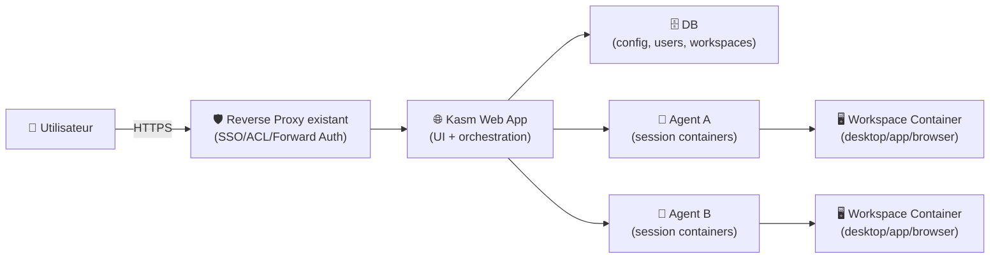
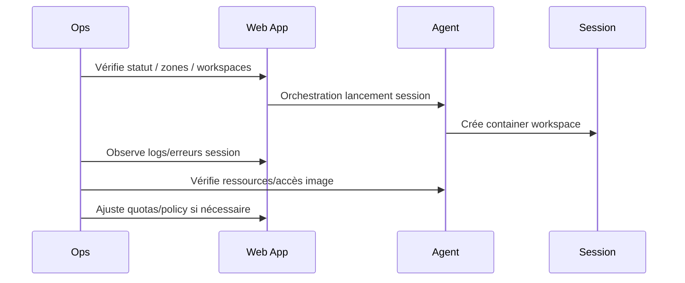

# 🖥️ Kasm Workspaces — Présentation & Exploitation Premium (sans install)

### Container Streaming Platform (CDI) : bureaux/applications dans le navigateur, sessions jetables, contrôle d’accès
Optimisé pour reverse proxy existant • Multi-serveur • Images workspaces • Gouvernance & observabilité

---

## TL;DR

- **Kasm Workspaces** fournit des **bureaux/applications isolés** dans le navigateur (sessions éphémères), utiles pour **RBI**, **VDI léger**, **dev/test**, **support**, **formation**.
- La valeur “premium” : **zones**, **agents**, **images workspaces maîtrisées**, **auth/SSO**, **permissions**, **quotas**, **logging/monitoring**, **tests & rollback**.
- Attention : c’est une plateforme **temps réel** (websocket/streaming) → reverse proxy et zones doivent être cohérents.

---

## ✅ Checklists

### Pré-usage (avant ouverture aux utilisateurs)
- [ ] Définir les cas d’usage : RBI, devbox, support, admin, navigation “à risque”
- [ ] Définir l’auth : local vs SSO/SAML/OIDC (via IAM/proxy)
- [ ] Définir la gouvernance : groupes, rôles, workspaces par équipe
- [ ] Définir les images autorisées + cadence de mise à jour
- [ ] Définir quotas : CPU/RAM, nombre de sessions, durée/idle timeout
- [ ] Valider le chemin réseau : reverse proxy existant + zones + websocket OK

### Post-configuration (qualité opérationnelle)
- [ ] Un user “team-a” ne voit que ses workspaces
- [ ] Une session se lance et se reconnecte correctement (test réseau)
- [ ] Le modèle d’image est stable (rolling vs pinned)
- [ ] Procédure d’audit : qui a accès à quoi, et pourquoi
- [ ] Procédure backup/restore des paramètres (et rollback version)

---

> [!TIP]
> Kasm est excellent en **RBI (Remote Browser Isolation)** : un navigateur “jetable” pour ouvrir des liens / pièces jointes en réduisant le risque poste.

> [!WARNING]
> Derrière un reverse proxy, la config “Zones / Upstream Auth Address / Proxy Port” est souvent la cause #1 des dysfonctionnements de sessions.

> [!DANGER]
> Une mauvaise gouvernance d’images (trop permissive) = surface d’attaque + dérives (images non maintenues, logiciels non patchés, etc.).

---

# 1) Kasm — Vision moderne

Kasm Workspaces n’est pas juste “un bureau distant”.

C’est :
- 🧱 **CDI** : sessions containerisées, jetables, isolées
- 🧑‍🤝‍🧑 **Catalogue de workspaces** : desktops, navigateurs, apps métiers
- 🔐 **Contrôle d’accès** : rôles/groupes, restrictions par workspace
- 🌐 **Multi-serveur** : séparation Web App / DB / Agents (scalabilité)
- 🧩 **Images Docker** : base images + images workspaces (rolling/pinned)

Références : documentation admin & concepts (docs Kasm).  

---

# 2) Architecture globale (vue “propre”)



Multi-server & rôles : (docs Kasm).  

---

# 3) Concepts clés à maîtriser (ce qui fait la stabilité)

## 3.1 Workspaces (catalogue)
- Un **workspace** = un “produit” lancé pour l’utilisateur (desktop/app)
- Attaché à une **image Docker**
- Paramètres : ressources, storage, policies, restrictions

## 3.2 Agents
- Les **agents** hébergent réellement les sessions (containers)
- Ce sont eux qui consomment CPU/RAM/GPU éventuel
- Échelle horizontale : + agents = + capacité

## 3.3 Zones
- Une **zone** regroupe les éléments réseau/agent et influence le routage
- Derrière reverse proxy, les zones doivent refléter la réalité “vue” par l’utilisateur

---

# 4) Gouvernance & Contrôle d’accès (premium, maintenable)

## Stratégie recommandée (simple et scalable)
- **Rôles** : Admin / Power User / Standard User
- **Groupes** : par équipe (ex: `team-infra`, `team-dev`, `team-support`)
- **Workspaces** : publication par groupe (seulement ce qui est utile)

Bon réflexe :
- Ne donne pas “toutes les apps” à tout le monde
- Publie des workspaces “curated” par métier

## Politique “workspaces par contexte”
- RBI (navigateurs) : dispo large
- Admin (terminal, outils infra) : strict
- Devboxes : par équipe + quotas
- Apps sensibles : accès nominatif ou groupe restreint

---

# 5) Stratégie Images (le cœur sécurité/qualité)

## Rolling vs Pinned
- **Rolling** : tu suis les updates (pratique, mais changeant)
- **Pinned** : tu fixes une version (stable, rollback facile)

Recommandation premium :
- En prod : **pinned** + fenêtre de patch régulière
- En lab : rolling possible

## Hygiène images (indispensable)
- Réduire le nombre d’images
- Documenter “qui maintient quoi”
- Automatiser la suppression d’anciennes versions (prune côté agents si nécessaire)

Docs images / custom images : (docs Kasm).  

---

# 6) Reverse proxy existant (principes, sans recette)

Kasm utilise du streaming et des flux persistants :  
- reverse proxy doit laisser passer les connexions nécessaires
- après mise derrière proxy, **mettre à jour la configuration de Zone**

Point d’attention fréquent (doc Kasm reverse proxy) :
- réglage **Upstream Auth Address** adapté au mode (mono vs multi-serveur)
- réglage **Proxy Port** selon la config

Référence : guide reverse proxy Kasm (docs Kasm).

---

# 7) Workflows premium (ops, support, sécurité)

## 7.1 Onboarding utilisateur
- Ajout au groupe
- Attribution des workspaces (catalogue limité)
- Quotas par défaut
- Première session de test + validation

## 7.2 Workflow incident (triage rapide)


## 7.3 “Change management” images
- Snapshot config
- Upgrade image en staging
- Test 3 workspaces représentatifs
- Déploiement prod (pinned)
- Rollback si régression (image tag précédent)

---

# 8) Validation / Tests / Rollback

## Tests fonctionnels (indispensables)
```bash
# 1) UI accessible (depuis le même chemin que les utilisateurs)
curl -I https://kasm.example.tld | head

# 2) Test de session : lancer un workspace "browser" et vérifier
# - démarrage < X secondes
# - reconnect OK
# - clipboard / upload/download selon policy
# (tests principalement UI/manuel)
```

## Tests reverse proxy (symptômes à repérer)
- UI OK mais session écran noir / boucle de chargement
- Déconnexion fréquente
- Impossible de lancer un workspace (routing zone)

## Rollback (pragmatique)
- Revenir au **tag d’image** précédent (pinned)
- Désactiver temporairement un workspace problématique
- Revenir à la configuration de zone précédente (si proxy change)

---

# 9) Limitations & bonnes pratiques

- Kasm = accès “live”, pas un SIEM : pour corrélation long terme, compléter par stack logs/metrics
- Les workspaces “desktop complets” consomment plus que “apps ciblées”
- Plus tu limites le catalogue, plus tu réduis les risques

---

# 10) Sources — Images Docker & Docs (en bash, comme demandé)

```bash
# Kasm Workspaces - Documentation officielle
https://www.kasmweb.com/docs/latest/
https://www.kasmweb.com/docs/develop/admin_guide.html

# Reverse proxy (Kasm docs)
https://www.kasmweb.com/docs/develop/how_to/reverse_proxy.html
https://docs.kasm.com/docs/security/reverse_proxy

# Multi-server / architecture roles (Kasm docs)
https://kasmweb.com/docs/latest/install/multi_server_install.html

# Images / custom images / default images (Kasm docs)
https://www.kasmweb.com/docs/develop/guide/custom_images.html
https://www.kasmweb.com/docs/develop/how_to/building_images.html

# Docker Hub - Kasm Technologies (Verified Publisher)
https://hub.docker.com/u/kasmweb
https://hub.docker.com/r/kasmweb/workspaces
https://hub.docker.com/r/kasmweb/desktop

# LinuxServer.io - image Kasm (si tu utilises LSIO)
https://docs.linuxserver.io/images/docker-kasm/
https://hub.docker.com/r/linuxserver/kasm
https://hub.docker.com/r/linuxserver/kasm/tags

# LinuxServer base image KasmVNC (utile pour desktops web)
https://github.com/linuxserver/docker-baseimage-kasmvnc
```