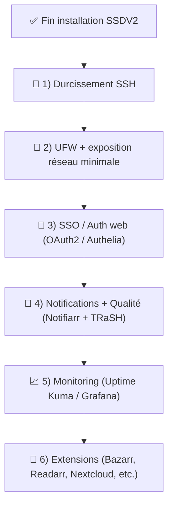
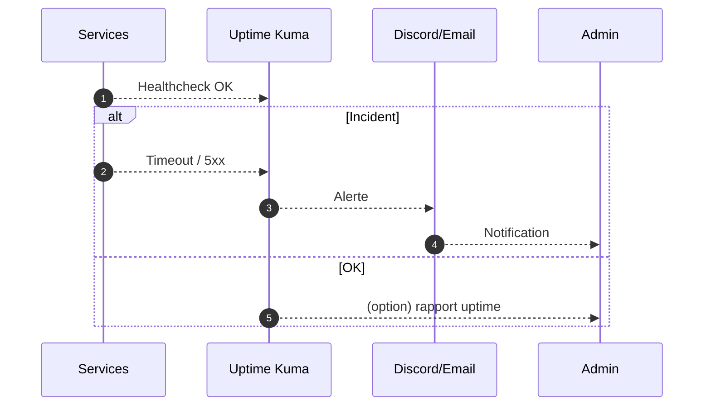

!!! abstract "🧾 Abstract"
    La configuration initiale est terminée. Cette page vous donne une **feuille de route ULTRA premium** pour renforcer la **sécurité**, augmenter la **fiabilité** et améliorer l’**expérience utilisateur** :
    **SSH** (anti lock-out) → **UFW** (exposition minimale) → **SSO** (OAuth2/Authelia) → **Cloudflare** (règles & cache) → **Notifications** → **Monitoring** → **Extensions**.

---

## ✅ TL;DR (à faire ensuite)

1. 🔐 **SSH** : root off + clés + test en 2e terminal + reload safe  
2. 🧱 **UFW** : autoriser SSH + 80/443 (et Plex si besoin) + validation anti lock-out  
3. 🪪 **SSO** : Google OAuth2 ou Authelia devant les apps sensibles  
4. 🔔 **Notifs** : Notifiarr / Discord / alertes (santé, erreurs, quota, indexers)  
5. 📈 **Monitoring** : Uptime Kuma (minimum) + Grafana/Prometheus (option)  
6. 🧩 **Qualité** : TRaSH-Guides + cohérence Radarr/Sonarr (+ 4K)

!!! tip "🧠 Raccourci mental"
    **SSH/UFW** = ne pas se verrouiller • **SSO** = réduire la surface d’attaque • **Notifs + Monitoring** = éviter les pannes silencieuses • **TRaSH** = automatisation propre

---

## 🧰 Pré-checklist (avant toute action sécurité)

- [ ] J’ai **un accès console/panel** (VPS/KVM) en secours
- [ ] Je garde **une session SSH ouverte** pendant les changements
- [ ] Je peux ouvrir **un 2e terminal SSH** pour tester
- [ ] Je connais mon **IP d’admin** (si je fais une allowlist)
- [ ] Je sais revenir en arrière (rollback UFW/SSHD)

!!! danger "⛔ Risque principal : lock-out"
    Les seules opérations réellement dangereuses ici sont celles qui peuvent vous **couper l’accès** (SSH/UFW).
    **Règle d’or : tester dans un 2ᵉ terminal avant de fermer le 1er.**

---

## 🗺️ Ordre recommandé (vision globale)



---

# 🔐 1) Durcissement SSH (propre, sans lock-out)

## Objectifs

- 🚫 Interdire le login **root**
- 🔑 Utiliser des **clés SSH**
- (Option) 🔒 Désactiver le mot de passe **après tests**
- (Option) 🔁 Changer le port (anti-bruit, pas une sécurité “magique”)

---

## 1.1 Vérifier qu’une clé SSH fonctionne (avant tout)

Depuis votre PC :

```bash
ssh VOTRE_USER@VOTRE_IP
```

Si vous utilisez un port custom :

```bash
ssh -p 2222 VOTRE_USER@VOTRE_IP
```

!!! success "✅ Critère de réussite"
    Vous pouvez ouvrir **une nouvelle session SSH** (dans un 2ᵉ terminal) avant de modifier quoi que ce soit.

---

## 1.2 Éditer `sshd_config` (modifs minimales)

```bash
sudo nano /etc/ssh/sshd_config
```

Appliquez ces lignes (ou assurez-vous qu’elles existent) :

```text
PermitRootLogin no
PubkeyAuthentication yes
PermitEmptyPasswords no
```

Option ULTRA (uniquement si vos clés fonctionnent) :

```text
PasswordAuthentication no
MaxAuthTries 3
```

Option port non-standard :

```text
Port 2222
```

!!! warning "⚠️ Avant de couper PasswordAuthentication"
    Vérifiez **dans un 2ᵉ terminal** que la connexion par clé est OK.
    Ne fermez pas la session actuelle tant que ce n’est pas validé.

---

## 1.3 Valider la config + recharger (safe)

Test syntaxe :

```bash
sudo sshd -t
```

Reload (moins risqué qu’un restart) :

```bash
sudo systemctl reload sshd
```

Si `reload` indisponible :

```bash
sudo systemctl restart sshd
```

---

## 1.4 Test final (obligatoire)

Dans un **2ᵉ terminal** :

```bash
ssh VOTRE_USER@VOTRE_IP
```

ou :

```bash
ssh -p 2222 VOTRE_USER@VOTRE_IP
```

!!! success "✅ SSH validé"
    Si la nouvelle session s’ouvre, vous pouvez fermer l’ancienne.

---

# 🧱 2) UFW (pare-feu baseline SSDV2)

## Principes

- ✅ Autoriser SSH **avant** d’activer UFW
- ✅ N’exposer que **80/443** via reverse proxy
- ⚠️ Exposer **32400** seulement si vous en avez besoin (Plex)

!!! tip "🧭 Pattern recommandé"
    Internet → **Cloudflare** → **Traefik (80/443)** → apps internes  
    ⇒ éviter d’exposer des ports d’admin directement.

---

## 2.1 Baseline (générique)

```bash
sudo apt update && sudo apt install -y ufw
sudo ufw default deny incoming
sudo ufw default allow outgoing
```

Autoriser SSH :

```bash
sudo ufw allow 22/tcp
# ou si port custom
sudo ufw allow 2222/tcp
```

Autoriser web (Traefik) :

```bash
sudo ufw allow 80/tcp
sudo ufw allow 443/tcp
```

(Option) Plex :

```bash
sudo ufw allow 32400/tcp
```

Activer :

```bash
sudo ufw enable
sudo ufw status verbose
```

!!! danger "⛔ Ordre critique"
    **Autorisez SSH avant** `ufw enable`, sinon lock-out probable.

---

## 2.2 Anti lock-out (procédure standard)

1. Gardez votre **terminal actuel ouvert**
2. Ouvrez un **2ᵉ terminal**
3. Testez une nouvelle connexion SSH

!!! success "✅ UFW validé"
    Si la 2ᵉ connexion SSH fonctionne, UFW est “safe”.

---

## 2.3 Rollback UFW (secours console/panel)

```bash
sudo ufw disable
```

!!! tip "🧯 Cas d’urgence"
    Si vous êtes bloqué SSH : passez par la console VPS, `ufw disable`, puis corrigez.

---

# 🪪 3) SSO / Auth Web (OAuth2 / Authelia)

## Pourquoi

- ✅ Centraliser l’accès
- ✅ Ajouter 2FA / règles / policies
- ✅ Protéger toutes les interfaces admin

### Options

- 🔑 **Google OAuth2** : SSO simple + 2FA Google (selon compte)
- 🛡️ **Authelia** : policies avancées (groupes, règles, 2FA, etc.)

!!! tip "✅ Bon pattern"
    **SSO** devant : Traefik dashboard, Portainer, dashboards, outils admin  
    Laisser les apps “grand public” avec auth interne + SSO selon votre besoin.

---

# ☁️ 4) Cloudflare (sécurité + conformité)

## Points clés

- 🔒 SSL/TLS : **Full**
- ✅ TLS 1.2+ / TLS 1.3 ON
- 🧱 Firewall : règles pays/IP si pertinent
- 🎬 Page Rules : **bypass cache** pour Plex/Emby/Jellyfin

!!! danger "⚖️ Conformité Cloudflare (plan gratuit)"
    Évitez d’utiliser Cloudflare comme cache/accélérateur “média” sur du streaming.
    Faites des règles de contournement pour les sous-domaines média.

---

# 🔔 5) Notifications (Notifiarr / Discord)

## Objectifs

- être averti avant que “ça casse”
- suivre : indexers down, quota, erreurs import, santé services

### Recommandé

- 🟣 Discord / Telegram / Email (selon vos outils)
- 🔔 Notifiarr (si vous l’utilisez) pour sync & alerting

!!! tip "🚨 Règle premium"
    Pas de monitoring = pannes silencieuses.
    **Activez au minimum Uptime Kuma + une destination d’alertes.**

---

# 📈 6) Monitoring (exploitation)

## Minimum viable

- ✅ **Uptime Kuma** : healthchecks + alertes
- ✅ (Option) **Glances** : ressources (CPU/RAM/Disk)

## Avancé

- 📊 **Prometheus** : métriques
- 📈 **Grafana** : dashboards + alerting



---

# 🧩 Extensions utiles (selon besoins)

- 🧷 **Bazarr** : sous-titres auto
- 🎵 **Lidarr** : musique
- 📚 **Readarr** : ebooks
- 🗃️ **Calibre-Web** : bibliothèque ebooks
- 🧭 **Organizr** : portail
- ☁️ **Nextcloud** : fichiers/sync (attention stockage et perf)
- 🧰 **Requestrr** : demandes via Discord/Telegram
- 🐳 **Portainer** : gestion Docker (à protéger !)

!!! warning "⚠️ Surface d’attaque"
    Chaque app ajoutée augmente la surface d’attaque :
    - protégez via SSO
    - ne laissez pas d’admin panels exposés sans contrôle

---

# ✅ Validation & tests (ULTRA pro)

## Après SSH

- [ ] Connexion SSH OK dans un **2ᵉ terminal**
- [ ] `sudo sshd -t` OK
- [ ] (Option) PasswordAuthentication OFF uniquement si test OK

## Après UFW

- [ ] `ufw status verbose` cohérent
- [ ] SSH OK dans un **2ᵉ terminal**
- [ ] 80/443 OK (Traefik)
- [ ] Plex 32400 seulement si voulu

## Après SSO

- [ ] Accès web protégé (OAuth2/Authelia)
- [ ] Whitelist / policies correctes
- [ ] Apps sensibles non accessibles sans auth

---

# 🧯 Rollback (rapide)

## SSH (si accès console)

- Réactiver temporairement mot de passe / port standard
- Tester puis redémarrer service

```bash
sudo nano /etc/ssh/sshd_config
sudo sshd -t
sudo systemctl restart sshd
```

## UFW

```bash
sudo ufw disable
```

---

# 🗓️ Roadmap 30 / 60 / 90 jours

## J+30 — Sécurité & stabilité
- SSH durci + UFW baseline
- Uptime Kuma + alertes
- sauvegardes : configs + données critiques

## J+60 — Confort & cohérence
- TRaSH appliqué + (option) Notifiarr
- portail (Organizr)
- Bazarr si besoin

## J+90 — Observabilité & évolutions
- Grafana/Prometheus si utile
- Nextcloud si besoin réel (et dimensionnement stockage)
- politiques SSO avancées (Authelia)

---

!!! success "🎉 État attendu"
    Vous avez une plateforme **stable** et **maintenable** :
    sécurité maîtrisée, exposition minimale, alertes utiles, et automatisations fiables.